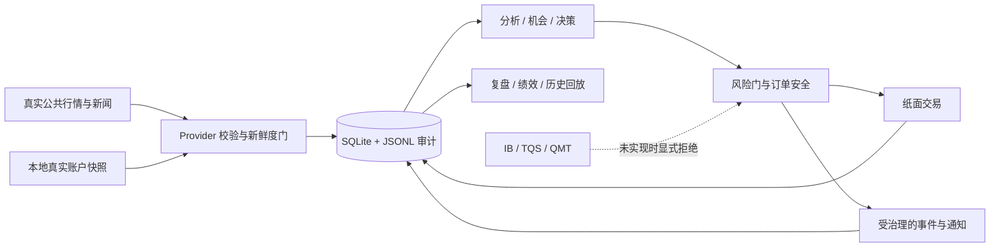

# stock_analysis

`stock_analysis` 是一个用 Rust 构建的 A 股研究、监控、纸面交易与复盘系统。它把真实公共
行情/新闻、可选的本地真实账户快照、量化分析、AI 研判、风险门、不可变审计和多通道通知
串成一条可验证的数据链。

当前系统的交易闭环是**受安全门约束的纸面交易**。IB、TQS、QMT 等券商 SDK 尚未接入，
系统不会把未实现的券商源伪装成可用，也不会自动提交真实账户订单。缺失、坏值或过期证据
会显式失败，不会替换为 mock、0、成本价或“中性”占位值。

## 项目作用

这个项目用于回答四类问题：

- **市场发生了什么**：采集并校验日线、实时行情、资金流、板块、公告和财经新闻。
- **哪些标的值得进一步研究**：运行指标、策略、产业链、机会评分、多 Agent 研判和否决链。
- **一个决策是否允许执行**：结合账户模式、数据模式、涨跌停、现金、仓位、手数和幂等规则。
- **事后能否复原过程**：持久化行情、决策、纸面成交、事件投递、绩效和哈希链审计证据。

它不是承诺收益的选股器，也不是已经连接券商的自动实盘机器人。回测、AI 输出和纸面成交
都是研究证据，不能替代投资判断或实时券商确认。

## 端到端架构



### 分层职责

| 层 | 主要路径 | 职责 |
| --- | --- | --- |
| 应用入口 | `src/main.rs`, `src/bin/monitor/`, `src/bin/*.rs` | 装配运行模式、一次性任务、监控、复盘、回测和数据导入 |
| 数据接入 | `src/data_provider/`, `src/search_service/`, `src/news/`, `src/broker.rs` | 连接真实公共源，解析协议，校验完整批次、价格、时间与来源 |
| 持久化与审计 | `src/database/`, `migrations/`, `src/event/`, `src/push_l7/` | SQLite 事实表、JSONL 历史、订单哈希链、投递结果和五年审计边界 |
| 研究与决策 | `src/analyzer/`, `src/indicators/`, `src/strategy/`, `src/pipeline/`, `src/opportunity/`, `src/decision/`, `src/agent/` | 技术/基本面分析、策略回测、机会发现、多 Agent 研判与最终决策 |
| 风险与纸面执行 | `src/risk/`, `src/trading/`, `src/portfolio/`, `src/performance/` | 环境隔离、订单安全、账户/数据模式、纸面成交、持仓和绩效 |
| 事件、通知与复盘 | `src/bus/`, `src/push_l1/`, `src/push_l2/`, `src/push_l4/`–`push_l7/`, `src/notification/`, `src/review/` | 事件标准化、去重、治理、路由、通道确认、统计与事后复盘 |

依赖方向以事实链为主：数据先验证并持久化，研究模块读取事实生成决策，风险层决定是否允许
进入纸面执行或通知，结果再回写审计存储。调用方不能绕过风险层自行制造成交事实。

## 关键数据流

### 研究与监控

1. Provider 从腾讯、东方财富、Sina、BaoStock、RustDX 等真实公共源取得数据。
2. 批次进入计算前检查身份、价格、涨跌幅、时间连续性、重复/缺口和复权跳变。
3. `pipeline`、`opportunity`、`decision` 和 `agent` 组合量化与文本证据。
4. `risk` 根据账户状态、数据完整性和否决规则收紧或拒绝动作。
5. 允许展示的结果经事件/推送治理层记录并发送；失败结果同样可追溯。

### 纸面交易

`broker.rs` 当前只注册真实腾讯公共行情作为执行报价来源，并要求报价不超过 5 秒。纸面订单
随后经过 `order_safety`、账户/数据模式和不可变订单审计；`Filled`、`NotFilled`、
`Invalidated` 是不同事实，未成交或重复写入不会发布虚假的 `ExecutionFilled`。

### 真实账户快照

真实账户证据由用户选择的、Git 忽略的本地 JSON 文件一次性导入 `real_account_snapshot`。
账户号等非必要字段可以保持 SQL `NULL`；快照可作为历史审计证据，但超过 30 秒不能授权
实时动作。这个导入边界不是券商连接，也不会读取或上传账户截图。

### 事件与通知

事件以 `EventEnvelope` 标准化，经 dispatcher、去重和治理层进入 Console、飞书、企业微信、
邮件或其他已配置 sink。只有通道确认成功且审计落盘后才算投递成功；历史查询和 replay
读取同一类 `push.delivery.audit` 事实。

## 数据与资金安全合同

这些约束来自 [`AGENTS.md`](AGENTS.md)，是代码、测试和发布共同的阻塞门：

| 领域 | 当前合同 |
| --- | --- |
| 数据真实性 | 生产路径禁止 mock；来源失败必须返回显式错误，缺失字段保持空值/告警 |
| 真实实现 | `verify/save/notify/push/sync/update_result/reconcile` 必须真实操作目标数据源；只记录日志即由 `check_fake_impl.sh` 阻塞合并 |
| 数据质量 | 价格必须大于 0；相邻有效值变化超过 ±20%、时间缺口/重复、复权异常都必须拒绝或人工确认 |
| 新鲜度 | 实时报价 ≤5 秒，持仓/现金 ≤30 秒，净值为同一交易日，日线最多落后 1 个交易日；周末和休市日不计交易日 |
| 测试隔离 | 测试身份使用 `TEST_CODE`；生产拒绝测试代码，测试环境拒绝真实代码订单，测试数据库物理隔离 |
| 订单安全 | 数量为正且是 100 股整数倍；金额不超过可用现金和 100 万元；价格在涨跌停范围内；60 秒业务 ID 防重；50 万元起要求二次确认 |
| 审计 | 关键数据流和订单记录来源、时间与依据；订单审计不可更新/删除，保留期不少于 5 年 |
| 规则一致性 | 去重、互斥、过滤、排序和限额先登记业务规则；配置阈值与设计文档必须互相引用 |

## 主要入口

先用 `--help` 核对当前命令，不依赖 README 中可能随版本变化的参数细节：

```bash
cargo run --bin stock_analysis -- --help
cargo run --bin monitor -- --help
```

| 入口 | 用途 |
| --- | --- |
| `cargo run --bin stock_analysis -- ...` | 单次股票分析、市场复盘、龙虎榜、产业链或定时分析 |
| `cargo run --bin monitor` | 常驻盘中/盘后监控；可能访问真实数据和已配置通知通道 |
| `cargo run --bin monitor -- --review` | 一次盘后复盘，完成后退出 |
| `cargo run --bin monitor -- --history --date=YYYY-MM-DD` | 只读事件历史查询，不进入常驻循环 |
| `cargo run --bin rsi_optimize -- compare` | 对比全部 RSI 预设并生成策略研究、回测报告和图表 |
| `cargo run --bin lhb_query -- ...` | 龙虎榜查询 |
| `cargo run --bin import_real_account_snapshot -- ...` | 从用户指定的本地忽略文件导入一份严格校验、追加不可变的账户快照 |
| `tools/one_shot/backfill_daily.sh` | 日线新鲜度门失败时回补真实公共数据 |

`--replay-force`、生产 `--push` 和常驻 monitor 都可能产生外部效果，不属于无副作用的快速
体验命令。`--test --e2e` 只允许配合隔离数据库和 `TEST_CODE` 数据使用。

## 本地准备

### 1. 安装依赖并创建配置

需要稳定版 Rust、Cargo 和 SQLite。复制环境模板后只填写实际使用的源/通道；不要把 `.env`
或真实账户证据加入 Git。

```bash
cp .env.example .env
cargo build --workspace --all-features
```

核心配置包括 `STOCK_LIST`、数据库路径、所选 LLM 凭据和通知通道。未配置的外部能力应保持
不可用，而不是使用演示值。

### 2. 运行只读或研究入口

```bash
# 盘后复盘（会访问真实数据；配置通知后可能发送消息）
cargo run --bin monitor -- --review

# 查看某日事件历史
cargo run --bin monitor -- --history --date=2026-07-17

# 参数研究与回测
cargo run --bin rsi_optimize -- compare
```

### 3. 本地导入真实账户历史证据

证据文件必须位于 Git 忽略路径。导入器不会打印账户金额或证券身份：

```bash
cargo run --bin import_real_account_snapshot -- \
  --database data/stock_analysis.db \
  --evidence <ignored-local-manifest.json>
```

### 4. 回补日线新鲜度

周末不产生交易数据；脚本和合规门按交易日历判断。如果最新日线超过 1 个交易日：

```bash
STOCK_DB=data/stock_analysis.db STOCK_LIST=000001 \
  bash tools/one_shot/backfill_daily.sh
```

生产运行应把 `STOCK_LIST` 换成明确需要维护的标的集合，并检查整批成功结果。

## 工程门禁

仓库按 Gate A → B → C → D 发布：设计与业务规则先行，随后是实现/失败路径、合规，最后是
覆盖率和真实数据证据。核心命令是：

```bash
cargo fmt --all -- --check
cargo clippy --workspace --all-targets --all-features -- -D warnings
cargo test --workspace --all-targets --all-features -- --test-threads=1
bash tools/compliance/check.sh
cargo build --release --workspace --all-features

cargo llvm-cov --workspace --all-features --json \
  --output-path target/coverage/coverage.json -- --test-threads=1
python3 tools/coverage/check_thresholds.py target/coverage/coverage.json
```

Gate D 要求全仓行覆盖率至少 80%，核心交易/数据链路至少 95%。覆盖阈值不能下调，也不能
通过排除生产代码、删除分母或调用真实下单来换取通过。

## 当前限制

- IB、TQS、QMT 券商 SDK 尚未接入；`BROKER_SOURCE` 当前只支持 `public|tencent`。
- 真实账户快照是本地、人工选择的历史证据，不是持续券商同步。
- 系统没有自动实盘订单出口；纸面交易结果不能视为券商成交确认。
- 部分公共数据源和 LLM/通知通道依赖网络、凭据与第三方可用性，失败时会显式拒绝对应批次。
- `docs/v9.x`–`docs/v18.x` 记录架构演进，其中的提案和历史完成声明不覆盖当前代码事实。

## 文档导航

- [仓库强制规则](AGENTS.md)
- [业务规则注册表](docs/business_rules.md)
- [文档总索引](docs/README.md)
- [v16.x 当前可执行合同](docs/v16.x/README.md)
- [v16.x 完整性审计](docs/v16.x/v16.x-completion-audit-2026-07-19.md)
- [Gate D 设计与数据安全收口](docs/superpowers/specs/2026-07-17-repository-history-and-gate-remediation-design.md)
- [Gate D 覆盖率实施计划](docs/superpowers/plans/2026-07-18-gate-d-coverage-closure.md)

历史文档用于理解决策背景；生产行为以当前代码、业务规则、合规脚本和最近一次可复验门禁
结果为准。
