# Stock Analysis 项目架构蓝图

> 生成日期：2026-09-03  
> 专项修订：2026-09-02（推送系统审计与演进路线；v18/v19 设计覆盖、冲突裁决与周期）  
> 当前架构同步：2026-09-03（外置 provider-host、gRPC-only 数据平面、BR-249/250/255、inventory 与网页再生成）  
> 事实基线：当前工作树中的 Rust 源码、Cargo metadata、配置、测试、CI 与 README  
> 生成配置：Rust / Auto-detect / C4-oriented Mermaid / Implementation-Ready  
> 规模快照：514 个 Rust 文件，379,107 行；1 个 library、28 个 binary、41 个 integration-test、1 个 benchmark、1 个 build-script target

## 1. 阅读约定与证据规则

本文是当前实现蓝图，不是愿景图。图中节点与文字采用以下状态标签：

| 标签 | 含义 |
| --- | --- |
| `CURRENT` | 当前生产或默认代码路径可达 |
| `CONDITIONAL` | 代码已实现，但受 feature、环境变量、activation、时间窗口或运行模式控制 |
| `COMPAT` | 为旧入口、旧合同或渐进迁移保留的兼容路径 |
| `INACTIVE` | 代码仍在，但生产主循环明确隔离或禁用 |
| `EXTERNAL` | 仓库外的 provider、LLM、Webhook、操作者或部署资产 |
| `INFERRED` | 由代码结构推导出的架构决策；仓库中没有对应正式 ADR 时，不冒充已批准 ADR |
| `PROPOSED` | 已形成并记录的目标架构或迁移约束；尚未宣称生产实现完成 |
| `HISTORICAL` | 历史实现、旧统计或被上位设计替代的记录；不代表当前运行路径 |

证据写作规则：

- `path:line` 指向当前源文件中的起始位置；行号会随代码编辑漂移，路径和符号名是长期锚点。
- 数量来自当前 `cargo metadata --no-deps`、`src/lib.rs`、`tests/` 与冻结 schema catalog 的实测。
- “完整”指架构面完整：运行单元、模块、数据流、状态机、存储、协议、横切约束、测试、部署和扩展点均列出；不逐行复述 379,107 行实现。
- 53-table catalog 是 legacy generation-1 冻结集合，不等于业务数据库所有增量 DDL 的总表数。

## 2. 架构检测结论

### 2.1 一句话结论

这是一个 **Rust 单 package 的大型模块化单体和外部数据服务消费者**。本仓库拥有 monitor/CLI、provider-neutral 领域类型、统一 Data Gateway、typed gRPC client contract、阶段化 selection workflow、SQLite 审计链与持久化投递协调器；生产市场数据宿主是仓库外独立部署的 `EXTERNAL provider-host`。它不是微服务集合，也不是严格单向依赖的 Clean Architecture。

### 2.2 定量与形态

| 维度 | 当前事实 | 代码依据 |
| --- | --- | --- |
| package | `stock_analysis 0.1.2`，单 Cargo package | `Cargo.toml`、Cargo metadata |
| library | 61 个公开顶层模块 | `src/lib.rs`；附录 A |
| production entrypoints | `monitor` 常驻控制面；`stock_analysis` 默认 CLI；provider-host 不属于本 package | `src/bin/monitor/main.rs`、`src/main.rs`、`README.md:28-44` |
| binary targets | 28，含 CLI、monitor、导入、回填、探针、研究与回测工具 | Cargo metadata；附录 A |
| integration tests | 41 | Cargo metadata；附录 B |
| project features | 无 `[features]`；所有生产市场数据路径均为远程 gRPC，不能切换本地 provider | `Cargo.toml`、`README.md:28-29` |
| async runtime | Tokio；CLI/monitor 使用 multi-thread runtime | `src/main.rs`、`src/bin/monitor/main.rs` |
| primary DB | SQLite + Diesel + r2d2 + descriptor attestation | `src/database/mod.rs:419`、`:1893`、`:2442` |
| durable DB | 独立 `data/durable_delivery.sqlite3` + rusqlite | `src/bin/monitor/durable_delivery_runtime.rs:76`、`src/durable_delivery/coordinator.rs` |
| data protocol | tonic/prost typed gRPC；`client-bundle/market.proto` + build-time compatibility extensions | `build.rs:18-36` |
| consumer gRPC catalog | 40 个 production-used operations；provider-host capabilities 必须满足调用 | `src/grpc_contract/ops.rs:77-128` |
| event mechanisms | 通用 EventEnvelope bus + monitor-domain bus，两套不同广播 | `src/event/bus.rs:63`、`src/monitor/event_bus.rs:74` |
| delivery | 同步权威投递/审计 + observation-only bus/JSONL | `src/bin/monitor/main.rs:4744-4748`、`src/event/jsonl_writer.rs:1-12` |

### 2.3 代码热点

| 代码域 | Rust 行数 | 架构含义 |
| --- | ---: | --- |
| `src/bin` | 75,666 | monitor 编排与 28 个工具/运维入口是最大热点 |
| `src/database` | 73,767 | schema、attestation、repositories、审计链高度集中 |
| `src/data_gateway` | 30,555 | 远程 wire 转换、证据准入与领域网关；本地 provider 实现移除后明显收缩 |
| `src/selection` | 25,967 | 阶段化、receipt 化、可恢复 selection-v2 |
| `src/durable_delivery` | 18,856 | 投递状态机、租约、审计、恢复 |
| `src/performance` | 15,697 | 归因、epoch、回放与报表 |
| `src/pipeline` | 14,893 | 默认 CLI 的宽分析管道 |
| `src/event` | 13,159 | envelope、审计、JSONL、回放 |
| `src/monitor` | 12,853 | 可复用监控领域能力；不含 bin-local 编排 |
| `src/grpc_client` / `grpc_contract` | 3,074 / 930 | 外部 provider-host 的网络、认证、错误和合同接缝 |
| `src/market_domain` | 1,968 | 本仓拥有的 provider-neutral 市场领域类型 |

## 3. C4 Level 1：系统上下文

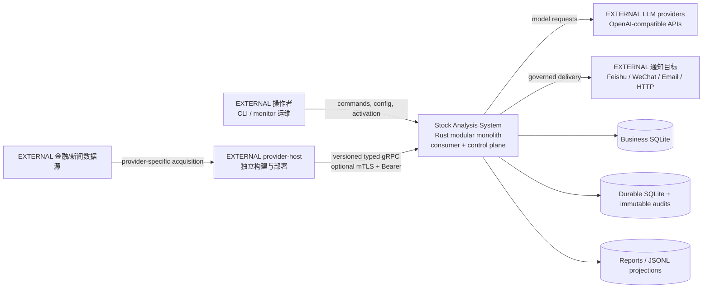

证据：`README.md:1-44` 明确本仓不含 provider 实现、server target 或本地 fallback；`src/lib.rs:225-232` 只公开 gRPC client/contract 与 `market_domain`；LLM port 在 `src/llm/mod.rs`；通知实现见 `src/notification/`、`src/push_l6/` 与 monitor-local `notify.rs`。

## 4. C4 Level 2：运行容器与进程拓扑

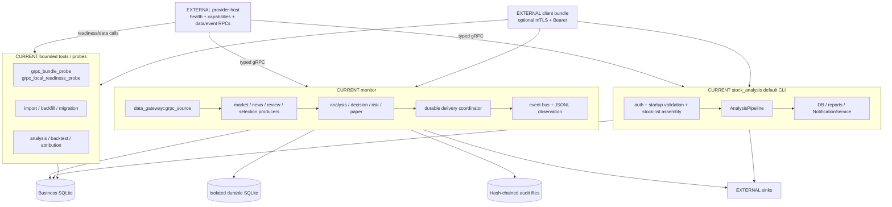

关键边界：

- provider-host 是 `EXTERNAL`：不在 Cargo targets、不链接本仓业务 DB，也不由本仓启动。证据：Cargo metadata、`README.md:28-44,94-95`。
- `tests/support/grpc_fixture` 只在 integration-test crate 中编译，不是 production container。证据：`README.md:85-90`、`tests/support/mod.rs`。
- default CLI 不是 monitor 控制客户端；它直接复用 library pipeline。证据：`src/main.rs` 的 mode dispatch 与 `src/app/bootstrap.rs`。
- `data_provider` 是委托统一 Gateway 的进程级 facade/cache，不是 provider implementation。证据：`README.md:44`、`src/data_provider/service.rs`。

## 5. C4 Level 2：生产部署拓扑

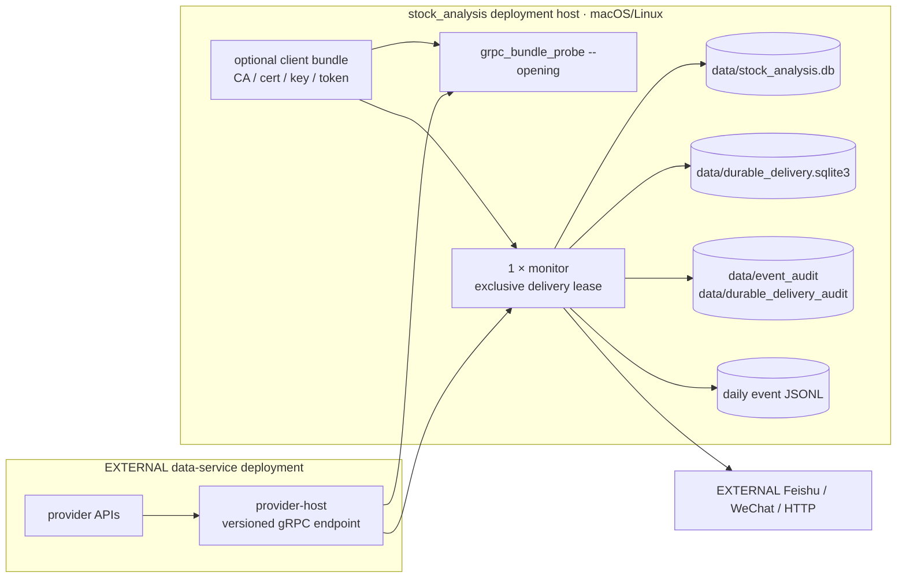

部署事实：本仓库没有 provider-host 部署单元，也没有根级 Dockerfile、docker-compose、systemd unit、Kubernetes 资源或 service discovery。运维顺序是先确保外部 host 和凭据可用，再运行 client-side opening probe，最后启动唯一 monitor lease owner。证据：`README.md:92-116`。

## 6. C4 Level 3：统一数据平面

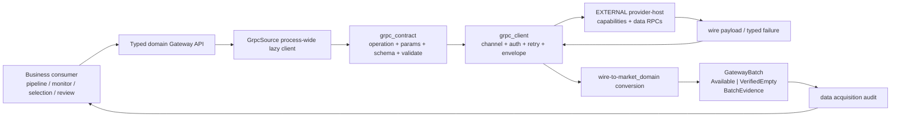

实现约束：

- `bridge_for` 总是注册 process-wide remote `GrpcSource`；地址来自 `GRPC_MARKET_ADDR`，可选安全连接来自 `GRPC_MARKET_CLIENT_BUNDLE`，首次方法调用才连接。证据：`src/data_gateway/grpc_source.rs:1-9,1063-1087`。
- 服务不可达、合同缺失或证据不合格时返回 typed error，绝不切换到本地采集库。证据：`src/data_gateway/grpc_source.rs:5-6` 与 `bridge_unreachable_is_fail_closed`。
- `HOOKED_OPS` 与真实 bridge 调用点由源码扫描测试对账；catalog 是 consumer 使用集合，不是本仓 server 实现清单。
- 业务消费者应接收带 evidence 的 typed batch；`Available` 空记录与 `VerifiedEmpty` 语义不同，多个模块对非法空 batch fail-closed。示例：`src/app/bootstrap.rs:185-226`。

### 6.1 Data Gateway 能力族

| 能力族 | 子模块 | 主要消费者 |
| --- | --- | --- |
| 行情与历史 | `market_data`、`historical_bars`、`index`、`benchmark`、`intraday_shape`、`t0_evidence` | pipeline、monitor、strategy、performance |
| 板块与排名 | `board`、`board_ranking`、`board_runtime`、`market_capabilities` | monitor、opportunity、selection |
| 资金与交易事实 | `capital`、`block_trade`、`dragon_tiger`、`consensus` | decision、CLI、review |
| 新闻与公告 | `global_news`、`sina_instrument_news`、`event_calendar`、`economic_calendar` | news monitor、agent、review |
| 公司与研究 | `company`、`research`、`general_web_research` | analyzer、agent、deep analysis |
| 身份与生命周期 | `instrument_identity`、`security_lifecycle`、`exchange_calendar_authority` | admission、过滤、session gate |
| 产业链与仓位 | `chain_intelligence`、`position_chain`、`review` | opportunity、portfolio、post-session review |
| selection outcome | `outcome_daily_bars` | selection-v2 settlement owner |

完整声明依据：`src/data_gateway/mod.rs`。

## 7. C4 Level 3：gRPC 合同与调用链

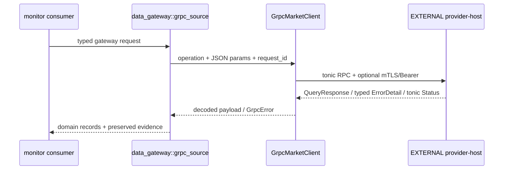

合同生成：

1. `build.rs:26-29` 读取 `client-bundle/market.proto`。
2. `build.rs:18-36` 在 OUT_DIR 合并 compatibility extensions，再用 `tonic_prost_build` 生成 client 与 test fixture 所需的 server trait；这不创建 production server target。
3. 合同枚举覆盖 0..=62；61=`ChainBatch`、62=`BenchmarkBars`，`QueryResponse.source=11` 保留来源证据。
4. `src/grpc_contract/ops.rs` 提供 0..=62 全量方法映射与 40 个 production-used consumer operations。
5. 外部 host 的 health/capabilities 必须满足 opening probe 和实际 operation；本仓集成测试使用 `tests/support/grpc_fixture` 验证 roundtrip。

错误与重试：

- typed `ErrorDetail` 在 client decode 后保留 request id、operation、provider、reason code、retryable；`no_current_reports` 等业务状态不会折叠成 `internal`。证据：`src/grpc_client/errors.rs`。
- endpoint timeout 35 秒。Unavailable 走指数退避并复查 health；DeadlineExceeded 有界重试且保留 request id；backoff 上限 60 秒。证据：`src/grpc_client/client.rs:54-96`、`:221-225`、`src/grpc_client/retry.rs:1-58`。
- InvalidArgument、Unauthenticated、PermissionDenied、Unimplemented、FailedPrecondition 不因远端 metadata 被错误升级为可重试。证据：`src/grpc_client/retry.rs:13-43`。

## 8. C4 Level 3：monitor 控制面

### 8.1 启动闸门

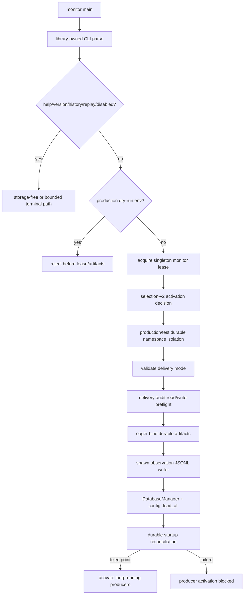

证据窗口：`src/bin/monitor/main.rs:4471-5077`。关键 fail-closed 点为生产 `V10_DRY_RUN_PUSH=1` 拒绝（`:4550`）、lease（`:4564`）、delivery mode（`:4655`）、audit preflight（`:4660`）、artifact bind（`:4681`）、startup reconciliation（`:4954-4982`）。

### 8.2 常驻任务树

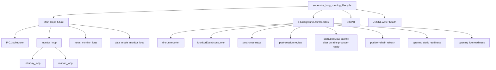

证据：四个 main loops 位于 `src/bin/monitor/main.rs:5479-5488`；八个 background tasks 位于 `:5496-5539`；`review_backfill` 在 durable `runtime_producer_ready` 后执行；`monitor_loop` 在 `:8796`，最终 `tokio::join!(intraday_loop, market_loop)` 在 `:11296`。

### 8.3 monitor 代码的两层组成

| 层 | 内容 | 证据 |
| --- | --- | --- |
| reusable library `src/monitor/` | adaptive、alert/log、attribution/deep、auction、checklist、data_mode/quality、detector、entity_linker、event_bus、news_ai/monitor、prediction、rate_budget、risk、scanner、signal_fusion/state | `src/monitor/mod.rs` |
| binary-local composition `src/bin/monitor/` | notify、transport、presentation registry、P-01、push templates、review batch/backfill、dryrun report、v13 diagnostics、attribution epoch runtime、blocking/async market data、closing valuation、data-mode probe、intraday market、durable runtime、L6 sink、news aggregator/AI shadow、health/webhook/freshness/v17 sources | `src/bin/monitor/main.rs` 顶部 module declarations 与同目录文件 |

这种拆分说明 monitor 既有可复用领域能力，也有大量只属于进程启动/运维的 composition root；新功能应先判断是否需要被其他 binaries 复用，再决定放 library 还是 bin-local。

## 9. C4 Level 3：默认 CLI 分析管道

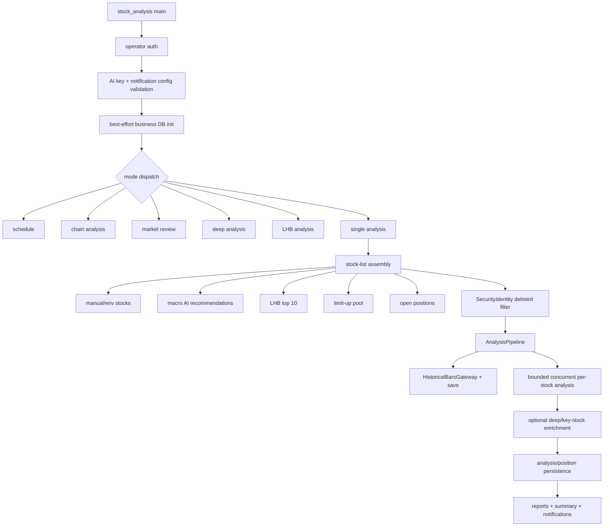

代码依据：

- mode dispatch：`src/main.rs:73-106`。
- 股票池装配：`src/app/bootstrap.rs:64-282`；deep mode 禁用 macro/LHB/limit-up 自动扩展。
- `AnalysisPipeline` 与宽 `AnalysisResult`：`src/pipeline/mod.rs:61-250`、`:350-735`。
- historical bars 与保存：`src/pipeline/data.rs:25-101`。
- reports/notification：`src/pipeline/summary_notify.rs:42-112`。
- schedule 仅每轮 override `.env`：`src/app/schedule.rs:175-237`；它不会自动重载 TOML snapshot。

CLI 与 monitor 的故障策略不同：CLI 的 business DB 初始化失败会记录“数据不会入库”后继续；monitor 的 delivery audit、artifact binding 与 durable reconciliation 属于 producer 启动前硬闸门。证据：`src/main.rs:64-72` 对比 monitor 启动窗口。

## 10. 业务能力地图

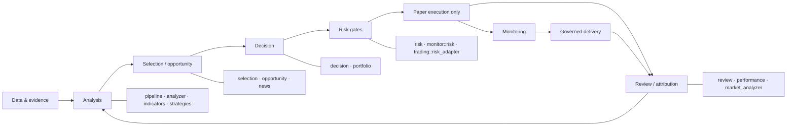

| 能力 | 当前职责 | 主要模块 |
| --- | --- | --- |
| 技术/基本面分析 | 指标、趋势、技术报告、财务/新闻分析、score/veto | `pipeline`、`analyzer`、`indicators`、`trend_analyzer`、`company_*` |
| 策略与回测 | Boll/MACD、RSI、multi-factor/timeframe、contrarian、lot、v16.4 | `strategy`、`backtest` re-export、多个 research binaries |
| 机会发现 | 事件提取、产业链映射、候选台、竞价、real alpha、winrate、launch gate | `opportunity` |
| selection-v2 | acquisition、admission、feature、sample、outcome、receipt、recovery | `selection`、`database::selection_v2*` |
| 决策支持 | exclusion、rotation、leader/sector score、capital verify、live/holding plan、T0 | `decision` |
| 风险 | cash/env guard、limits、stop loss、sector exit、veto chain、account/action gate | `risk`、`monitor::risk`、`trading::risk_adapter` |
| 模拟交易 | order safety、paper buy/sell、ledger/audit | `trading`；不含实盘下单路由 |
| 复盘归因 | 日/周复盘、watchlist、failure attribution、factor IC、epoch/replay | `review`、`performance`、`market_analyzer` |
| 通知投递 | legacy NotificationService、push L1-L7、monitor production durable route | `notification`、`push_l*`、monitor-local runtime |

近期已落地的能力扩展：

- BR-249 将 `chain_daily` 主线簇与持仓行业链归属装入 NewsAI v2 evidence context，并新增 `ChainRisk` monitor 告警；它们复用现有 NewsAI/monitor/durable 链，不构成新服务。证据：`src/monitor/news_ai.rs:589-600`、`src/bin/monitor/news_ai_shadow.rs:399-537`、`src/monitor/detector.rs:64,435`。
- BR-250 通过统一证券身份 Gateway 为 NewsAI 卡片补 display-only 名称；名称不进入 identity、prompt、证据 hash 或 DB，恢复推送缺名时只显示代码。证据：`src/monitor/news_ai.rs:120,282-288,1236`、`src/bin/monitor/news_ai_shadow.rs:436-469`。
- BR-255 的 15:05--15:20 归因闭环改用 `HistoricalBarsGateway` 当日收盘价，并新增 `attribution_backfill` 运维入口；epoch 首月窗口截断到 effective date。证据：`src/bin/monitor/market_data.rs:88`、`src/bin/monitor/main.rs:9084`、`src/performance/attribution.rs:542`、`src/bin/attribution_backfill.rs`。

### 10.1 模拟交易边界

- `CURRENT`：`decision::intraday_monitor` 获取 `broker::execution_quote`，保留真实涨跌停标志和 `quote_observed_at`，调用 `paper_trade::simulate`。证据：`src/decision/intraday_monitor.rs:175-235`、`:470-521`。
- `CURRENT`：monitor 盘中/盘后调用 `paper_sell::scan_and_sell*`；FIFO lot ledger 已重建，默认允许模拟卖出，只有 `PAPER_SELL_DISABLED=1` 才显式暂停。证据：`src/bin/monitor/main.rs:8246-8274` 及 `paper_sell_paused` 调用点。
- `INACTIVE`：legacy `paper_engine::run_once` 已从 production loop 隔离，函数自身返回 disabled error。证据：`src/bin/monitor/main.rs:8329-8353`、`src/trading/paper_engine.rs:409`。
- `EXTERNAL/未接通`：真实 broker trade-sync watermark 尚未连接，confirmed account snapshots 只作为 display facts。证据：`src/bin/monitor/main.rs:1800-1801`、`:2414-2418`。

因此本系统当前是分析、监控、受控通知与 paper simulation 系统，不应被架构图标成自动实盘交易系统。

## 11. selection-v2 阶段架构

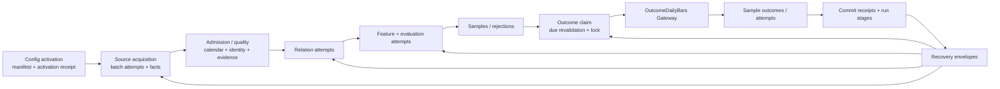

### 11.1 所有权与顺序

selection-v2 通过 opaque/typed capability 阻止 caller 自造中间状态：

1. activation runtime 读取真实 CLI/env/config evidence，决定 generation 与 outcome capability 是否释放。证据：`src/selection/activation_runtime.rs`、`activation_gate.rs`。
2. acquisition/admission 将 provider batch 与 trading calendar、instrument identity、source evidence 绑定。证据：`src/selection/acquisition_v2.rs`、`admission.rs`、`ingress_v2.rs`。
3. feature/evaluation/relation 构造 stage input，不允许绕过 stage ownership。证据：`features.rs`、`relation.rs`、`model.rs`。
4. `SelectionV2PersistenceOwner` 提交 stage、audit、receipt，并 read-back 验证。证据：`src/selection/persistence_v2.rs`、`src/database/selection_v2_repository.rs`。
5. `OutcomeSettlementOwner` 是生产 outcome 编排唯一 owner：先 drain recovery、fresh revalidate due，再 commit claim，之后调用 provider，最后 commit outcome receipt。证据：`src/selection/outcome_v2.rs:260-294`、`:854-935`、`:1085-1193`。
6. outcome claim 使用 descriptor-relative/no-follow 文件锁确保进程/跨进程同一 logical subject 只有一个 owner。证据：`src/selection/outcome_v2.rs:348-750`。

### 11.2 激活状态

`CONDITIONAL`：selection-v2 代码已完整存在，但 monitor 每次启动计算 `selection_v2_enabled`；disabled 时明确输出 providers=0、database_operations=0、sinks=0、schedulers=0。证据：`src/bin/monitor/main.rs:4523-4612`。generation-only release 与 outcome capability 还能独立关闭，不能用“模块存在”推断“默认生产启用”。

BR-178 又增加一层运行保护：当 production `DatabaseManager` 没有 amended selection schema authority 时，outcome recovery/due tick 返回空 summary 并只告警一次，不再每分钟制造 failed-closed 噪声；authority 接线后才自动放行。证据：`src/database/selection_v2_read_model.rs:231-239`、`src/selection/outcome_v2.rs:1106-1118`。

### 11.3 selection-v2 final catalog

| 对象 | 数量 | 约束 |
| --- | ---: | --- |
| final tables | 12 | 见附录 E |
| explicit indexes | 5 | activation、pending source、generation、outcome attempt、receipt subject |
| static triggers | 17 | lineage、manifest closure、receipt closure |
| stage membership targets | 9 | 对 9 张 stage table 生成 membership constraints |
| symbol constraint targets | 3 | relation、evaluation、sample |
| final payload schemas | 5 | config-v1、ingress-v2、generation-v3、outcome-claim-v2、outcome-v3 |

证据：`src/database/global_schema_catalog_v1.rs:27-146`。

## 12. 持久化投递与权威审计

### 12.1 投递序列

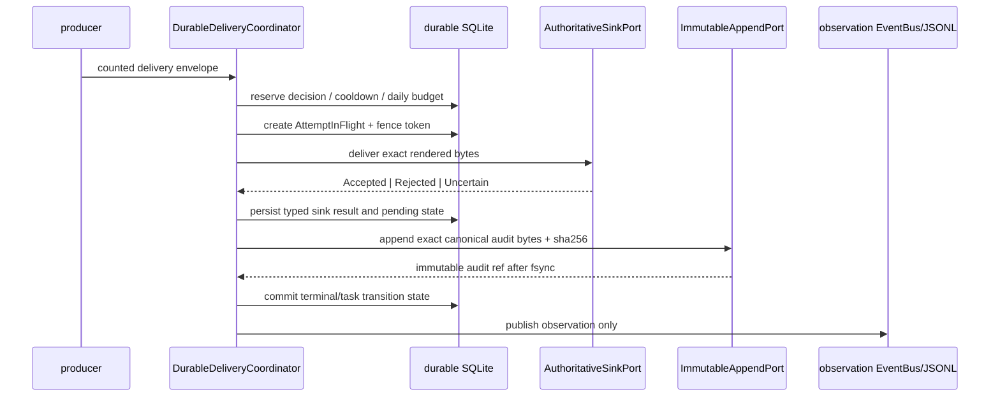

顺序语义：

- authoritative sink request 绑定 decision id、attempt id、fence token、push kind、stable template id、exact rendered bytes 与 SHA-256。证据：`src/durable_delivery/model.rs:1164-1179`。
- immutable append port 接收 exact canonical bytes 与 expected SHA-256。证据：`src/durable_delivery/model.rs:1183-1192`。
- monitor 明确声明 event bus 不能 acknowledge delivery。证据：`src/bin/monitor/main.rs:4744-4748`。
- event delivery audit 与 durable immutable audit 都使用固定/隔离 authority、retained descriptor、hash chain、sync/fsync；不接受任意 caller path 升级为生产 authority。证据：`src/event/dispatcher.rs:20-44`、`:190-250`，`src/event/durable_delivery_append.rs:1-52`。

### 12.2 DecisionState 状态机

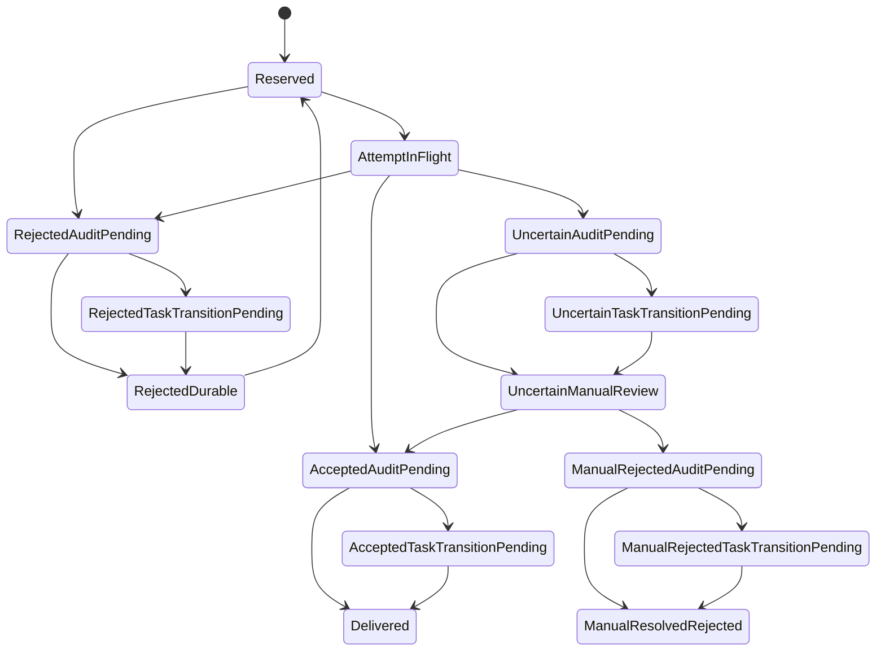

14 个状态定义在 `src/durable_delivery/model.rs:800-814`；上图 20 条合法 transition 逐项来自 `src/durable_delivery/coordinator.rs:7123-7150`。任何新增状态必须同时修改 enum、string mapping、schema constraints、transition table、reconciliation 与 tests。

### 12.3 恢复原则

- startup reconciliation 在 producer 启动前到达 durable local fixed point；未过闸不启动生产者。证据：`src/bin/monitor/main.rs:4954-4982`。
- non-expired foreign attempts 不自动 resend；uncertain decisions 留给 manual review。证据：同一启动窗口的日志分支。
- `RejectedDurable -> Reserved` 是唯一显式 retry loop；BR-249 要求先由 `authorize_rejected_retry` 写入授权，再重新取得 lease/fence/reservation，不能盲目重发。证据：`src/durable_delivery/coordinator.rs:3606`、`src/bin/monitor/durable_delivery_runtime.rs:1748`。
- review terminal replay 有 attempt/completion 两张专用表；恢复行为不是简单重放外部 sink。
- startup review backfill 只在 `runtime_producer_ready()` 后扫描历史业务日；缺估值时用 exact business-date closing valuation 回填，避免把上一交易日价格冒充目标日。证据：`src/bin/monitor/main.rs:5498-5526,5953-5966`、`src/database/closing_valuation.rs:145-170`。

## 13. 事件、推送与通知架构

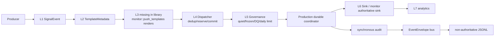

当前并存的三套抽象：

| 抽象 | 用途 | 边界 |
| --- | --- | --- |
| `notification::*` | default CLI 报告通知；email/Feishu/WeChat | 较早的 report-oriented service |
| `push_l1/l2/l4/l5/l6/l7` | library push layering、governance、sink、analytics | L3 缺失；L4 是内存 dedup compatibility 层 |
| monitor `notify` + `durable_delivery_runtime` | production counted delivery、receipt、audit、recovery | 当前生产权威路径 |

`push_l6` 提供 ConsoleSink、SinkRouter、HttpSink、WechatSink、FeishuSink；`push_l7` 提供 AnalyticsStore、InMemoryStore、SqliteStore。证据：`src/push_l6/mod.rs`、`src/push_l7/mod.rs`。新增生产 sink 不能只注册到 L6；若它承载 counted delivery，还必须实现 authoritative receipt 语义并接入 durable runtime。

### 13.1 两套 bus 不可混淆

| Bus | Payload | 特性 | 证据 |
| --- | --- | --- | --- |
| `event::bus::EventBus` | `EventEnvelope` | publish outcome、metrics、shutdown；用于 observation/replay | `src/event/bus.rs:43-166` |
| `monitor::event_bus::EventBus` | `MonitorEvent` | 全局 Tokio broadcast；alert/opportunity/order/price/DQ/info | `src/monitor/event_bus.rs:74-107` |

monitor bus lag 会记录丢失条数并继续；它不是 durable queue。通用 replay 默认 dry-run，force 模式生成新 id、设置 `replay_of`、跳过 delivery audit event，并把 publish failure 计为失败。证据：`src/event/replay.rs:108-190`、`:277-451`。

## 14. 数据架构

### 14.1 物理存储拓扑

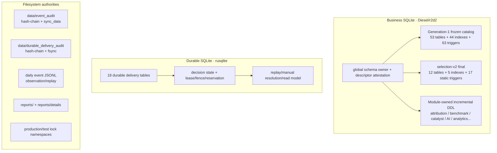

### 14.2 Business DB owner

`DatabaseManager` 是 `OnceCell` singleton，持有 operational pool、optional attribution pool、descriptor sources、readonly attribution snapshot 与 selection schema authority。字段 drop order 也是安全合同：pool connections 必须先于 owner descriptors 和 global schema maintenance lease 释放。证据：`src/database/mod.rs:419-435`。

连接安全包括：

- Diesel `SqliteConnection` + r2d2 manager；每个新建或重建连接执行固定 PRAGMA 配置。证据：`src/database/mod.rs:1893-2255`。
- descriptor-bound main/WAL/SHM identity、connection attestation token、read-back connection 与 namespace-swap 检测。证据：`src/database/mod.rs:900-2011`。
- selection/attribution authoritative reads 不接受 caller-supplied connection；query-only 与 retained proof 在 owner 内验证。证据：`src/database/mod.rs:2706-2873`。
- global schema application id/generation 与 SQLite version range 被校验。证据：`src/database/global_schema_catalog_v1.rs:153-156`。

### 14.3 三类业务 schema

| 类别 | 定义方式 | 说明 |
| --- | --- | --- |
| legacy generation-1 | frozen TSV catalog + DDL fixture | 53/44/63 的基线，完整表清单见附录 D |
| selection-v2 final | typed catalog plan + canonical DDL | 12/5/17，另有动态 membership/symbol triggers，见附录 E |
| incremental owners | 各模块的 explicit DDL/migration | 不属于 53 frozen 数量；必须按 owner 管理 |

已观察的增量生产表族：

- attribution epoch：`attribution_sample_epoch_receipt(_chain)`、`attribution_legacy_carry_item`、`attribution_epoch_attempt_audit/_chain`、`paper_attribution_epoch_daily/_chain`；owner `src/database/attribution_epochs.rs`。
- attribution report：`attribution_report_epoch_binding/_chain`、`attribution_run_audit/_chain`、`attribution_report_revision/_chain`、`attribution_failure_audit/_chain`；owner `src/database/attribution_reports.rs`。
- benchmark：`benchmark_segment_revision/_chain`、`benchmark_manifest`、`benchmark_manifest_acquisition`、`benchmark_manifest_chain`；owner `src/database/benchmark_segments.rs`。
- catalyst：`catalyst_watchlist_run/daily/outcome`；owner `src/database/catalyst_watchlist.rs`。
- news AI delivery：`news_ai_delivery_event/_chain`；owner `src/database/news_ai.rs`。
- paper inventory audit：`paper_inventory_failure_audit/_chain`；owner `src/database/paper_inventory_failure_audit.rs`。
- closing valuation：`closing_valuation_run`、`closing_valuation_item`；owner `src/database/closing_valuation.rs`，两表都有 no-update/no-delete triggers，run identity 包含 price date/provider/positions。
- newer projections：`daily_change_confirmation_v2/_chain_v2`、selection generation cadence/audit closure 两表、`candidate_trigger_selection`、`holding_plan_daily`、`push_analytics`。

测试表、migration 中间表（例如 `_v3/_v4/_v5`）和 `TEST_CODE_*` 不计入生产目录。

### 14.4 数据质量模型

| 规则 | 表达 |
| --- | --- |
| 来源确认空 | `GatewayBatch::VerifiedEmpty(evidence)`，区别于错误或非法 `Available([])` |
| 时间证据 | `source_at`、`observed_at`、business/trading date、freshness thresholds |
| 批次身份 | provider/source/batch_id/content hash；转换必须保持 identity |
| 不可信数据 | typed GatewayError / rejection / retryable；不得补零或伪造字段 |
| 幂等/唯一 | selection receipt、event id、delivery decision/attempt、business-date-once claim |
| 篡改证据 | chain tables、no-update/no-delete triggers、SHA-256 canonical bytes |

## 15. AI、LLM 与 Agent 子系统

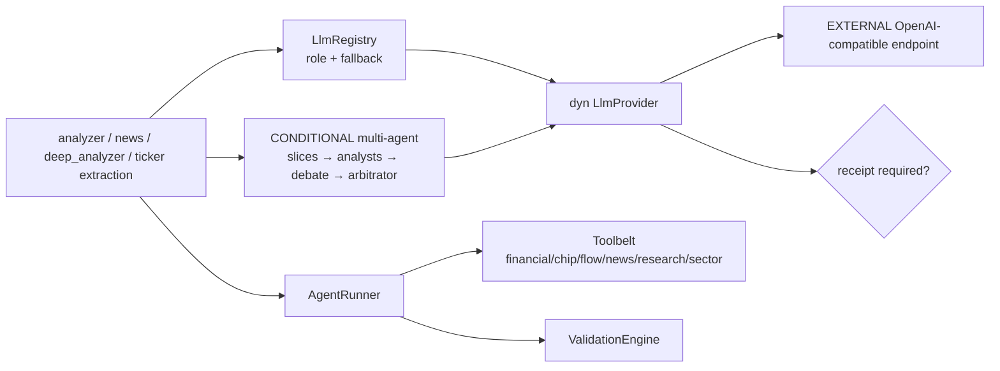

架构规则：

- `LlmProvider::chat_json_with_receipt` 默认 fail-closed 为 `ReceiptUnavailable`；只有绑定真实 upstream response id/model 的实现可 override。证据：`src/llm/mod.rs:198-225`。
- registry 从 `LLM_ROLE_<NAME>` 与 `LLM_DEFAULT_FALLBACK` 选 provider；无可用 provider 返回 None 并记录。证据：`src/llm/registry.rs:28-109`。
- ticker extractor 的业务降级是空结果，不把推断当事实。证据：`src/llm/ticker_extractor.rs:50-80`。
- AgentRunner 限制重复相同 tool call、清除失败事实、运行 validators，并可切换 model fallback。证据：`src/agent/loop_runner.rs:86-310`。
- `CONDITIONAL` multi-agent 真实存在，但只由明确入口启用，例如宏观路径 `MACRO_AGENT_PIPELINE` 或 CLI `--deep-analysis`；默认 `AnalysisPipeline` 不是全量 agent orchestration。证据：`src/analyzer/macro_rec.rs:78-95`、`src/app/modes.rs:16-35`。
- NewsAI 使用 `NEWS_AI_ANALYSIS_VERSION=news_ai_v2`，产业链字段进入 normalized prompt 与 evidence hash；证券名称严格是 display-only，不参与 dedup identity。链上下文读取失败降级为空字段，不阻塞单条评估，也不得推断缺失事实。证据：`src/monitor/news_ai.rs:35-38,589-600,2157-2165`、`src/bin/monitor/news_ai_shadow.rs:399-537`。

## 16. 依赖方向与已知环

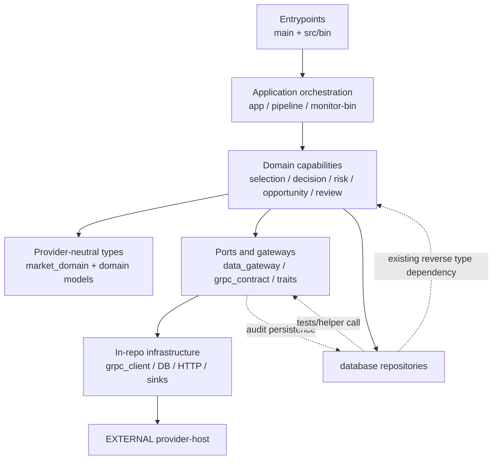

理想方向是 entrypoint → application → domain → gateway/infra，但当前不是严格分层：

- `data_gateway/grpc_source.rs` 依赖 database acquisition audit 与 `DatabaseManager`。
- `database/mod.rs` 构造 selection schema types；database tests 还调用 data_gateway helper。
- pipeline position tracker 同时依赖 database、`monitor::risk`、`risk` 与 data_gateway。
- monitor binary-local 模块承担较多 composition 和部分业务 owner。

这些是当前实现事实，不应画成不存在的纯 hexagonal architecture。边界主要由源码扫描测试而非多 crate 编译边界执行。证据：`tests/unified_data_architecture.rs`、`tests/test_design_contradiction.rs`。

## 17. 横切关注点

### 17.1 认证与秘密

| 场景 | 当前实现 | 代码依据 |
| --- | --- | --- |
| CLI operator | 启动前 `require_monitor_operator_auth`，失败 exit 1 | `src/main.rs:29-34`、`src/auth/` |
| gRPC request | Bearer metadata 可来自环境；authorization 不进入 debug/tracing | `src/grpc_client/auth.rs:1-77` |
| remote bundle | HTTPS + CA + client cert/key + server name + instance Bearer | `src/grpc_client/bundle.rs:68-121`、`client.rs:69-109` |
| secret hygiene | `Zeroizing<String>`；authorization 不进 debug/tracing | `src/grpc_client/auth.rs:29-77` |
| deployment permissions | bundle 0700，token/key/cert/connection 0600 | `README.md:149-161` |

### 17.2 配置与 feature flags

- `.env`：credentials、paths、mode、feature toggles；CLI/monitor 启动加载。
- `config/strategy.toml`：risk + monitor + opportunity projections。
- `config/chain.toml`：chain rules、announce keywords、exclusion boards。
- `config/selection/*.json`：trading calendar、provider board bindings、activation。
- `config/design_contracts.toml`：coverage/governance contracts。
- `config::load_all()` 读取两份 TOML 到 `ArcSwap`/`RwLock` snapshots；解析失败保留前值/默认值。证据：`src/config.rs:492-736`。
- 只有 CLI schedule 每轮 override `.env`；monitor 没有相同的全量热重载承诺。
- Cargo 当前没有项目级 `[features]`；provider 隔离由仓库边界、Cargo dependency gate 和唯一远程 gRPC 路径执行，而不是 feature switch。
- 市场数据连接只接受 `GRPC_MARKET_ADDR` 与可选 `GRPC_MARKET_CLIENT_BUNDLE`；不存在 local/provider 运行时选择开关。
- `PAPER_SELL_DISABLED=1` 是模拟卖出逃生口；selection release 仍受 hash、effective time、executable evidence activation 控制。

### 17.3 错误、韧性与并发

- 边界使用 `anyhow`、`thiserror`、typed domain failures；provider/retryability 尽量保真。
- 同步 Gateway、SQLite、文件或 CPU 边界通过 `spawn_blocking`/专用 runtime 隔离，避免阻塞 Tokio worker。
- Tokio broadcast 的 lag 是可观察丢失，不是 durable guarantee。
- gRPC retry 有分类、有界、指数退避；request/auth/contract errors 不重试。
- monitor 长任务由 supervisor 统一观察；JSONL writer 或 main loop fatal failure 导致 exit 2。
- singleton lease、fence token、reservation、cross-process lock 防止双 owner；测试 namespace 与 production namespace 强隔离。

### 17.4 日志、指标与可观察性

- `env_logger` 使用本地毫秒时间、level、target。证据：`src/main.rs:37-51`。
- event bus 暴露 published/no-subscriber/rejected metrics。证据：`src/event/bus.rs:43-58`、`:156-166`。
- L4 dispatcher 与 L7 analytics 有计数/持久化统计，但它们不替代 durable delivery read model。
- health/capabilities、opening static/live readiness、data-mode/account-mode banner、audit preflight、startup reconciliation 都有结构化 reason code/日志。
- `src/bin/monitor/metrics.rs` 与 `prometheus` 依赖存在，但该 module 未被 monitor composition root 接线，也没有 HTTP listener；因此当前没有可达的 Prometheus/OpenTelemetry exporter或集中式 tracing pipeline，应标 `INACTIVE prototype`，不能从文件存在推断 production metrics endpoint。

## 18. Rust 实现模式

### 18.1 Trait ports + `Arc<dyn Trait>`

```rust
pub trait AuthoritativeSinkPort: Send + Sync {
    fn sink_identity(&self) -> &str;
    fn deliver(&self, request: &AuthoritativeDeliveryRequest) -> AuthoritativeSinkResult;
}

pub type AuthoritativeSink = Arc<dyn AuthoritativeSinkPort>;
```

来源：`src/durable_delivery/model.rs:1176-1181`。适合需要 test double、运行时实现选择、且接口比实现更稳定的边界。

### 18.2 Default method 作为 fail-closed capability

```rust
async fn chat_json_with_receipt(
    &self,
    _system: &str,
    _user: &str,
) -> Result<ReceiptBearingJson, LlmError> {
    Err(LlmError::ReceiptUnavailable {
        provider: self.name().to_string(),
        model: self.model().to_string(),
    })
}
```

来源：`src/llm/mod.rs:212-225`。默认实现不伪造高保证 capability，真实 provider 必须显式证明。

### 18.3 显式 capability catalog

```rust
pub fn is_implemented(op: Operation) -> bool {
    implemented_operations().contains(&op)
}
```

来源：`src/grpc_contract/ops.rs:130-132`。proto 中存在不代表本仓 consumer 会使用；40-op catalog 与外部 provider-host capability negotiation 共同决定生产可用性。

### 18.4 单一远程 Lazy bridge

```rust
pub fn bridge_for(_op: &str) -> Result<Arc<GrpcSource>, GatewayError> {
    // process-wide cache; network connection is established on first query
    let source = GrpcSource {
        addr: std::env::var("GRPC_MARKET_ADDR")
            .unwrap_or_else(|_| DEFAULT_ADDR.to_string()),
        external_bundle: std::env::var_os("GRPC_MARKET_CLIENT_BUNDLE")
            .filter(|value| !value.is_empty())
            .map(PathBuf::from),
        // ... lazy clients
    };
    Ok(Arc::new(source))
}
```

来源：`src/data_gateway/grpc_source.rs:1063-1087`。同一个 typed gateway API 只有远程 transport；地址、认证或证据失败均显式返回，不存在 library provider fallback。

### 18.5 Once-initialized process owners

```rust
pub struct DatabaseManager {
    pool: DbPool,
    attribution_pool: Option<DbPool>,
    // descriptor-bound authorities omitted
}

static DB_INSTANCE: OnceCell<DatabaseManager> = OnceCell::new();
```

来源：`src/database/mod.rs:419-435`。项目还使用 `OnceLock`、`LazyLock`、`ArcSwap` 管理 process-scoped bridge、config、bus 与 runtime owner；测试通常提供 local instance 或显式 namespace，避免共享全局状态污染。

### 18.6 显式状态转换白名单

```rust
fn legal_transition(from: DecisionState, to: DecisionState) -> bool {
    matches!((from, to),
        (DecisionState::Reserved, DecisionState::AttemptInFlight)
        // ...其余合法 pair 显式列出
    )
}
```

来源：`src/durable_delivery/coordinator.rs:7123-7150`。状态机用 pair whitelist 而不是“非终态即可迁移”的宽规则。

### 18.7 其他 Rust-specific 选择

- `async_trait` 用于 LLM 与异步 sink/tool ports。
- Tokio `join!` 表达长期并发任务；`spawn_blocking` 隔离同步 provider/SQLite/CPU 边界。
- Diesel 负责业务 DB typed schema/repositories；rusqlite 负责 durable coordinator 的精细事务与 trigger 控制。
- `build.rs` 合并 proto compatibility extensions，并同时生成 client 与 integration fixture 使用的 server trait；生成 server trait不等于拥有 production server。
- `cfg(test)`、`tests/support/grpc_fixture`、TEST_CODE namespace、isolated roots 是测试隔离策略；production provider-host 始终在仓库外。

## 19. 测试架构与质量门禁

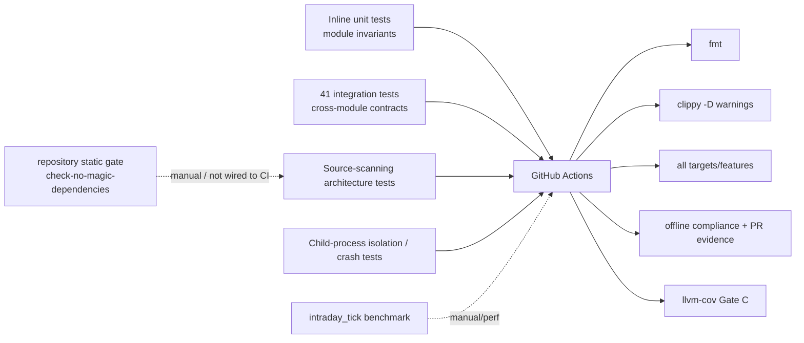

### 19.1 测试层次

| 层次 | 当前模式 | 示例 |
| --- | --- | --- |
| module unit | 与实现同文件，覆盖 parsing、state、schema、retry、renderer | `grpc_contract::ops`、`durable_delivery`、`selection_v2` |
| integration | `tests/*.rs`，验证跨模块、E2E、架构边界 | `grpc_bridge_e2e`、`durable_delivery_counted_cutover` |
| source contract | 扫描源码/调用点，防止绕过 gateway 或恢复禁用调用 | `unified_data_architecture`、`test_design_contradiction` |
| process isolation | child binary/process、foreign CWD、crash/restart、help storage-free | `tool_binary_process_isolation`、`monitor_help_isolation` |
| schema/attestation | SQLite catalog、trigger、descriptor identity、read-back proof | database/selection/durable 内联 tests |
| benchmark | Criterion-like Cargo bench target `intraday_tick` | `benches/intraday_tick.rs` |

### 19.2 CI 事实

| Workflow | 当前门禁 | 证据 |
| --- | --- | --- |
| Rust CI | fmt；strict clippy all targets/features；test all targets/features | `.github/workflows/ci.yml` |
| compliance | offline compliance；选择的 unit/e2e；PR commit spec refs | `.github/workflows/compliance.yml` |
| coverage | Rust 1.95.0；cargo-llvm-cov 0.8.7；workspace all-features；diff Gate C | `.github/workflows/coverage.yml` |
| PR template lint | monitor/push/notify 变更要求 v13/v14.2 refs | `.github/workflows/pr-template-lint.yml` |

注意：`scripts/check-no-magic-dependencies.sh all` 当前是仓库内可运行的静态门禁，但未接入上述 workflows；不得写成 CI 已执行。`compliance.yml` 仍引用 Cargo metadata 中不存在的 `--test e2e`，属于待修 CI 配置漂移。架构维护时应验证 workflow 命令真实可解析，而不是只读注释。

## 20. 构建、部署与运行手册

### 20.1 构建矩阵

| 目标 | 命令 | provider linkage |
| --- | --- | --- |
| default CLI | `cargo build --release --bin stock_analysis` | gRPC consumer；不链接 provider implementation |
| production monitor | `cargo build --release --bin monitor` | gRPC consumer + durable owner |
| client probes | `cargo build --release --bin grpc_bundle_probe --bin grpc_local_readiness_probe` | 只验证已运行的外部 endpoint |
| attribution repair | `cargo build --release --bin attribution_backfill` | 使用 HistoricalBarsGateway + attribution epoch authority |

依据：`README.md:76-115`、Cargo metadata。仓库没有 provider server 构建目标。

### 20.2 启动顺序

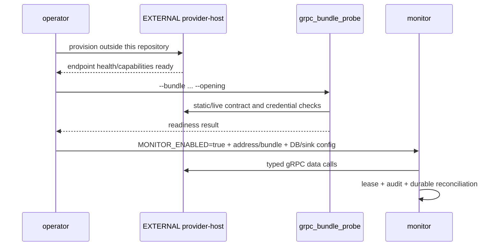

运行约束：

- provider-host 的 listener、provider credentials 和服务端数据持久化属于外部部署责任；本仓不拥有其生命周期。
- 一个生产 namespace 只能有一个 monitor delivery lease owner。
- monitor 需要 business DB、durable DB、event/durable audit directories、locks、client bundle 和 sink credentials。
- remote bundle 必须先通过 health/capability/opening gates。
- 当前仓库没有自动创建 OS service、容器镜像或集群资源的实现；这些属于部署环境责任。

### 20.3 运行产物

| 产物 | 典型路径 | 权威性 |
| --- | --- | --- |
| business DB | `data/stock_analysis.db` 或 `DATABASE_PATH` | 业务事实/读模型 |
| durable DB | `data/durable_delivery.sqlite3` | 投递状态与恢复 authority |
| event delivery audit | `data/event_audit` | 权威 hash-chain delivery evidence |
| durable immutable audit | `data/durable_delivery_audit` | durable coordinator exact-byte authority |
| event JSONL | daily JSONL base dir | non-authoritative observation/replay |
| reports | `reports/`、`reports/details/` | 人类可读投影 |
| locks | `data/locks/production/...` 或 isolated test roots | ownership/fencing |

## 21. 扩展蓝图

### 21.1 新增一个 Data Gateway capability

1. 在 `src/data_gateway/` 定义 request、record、`GatewayBatch<T>` 返回与 evidence validation；provider-specific 类型不得泄漏给业务层。
2. 在外部 provider-host 仓库实现 provider-specific acquisition；本仓不得重新引入 provider SDK、provider server target 或本地采集 fallback。
3. 明确 `Available`/`VerifiedEmpty`/error/retryability/freshness 语义。
4. 任何新市场数据 capability 都继续执行 21.2 的 gRPC 合同扩展步骤；不存在“仅本地 provider route”。
5. 添加真实 consumer integration test、bridge hook/source scan test、错误分类测试。
6. 更新 `data-sources-inventory`、本蓝图 capability 表与 evidence matrix。

### 21.2 新增一个 gRPC operation

1. 优先更新上游 `client-bundle/market.proto`；只有明确兼容需求才在 `build.rs` 添加 local extension。
2. 更新 `grpc_contract::ops::method_name`；若生产可用，再加入 `implemented_operations()`。
3. 在 params/schema/validate 中定义版本和字段约束。
4. 在外部 provider-host 实现并发布对应 capability；通过版本/health/capability probe 证明可用，本仓不增加 production server handlers。
5. 在 `grpc_client` 增加 RPC dispatch 与 decode；在 `data_gateway::grpc_source` 增加 wire-to-domain bridge method。
6. 将真实 gateway call site 纳入 `HOOKED_OPS`，不允许以 local fallback 绕过合同。
7. 用 `tests/support/grpc_fixture` 添加 client/contract roundtrip、bridge E2E、capability count 与全 enum mapping tests，并对真实外部 host 做独立部署验收。

### 21.3 新增 monitor 常驻任务

1. 判断它是 reusable monitor domain 能力还是 bin-local composition。
2. 定义终止/错误语义：返回 fatal、重试，还是只发 DQ observation。
3. 在 producer 激活前声明所需 startup gates；不得在 audit/durable reconciliation 前产生 counted delivery。
4. 若为主循环，加入 `main_loops`；若为 background JoinHandle，加入带名字的 `background_tasks`。
5. 确保 `supervise_long_running_lifecycle` 能观察它，避免 detached silent failure。
6. 更新 source-scanning lifecycle tests 与本蓝图任务树。

### 21.4 新增 selection feature/stage

1. 在 selection model/features 中定义 canonical input/output 与版本。
2. 通过 owner 构造 opaque prepared stage；不暴露 caller 可自造 receipt/run id 的 API。
3. 更新 canonical DDL/catalog、stage membership/symbol triggers、payload schema allowlist。
4. 更新 recovery envelope 与 ordered drain 逻辑。
5. activation gate 必须决定能力是否 release；disabled branch 要做到 provider/DB/sink/scheduler 全零副作用。
6. 增加 commit + audit + receipt read-back、crash boundary、process isolation tests。

### 21.5 新增 counted PushKind 或 production sink

1. 在 compiled policy catalog 定义 cooldown、daily budget、business-date-once 等策略。
2. 构造稳定 subject/occurrence/evidence/source binding 与 exact rendered bytes。
3. 若新增 sink，实现 `AuthoritativeSinkPort`，返回 Accepted/Rejected/Uncertain 的真实 typed receipt；不可把 HTTP 2xx 之外的模糊状态假定成功。
4. 通过 coordinator reserve → attempt → sink → audit → terminal transition；禁止 bus/L6 shortcut。
5. 更新 durable schema constraints、reconciliation、manual review、task transition payload。
6. 添加 crash-before/after-sink、foreign lease、duplicate、uncertain、audit append fault 和 restart E2E。

### 21.6 新增业务表

1. 先决定 owner：global frozen generation、selection-v2 final、module-owned incremental，或 durable isolated schema。
2. 业务 DB 使用 Diesel/owner migration；durable DB 使用 coordinator schema transaction；不要跨两个 DB 做假原子事务。
3. 对审计/receipt 表定义 canonical bytes/hash、FK、unique 与 no-update/no-delete constraints。
4. 更新 descriptor/global schema attestation 或相应 module catalog。
5. 添加 clean DB、existing DB、partial schema、future generation、namespace swap 与 rollback/fail-closed tests。
6. 更新附录 D/E/F 或增量表族清单。

## 22. 架构决策记录（由代码推导）

这些条目是 `INFERRED` architecture decisions，用于解释当前代码；如需正式治理，应另建 ADR 并记录批准者与日期。

### ADR-I01：provider host 是仓库外系统边界

- 状态：`INFERRED / CURRENT`
- 决策：本仓只保留 provider-neutral domain、gRPC client/contract 与 consumer admission；provider-host 在外部仓库独立构建部署。
- 动机：彻底隔离 provider linkage、credentials、阻塞采集与控制面，避免 monitor/CLI 加载 provider SDK。
- 代价：跨仓合同/能力发布必须协调，服务不可达时只能 fail-closed，不能靠本地 fallback 应急。
- 证据：`Cargo.toml`、`README.md:28-44`、`scripts/check-no-magic-dependencies.sh`、Cargo targets。

### ADR-I02：统一 Data Gateway 是唯一外部数据边界

- 状态：`INFERRED / CURRENT`
- 决策：业务代码只消费 gateway/`market_domain` types；所有市场数据从 external provider-host 进入，再执行本仓 evidence admission。
- 动机：保持 identity、freshness、empty/error、batch evidence 和 fail-closed 语义一致。
- 代价：data_gateway 体量很大，并与 audit database 形成反向依赖。
- 证据：`tests/unified_data_architecture.rs`、`src/data_gateway/mod.rs`。

### ADR-I03：durable delivery 物理隔离

- 状态：`INFERRED / CURRENT`
- 决策：delivery coordinator 使用独立 rusqlite DB 和独立 immutable audit，而非复用 Diesel business pool。
- 动机：租约/fence/恢复/状态机需要独立 authority 和精细事务控制。
- 代价：跨 DB 无原子提交；需要 startup reconciliation 和 payload/hydration bridge。
- 证据：`src/bin/monitor/durable_delivery_runtime.rs:76`、`src/durable_delivery/schema.rs`。

### ADR-I04：权威审计先于 observation bus

- 状态：`INFERRED / CURRENT`
- 决策：synchronous durable audit 才能确认 delivery；bus/JSONL 仅 observation/replay。
- 动机：broadcast 可 lag/no-subscriber，JSONL projection 可失败，均不满足 counted delivery authority。
- 代价：投递路径延迟更高，audit filesystem 成为启动与运行硬依赖。
- 证据：`src/bin/monitor/main.rs:4744-4748`、`src/event/jsonl_writer.rs:1-12`。

### ADR-I05：selection-v2 通过 activation gate 渐进发布

- 状态：`INFERRED / CONDITIONAL`
- 决策：代码可存在，但 generation/outcome capability 必须由 config/receipt/runtime evidence 释放。
- 动机：避免未闭合 schema/provider/outcome/recovery 直接产生生产副作用。
- 代价：activation/recovery/receipt 代码复杂，旧 selection 与 v2 并存。
- 证据：`src/selection/activation_runtime.rs`、monitor `selection_v2_enabled` 分支。

### ADR-I06：兼容层只保留业务/协议兼容，不保留 provider fallback

- 状态：`INFERRED / COMPAT`
- 决策：保留 NotificationService、push L1-L7、legacy selection 和 wire extensions 等业务/协议兼容层；provider SDK、本地 server 与本地市场数据 fallback 已删除。
- 动机：允许增量迁移与回归对照。
- 代价：同一能力存在多套抽象；必须清楚标注 production wiring，避免误接旧 bypass。
- 证据：`src/lib.rs` push 注释、`build.rs` compatibility extensions、`paper_engine` disabled、monitor-local durable runtime、no-Magic gate。

### ADR-I07：安全边界用 descriptor 与源码测试补强单 crate

- 状态：`INFERRED / CURRENT`
- 决策：不拆多个 crates，而用 descriptor attestation、opaque capabilities、source scans、process tests 执行边界。
- 动机：在单 package 内保持开发效率，同时保护关键 authority。
- 代价：编译器不能阻止所有跨模块依赖；source tests 对重命名敏感。
- 证据：`src/database/mod.rs` descriptor manager、`tests/unified_data_architecture.rs`。

## 23. 新开发治理模板

每个架构相关 PR 应回答：

| 问题 | 必填证据 |
| --- | --- |
| 它属于哪个运行单元？ | CLI/monitor/tool 或外部 provider-host；是否改变跨仓合同/部署依赖 |
| 它的 authority 是谁？ | 唯一 owner、lease/fence/receipt/descriptor |
| 数据从哪里来？ | gateway capability、provider、batch/evidence/freshness |
| 空、缺失、过期、模糊结果如何表达？ | typed empty/error/retryable/uncertain，不得补事实 |
| 写到哪里？ | business/durable/filesystem；说明是否可原子提交 |
| 是否产生外部副作用？ | governance、dedup、audit、sink receipt、dry-run isolation |
| 如何恢复？ | restart、partial commit、foreign owner、manual review |
| 哪些模式启用？ | default/feature/env/activation/session/test/compat 状态 |
| 哪些测试执行边界？ | unit、integration、source scan、process/crash、CI |
| 蓝图哪些清单受影响？ | modules/targets/ops/states/tables/tasks/decisions |

### 23.1 禁止的架构捷径

- 在本仓任何位置重新引入 provider SDK、provider-only target 或直接 provider acquisition。
- 以 `Vec::new()` 伪装 provider 确认空批次。
- 将 event bus publish 或 JSONL append 当成 counted delivery 成功。
- 在 production monitor/CLI 增加 library provider fallback，或在远程失败时伪装本地成功。
- caller 自造 selection receipt、due work、run id 或 delivery audit ref。
- 绕过 durable coordinator 直接调用 production sink。
- 把 test namespace、TEST_CODE receipt 或 arbitrary path 提升为 production authority。
- 新增 `DecisionState` 却不更新 transition/schema/recovery 全链。
- 宣称“热重载”却只重载 `.env` 或只更新一份 config projection。

## 24. 推送系统专项架构与演进路线

> 状态：`PROPOSED`  
> 审计日期：2026-09-01 至 2026-09-02  
> 范围：65 个 `PushKind`、monitor 定时/事件 producer、presentation、push L1-L7、NotificationService、durable delivery、authoritative sink、业务完成游标与盘前/竞价/盘中/盘后调度。

本节是基于第 8、12、13、16、18、21 与 22 节当前架构事实形成的专项演进方案。它不改变以下既有架构决策：provider-host 位于仓库外、Data Gateway 作为唯一市场数据准入边界、durable delivery 物理隔离、权威审计先于 observation bus，以及业务兼容层的渐进迁移方式。

### 24.1 审计口径、状态与时段边界

本节的“所有推送项”包括两层：`PushKind` enum 的 65 个稳定业务名称，以及绕过 `PushKind` 的真实通知路径。enum 定义、等级与冷却只证明合同存在，不证明生产可达；生产状态以 composition root、scheduler、source capability、presentation gate、durable policy 和 sink 调用图的交集为准。主要证据入口是 `src/bin/monitor/notify.rs:45-197,289-460`、`src/bin/monitor/presentation_registry.rs:42-421`、`src/bin/monitor/main.rs:5464-5525,8796-11295` 与 `src/bin/monitor/push_templates.rs:9546-9818`。

“逐行”在本文中按可执行语义解释：每个时间判断、feature/环境 gate、取数分支、空数据分支、状态写入、渲染、governor、sink、回执、重试和完成游标都落到连续代码行范围；纯 import、括号和派生样板只说明结构作用，不虚构业务含义。每个 65-kind 行都至少带一个当前存在且未越界的 `path:line` 证据。

业务状态标签仅用于本专项清单：

| 标签 | 精确定义 |
| --- | --- |
| `ACTIVE` | 当前生产 composition root 有 producer；仍可能因非交易日、无数据、冷却、权限、证据或 sink 失败而不发送 |
| `STARVED` | 调度和 dispatcher 可达，但当前上游不再产生新的有效输入，只可能消费历史残留 |
| `OPT-IN` | producer 存在，但 checked-in/default 配置关闭；显式开关后才可进入发送链 |
| `INACTIVE` | 无 producer、结构不可达、source 未注册、硬编码 disabled，或 fail-closed 合同阻断 |

`MarketSession` 的真实边界是：盘前 `Closed(<09:15)`、集合竞价 `Auction([09:15,09:25))`、竞价后闭市间隙 `[09:25,09:30)`、早盘 `[09:30,11:30)`、午休 `[11:30,13:00)`、下午盘 `[13:00,15:00)`、盘后 `AfterHours(>=15:00)`；证据为 `src/calendar.rs:508-559`。下表按“主要业务归属”只收录一次，跨时段 producer 会在行内明确标出，因此分类计数不等于 scheduler 数量。

### 24.2 所有 monitor PushKind 共用的逐层逻辑

| 顺序 | 当前代码行为 | 成功/失败语义 | 证据 |
| ---: | --- | --- | --- |
| 1 | producer 从 Data Gateway、业务 DB、事件总线或 owner 文件读取结构化事实；各入口自行决定交易日、时窗、空数据和业务筛选 | 这是最分散、最容易把“计算完成”误当“通知完成”的一层 | `main.rs:8796-11295`；`push_templates.rs:2520-9538` |
| 2 | `PushKind` 给出 level、banner、cooldown 与 scope；`is_deprecated()` 当前永远为 false | enum/metadata 不代表 producer 已启用 | `notify.rs:203-286,289-534` |
| 3 | production presentation 以 `(family, kind, producer, renderer)` 精确签 token；当前 58 个 tuple 覆盖 54 个唯一 kind | token 只证明允许的展示形状，不证明数据源和调度可达 | `presentation_registry.rs:42-421` |
| 4 | generic governor 先拒绝 counted kind，再执行 launch/source/v14 gate、L4 去重与 L5 治理；counted kind 必须携带稳定 occurrence、subject、canonical evidence | `Denied` 不得当成送达；普通周期 helper 却把 `Deduped` 当 confirmed | `notify.rs:2213-2450,2891-2966`；`push_templates.rs:14617-14659` |
| 5 | counted 路径进入 `DurableDeliveryCoordinator`，执行 reserve、attempt、fence、typed sink result、immutable audit、terminal/reconcile | durable catalog 只有 23 个 kind；未列入的 kind 不得伪造 counted binding | `durable_delivery/model.rs:169-226,611-650`；`durable_delivery_runtime.rs:1354-1369,2270-2321` |
| 6 | monitor 物理层默认飞书；webhook 走 HTTP，否则走 magiclaw CLI；显式 `wechat` 才走微信。发送前必须先落 push log，鉴权失败仅重签后重试一次 | dry-run、尝试前拒绝、真实尝试成功/失败是不同结果；不能压成裸 `bool` | `notify.rs:3133-3387,4325-4329,4628-4662` |
| 7 | 物理成功后提交治理去重并写 L7/hash-chain；后置审计失败返回 `SinkError` 但避免盲目重发 | observation bus/JSONL 不是权威 receipt | `notify.rs:3653-3768`；`src/event/jsonl_writer.rs:1-12` |
| 8 | 盘后 `ReviewTask` 另有 delivered/no_data/deferred/disabled/failed 状态和 1/5/15 分钟退避 | 该路径把 `Deduped` 转为不可重试 Failed，与普通周期语义冲突 | `review_batch.rs:829-940,1190-1240,1507-1687` |

### 24.3 盘前推送（5 个 PushKind）

| PushKind / 状态 | 触发、业务逻辑与完成规则 | 代码证据 |
| --- | --- | --- |
| `AccountMode` / `ACTIVE` | 启动时评估，08:30 后当日补做；核对持久化旧状态与本次 evaluation，先写审计 pending，再推“旧→新模式、原因、限制、解除条件”。只有 `Pushed` 才把同一行标记完成；失败保留 pending 并重试。Frozen 新迁移还会附带 `MarketActionAlert`。 | `main.rs:5464-5487,9370-9430`；`push_templates.rs:1817-2069` |
| `DataMode` / `ACTIVE` | 启动及常驻 data-mode loop 评估 Full/Degraded/Unsafe；首次 Full 静默建基线，恶化到 Unsafe 立即推，其他抖动需稳定 5 分钟。Degraded 禁盘口判断，Unsafe 再禁价格建议；只有静默建基线或 `Pushed` 才 confirmed。此项跨盘前、竞价、盘中和盘后持续监测，主归属启动/盘前。 | `main.rs:5464-5525`；`push_templates.rs:14312-14477` |
| `SnapshotStale` / `ACTIVE` | 启动时检查用户确认持仓快照；只有落后最近交易日至少 5 个交易日才提醒。`begin` 建 in-flight，只有 `Pushed/Deduped` 才 `finish` 当日完成，失败可重试。不要与 15:05 复用 `IntradayMarket` 的“超过 6 小时”提醒混为一项。 | `main.rs:1900-1965,9241-9294` |
| `PreopenNewsHot` / `ACTIVE` | P-01 仅交易日 `[09:00,09:15)` 每 30 秒检查；读取上一交易日涨停池 200 条，取产业链前三主线首票并绑定证券身份与逐票新浪新闻；总新闻数为 0 则终态拒绝。先 inspect/resume durable claim，再渲染和 counted send；缺权威终态时即使底层称 Pushed/Deduped 也判失败。 | `p01.rs:19-20,101-150,484-1035,1284-1392,1488-1601`；`push_templates.rs:14744-14811` |
| `CandidateTriggered` / `INACTIVE` | 设计意图为 09:00--09:15 候选转正；实际代码位于“已经等到市场 active”之后却要求 `Closed`，结构无交集。即使人工开关通过，caller 传 `promotion_evidence=None`，且当前无 durable lifecycle transition owner，dispatcher 必须 fail closed。 | `main.rs:9442-9457,9590-9616`；`push_templates.rs:5714-5835,14227-14265` |

补充：09:10 行情预检不是独立 `PushKind`，它复用 `IntradayMarket`；与 `CandidateTriggered` 位于同一不可达分支，而且探测一执行就封当天，外发失败也不重试。证据：`main.rs:9618-9688`。

### 24.4 集合竞价推送（7 个 PushKind）

| PushKind / 状态 | 触发、业务逻辑与完成规则 | 代码证据 |
| --- | --- | --- |
| `AuctionVolume` / `ACTIVE` | 09:20 后每个竞价 tick 读取当日涨停池，按量比降序选未通知 Top10；只有 dispatcher 返回 true 才把 code 写入进程内 `auction_vol_notified`，banner/token/sink 失败可在竞价窗口再试。 | `main.rs:9692-9773`；`push_templates.rs:5935-5984` |
| `AuctionRepush` / `ACTIVE` | 与 CandidateBoard 同一 tick；过滤价格/热度缺失项，Strong 优先、再按热度降序取 Top5，展示首来源、现价、热度。它与 CandidateBoard 都成功才封本轮，否则下一 tick 继续，由各自 cooldown 再防重复。 | `main.rs:9775-9801`；`push_templates.rs:7184-7275` |
| `CandidateBoard` / `ACTIVE` | 合并 P5 文件、持仓和 chain 等候选，输出排序候选台；发送前先做失效 diff、采样并把本轮 code 快照写盘，最后才发送，所以发送失败时 diff 基线已经推进。 | `push_templates.rs:3517-3655,7752-7865` |
| `CandidateInvalidated` / `ACTIVE` | CandidateBoard 将“上一快照存在、本轮消失”的 code 逐票发 T-08，内容是旧状态→Invalidated 与原因；名称可能因本轮已无 entry 回退为 code。它不是独立 scheduler。 | `push_templates.rs:703-743,7752-7865,14268-14286` |
| `LimitBoards` / `ACTIVE` | 只处理存在主力净流数据的涨停股，最多查 40 个板级、排序最多取 50 个；首板/二板/三板分别取 token 并发三张卡，但共享同一 kind 冷却/预算。代码先 `board_notified.insert` 再渲染发送，失败后同日不会重试该票。 | `main.rs:10241-10416` |
| `VirtualWatch` / `STARVED` | Confirm 模式且早盘候选非空、价格全为 0 时初始化；报价按持仓→涨停池→实时行情补齐，正价项先持久化 snapshot 再推，返回值被丢弃且日志无条件写“已推送”。但唯一候选写入来自固定空字符串 `post_close`，当前没有新输入。 | `main.rs:9803-9967,10103-10238` |
| `PaperTrade` / `ACTIVE` | 竞价工作流约 09:15--09:20 每 30 秒消费当日已持久化终态；逐条要求合法 A 股、buy/sell、正价、整百股数量、终态及唯一 order audit/hash chain，SQL 精确联接 plan/source/reason。所有行 Pushed/Deduped 才 confirmed。 | `main.rs:10043-10057`；`push_templates.rs:5319-5693` |

### 24.5 盘中推送（22 个 PushKind，含尾盘集合竞价与事件驱动）

| PushKind / 状态 | 触发、业务逻辑与完成规则 | 代码证据 |
| --- | --- | --- |
| `HoldingEvent` / `INACTIVE` | 仍有紧急级 renderer/metadata，但 legacy summary 在渲染前停用；LimitUp/LimitDown、主力流入流出、放量、炸板等内存告警因没有 durable lifecycle owner 统一 fail closed，不外发。 | `main.rs:9520-9523,10555-10712,11514-11530` |
| `Announcement` / `ACTIVE` | news loop 从 EventCalendarGateway 取当日最多 300 条，关键词分类并用概念/名称补 code；受众为自选+24 小时内确认持仓。每个输入经生命周期、分类、受众、dedup/source-fact gate，只有 disposition=Pushed 才进入后续催化。当前配置可让 news loop 全天运行，主归属事件驱动。 | `main.rs:7293-7454,7464-7528,8000-8124`；`v17_sources.rs:714-787` |
| `SectorTop` / `ACTIVE` | 每小时尝试一次，从 Concept 板块排行生成领涨 Top；构造全局 counted binding。空批按 confirmed empty，投递成功或失败当前都会重置小时 timer。 | `main.rs:10990-11048`；`push_templates.rs:16334-16423` |
| `SectorAnomaly` / `ACTIVE` | 与 SectorTop 同一小时调度，检测量价反向；读取财联社 20 条并取前 10 标题作归因，新闻失败用空归因文本，非空 moves 才构造全局 counted binding。当前无论成功失败也重置 timer。 | `main.rs:10990-11048`；`push_templates.rs:14087-14152,16429-16456` |
| `FundInflow` / `INACTIVE` | enum 仅保留“主力净流入 Top10”元数据；生产源码精确引用扫描没有 dispatcher/caller。当前板块资金展示由 `IntradayMarket`/`SectorTop` 承担，不能把模板名称视为在推。 | `notify.rs:60-61`；`main.rs:10810-10855,10990-11048` |
| `TurnoverTop` / `INACTIVE` | 有真实板块成分加载、换手率排序 Top10 和 renderer，但没有生产 scheduler/dispatcher 调用；因此是“实现存在、无 producer”。 | `push_templates.rs:1053-1161` |
| `NewsRanked` / `INACTIVE` | enum 注释和启动审计语义均为 shadow ranker 无生产调用；只剩 level/适配/测试清单引用。 | `notify.rs:84-91` |
| `HoldingPlan` / `ACTIVE` | 每 30 分钟基于确认持仓+行情逐票生成；空仓静默，缺行情/非法成本跳过；盈亏 >+5% Reduce、<-3% Add、否则 Hold，并给减仓区/支撑/压力/止损。票级 durable occurrence；Pushed/Deduped 后写跨重启一日一票表，全部确认才推进 timer。 | `main.rs:8460-8620,10857-10986` |
| `T0Advice` / `ACTIVE` | 每 30 秒到期，按持仓与 Magic TDX 批次生成逐票建议，展示趋势、均价/ATR、量能/五档、卖出/接回区、数量和失效条件；全批 Pushed/Deduped（空批也算）才推进 timer，失败立即保留重试。 | `main.rs:10735-10804`；`push_templates.rs:518-567` |
| `ForbiddenOps` / `INACTIVE` | T-09 renderer 可输出结论和多条禁因，durable enum 也保留，但当前告警 producer 因缺生命周期 binding 被 `reject_unbound_alert_delivery` 统一阻断，没有生产发送调用。 | `push_templates.rs:703-743`；`main.rs:10555-10712,11514-11530` |
| `PaperSell` / `ACTIVE` | 默认启用，仅 `PAPER_SELL_DISABLED=1` 暂停；盘中每 30 秒随决策 tick、盘后 15:30 再扫，只有真实风险上下文才执行，逐票普通 governor。发送失败只告警，没有 durable counted receipt。 | `main.rs:8246-8274,8816-8876,8928-8967` |
| `CloseCall` / `ACTIVE` | 14:55 后读取确认持仓，只对相对成本跌幅 ≤-3% 的票生成“尾盘跳水”；逐票 `close-call:{date}:{code}` counted binding。只有所有票 confirmed 才封当天，失败保留重试。 | `main.rs:8624-8707,11138-11210` |
| `IntradayMarket` / `ACTIVE` | 主路径每 5 分钟读取 Concept 板块 1 日资金流 Top10，真实空推进 timer、取数失败不推进、仅 confirmed delivery 推进。该 kind 还被 09:10 不可达预检和 15:05 快照新鲜度提醒复用，导致三种业务共享冷却/指标。 | `main.rs:9618-9688,10810-10855,9241-9294`；`push_templates.rs:2520-2664` |
| `NewsCatalyst` / `ACTIVE` | 公告路由本轮至少一条 Important 才触发；优先最新 board_rotation、校验最多 9 只股票，无 rotation 回退 chain_daily，LLM 为可选增强，失败/空回退主题规则。 | `main.rs:8126-8192`；`push_templates.rs:2670-3050,14068-14084` |
| `NewsToIdea` / `ACTIVE` | 与 NewsCatalyst 共享 Important 新闻触发；从统一候选批取第一名，按 source_count 定阶段、涨幅决定 DoNotChase/BuyDip/Observe，可选 LLM 最多 3 条理由。先确认推送，BuyDip 才模拟买 100 股；虚拟买入失败会使本轮 false 且不写 1 小时 memo。 | `main.rs:8126-8192`；`push_templates.rs:3517-3655,3888-4187` |
| `IndustryChainIntraday` / `ACTIVE` | 每 15 分钟调用产业链扩散；空来源 confirmed empty，有候选时可用 LLM 生成 trigger，失败回退原 trigger。只有 confirmed 才推进 timer；成功后保存 pushed_stocks，审计写失败会把周期改为 Failed。 | `main.rs:10857-10926`；`push_templates.rs:3337-3468` |
| `StPriceLimitChanged` / `ACTIVE` | 09:30 后一次性检查 ST 持仓，展示 ST 类型、5%→10% 规则参数、成本/现价与新止盈止损；dispatcher 成功才封当天。 | `main.rs:11098-11123`；`push_templates.rs:5029-5088` |
| `EtfClosingCallAuction` / `INACTIVE` | 语义属于 14:57 尾盘集合竞价，不是开盘 Auction；到点后代码直接记录 `disabled=no_etf_auction_producer` 并封当天，不取数、不渲染、不发送。 | `main.rs:11212-11222` |
| `PolicyHit` / `INACTIVE` | classifier 要求非 research-only、完整 governed evidence、标题/source/发布日期，并允许全局无 code；但生产没有调用 classifier，`SourcePushKind::PolicyHit` 只在测试直接构造。 | `src/news/aggregator/classifier.rs:315-359`；`v17_sources.rs:714-787` |
| `MarketActionAlert` / `ACTIVE` | 事件路径只从 `MonitorEvent::OrderUpdate` 生成，以 code/action/shares 构 identity，内存状态未变化则跳过；AccountMode 进入 Frozen 时还会额外生成一次。按 Emergency 无条件绕过 launch gate。 | `v17_sources.rs:177-220`；`push_templates.rs:2027-2057`；`notify.rs:2440-2450` |
| `NewsFlashCritical` / `INACTIVE` | 虽有专用 typed-receipt 事务和 presentation，但 SourceOnly aggregator 完全不使用 critical threshold，所有合格新闻只进缓冲；测试若产生 N-01 reservation 会 panic，启动也声明无权威 strength provider。 | `news_aggregator_init.rs:136-149,478-609,1475-1476`；`main.rs:7641-7654` |
| `NewsFlashAggregated` / `ACTIVE` | 从不可变 event authority 预检后抓各 feed 20 条；固定在 09:30/11:30/13:00/15:00（首 tick 容差 5 分钟）按 strength 取 Top3。同窗口未决 reservation 只恢复不新建；仅 Accepted 计数，Rejected/Uncertain 精确 settle。 | `main.rs:7685-7817`；`news_aggregator_init.rs:520-605,1057-1145` |

### 24.6 盘后推送（31 个 PushKind）

| PushKind / 状态 | 触发、业务逻辑与完成规则 | 代码证据 |
| --- | --- | --- |
| `DailyReport` / `INACTIVE` | R-01/旧收盘汇总有 renderer 和 durable 映射，但收盘主循环因缺 immutable counted/source contract 明确停用；不能把 `FactorIC/SectorTier/CapitalVerify` 的 sub-kind 映射当作 generic DailyReport producer。 | `main.rs:11242-11276`；`push_templates.rs:1163-1198`；`durable_delivery_runtime.rs:2307-2318` |
| `FactorIC` / `INACTIVE` | 仅保留 `DailyReportSubKind::FactorIC` 稳定映射；没有生产 producer 构造该 `PushKind` 或完整 immutable binding。 | `notify.rs:64-65,228-286`；`durable_delivery_runtime.rs:2307-2316` |
| `SectorTier` / `INACTIVE` | 与 FactorIC 相同，只是 `DailyReportSubKind::SectorTier` 元数据，没有当前 production caller。 | `notify.rs:66-67,228-286`；`durable_delivery_runtime.rs:2307-2316` |
| `CapitalVerify` / `INACTIVE` | 与 FactorIC 相同，只是 `DailyReportSubKind::CapitalVerify` 元数据，没有当前 production caller。 | `notify.rs:68-69,228-286`；`durable_delivery_runtime.rs:2307-2316` |
| `WeeklySOP` / `INACTIVE` | enum/cooldown 保留一周计划语义，生产调用图没有 renderer dispatcher 或 scheduler。 | `notify.rs:70-71,421` |
| `StockPick` / `INACTIVE` | `stock_pick` 仍是 CandidateBoard 的输入来源枚举，不是 `PushKind::StockPick` 投递；该 kind 没有 producer。 | `push_templates.rs:3517-3553`；`notify.rs:72-74` |
| `IndustryChain` / `INACTIVE` | R-03 注册为 LegacyAccountGate；当前账户依赖任务统一产生 `AccountMetricsIncomplete`，不会进入 provider/renderer/sink。注意 09:05/15:30 产业链报告走的是独立 NotificationService，不是此 kind。 | `review_batch.rs:408-505,1570-1687`；`push_templates.rs:9546-9818` |
| `AttributionDaily` / `ACTIVE` | 15:05--15:20 计算持仓报价、日/30 日归因，落 DB 并写 Markdown，再普通 governor 推摘要。代码不论 Pushed/Deduped/Denied/SinkError 都标当天完成，故通知失败不重试。 | `main.rs:8988-9122` |
| `G5bAttribution` / `ACTIVE` | 同一 15:05--15:20 窗口；无告警即封日，有告警但无 LLM 不封；最多分析 `DEEP_ATTRIBUTION_MAX_EVENTS` 条，每条先保存深链结果再推。`done` 统计分析/持久化成功而非确认送达，批次尝试完即封日。 | `main.rs:9143-9238` |
| `ReviewMarket` / `INACTIVE` | R-02 在 13-task catalog 中，但 preflight 明确 Disabled，不调用 provider/renderer/sink。 | `review_batch.rs:408-505,1570-1687` |
| `ReviewLhb` / `ACTIVE` | R-04 自动运行需 21:00（手工可绕过）；取 Eastmoney 龙虎榜 top-five 完整批次，verified-empty 终态 NoData，否则 source-only counted delivery。 | `review_batch.rs:1570-1687`；`push_templates.rs:12732-12932` |
| `ReviewSignal` / `INACTIVE` | R-05 已注册但 preflight 明确 Disabled。 | `review_batch.rs:408-505,1570-1687` |
| `ReviewFailure` / `INACTIVE` | R-06 已注册但 preflight 明确 Disabled。 | `review_batch.rs:408-505,1570-1687` |
| `TomorrowWatch` / `ACTIVE` | R-07 21:00 后聚合 A 档未触发、龙虎榜净买 Top5、涨停链前三、可做 T 持仓；用收盘价派生 ±2% 区间和 -5% 止损，去重后仍必须绑定完整 LHB provider batch。 | `review_batch.rs:1570-1687`；`push_templates.rs:8047-8475` |
| `EventCalendar` / `ACTIVE` | R-08 并发取 CNInfo 公告、CFFEX 交割、海外指数、USD/CNY；允许部分组件降级，但把所有可用批次完整绑定后走 source-only counted gateway。 | `push_templates.rs:10983-11210` |
| `ReviewProviderTopN` / `ACTIVE` | R-09 15:35 后运行；并非全市场榜，而是 Eastmoney 单响应中的量比/主力净流入双 TopN。每行严格校验 metric/unit/source ordinal/date/filter/证券身份并保留 declared total/inspected count。 | `review_batch.rs:1570-1687`；`push_templates.rs:6226-6323,6680-6777` |
| `PositionReview` / `ACTIVE` | R-11 要求用户确认账户摘要和 review_date 收盘估值；空仓也可推“无持仓”，有持仓按行业市值 Top5+其他汇总，可选 deep-analyzer 文本不阻塞，最后 counted delivery。 | `push_templates.rs:8797-9012` |
| `ReviewBacktest` / `INACTIVE` | R-12 虽在 scheduler/durable catalog，但常量 `R12_TECHNICAL_BARS_PUBLISHED=false`，在 loader/provider 前直接 Disabled。 | `push_templates.rs:9020-9110` |
| `WatchlistTracking` / `ACTIVE` | R-13 次日读取 A-10 watchlist 并核对行情，确认推送后落 outcomes；outcomes 落库失败只 warning，不反转已经送达的状态。 | `push_templates.rs:9343-9538` |
| `CatalystReview` / `ACTIVE` | A-10 读取可见产业链批，按成员数/连板数/持续性派生 0..100 分和明日观察点，走 counted；成功后保存 T+1 watchlist，保存失败不反转投递。静默期会延期。 | `review_batch.rs:1570-1687`；`push_templates.rs:13551-13755` |
| `PostFixedPriceOrder` / `INACTIVE` | T-14 dispatcher 每 15 分钟的代码入口存在，但全仓没有生产调用 `register_trade_event_source`；每次在 source 边界失败。业务校验要求合法 A 股、正价、整百股、非空 order_id/status。其语义是盘后固定价格，当前却放在盘中分支。 | `main.rs:11052-11094`；`push_templates.rs:4688-4878` |
| `PostFixedPriceFill` / `INACTIVE` | 与 T-14 共用未注册 source，并要求 fill/`next_session_carry`；注释窗口 15:05--15:30，但调用嵌在 Morning/Afternoon 分支，15:00 后已退出，形成 source+schedule 双重不可达。 | `main.rs:10060-10080,11052-11094,11227-11229`；`push_templates.rs:4688-4878` |
| `BlockTradeIntradayConfirm` / `ACTIVE` | 名称称盘中，实际是 19:00 review side route：按自选+持仓查 BlockTradesGateway，300/301/688 只接受协议大宗、实时确认、合法百股数量/正价。 | `push_templates.rs:5127-5180,7684-7735,9700-9721` |
| `BlockTradePriceRange` / `ACTIVE` | 与上一项同一 19:00 side route；仅 8/4/920 开头北交所证券，要求正当日均价和非空价格区间。 | `push_templates.rs:5182-5215,7684-7735,9700-9721` |
| `PaperReview` / `STARVED` | A-01 可在 13:00--13:04 午盘和 19:00 review 执行，且午盘无论 bool 成败都封日；它读取 VirtualWatch snapshots。由于当前唯一 virtual_observation 生产写入来自固定空 `post_close`，新快照输入枯竭，只可能处理历史残留。 | `main.rs:9007-9022,9803-9967`；`push_templates.rs:13980-14220` |
| `IpoListingApproval` / `INACTIVE` | enum/presentation 元数据保留，启动明确打印 `disabled=no_producer`。 | `main.rs:5648-5654`；`notify.rs:174-178` |
| `IpoProspectus` / `INACTIVE` | 与 IpoListingApproval 相同，明确无 producer。 | `main.rs:5648-5654`；`notify.rs:174-178` |
| `IpoCatalyst` / `ACTIVE` | 盘后 review 的额外 side effect：读取/复用当日公告，按关键词分类和静态供应链表映射，必要时查询板块/成分/证券身份；无公告或 provider failure 静默短路。 | `push_templates.rs:7418-7627,9546-9818` |
| `EarningsBeat` / `OPT-IN` | 15:00 后 earnings provider 生成归一化 source event，但默认因缺报告期/预测年度/口径 binding 关闭；仅 `EARNINGS_BEAT_ENABLED=1` 放行，禁用告警每 30 分钟节流。 | `main.rs:7914-7953`；`v17_sources.rs:811-845` |
| `EarningsMiss` / `OPT-IN` | 与 EarningsBeat 共用 provider、校验与默认关闭 gate，仅分类结果为 Miss。 | `main.rs:7914-7953`；`v17_sources.rs:811-857` |
| `AnalystUpgrade` / `ACTIVE` | 15:00 后按配置轮询评级 provider，状态店追踪；归一化事件要求合法 code、当日发布日期、完整批次 evidence，再走 source-fact gate。 | `main.rs:7914-7953`；`src/news/aggregator/source_event.rs:308-383`；`v17_sources.rs:714-787,942-1015` |

13 个 ReviewTask 的自动 scheduler 只在交易日 19:00 后运行；R-04/R-07 还受 21:00 门，R-09 受 15:35 门，可重试失败按 1/5/15 分钟退避。注册任务不等于必然发送。证据：`main.rs:5786-5790,6252-6460`、`review_batch.rs:1190-1240,1507-1687`。

### 24.7 不经过 PushKind 的通知路径与 helper

| 路径 | 当前业务逻辑 | 问题与证据 |
| --- | --- | --- |
| 09:05 盘前产业链报告 | `[09:05,09:15)` 调 `run_chain_analysis_mode(true)`，先分析并保存报告，再遍历 `NotificationService` 渠道 | `Ok(false)`/`Err` 只记 warning，函数仍 `Ok(())`，外层据此封当天，通知失败不重试；`main.rs:9398-9427`、`src/app/modes.rs:106-182` |
| 15:30 盘后产业链报告 | `[15:30,15:35)` 与盘前路径相同；与 `PushKind::IndustryChain` 的 R-03 不是同一 producer | 同样存在“保存成功=调度完成、通知未确认也封日”；`main.rs:8974-9003`、`src/app/modes.rs:106-182` |
| default CLI 单股分析报告 | pipeline 生成报告后调用 `NotificationService::send`；该 service 顺序遍历已配置的 10 类 channel，任一成功即 `Ok(true)`，无渠道或全失败为 `Ok(false)` | caller 对 `Ok(_)` 一律打印“推送成功”，会把 `Ok(false)` 冒充成功；`src/notification/service.rs:124-272`、`src/pipeline/analyze.rs:1246-1257` |
| default CLI 汇总报告 | summary notifier 使用同一 NotificationService | 同样把 `Ok(false)` 记为成功；`src/pipeline/summary_notify.rs:8-65,107-114` |
| `monitor::AlertManager` | 设计注释称 Emergency 全渠道、Important 微信+飞书、Info 飞书/邮件 | 三个 match 分支实际都调用同一个 `send(text)`，且 `push_alert` 当前无生产 caller；`src/monitor/alert.rs:93-180` |

`NotificationService` 可配置企业微信、飞书、Telegram、邮件、Pushover、Custom、Server酱、钉钉、Slack、Discord 共 10 类渠道；`send` 顺序遍历，任一成功即 `Ok(true)`，无渠道或全失败是 `Ok(false)`。带图消息只有邮件真正携带附件，其他渠道降级成文本。证据：`src/notification/config.rs:3-38,51-132`、`src/notification/service.rs:124-374`。

### 24.8 全量对账结论

| 维度 | 数量 | 对账结果 |
| --- | ---: | --- |
| `PushKind` | 65 | 盘前 5 + 集合竞价 7 + 盘中 22 + 盘后 31 = 65；无 missing/extra/duplicate |
| 生产可达性 | 65 | `ACTIVE` 37 + `STARVED` 2 + `OPT-IN` 2 + `INACTIVE` 24 = 65 |
| presentation | 58 tuples / 54 unique kinds | 展示目录不等于 producer 目录；11 个 kind 无 presentation registration |
| durable counted | 23 kinds | 只代表进入 durable authority 的子集，不代表 23 个全部有可达 producer |
| enum 外通知 | 5 条路径/helper | 09:05/15:30 产业链、CLI 单股、CLI 汇总、AlertManager；其中前四条有实际 caller，AlertManager helper 无 caller |

上述数量由 `notify.rs:45-197`、`presentation_registry.rs:42-421`、`durable_delivery/model.rs:169-226` 的定义集合，与 `main.rs`/`p01.rs`/`push_templates.rs`/`v17_sources.rs`/`news_aggregator_init.rs` 的生产调用点做集合差分得到；测试 manifest 不参与生产状态判定，因为 `br196_test_delivery.rs:706-788` 仍固定 63 项并误标 CandidateBoard/IpoCatalyst。

### 24.9 当前事实与问题基线

推送目录的四个集合当前并不相等：

| 集合 | 当前实测 | 架构含义 |
| --- | ---: | --- |
| `PushKind` enum | 65 | 命名空间，不等于生产启用清单；`src/bin/monitor/notify.rs:45-197` |
| production presentation tuples | 58，覆盖 54 个唯一 kind | 允许的 family/kind/producer/renderer 形状，不证明 producer 可达；`presentation_registry.rs:42-421` |
| durable counted catalog | 23 | 进入 production durable owner 的 counted 子集；`src/durable_delivery/model.rs:169-226` |
| 生产调用图 | 37 有当前 producer；2 路径可达但新输入枯竭；2 默认关闭可 opt-in；24 禁用、阻断或无 producer | 当前运行事实；不能由 enum、模板或测试 manifest 单独推断 |

已确认的高风险问题：

| 问题族 | 当前实例 | 影响 | 主要证据 |
| --- | --- | --- | --- |
| 投递未确认却推进完成 | AttributionDaily、G5bAttribution、PaperReview 午间、15:05 快照提醒、09:05/15:30 产业链报告 | 漏重试、日志假成功、用户实际未收到 | `main.rs:8988-9238`、`:9241-9294`、`app/modes.rs:164-182` |
| 发送前推进通知状态 | LimitBoards、CandidateBoard | sink/token/renderer 失败后仍失去重试或改变差分基线 | `main.rs:10306-10416`、`push_templates.rs:7752-7865` |
| 调度窗口与代码位置矛盾 | CandidateTriggered、09:10 行情预检、PostFixedPriceFill | 代码存在但运行窗口没有交集 | `main.rs:9442-9688`、`:10060-10080`、`:11052-11229` |
| source capability 未接通 | PostFixedPriceOrder、PostFixedPriceFill | 周期入口重复失败；没有真实生产输入 | `push_templates.rs:4688-4878` |
| 新输入链断裂 | VirtualWatch → PaperReview | `post_close` 固定为空，后续只能消费历史残留记录 | `main.rs:9803-9967`、`:10103-10238` |
| 结果语义分叉 | 普通 periodic 把 Deduped 视为 confirmed；ReviewTask 把 Deduped 转为不可重试 Failed | 指标、终态原因和恢复行为不一致 | `push_templates.rs:14617-14659`、`review_batch.rs:829-940` |
| 旧通知路径返回值歧义 | pipeline 对 NotificationService 的 `Ok(false)` 记录成功 | 无渠道或全渠道失败被冒充成功 | `pipeline/analyze.rs:1246-1257`、`pipeline/summary_notify.rs:107-114` |
| catalog 漂移 | BR-196 只登记 63 kind，漏 PaperSell/SnapshotStale，并把 CandidateBoard/IpoCatalyst 错列为 disabled | 测试清单不能证明 runtime 状态 | `br196_test_delivery.rs:706-788` |
| 一个 kind 混合多种业务 | IntradayMarket 同时表示盘中板块、盘前数据源预警、盘后快照提醒 | 冷却、预算、订阅和指标互相污染 | `main.rs:9618-9688`、`:10810-10855`、`:9241-9294` |

### 24.10 目标架构约束

专项演进遵守以下约束：

1. **不新增推送微服务。** 保持 Rust 模块化单体；市场数据继续由 `EXTERNAL provider-host` 通过 gRPC 提供，本仓只运行 monitor/CLI/tools。
2. **Data Gateway 仍是 producer 的唯一外部数据 seam。** monitor 生产构建不得重新直接链接 provider SDK。
3. **DurableDeliveryCoordinator 仍是 monitor 生产投递的唯一 authority。** 不在其旁边新建第四套 counted 状态机。
4. **EventBus/JSONL 只做 observation。** bus publish、subscriber 接收或 JSONL append 均不能 acknowledge delivery。
5. **业务 DB 与 durable DB 保持物理隔离。** 通过稳定 decision id、幂等 finalizer 和 reconciliation 解决跨库完成，不制造假原子事务。
6. **monitor `main.rs` 保持 composition root。** 可复用规则放 library，具体 producer/sink/runtime 绑定留在 bin-local adapter。
7. **兼容路径按 strangler 迁移。** 不一次性重写 65 项；先固化 seam，再逐项切换 production wiring。

### 24.11 目标运行链

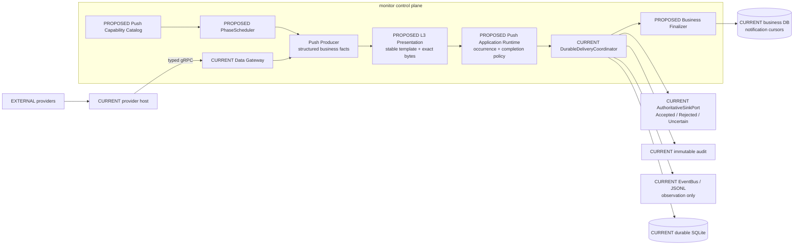

该运行链在现有 coordinator 前增加 application-level seam，不修改 coordinator 的 14-state authority。`DeliveryResult` 是应用层对 durable terminal/receipt 的规范化投影，不是新的 `DecisionState`。

### 24.12 模块落位与依赖方向

| 目标模块 | 建议位置 | 职责 | 禁止依赖/行为 |
| --- | --- | --- | --- |
| Push domain contract | `src/monitor/push_job.rs`（`PROPOSED`） | `RunContext`、`JobDecision`、`PreparedPush`、稳定 occurrence/subject | 不依赖飞书、HTTP、SQLite、全局 timer、presentation token |
| Push capability catalog | `src/monitor/push_catalog.rs`（`PROPOSED`） | kind、owner、phase、schedule、source、presentation、delivery class、activation、completion policy | 不执行网络/DB/sink；不与 BR-196 再维护第二份手写清单 |
| L3 presentation | `src/push_l3/`（`PROPOSED`） | 结构化 payload → stable template id、exact rendered bytes、SHA-256 | 不取行情、不推进业务状态、不从渲染文本反向解析事实 |
| Push application runtime | `src/bin/monitor/push_runtime.rs`（`PROPOSED`） | 绑定 producer、catalog、clock/calendar、presentation、coordinator 与 finalizer | 不包含持仓/候选/新闻分类规则；不直接实现 sink |
| PhaseScheduler | `src/bin/monitor/phase_scheduler.rs`（`PROPOSED`） | 交易日/phase/due/retry 调度并受 supervisor 观察 | 不使用 detached task；不自行解释物理 sink 结果 |
| Durable authority | `src/durable_delivery/**`（`CURRENT`） | reserve、attempt、fence、typed sink result、audit、terminal state、reconcile | 不拥有股票筛选、盈亏规则或报告内容 |
| Production adapters | `src/bin/monitor/**`（`CURRENT/COMPAT`） | Data Gateway、AuthoritativeSinkPort、immutable append、business finalizer 的具体绑定 | 不绕过 runtime/coordinator 直接发送 counted 消息 |

依赖目标保持：

```text
monitor entrypoint
    → push application runtime / scheduler
        → monitor domain contracts and producer rules
            → Data Gateway ports
        → presentation
        → durable coordinator ports
            → SQLite / sink / audit adapters
```

### 24.13 统一的应用层结果合同

producer 不返回含义不明的 `bool`，而返回：

```rust
pub enum JobDecision {
    Ready(PreparedPush),
    NoData,
    Disabled { reason: ReasonCode },
    RetryableFailure { reason: ReasonCode },
    PermanentFailure { reason: ReasonCode },
}
```

application runtime 将 durable/sink 结果规范化为：

```rust
pub enum DeliveryResult {
    TransportAccepted { receipt: DeliveryReceipt },
    AlreadyDelivered { decision_id: DecisionId, authority: AcceptanceAuthority },
    ManualConfirmedAccepted { resolution_id: ResolutionId, evidence_sha256: String },
    Rejected { retryable: bool, reason: ReasonCode },
    Uncertain { decision_id: DecisionId, attempt_id: AttemptId },
    NotDelivered { resolution_id: ResolutionId, reason: ReasonCode },
}
```

语义要求：

- `TransportAccepted` 只能由经过验证的 typed remote receipt 产生；HTTP 2xx、业务 `code=0`、CLI exit 0、日志或报告保存都不够。
- `AlreadyDelivered` 表示同一 occurrence 历史上已经由 transport 或人工证据权威确认；允许完成本 occurrence，但指标不得记为本次远端发送，且必须保留原 authority 类型。
- `ManualConfirmedAccepted` 是操作人基于受审查证据作出的独立事实，不得伪造 `DeliveryReceipt`，指标必须与 `TransportAccepted` 分开。
- `Rejected { retryable: true }` 保留由 durable reservation/fence 约束的重试资格。
- `Uncertain` 必须进入 inspect/reconcile/manual review；所有 severity 都禁止盲重发，Emergency 只提高核查频率，只有远端证明未接受或 transport 支持幂等键时才允许重试。
- `NotDelivered` 终止本 occurrence，但不推进“已通知”游标；后续独立 occurrence 仍可按 policy 运行。
- `NoData`、`Disabled`、业务计算完成、报告文件保存完成均不能冒充 delivery success。
- 所有 daily flag、timer 和 notification cursor 必须声明自己的 `CompletionPolicy`；caller 不再自由解释 `PushOutcome`。

### 24.14 跨业务 DB 与 durable DB 的完成协议

业务事实与投递事实分别归属：

| 存储 | 应拥有 | 不应拥有 |
| --- | --- | --- |
| business DB | 分析结果、候选快照、归因、虚拟观察、`latest_evaluated_snapshot`、`last_notified_snapshot`、业务 notification cursor | sink attempt、fence token、remote receipt、durable terminal authority |
| durable DB | decision、occurrence、reservation、attempt、receipt、audit pending/terminal、manual resolution | 股票筛选结果、盈亏规则、LLM 分析正文的业务 owner 状态 |

推荐协议：

1. producer 生成并幂等保存业务结果，绑定稳定 `decision_id`；business DB 同事务写 additive `push_notification_intents`，只保存业务键、finalizer 类型、目标游标、expected version 与 Prepared/Finalized 状态，不复制 sink attempt/receipt。
2. runtime 将 exact rendered bytes 与 evidence 交给 `AuthoritativeDeliveryPort`。generic `DurableDeliveryCoordinator` 是默认实现；P01/N02 通过 conformance 验证的 `DedicatedAuthoritative` adapter 保留，不重写其高保证状态机，也不允许新增第三种 authority。
3. authority 到达 `TransportAccepted`、`ManualConfirmedAccepted` 或发现 `AlreadyDelivered`。
4. business finalizer 以 `decision_id` 在 business DB 事务内幂等推进领域通知游标，并将 intent 标为 Finalized。
5. 如果步骤 4 前崩溃，startup/background reconciliation 查找“authority 已确认、business intent 未 finalize”并补齐；正常目标不超过两个 reconcile interval，硬上限 5 分钟。
6. rollback 只能关闭新 producer/scheduler；已经存在的 authority、finalizer、reconciler 与旧路径 fence 必须继续到 Prepared/Uncertain 全部结清，禁止删除 intent 或 durable decision 后让旧路径重发。

具体修复映射：

- CandidateBoard 同时保留 `latest_evaluated_snapshot` 与 `last_notified_snapshot`；失效差分只对后者计算。
- AttributionDaily 分离“归因计算完成”和“归因通知完成”。
- G5b 分离 analyzed/persisted/delivery_attempted/delivered/failed 计数。
- LimitBoards 只有 finalizer 确认后才推进通知 occurrence；不得在 sink 前写 `board_notified`。

### 24.15 PhaseScheduler 与启动 readiness

`PhaseScheduler` 作为受 `supervise_long_running_lifecycle` 观察的长期任务，统一使用 `calendar::MarketSession` 和交易日历，不依赖散落的 `Instant`、`static Mutex<Option<NaiveDate>>` 或注释时间窗。

所有时间驱动的 `ACTIVE`、`STARVED`、`OPT-IN` producer 都必须登记 PhaseScheduler；事件驱动 producer 可保留在受监督 event loop，但必须登记触发类型和 readiness。`INACTIVE` 只登记元数据和禁用原因，不创建 scheduler，也不得因 catalog 存在而被激活。

启动顺序扩展为：

```text
lease
→ activation
→ namespace
→ delivery mode
→ audit/artifact preflight
→ durable startup reconciliation
→ push capability readiness
→ activate ready producers and schedulers
```

每个启用定义必须验证：

- schedule 与允许的 `MarketSession` 至少有一个交集；
- producer 已绑定且 owner 唯一；
- required Data Gateway/gRPC capability 已实现；
- presentation tuple/stable template 已注册；
- counted kind 已进入 durable policy catalog；
- production sink 满足对应 receipt 强度；
- activation/feature gate 状态明确；
- completion policy 已声明；
- source 未注册时 scheduler 为零副作用 Disabled，而不是周期性失败。

readiness 分为两级：

- `CoreUnready`：namespace、durable DB、audit、typed sink 等共享 authority 前提失效，monitor 不得进入生产。
- `ProducerUnready`：单个 source/schedule/presentation/policy 缺失，只隔离对应 producer；进程可保持存活，但部署门禁失败并持续产生 operational alert。

activation 由单一、带 schema version 的 manifest 管理，每个 MigrationUnit 只能为 `Disabled`、`Shadow`、`Active`、`Draining`；启动时校验并记录完整 manifest hash。当前配置没有热加载，因此一次 promotion 通过受控重启生效，且只允许改变一个 physical owner。

readiness 至少输出：

```text
push_total
ready
conditional
compat
inactive
schedule_unreachable
producer_missing
source_missing
presentation_missing
durable_policy_missing
```

该门禁应在生产者启动前发现 CandidateTriggered/09:10 probe 的窗口矛盾和 T14/T15 的 source/时段问题。

### 24.16 三套通知抽象的兼容迁移

| 当前路径 | 迁移决策 |
| --- | --- |
| monitor `notify + durable_delivery_runtime` | 通过统一 `AuthoritativeDeliveryPort` 保持 production authority；generic coordinator 是默认实现 |
| push L1/L2/L4/L5/L6/L7 | 保留治理、sink、analytics 能力；L4 compatibility dedup 逐项被 durable occurrence 替代；新增 L3 presentation contract |
| `notification::*` | 继续作为 default CLI report-oriented `COMPAT/BestEffort` 路径；返回逐渠道 typed result，但弱回执不得推进 authoritative 通知游标，也不直接竞争 monitor production durable lease |

具体规则：

- 09:05/15:30 产业链定时报告属于 monitor 生产调度，应迁入 PhaseScheduler + durable authority。
- default CLI 单股/汇总报告短期保留 NotificationService，但返回 `BestEffortAccepted`、`PartiallyAccepted`、`NoChannelConfigured`、`AllChannelsFailed` 等明确结果；这些名称不能投影成 `TransportAccepted`。
- 若未来要求 CLI 报告也进入权威投递，应通过 monitor command/inbox seam；禁止 CLI 直接打开 production durable SQLite。
- P01、N02 已有较强 claim/receipt/recovery 合同，先作为 `DedicatedAuthoritative` adapter 进入 catalog/conformance，不重写状态机。

### 24.17 推送体验与语义去重

架构正确性稳定后，再进行内容层优化：

1. 拆分混合 kind：`IntradayMarket` 至少拆为盘前数据源预警、盘中板块资金、持仓快照新鲜度三种 occurrence/订阅语义。
2. 建立跨 kind `topic_key`（股票、板块、事件簇），避免 Announcement、NewsCatalyst、NewsToIdea、LimitBoards、IndustryChainIntraday 等短时间重复表达同一事实。
3. severity 决定即时/摘要和渠道：Emergency 即时多渠道、Important 即时主渠道、Info 进入周期摘要、Research 进入盘后报告。
4. 用户订阅至少支持竞价、持仓、新闻、板块、盘后复盘、研究报告、仅持仓相关、仅 Important/Emergency。
5. `AlertManager` 的级别路由必须真实选择 adapter，不能三个分支调用同一个 `send`。

### 24.18 增量实施顺序与验收

本节是 2026-09-02 Q1--Q55 Grill 决策的正式结果，覆盖并废止此前“C0--C6 横向串行、10--15 个有效开发日”的执行基线。C0--C6 只保留为能力标签；实际拓扑改为 **Foundation → 纵向 MigrationUnit → Final cleanup**。开发由 Codex 单独承担；每次改变 physical owner 的 production promotion 必须由用户或指定操作人在线监督，等待交易窗口、人工裁定、外部 source 与生产观察不计入有效开发日。

**确认后的范围：**

| 集合 | 数量 | 本轮处理 |
| --- | ---: | --- |
| `ACTIVE` | 37 | 全部进入 catalog、completion policy、readiness 与 trigger 对账；不合规 wiring 逐 MigrationUnit 迁移 |
| `STARVED` | 2 | 保持 Starved；修合同/完成语义/readiness，不恢复输入链或暗中激活 |
| `OPT-IN` | 2 | 保持 OptInDisabled；只有显式产品决策后才允许生产灰度 |
| `INACTIVE` | 24 | 只登记禁用原因和能力缺口，不创建 scheduler/producer，不因 enum/catalog 存在而启用 |
| enum 外真实通知 | 4 | 09:05/15:30 产业链进入 monitor authority；CLI 单股/汇总保留 typed BestEffort compatibility |
| enum 外无 caller helper | 1 | AlertManager 只登记 no-producer；修 severity adapter 不冒充生产迁移 |

**Foundation Release（零行为变化）：**

| 产物 | 必须具备 | 零行为证明 |
| --- | --- | --- |
| Domain contracts | `RunContext`、`PreparedFacts`、`JobDecision`、`DeliveryResult`、`CompletionPolicy` | 未接 caller 时无 provider/DB/sink 调用 |
| Business intent | additive `push_notification_intents` 与幂等 finalizer/reconciler | migration 只增表/索引；旧 binary 可忽略；无自动 drop |
| Machine catalog | 每个 MigrationUnit 的 ID、producer、occurrence family、completion owner、当前/目标 authority、trigger、依赖、门禁 | 与 65 enum、41 非 INACTIVE、presentation、durable、source、schedule exact-match |
| Authority seam | `AuthoritativeDeliveryPort`、generic coordinator adapter、P01/N02 DedicatedAuthoritative adapter | 不改 P01/N02 14-state/专用高保证状态机 |
| PhaseScheduler | clock/calendar 注入、supervisor、timer registration | manifest 为 Disabled 时 schedulers=0 |
| Activation manifest | schema version、Unit 的 Disabled/Shadow/Active/Draining、manifest hash audit | 默认状态不改变任何 physical owner |
| Shadow harness | 单次采集 `PreparedFacts`，old/new 共用输入并输出结构 diff | shadow 禁止 sink 与业务 finalize |
| Operator/observability | inspect/resolve CLI、readiness、结构化日志、reconciler 指标 | 不依赖业务 push sink 才能发现其故障 |

Foundation 必须先生成机器可核验 catalog 后才能冻结 MigrationUnit 数量、`requires_physical_promotion` 集和正式工期；下面的 35 只是当前审计下界，不是伪装成事实的最终清单。

**首版 MigrationUnit 下界：**

| 类别 | 暂定数量 | 代表范围 |
| --- | ---: | --- |
| P0/错误完成 owner | 10 | CLI report、盘前/盘后产业链、Attribution、G5b、15:05 快照、PaperReview、Candidate lifecycle、LimitBoards、ReviewTask result semantics |
| 弱 authority/调度/语义 | 18 | Account/Data mode、SnapshotStale、Auction、Announcement、PaperSell、IntradayMarket、新闻映射、产业链、ST、MarketAction、BlockTrade、IPO、评级、VirtualWatch、Earnings |
| 已有强 authority conformance | 7 | P01、PaperTrade、SectorTop/Anomaly、HoldingPlan、T0Advice、CloseCall、NewsFlashAggregated |
| 合计下界 | 35 | Foundation 后逐 Unit 纵向实现；正式数量由 exact catalog 决定 |

MigrationUnit 以 `(producer, occurrence family, completion owner)` 为边界，不以 PushKind 名称或源文件为边界。以下共享 owner 必须原子处理：CandidateBoard + CandidateInvalidated、SectorTop + SectorAnomaly、7 个 ACTIVE ReviewTask 的 result mapping、两类 BlockTrade、EarningsBeat + EarningsMiss。一个 `IntradayMarket` 的盘前预警、盘中板块和 15:05 快照则必须拆成不同 occurrence/subscription 语义。

**第一批风险顺序：**

| 顺序 | MigrationUnit | 先做原因 |
| ---: | --- | --- |
| 1 | CLI report typed BestEffort result | 无持久 notification cursor，用于先验证外部兼容结果合同 |
| 2 | 09:05 产业链 | 当前吞通知 false/error 后封日 |
| 3 | 15:30 产业链 | 与盘前同 bug，但 occurrence/completion owner 独立 |
| 4 | AttributionDaily | 未确认投递也推进日完成 |
| 5 | G5bAttribution | 分析成功数冒充送达数并封日 |
| 6 | 15:05 snapshot occurrence | 混用 IntradayMarket 且失败也封日 |
| 7 | CandidateBoard + CandidateInvalidated | 发送前推进候选 diff 快照 |
| 8 | LimitBoards | 发送前写 `board_notified` |
| 9 | ReviewTask result semantics | Deduped 与普通 periodic 解释相反 |
| 10 | PaperReview-Starved conformance | 修历史残留的完成语义，但不恢复输入或启用新推送 |

**每个 Unit 的纵向交付内容：**

1. 从同一 `PreparedFacts` 构造 old/new decision；provider、LLM 和业务取数只执行一次。
2. shadow 只能 prepare/project；买入、候选快照、通知游标、watchlist/outcome 等副作用只能由当前 physical owner/finalizer 执行一次。
3. audience、occurrence、business key、severity、evidence、suppression、completion policy、template version、rendered bytes 必须 exact-match；只排除 attempt ID、运行延迟、日志时间等纯遥测。业务日期/phase 来自同一 `RunContext`，不得忽略。
4. 基础设施迁移不得夹带模板改文案；模板变化另建 versioned Unit。同一 `decision_id` 永远重放首次保存的 exact bytes。
5. artifact 可包含多个 Disabled/Shadow Unit，但每次 production promotion 只允许一个 Unit 取得 physical ownership。
6. Release N 接管 Unit N；下一次发布以独立 commit 清理 Unit N 的旧路径并可接管 Unit N+1；最后保留一次 tail cleanup。

**authority 与 receipt 强度：**

| 路径 | authority 分类 | 可产生的结果 | 是否可推进 authoritative 游标 |
| --- | --- | --- | --- |
| generic DurableDeliveryCoordinator + typed CLI receipt | GenericAuthoritative | TransportAccepted、Rejected、Uncertain、AlreadyDelivered | 是 |
| P01/N02 现有高保证状态机 | DedicatedAuthoritative | 通过 adapter 投影同一应用结果合同 | conformance 通过后是 |
| 飞书 HTTP/Webhook、邮件、NotificationService 多渠道 bool | COMPAT/BestEffort | BestEffortAccepted、PartiallyAccepted、NoChannelConfigured、AllChannelsFailed | 否 |
| 人工裁定 | Manual authority | ManualConfirmedAccepted 或 NotDelivered | 只按显式 CompletionPolicy；不得伪造 transport receipt |
| EventBus/JSONL/report save/analysis complete | Observation/business fact | 非 delivery 结果 | 否 |

所有 severity 都禁止 blind resend。Emergency 只提高 inspect/人工升级频率；只有远端证明未接受、transport 提供幂等键，或 `Rejected.retryable=true` 且 fence 仍有效时才允许重试。

**Uncertain 与 finalizer SLA：**

| 类别 | 告警/处置 | promotion 门禁 |
| --- | --- | --- |
| Emergency Uncertain | 1 分钟内 operational alert，15 分钟内人工裁定 | 未裁定立即阻止新 promotion |
| Important Uncertain | 5 分钟内 operational alert，4 小时内裁定 | 未裁定阻止新 promotion |
| Info/Research Uncertain | 下一 eligible session 前 ManualConfirmed 或 NotDelivered | 未裁定阻止新 promotion；不得自动改 Accepted |
| AcceptedPending finalizer | 目标不超过两个 reconcile interval，硬上限 5 分钟 | 上一 Unit 不得存在超龄 intent 或 business/durable mismatch |

**shadow、promotion 与观察门禁：**

| 门禁 | 要求 |
| --- | --- |
| shadow 并行度 | 多个 Unit 可同时 shadow；任何时刻每个 occurrence 只有一个 physical owner |
| promotion 频率 | 每个交易日最多 promotion 一个改变 physical owner 的 Unit；开发、shadow、无 owner 变化的部署可继续 |
| 高频定时 Unit | 至少覆盖一个完整 eligible session，且条件允许时不少于 3 个 occurrence |
| 每日/低频 Unit | 确定性 replay + 一次自然 occurrence 或明确授权的专用灰度 |
| Emergency/业务副作用 Unit | 至少观察两个 eligible session |
| transport 灰度 | 每个实际启用的 authoritative CLI channel 各一次真实 TransportAccepted；同 decision 重放必须 AlreadyDelivered 且无第二条消息 |
| 停线条件 | 任一 semantic diff、重复发送、未解释 cursor 前进、超龄 backlog、未裁定 Uncertain、CoreUnready 或跨库不一致 |

rollback 不是恢复旧 binary 后重新发送。新 producer/scheduler 可关闭，但 authority、finalizer、reconciler 和旧路径 fence 必须继续；`Draining` 不创建新 occurrence，只结清既有 Prepared/Uncertain。若新路径已经 Accepted，外部事实不可撤销。

**人工裁定与控制面：**

- promotion 只在用户或指定生产操作人在线的窗口执行；Codex 负责开发、诊断和当次操作，不能被当作无人值守 15 分钟 on-call。
- CLI 必须先 `inspect decision_id`，再使用当前 fence 执行 `resolve`；operator 来自已认证本机/服务身份与 production allowlist，禁止自由文本伪造身份和直接 SQLite 修改。
- resolution 必须带 reason/evidence；audit 保存最小元数据、受保护 evidence URI 与 SHA-256，不保存 token、cookie、Webhook URL 或不必要的持仓/正文。
- operational alert 至少进入结构化本地日志、进程 health/readiness 和可查询 CLI；可选独立 pager 不能被当作业务 receipt，也不能只依赖正在故障的业务 sink。

**数据库、保留与故障演练：**

| 项目 | 正式要求 |
| --- | --- |
| migration | 只做 additive table/index；生产前分别备份 business/durable DB、分别 `integrity_check` 并在 Test namespace 演练恢复；不得宣称两库原子快照 |
| retention | migration 与 Production Verified 后至少 90 天不自动删除 terminal intent、receipt、manual resolution、immutable audit；nonterminal 永不自动清理；后续 retention 另立 ADR |
| failure matrix | sink 前 definitive rejection、sink 开始后 Uncertain、Accepted 后 finalizer 前崩溃、finalizer 幂等重试、AlreadyDelivered 防二次发送、pending intent binary rollback、manual resolution 合法性 |
| production fault policy | 生产只做正常 typed receipt 灰度与防重复重放；不主动断网/杀库制造故障 |
| test isolation | 默认并行 monitor 测试不得保留无法解释的失败；进程级环境测试必须隔离 subprocess/namespace 或进入 CI 强制的明确 serial-only suite |

**工期重新基线：**

此前 W01--W21 已有 98--142 小时，但没有计入约 35 个纵向 Unit 各自的 shadow、activation、diff、cutover、cleanup 与证据门禁。按每 Unit 额外 4--8 小时，增加 140--280 小时；合计原始 238--422 小时，再加 20%--30% 故障定位/回归缓冲为 286--549 小时，即 **36--69 个 8 小时等效开发日**。source 合同扩张或 exact catalog 继续拆分 Unit 时进入更高风险区间，不能通过删除 C6 类验收追回日期。

| 计划维度 | 暂定基线 | 说明 |
| --- | --- | --- |
| 工程投入 | 36--69 个 8 小时等效开发日 | Codex 单独开发；Foundation exact catalog 后冻结正式数值 |
| production rollout | 7--10 个交易周 | 每交易日最多一个 physical promotion；高风险 Unit 需要两个 eligible session |
| Program Production Verified | 约 10--16 周日历跨度 | 开发与 rollout 可重叠；交易窗口、人工审批和外部等待影响日历但不计有效开发日 |
| 原 10--15 日 | 已废止 | 既不满足原 WBS 数学，也不包含逐 Unit 门禁与生产观察 |

**四级里程碑：**

| 里程碑 | 定义 | 不能冒充的状态 |
| --- | --- | --- |
| Foundation Ready | 合同、intent、catalog、reconciler、shadow、manifest、operator control 完成，且零 physical owner 变化 | 不是业务修复完成 |
| P0 Production Verified | 首批 10 个高风险 Unit 完成 promotion、观察与上一单元 cleanup | 不是全量架构迁移完成 |
| Architecture Release Candidate | 全部 Unit 的代码、shadow、测试完成，但仍可能有 Unit 未做生产观察 | 不是 Production Verified |
| Program Production Verified | required Unit 全部 promotion/观察/cleanup，真实渠道与故障门禁全部结束 | 唯一可称专项完成的状态 |

**最终退出标准：**

- 65 PushKind、41 个非 INACTIVE 状态、24 个 INACTIVE 原因和 enum 外路径 exact reconciliation；无 missing/extra/duplicate。
- 全部 required MigrationUnit 完成 shadow、promotion、观察和 tail cleanup；STARVED/OPT-IN/INACTIVE 未被意外激活。
- 零未裁定 Uncertain、零超龄 finalizer backlog、零 business/durable mismatch、零已知重复物理发送。
- 每个启用 authoritative transport 完成真实 TransportAccepted + AlreadyDelivered 灰度；ManualConfirmed、NotDelivered 与 transport 指标完全分栏。
- rollback/fault matrix 全通过；default parallel、明确 serial-only suite、integration、lint/check 均有 fresh receipts，不用偶发复跑通过掩盖 flake。
- 老 physical path 已删除，或只剩有 owner、到期日和禁止竞争 production lease 的明确 COMPAT 例外。
- 蓝图、运行手册、machine catalog、migration log、activation manifest schema、人工处置说明和 HTML/SHA 同步。

### 24.19 专项禁止项

- 不新建推送微服务、Kafka/Redis durable queue 或第二个权威投递数据库。
- 不把 EventBus/JSONL、HTTP 2xx、报告文件保存或分析完成当成 delivery receipt。
- 不把 Webhook/邮件/NotificationService 的弱成功结果命名或投影成 `TransportAccepted`，也不据此推进 authoritative cursor。
- 不把 `ManualConfirmedAccepted` 伪造成 transport receipt；操作人不得直接修改 production SQLite 绕过 inspect/resolve、fence 和 immutable audit。
- 不因 Emergency 等级绕过 `Uncertain` 的核查流程盲目重发；severity 只改变告警与裁定 SLA。
- 不合并 business DB 与 durable DB 来掩盖跨 owner 完成问题。
- 不宣称 business/durable 两库具备原子快照或原子提交；用 intent + finalizer + reconciliation 显式处理边界。
- 不允许 default CLI 直接竞争 monitor 的 production durable lease。
- 不从渲染文本反向提取股票、候选或 occurrence identity。
- 不新增第二份 PushKind/producer/status 手工清单；所有清单必须由唯一 catalog 派生或自动对账。
- 不在 `main.rs` 继续新增独立 static timer/daily flag；新周期任务必须进入 PhaseScheduler 或有明确例外 ADR。
- 不为 `INACTIVE` 创建 scheduler，不因合同修复激活 `STARVED`，不绕过显式产品决策启用 `OPT-IN`。
- 不允许 shadow 二次调用 provider/LLM 或执行买入、游标、候选快照、outcome 等业务副作用；old/new 必须共享一份不可变 `PreparedFacts`。
- 不在同一交易日 promotion 两个改变 physical owner 的 Unit，也不在仍有未裁定 `Uncertain`、超龄 intent 或 semantic diff 时继续 promotion。
- 不通过 rollback 删除 `push_notification_intents`、durable decision、receipt 或 fence；`Draining` 必须先结清已存在的 occurrence。
- 不用“复跑后偶尔通过”接受默认并行 monitor 测试中的未知失败；必须隔离 subprocess/namespace 或标为 CI 强制 serial-only suite。
- 不先重写 P01/N02/durable coordinator 等高保证状态机；先迁移错误封口和无权威 receipt 的旧路径。

## 25. v18.x / v19.x 设计覆盖审计与落位

结论先行：此前蓝图记录了不少被 v18/v19 触及的现有能力，但**没有把两套版本设计逐项纳入，也没有区分“设计稿存在”“被当前代码部分吸收”“已按原合同实现”**。本节补齐这一缺口。核验基线为 `2026-09-02`、代码 `a673043`；状态只能由当前代码、测试和生产证据决定，不能由目录名、文档标题或历史 commit 说明自行升级。

### 25.1 状态词与裁决优先级

| 状态 | 本节含义 |
| --- | --- |
| `CURRENT` | 当前仓库存在对应生产实现和可定位证据；仍不自动等于生产已验证 |
| `PARTIAL` | 目标能力有局部实现，但公开合同、状态机、owner 或验收与设计稿不一致 |
| `PROPOSED` | 可继续作为候选目标；尚未实现，不能画进 CURRENT 运行图 |
| `SUPERSEDED` | 历史事实/方案已被更新的代码审计或上位设计替代；保留用于追溯 |
| `CONFLICT` | 与上位安全边界、当前架构或同文档其他要求冲突；实施前必须先 ADR 裁决 |

冲突时按以下顺序裁决：当前源码与 fresh test/production evidence → 本蓝图 CURRENT 章节 → 同版本权威入口 → companion/strategy/draft。对 v18，`v18.0 量化平台闭环中文整合设计` 高于 v18.1 战略建议；对推送，本文 §24 的 65-kind 审计高于 v19 的 57/59-kind 历史 catalog。设计文档中的示例 Rust/SQL 只说明意图，不是可编译或已迁移证据。

本次 exact negative probe 在 `src/` 与 `tests/` 中对以下声明均为 **0 个定义命中**：`DataEnvelope`、`AuditJournal`、`DecisionRecord`、`PaperExecution`、`BannerSnapshot`、v19 设计的 `CircuitBreaker`、v19 `ErrorCode`、`SignalTracker`。同时 `src/lib.rs:10-96` 没有 `data_contract`、`paper_ledger`、`banner`、`breaker`、`backtest` 顶层模块；`backtest` 目前只是 `strategy::core` 的兼容 re-export（`src/lib.rs:70-73`）。这组反证必须与下面的“局部能力已存在”一起读，不能误解为系统没有回测、模拟交易、熔断或复盘能力。

### 25.2 v18.x 全文档覆盖矩阵

| 文档 | 自报状态/真实版本 | 本次裁决 | 蓝图落位 |
| --- | --- | --- | --- |
| `docs/v18.x/README.md` | v18 入口；明确“尚未开始实现” | `CURRENT` 文档事实 | 本节作为版本边界；不能用 README 的“新增”推导代码已实现 |
| v18.0 中文整合设计 | Active design；明确尚未实现 | `PROPOSED` 上位目标 | §25.3--25.5 记录四模块、Gate P/L 与实施边界 |
| v18.0 四核心模块 | Active companion；仅设计 | `PROPOSED` | 接口意图并入 §25.3；示例类型不进入 CURRENT inventory |
| v18.0 平台评估 | 2026-07-16 snapshot | `SUPERSEDED/PARTIAL` | 定位与风险仍有效；测试数、文件状态和能力百分比必须重新测量 |
| v18.0 实施路线图 | 6 个顺序 workstream | `PROPOSED` | 保留依赖顺序，但执行前必须按当前模块重新拆 MigrationUnit/ADR |
| v18.1 战略差距分析 | Strategic Research | `CONFLICT/PARTIAL` | “人工决策支持、无已证实 broker 实盘”判断保留；其优先接券商/小资金实盘建议被 Gate L 边界否决 |
| `v18.2-backtest-direction.md` | 文件在 v18.x，标题实际为 **v20.x** Strategic Planning | `PROPOSED/CONFLICT` | 移入未来 backtest discovery；不得和 v18 PaperLedger 双重建模 |
| `v18.3-backtest-implementation.md` | 标题实际为 **v20.x** Implementation Design | `PROPOSED` | 约 1,150 行伪实现只作草案；当前无 `src/backtest/`，且示例存在不可编译片段 |
| `v18.4-factor-zoo-design.md` | 标题实际为 **v20.x** Implementation Design | `PROPOSED` | 55 因子/Polars/5 模式是研究候选，不是当前 factor inventory 或性能事实 |
| `v18.5-production-readiness-design.md` | 标题实际为 **v20.0** Draft | `CONFLICT/PROPOSED` | Redis/Postgres/REST/WebSocket/JWT/Docker/K8s/Web UI 属独立平台扩容提案，当前不并入单机生产拓扑 |

因此，“v18 设计已加进来”的准确含义只能是：**目标、边界、现状差距与未来裁决已进入蓝图；四核心合同和 v20 草案没有被宣称已实现。** 文件归档应在后续文档治理变更中把 v18.2--v18.5 移至 v20.x 或在原处增加醒目的 alias/deprecation header，避免目录名继续制造错误版本语义；本轮为保持历史链接稳定不移动文件。

### 25.3 v18 四核心模块：目标与当前吸收程度

v18 的目标链保持：

```text
Data Contract Gate / DataHealthSnapshot
    → CandidateSnapshot / InvestmentDecisionRecord
        → Paper Order / Fill / Ledger
            → Attribution / ModelChangeProposal
                → Gate P evidence
                    → 独立 Gate L 评审（默认关闭）
```

| v18 目标 | 当前可复用能力（正证） | 仍缺的原设计合同 | 裁决 |
| --- | --- | --- | --- |
| Data Contract Gate / `DataHealthSnapshot` | 回测日线通过统一 Gateway 获取并保存 `BatchEvidence`，明确拒绝伪造 index 身份；因子快照按 `<= as_of` 取值，兼容路径显式标注 look-ahead 风险（`src/pipeline/backtest_runner.rs:56-126`） | 没有通用 `DataEnvelope<T>` 五态、唯一 action health authority、全行动路径 5s/30s freshness gate | `PARTIAL` |
| CandidateSnapshot / `DecisionRecord` | `src/decision` 已有排除、分层、资金验证、持仓计划、盘中监控等业务模块（`src/decision/mod.rs:1-19`）；selection 与 durable push 有各自稳定 ID | 没有保存完整 universe disposition 的不可变 investment decision、统一 `correlation_id`、成本/流动性证据与 risk result 链 | `PARTIAL` |
| Paper Order / Fill / Ledger | paper fill 严格解析事实时间，FIFO 重建持仓并拒绝重复、逆序、未来日期与坏价（`src/trading/paper_lot_ledger.rs:1-150`）；`paper_trade` 与真实 `stock_position` 隔离并带 order audit/idempotency | 没有 v18 `PaperExecution` port、完整 parent order/partial fill/no-fill 状态机、可由事件重放的独立 PaperLedger 和通用 WORM `AuditJournal` | `PARTIAL` |
| Attribution / `ModelChangeProposal` | `performance` 已有 attribution、epoch、replay、report/snapshot（`src/performance/mod.rs:1-10`）；`prediction_tracker` 保存 T+1/T+3/T+5 结果并有候选样本聚合（`src/database/mod.rs:3400-3465,3838-3950`） | 没有沿单一 investment `decision_id` 的全链路归因，也没有 Draft→Reviewed→Shadow→PaperChallenger→Promoted 的治理状态机 | `PARTIAL` |
| Research/model registry | 当前回测支持 point-in-time 因子快照与 walk-forward 基础 | 没有不可变 research run/model promotion record、统一成本/容量证据和独立审批/有效期 | `PARTIAL` |
| `AuditJournal` / Gate P | order audit、attribution epoch、selection 与 durable delivery 各有更窄的链/receipt | 没有四模块共享的远端 WORM/Object-Lock authority、五年 retention probe、daily signed Merkle root 与 restore/read Gate P 证据 | `PARTIAL` |

这里有一个必须现在消除的命名碰撞：§12/§24 的 durable delivery `DecisionId` 表示“一次外部投递决策”，v18 的 `DecisionRecord` 表示“一次投资/组合决策”。未来落地必须使用命名空间或显式类型，例如 `PushDecisionId` 与 `InvestmentDecisionId`；两者只能通过业务引用关联，禁止复用 UUID 字段后让发送成功被解释为投资决策或交易成功。

### 25.4 v18 安全边界与实施顺序

以下边界从设计稿直接晋升为蓝图约束，因为它们与当前事实和安全模型一致：

- 当前系统是研究、分析、监控、通知和 paper simulation 平台，不是自动实盘交易系统；当前代码也明确把 legacy paper engine 从 production loop 隔离，见 §10.1。
- 推送送达、`ManualConfirmedAccepted`、人工持仓调整、paper fill 均不等于券商订单接受或真实成交。
- Gate L 默认关闭；只有 Gate P 在约定模拟观察期内持续通过，且另行完成 broker 状态机、查询对账、kill switch、授权与人工审批设计，才允许提出实盘 adapter 变更。
- v18.1 “优先券商 API/小资金实盘”与上述顺序冲突，按上位设计否决；不能用战略建议绕过 Gate P/L。
- 缺数据、过期数据、冲突数据不能变成零值/空集后参与行动；研究兼容路径必须标为 exploratory，不能晋升模型。
- 复盘可以生成 `ModelChangeProposal`，但不能直接写配置、阈值或模型；生效必须走独立版本、审批、shadow 和 rollback。

若未来授权实现 v18，顺序保持但需要按当前代码重做接口设计：

1. **V18-F0 术语与 ADR 收敛：** 冻结 `PushDecisionId`/`InvestmentDecisionId`、DataHealth authority、通用审计与现有四类窄审计的关系。
2. **V18-F1 数据合同：** 先在一个可行动路径建立 envelope/health vertical slice，不一次性重写全部 provider。
3. **V18-F2 决策记录：** 固化完整候选集合与 risk result；通知只渲染已持久化 view。
4. **V18-F3 paper ledger：** 在不改变真实账户 owner 的前提下，迁移一个策略到 order/fill/event/reconcile 闭环。
5. **V18-F4 归因治理：** 只消费 F2/F3 的不可变 ID；先 report，再 proposal，最后才讨论 challenger。
6. **V18-F5 Gate P：** 完成 retention/restore/replay/point-in-time/成本后证据；Gate L 保持独立项目。

该计划不能并入 §24 推送专项的 36--69 日基线。§24 Foundation 只需为未来 `InvestmentDecisionId`、`DataHealthSnapshotRef` 和 report ref 保留 typed optional reference；不得借推送迁移顺便实现 v18 四模块。

### 25.5 v18.2--v18.5 实际是 v20 提案

| 提案 | 可保留的设计意图 | 当前不能接受的假设 | 下一步门禁 |
| --- | --- | --- | --- |
| 事件驱动回测 | signal→order→fill→position、成本、涨跌停、可追溯 | 新建 `src/backtest` 与 v18 PaperLedger/现有 `strategy::core` 三套 engine owner；用当日 close 推导涨跌停；理想化部分成交 | 先写 Backtest/PaperExecution 边界 ADR 与同一 FillModel conformance |
| 55 因子 + Polars | factor metadata、point-in-time、IC/IR、分层、walk-forward | “55 个够了”“快 100 倍”和固定阈值未经 benchmark/统计验证；缺失值直接填 0 会违反数据红线 | 数据集版本、survivorship/corporate-action、multiple-testing、成本/容量和 benchmark receipt 先就绪 |
| 5 种回测模式/策略 DSL | 研究模式可组合、策略规则结构化 | 直接把示例阈值/权重变成业务规则；重复现有 strategy/selection contract | 每种模式独立 PRD、BR/threshold proof、golden fixture 与 OOS gate |
| Production Readiness & Scale | 统一健康、观测、访问控制、容量规划 | 当前没有已批准的 Web 产品或多副本部署需求；Redis/Postgres/K8s 会改变 owner、lease、DB 与安全拓扑 | 独立产品 PRD + ADR；先证明单机瓶颈，再选择扩容形态 |

这些提案的开发周期在完成 ADR、数据范围和产品选择前没有可信基线。任何引用其“11 周”“~2,500 行”“2026-10-31 GA”或覆盖率百分比的计划，都必须先重新测量当前代码和依赖，不能作为本轮承诺。

### 25.6 v19.x 全文档覆盖矩阵

| 文档 | 自报状态/历史基线 | 本次裁决 | 蓝图落位 |
| --- | --- | --- | --- |
| `docs/v19.x/README.md` | 设计阶段、待评审 | `CURRENT` 文档事实 | 版本边界与 10 个运行痛点进入本节；“v19 已完成”不成立 |
| v19.0 Operational Clarity | 11 PR、5--6 周、评审中 | `PROPOSED/PARTIAL` | §25.7 逐 PR 对账；运行原则部分被现有 supervisor/readiness 吸收 |
| Push Template Catalog | `master@97f28b9`、57 kinds | `SUPERSEDED` | 方法论保留；事实清单由 §24 的 65-kind/41 非 INACTIVE 审计替代 |
| v19.1 复盘增强 | `Design`；JSONL SignalTracker + R10 | `PARTIAL/SUPERSEDED` | 当前改由 SQLite `prediction_tracker` + BR-232 side route 部分吸收；没有 R10 |
| v19.2 AI 改进 | `Design`；历史 IC=-0.0775 | `PARTIAL/PROPOSED` | `LlmRegistry` 已存在，但旧 Gemini/multi-agent 路径仍活跃；IC 必须用当前样本重算 |
| v19.3 全天推送工作流 | BR-223、commit 704de84；57→59 kinds | `SUPERSEDED/PARTIAL` | 历史接线变更可追溯；当前时段、状态、producer、问题与方案一律以 §24 为准 |

### 25.7 v19.0 11 个 PR 的当前代码对账

| PR | 设计目标 | 当前证据 | 状态/缺口 |
| --- | --- | --- | --- |
| PR-1 Quiet/Halted RunMode | 休市停非必要轮询、fatal 可停止 | monitor 有交易 phase、shutdown 和长期任务 supervisor（`src/bin/monitor/main.rs:4212-4255`），但没有设计中的 `RunMode` | `PARTIAL`；PhaseScheduler 可承接 due policy，不能宣称 Quiet Mode 完成 |
| PR-2 BannerSnapshot | 单一结构化 health truth | 当前仍是 `Mutex<Option<BannerCtx>>`，缺失时 caller 记录字符串并跳过（`src/bin/monitor/main.rs:1666-1695`） | `PROPOSED`；不能把现有 BannerCtx 重命名后算完成 |
| PR-3 ErrorCode | typed code/retryable/severity/retry_after | exact type 0 命中；当前大量 reason_code 仍分散 | `PROPOSED`；应与 §24 `ReasonCode`、readiness reason schema 合并设计，避免第二套错误 taxonomy |
| PR-4 Log rotation | 日切、50MB、30 日、warn 分流 | 无 `src/log/rotate.rs`/tracing rotation 实现 | `PROPOSED`；保留期与 secrets/redaction policy 要先定 |
| PR-5 `--health` | 1 秒内人读/JSON health | 无 health command/module；现有 opening readiness 通过日志暴露 | `PROPOSED`；应读取同一 snapshot，不触发 provider 或业务 sink |
| PR-6 25+ metrics | operational metrics catalog | 当前 `MonitorMetrics` 明确只有 6 项（`src/bin/monitor/metrics.rs:1-67`） | `PARTIAL`；标签基数、单位和 authoritative/BestEffort 结果须与 §24 对齐 |
| PR-7 per-source breaker | Closed/Open/HalfOpen + recovery | `BackoffState` 已有失败升级、CircuitBreak 和 half-open 检查（`src/monitor/rate_budget.rs:94-230`） | `PARTIAL`；尚未证明每个真实 source 都统一接线或进入 banner；原设计 threshold=5/10 自相矛盾，须先冻结 |
| PR-8 recovery fields | 每源 last successful pull/失败时长 | 当前 BannerCtx 没有统一 per-source map | `PROPOSED`；source identity 应复用 Gateway evidence catalog |
| PR-9 多层健康通知 | heartbeat、可选 HTTP health、可选 webhook | 当前有 data-mode immutable heartbeat 与远端 API health，但不是设计中的独立三层 monitor health control plane | `PARTIAL`；§24 已要求 operational alert 不依赖业务 sink，可作为上位合同 |
| PR-10 test isolation | test banner、强制 dry-run、物理路径隔离 | durable delivery/test side route 已有 namespace 与零副作用测试门禁，BR-232 post-session test 明确阻断 provider/persistence/sink（`src/bin/monitor/push_templates.rs:9687-9699`） | `PARTIAL`；仍需全 monitor 资源矩阵证明，不以一个路径外推全局完成 |
| PR-11 failure tests | 每个 typed error 至少一个反向测试 | 已有大量局部故障测试，但目标 ErrorCode 尚不存在 | `PARTIAL`；待统一 error contract 后生成 exact matrix |

v19.0 文内还有一个必须先解的规范冲突：PR-7 表写“5 次失败后 Open”，风险段又写默认 `failure_threshold=10`。实现前应把阈值、cooldown、按 source/operation 粒度和恢复成功数写入 ADR/配置证据；不能任选一个值编码。

### 25.8 v19.1/v19.2/v19.3 的具体裁决

**v19.1 复盘增强：** 原设计的 `src/review/signal_tracker.rs`、`data/signal_tracker/YYYY-MM-DD.jsonl` 与 `ReviewTask::R10` 没有按原形态落地。当前 ReviewTask 已扩为 13 项但没有 R10（`src/bin/monitor/review_batch.rs:408-468`）；BR-232 在 CandidateBoard 侧把 Strong 样本写入 SQLite `prediction_tracker`，盘后 side route 回填收益，并用样本数/胜率作为 CandidateTriggered promotion evidence（`src/bin/monitor/push_templates.rs:5714-5745,7821-7850,9190-9225,9695-9699`）。因此：

- “信号→未来收益”的最小闭环是 `CURRENT/PARTIAL`；
- “所有成功推送都记录、统一方向、5 个交易日而非自然日、R10 独立 task、日/周报告”没有由原验收证明；
- 当前代码用 `pred_date + Duration::days(5)` 生成 target，却在回填函数按逐日 offset/次日 target 处理，交易日语义需要单独审计，不能直接宣称 v19.1 完成；
- 后续优先把现有 SQLite owner 抽成窄 `OutcomeTracker` port，而不是再建平行 JSONL SignalTracker；是否新增 ReviewTask 必须由 completion owner 决定。

**v19.2 AI 改进：** role-based `LlmRegistry` 已实现 DeepSeek/MiniMax 与 fallback（`src/llm/registry.rs:1-112`），但 `GeminiAnalyzer`、`agent::multi_agent`、`AI_DEBATE_ROUNDS` 和 `news_ai_shadow` 仍有生产或编译调用，故“统一 LLM/清死代码”未完成。历史 `IC=-0.0775` 只能作为重新验证理由，不能作为 2026-09-02 当前性能结论。正确门禁是：冻结 prompt/model/data version → 以 point-in-time outcome 和成本后指标重算 → 与无 AI baseline 比较 → 明确 keep/restrict/retire；不得把“IC 转正”写成会自然实现的目标。

**v19.3 全天推送：** BR-223 的 AuctionRepush、CandidateBoard/Invalidated、BlockTrade 与 IpoCatalyst 接线历史仍有价值，但文档自己的 2026-08-06 记录已承认竞价未推、Quote Unsafe 和新闻早间未命中；当前 enum 也已从其 57/59 增长到 65。其“权威版”标签由本蓝图 §24 取代。任何修订应更新 §24 machine catalog，而不是继续手改第二份全天清单。

### 25.9 与推送专项的合并边界、计划和周期

| 项目 | 与 §24 的关系 | 是否计入 §24 36--69 日 |
| --- | --- | --- |
| v19.3 时段/catalog/接线事实 | 已由 §24 全量覆盖并纠错 | 已计入，不另加 |
| v19 PR-3 typed reason、PR-6 delivery metrics、PR-9 independent health、PR-10 isolation | 与 Push Foundation 有交集；只实现推送所需最小 slice | 交集部分已计入 |
| v19 Quiet Mode、BannerSnapshot、log rotation、通用 health CLI、全 source breaker | platform-wide operational project | 不计入，需独立计划 |
| v19.1 OutcomeTracker / v19.2 AI evaluation | 可为推送语义和模型评价提供 evidence，但不是 delivery authority | 不计入，需独立 research/review plan |
| v18 四模块与 Gate P/L | future research-to-paper architecture；push 只保留 typed refs | 不计入，严禁借推送重构扩 scope |
| v20 backtest/factor/scale 草案 | 独立 discovery/PRD/ADR | 不计入 |

以 Codex 单独开发为人力基线，只有在 exact ADR/catalog 后才冻结正式工期。当前仅用于排期的区间是：v19 通用运行面 15--25 个 8 小时等效开发日，另需至少 5 个真实运行日观察；v19.1/19.2 收敛 8--15 日，另需跨持有窗口的样本等待；v18 F0--F5 45--80 日，Gate P 的模拟观察与 WORM/restore 外部证据另计日历时间；v20 回测/因子/平台扩容不估时，直到产品范围与 ADR 批准。三者不可相加后宣称一个交付日期，因为可并行程度、外部基础设施和样本窗口尚未冻结。

建议顺序不变：先完成 §24 Push Foundation 与高风险 MigrationUnit；其间只复用 v19 的 typed reason/metrics/isolation seam。推送专项 P0 Production Verified 后，再做 v19 通用运行面；随后选择 v18 F0 数据/身份 vertical slice。v20 因子/回测/平台扩容必须等待 v18 的 Decision/Fill owner 收敛，否则会制造第三套回测与账本真相。

## 26. 蓝图维护触发器

发生以下任一变化时必须更新本文：

- `src/lib.rs` 顶层模块增删。
- Cargo target、依赖、生产构建命令或 provider-host 部署合同改变；本项目当前未定义 Cargo feature。
- monitor main/background task 树或 startup gate 改变。
- proto Operation/RPC、consumer-used operation catalog 或外部 provider-host capability 改变。
- frozen/global/selection/durable schema catalog、增量 owner 表族改变。
- `DecisionState`、合法 transition、PushKind/policy catalog 改变。
- provider import prohibition、gateway evidence model、retry/error classification 改变。
- authority storage 路径、bundle authentication、deployment topology 改变。
- CI workflow、coverage policy、integration/source/process tests 改变。
- v18 四核心合同、Gate P/L、v19 operational PR、BR-232 OutcomeTracker 或 v20 backtest/factor/scale 提案的状态改变。
- `DataEnvelope`、`AuditJournal`、investment `DecisionRecord`、`PaperExecution`、`BannerSnapshot`、typed operational `ErrorCode` 等 §25 negative probe 中的类型开始落地。

建议自动对账项：

```text
src/lib.rs public modules                 == 61
Cargo binary targets                     == 28
tests/*.rs integration targets           == 41
grpc consumer-used operations            == 40
merged Operation enum values             == 0..=62
DecisionState variants                   == 14
legacy catalog                           == 53 tables / 44 indexes / 63 triggers
selection-v2 final catalog               == 12 tables / 5 indexes / 17 static triggers
durable delivery CREATE TABLE set        == 18
PushKind enum                            == 65
production presentation tuples          == 58 / 54 unique kinds
durable counted PushKind catalog         == 23
```

网页同步流程：正文事实只在本 Markdown 维护；运行 `ruby scripts/render-architecture-blueprint-html.rb` 刷新预渲染正文、目录、指标、Mermaid 图源、内嵌 Markdown 与 SHA-256，再用同一命令的 `--check` 模式验证 HTML 幂等且未过期。HTML 的 CSS/交互外壳可以独立演进，但不得手改生成区来绕过源文档。

---

## 附录 A：完整代码模块与 binary inventory

### A.1 61 个 `src/lib.rs` 顶层模块

| # | 模块 | # | 模块 | # | 模块 |
| ---: | --- | ---: | --- | ---: | --- |
| 1 | `analyzer` | 22 | `indicators` | 43 | `event` |
| 2 | `announcement` | 23 | `lhb_analyzer` | 44 | `push_l1` |
| 3 | `app` | 24 | `llm` | 45 | `push_l2` |
| 4 | `auth` | 25 | `market_analyzer` | 46 | `push_l4` |
| 5 | `breakout` | 26 | `market_data` | 47 | `push_l5` |
| 6 | `broker` | 27 | `models` | 48 | `push_l6` |
| 7 | `bus` | 28 | `monitor` | 49 | `push_l7` |
| 8 | `calendar` | 29 | `news` | 50 | `strategy` |
| 9 | `capital_flow` | 30 | `notification` | 51 | `traits` |
| 10 | `chart_generator` | 31 | `opportunity` | 52 | `trend_analyzer` |
| 11 | `cli` | 32 | `performance` | 53 | `types` |
| 12 | `company_financials` | 33 | `pipeline` | 54 | `util` |
| 13 | `company_metrics` | 34 | `portfolio` | 55 | `agent` |
| 14 | `config` | 35 | `review` | 56 | `deep_analyzer` |
| 15 | `data_gateway` | 36 | `registry` | 57 | `trading` |
| 16 | `data_provider` | 37 | `risk` | 58 | `http_client` |
| 17 | `database` | 38 | `schema` | 59 | `grpc_client` |
| 18 | `decision` | 39 | `search_service` | 60 | `grpc_contract` |
| 19 | `durable_delivery` | 40 | `selection` | 61 | `market_domain` |
| 20 | `enums` | 41 | `sharpe_calculator` |  |  |
| 21 | `errors` | 42 | `signal` |  |  |

依据：`src/lib.rs`。`grpc_server` 与 `magic_compat` 已删除；provider-neutral 类型由 `market_domain` 拥有。

### A.2 主要模块的完整子模块声明

| 模块族 | 当前子模块 |
| --- | --- |
| `app` | `bootstrap`、`modes`、`schedule` |
| `analyzer` | private `analyze`、`client`、`macro_rec`、`prompts`；public types/re-exports |
| `agent` | `context`、`loop_runner`、`multi_agent`、`state`、`tool`、`toolbelt`、`tools`、`tools_chip`、`tools_money_flow`、`tools_news`、`tools_research`、`tools_sector`、`validation`、`auction_agent` |
| `data_gateway` | private `benchmark`、`board_runtime`；public `block_trade`、`board`、`board_ranking`、`capital`、`chain_intelligence`、`company`、`consensus`、`dragon_tiger`、`economic_calendar`、`event_calendar`、`evidence_time`、`exchange_calendar_authority`、`futures_delivery`、`general_web_research`、`global_market`、`global_news`、`grpc_source`、`historical_bars`、`index`、`instrument_identity`、`intraday_shape`、`market_capabilities`、`market_data`、`outcome_daily_bars`、`position_chain`、`research`、`review`、`security_lifecycle`、`sina_instrument_news`、`t0_evidence` |
| `database` | `factor_snapshot`、`repository`、`attribution_epochs`、`attribution_reports`、`benchmark_segments`、`chain_intelligence`、`concepts`、`daily_change_confirmation`、`data_acquisition_audit`、`execution_tracking`、`news_ai`、`order_audit`、`position_chain`、`account_mode_log`、`account_snapshot`、`catalyst_watchlist`、`closing_valuation`、`position_shares`、`selection`、`selection_v2`、`selection_v2_read_model`、`selection_v2_repository`、`user_account_summary`、`user_position_snapshot`；private `kline`、`lhb`、`positions`、`sqlite_descriptor_attestation` 及 schema/journal internals |
| `monitor` | `adaptive`、`alert`、`alert_log`、`attribution`、`attribution_deep`、`auction`、`checklist`、`data_mode`、`data_quality`、`detector`、`entity_linker`、`event_bus`、`news_ai`、`news_monitor`、`prediction`、`rate_budget`、`risk`、`scanner`、`signal_fusion`、`signal_state`；private `integration` |
| `selection` | `acquisition_v2`、`activation_gate`、`activation_runtime`、`admission`、`audit`、`config_activation_v2`、`features`、`ingress_v2`、`model`、`outcome_v2`、`persistence_v2`、`quality`、`relation`、`schema_v2`、`trading_calendar_v2`；private `process_bootstrap`、`outcome_session_gate` |
| `decision` | `capital_verify`、`decision_decide`、`decision_panel`、`decision_render`、`exclusion`、`holding_plan`、`intraday_monitor`、`layers`、`leader`、`live_plan`、`pre_trade_filter`、`rotation`、`sector_score`、`t0_advisor` |
| `pipeline` | `chain_analysis`、`result_types`、`score_breakdown`、`section_utils`、`technical_report`、`veto_rules`、nested `data`/`analyze`；private `backtest_runner`、`macro_news`、`market_regime`、`reporting`、`summary_notify`、`trade_type`，以及同目录辅助文件 |
| `opportunity` | `auction_agent`、`bom_kb`、`candidate_panel`、`candidate_state`、`chain_mapper`、`discover`、`event_extractor`、`hit_case`、`impact`、`launch_gate`、`real_alpha`、`scheduler`、`score`、`virtual_reason`、`winrate` |
| `review` | `equity`、`factor_ic`、`factor_report`、`journal`、`report`、`sop`、`backtest`、`watchlist_tracking`、`catalyst_review`、`failure_attribution`、`lhb_review`、`limit_chain_review`、`market_stage`、`performance_feedback`、`signal_review`、`tomorrow_watchlist` |
| `performance` | `attribution`、`attribution_epoch`、`attribution_replay`、`economic_position`、`report`、`snapshot` |
| `market_analyzer` | `async_overview`、`limit_chain_review`、`market_stage_confidence`、`performance_feedback`、`post_close_review`、`review`、`sector_monitor`；private `indices`、`limit_up`、`statistics` |
| `risk` | `cash_guard`、`env_guard`、`limits`、`sector_exit`、`stop_loss`、`veto_chain`、`veto_rules_live`、`account_mode`、`action_gate` |
| `trading` | `order_safety`、`paper_engine`、`paper_sell`、`paper_trade`、`risk_adapter`；private `paper_lot_ledger` |
| `strategy` | `boll_macd`、`bollinger_zscore`、`contrarian`、`core`、`lot`、`multi_factor`、`multi_timeframe`、`rsi`、`v16_4` |
| `news` | `aggregator`、`dispatcher`、`impact`、`ipo`、`sink`、`stock_mapper` |
| `event` | `bus`、`cli`、`delivery_settlement`、`dispatcher`、`durable_delivery_append`、`envelope`、`history`、`jsonl_writer`、`push_record`、`replay` |
| `notification` | `config`、`email`、`feishu`、`report`、`service`、`wechat` |
| `grpc_client` | `auth`、`bundle`、`client`、`envelope`、`errors`、`external_v1`、`pb`、`retry` |
| `grpc_contract` | `ops`、`params`、`schema`、`validate` |
| `push` | L1 `event`；L2 template；L4 `dispatcher`；L5 `governance`；L6 `sink`/`external_sinks`；L7 `analytics`/`sqlite_store`；L3 未建 module |
| `portfolio` | `closing_valuation`、`user_position_snapshot`；private `store` |
| `data_provider` | `chip_distribution`、`consensus`、`halt_status`、`limit_status`、`service`、`news_item` |
| `market_domain` | `bars`、`evidence`、`instrument`、`lifecycle`、`market`、`provider_id`、`ranking`、`record`、`tdx`、`value` |
| `indicators` | private `cross`、`divergence`、`kdj`、`macd`、`rsi`、`skdj`；public `multi_period` |
| `signal` | `market_event`、`push_recorder` |
| `breakout` | `engine`、`position`、`signal` |
| `llm` | `providers`、`registry`、`ticker_extractor` |

### A.3 28 个 binary targets

| 类别 | targets |
| --- | --- |
| 核心运行单元 | `stock_analysis`、`monitor` |
| 数据/连接/合同探针 | `announcement_probe`、`board_directory_probe`、`gateway_quote_probe`、`grpc_bundle_probe`、`grpc_local_readiness_probe` |
| 运维、导入、迁移、回填 | `attribution_backfill`、`backfill_catalyst_watchlist`、`backfill_daily`、`backfill_predictions`、`confirm_daily_change`、`import_real_account_snapshot`、`import_user_account_summary`、`import_user_position_snapshot`、`migrate_selection_v2`、`selection_activation_prepare`、`run_closing_valuation` |
| 分析、研究、回测 | `agent_test`、`boll_macd_backtest`、`deep_analyze`、`economic_position_probe`、`lhb_query`、`produce_winrate_samples`、`rsi_optimize`、`strategy_attribution`、`v14_e2e`、`winrate_simulator` |

依据：Cargo metadata 的 `kind=["bin"]` targets；不能仅统计 `src/bin/*.rs`，因为 `monitor` 是目录式 target，`stock_analysis` 在 `src/main.rs`。

## 附录 B：41 个 integration-test targets

| # | target | # | target |
| ---: | --- | ---: | --- |
| 1 | `attribution_epoch_integration` | 22 | `monitor_help_isolation` |
| 2 | `board_gateway_consumer_cutover` | 23 | `news_item_test` |
| 3 | `bom_kb_tests` | 24 | `north_flow_option_tests` |
| 4 | `br192_candidate_counted_binding` | 25 | `notification_channels_tests` |
| 5 | `br192_main_fail_closed_counted_producers` | 26 | `opportunity_e2e_tests` |
| 6 | `br192_monitor_test_counted_cleanup` | 27 | `position_tracker_tests` |
| 7 | `br192_paper_trade_counted_binding` | 28 | `ranking` |
| 8 | `br192_paper_trade_quote_freshness` | 29 | `review_timeout_tests` |
| 9 | `br193_selection_activation` | 30 | `rule_filter_benchmark` |
| 10 | `br193_selection_scheduler` | 31 | `score_tests` |
| 11 | `chain_exclusive` | 32 | `selection_process_bootstrap_isolation` |
| 12 | `durable_delivery_counted_cutover` | 33 | `test_coverage_thresholds` |
| 13 | `e2e_dedup` | 34 | `test_data_freshness_check` |
| 14 | `e2e_prediction_verify` | 35 | `test_design_contradiction` |
| 15 | `event_extractor_tests` | 36 | `test_fake_impl_check` |
| 16 | `flash_filter` | 37 | `tool_binary_process_isolation` |
| 17 | `grpc_bridge_e2e` | 38 | `unified_data_architecture` |
| 18 | `grpc_channel_e2e` | 39 | `v11_three_sources` |
| 19 | `holding_summary_tests` | 40 | `v12_p0_3_halt` |
| 20 | `launch_gate_tests` | 41 | `winrate_tests` |
| 21 | `market_event_tests` |  |  |

依据：Cargo metadata 与 `tests/*.rs` 当前文件集。

## 附录 C：gRPC Operation 完整目录

### C.1 40 个 production-used consumer operations

| ID | Operation | ID | Operation | ID | Operation |
| ---: | --- | ---: | --- | ---: | --- |
| 3 | `RealtimeQuotes` | 1 | `HistoricalBars` | 2 | `MinuteData` |
| 5 | `OrderBooks` | 4 | `MoneyFlows` | 8 | `SecurityMetadata` |
| 18 | `Announcements` | 17 | `GlobalNews` | 11 | `EconomicCalendar` |
| 12 | `FuturesDelivery` | 9 | `GlobalIndices` | 27 | `BoardDirectory` |
| 28 | `BoardConstituents` | 36 | `BoardFlows` | 44 | `LimitPools` |
| 45 | `StrongStockReasons` | 46 | `DragonTiger` | 47 | `MarketDragonTiger` |
| 49 | `MarketRankings` | 52 | `ConceptHits` | 32 | `Consensus` |
| 30 | `ResearchReports` | 38 | `BlockTrades` | 43 | `NorthboundDaily` |
| 10 | `ForeignExchange` | 23 | `FinancialStatements` | 24 | `MarketStatistics` |
| 25 | `TechnicalBars` | 26 | `CorporateActions` | 34 | `SemanticSearch` |
| 35 | `FundFlowSeries` | 54 | `ProviderTopNRankings` | 56 | `IndexQuotes` |
| 55 | `InstrumentNews` | 57 | `IntradayShape` | 58 | `T0Evidence` |
| 59 | `OutcomeDailyBars` | 60 | `UpperLimitPoolReview` | 61 | `ChainBatch` |
| 62 | `BenchmarkBars` |  |  |  |  |

### C.2 冻结但未加入 consumer-used 集的 22 个 operations

`Auctions(6)`、`Trades(7)`、`ReferenceRates(13)`、`OfficialFxFixings(14)`、`EconomicSeries(15)`、`CompanyFilings(16)`、`MarketAnnouncements(19)`、`InvestorQuestions(20)`、`PolicyDocuments(21)`、`SecurityProfiles(22)`、`BoardMemberships(29)`、`ResearchDocuments(31)`、`TargetPrices(33)`、`MarginData(37)`、`HolderCounts(39)`、`LockupEvents(40)`、`DividendPlans(41)`、`PostCloseFlows(42)`、`DragonTigerDiscovery(48)`、`MarketBreadth(50)`、`Popularity(51)`、`OptionData(53)`。

此外 `Operation::Unspecified(0)` 只用于合同默认值，不是业务 operation。全量映射证据：`client-bundle/market.proto` + `build.rs` compatibility extensions + `src/grpc_contract/ops.rs:8-73`；consumer-used 集证据：`:77-128`。该集合描述本仓调用面，不代表本仓实现 provider RPC；外部 provider-host 必须满足这些 capability。

## 附录 D：legacy generation-1 冻结业务表（53）

| 领域 | tables |
| --- | --- |
| 账户/持仓/估值 | `account_mode_log`、`real_account_snapshot`、`user_account_summary`、`user_position_snapshot`、`user_position_snapshot_item`、`stock_position`、`position_adjustments`、`position_chain_assignment`、`closing_valuation_run`、`closing_valuation_item` |
| 行情/市场/概念 | `stock_daily`、`lhb_daily`、`board_rotation_daily`、`chain_daily`、`stock_concepts`、`concept_cooccurrence` |
| 分析/信号/预测 | `analysis_result`、`factor_snapshot`、`signal_state`、`prediction_tracker`、`agent_scratchpad` |
| 新闻 | `news_items`、`news_dedup`、`news_ai_assessment`、`news_ai_assessment_chain`、`event_seen_simhash`、`topic_novelty_history` |
| 产业链 intelligence | `chain_intelligence_batches`、`chain_intelligence_input_evidence`、`chain_intelligence_chains`、`chain_intelligence_members`、`chain_intelligence_rejections`、`chain_intelligence_visibility_receipts` |
| 采集与确认审计 | `data_acquisition_audit`、`data_acquisition_audit_chain`、`daily_change_confirmation`、`daily_change_confirmation_chain` |
| 交易与订单 | `trades`、`paper_trades`、`paper_performance_snapshot`、`ledger`、`order_idempotency`、`order_audit`、`order_audit_chain`、`execution_tracking` |
| legacy selection | `selection_event_inbox`、`selection_event_completions`、`selection_runs`、`selection_candidates`、`selection_feature_snapshots`、`selection_outcomes`、`selection_visibility_receipts` |
| 推送记录 | `pushed_stocks` |

冻结形状同时包含 44 个 explicit indexes 与 63 个 triggers。唯一目录证据：`src/database/fixtures/global_schema_legacy_catalog_v1.tsv`；捕获/验证逻辑：`src/database/global_schema_catalog_v1.rs`。

## 附录 E：selection-v2 final tables（12）

1. `selection_source_batch_attempts`
2. `selection_source_facts_v2`
3. `selection_source_fact_attempts`
4. `selection_relation_attempts`
5. `selection_evaluation_attempts`
6. `selection_samples`
7. `selection_rejections`
8. `selection_sample_outcomes`
9. `selection_outcome_attempts`
10. `selection_v2_recovery_envelopes`
11. `selection_v2_run_stages`
12. `selection_v2_commit_receipts`

5 个 indexes：`selection_v2_one_activation_per_config`、`selection_v2_source_facts_pending`、`selection_v2_samples_generation`、`selection_v2_outcome_attempt_run`、`selection_v2_receipt_subject`。

17 个 static triggers：

`selection_v2_batch_lineage`、`selection_v2_fact_lineage`、`selection_v2_fact_attempt_lineage`、`selection_v2_relation_requires_admitted_source`、`selection_v2_evaluation_requires_admitted_source`、`selection_v2_sample_requires_admitted_source`、`selection_v2_rejection_requires_admitted_source`、`selection_v2_manifest_envelope_binding`、`selection_v2_config_manifest_closure`、`selection_v2_ingress_manifest_closure`、`selection_v2_generation_manifest_closure`、`selection_v2_outcome_manifest_closure`、`selection_v2_receipt_manifest_binding`、`selection_v2_config_receipt_closure`、`selection_v2_ingress_receipt_closure`、`selection_v2_generation_receipt_closure`、`selection_v2_outcome_receipt_closure`。

证据：`src/database/global_schema_catalog_v1.rs:27-126`、`src/database/selection_v2.rs:18-31`。

## 附录 F：durable delivery tables（18）

| 组 | tables |
| --- | --- |
| decision/policy/audit | `delivery_decisions`、`delivery_policy_catalog`、`immutable_audit_outbox` |
| reservation/claim | `cooldown_reservations`、`cooldown_heads`、`business_date_once_claims`、`daily_budget_reservations` |
| attempts/results | `delivery_attempts`、`sink_results` |
| review/manual | `review_terminal_replay_attempts`、`review_terminal_replay_completions`、`manual_resolutions` |
| payloads | `delivery_disposition_payloads`、`task_transition_payloads` |
| append-only events | `delivery_state_events`、`delivery_attempt_events`、`cooldown_reservation_events`、`daily_budget_reservation_events` |

证据：`src/durable_delivery/schema.rs:155-520`。

## 附录 G：DecisionState 完整目录（14）

1. `Reserved`
2. `AttemptInFlight`
3. `AcceptedAuditPending`
4. `AcceptedTaskTransitionPending`
5. `Delivered`
6. `RejectedAuditPending`
7. `RejectedTaskTransitionPending`
8. `RejectedDurable`
9. `UncertainAuditPending`
10. `UncertainTaskTransitionPending`
11. `UncertainManualReview`
12. `ManualRejectedAuditPending`
13. `ManualRejectedTaskTransitionPending`
14. `ManualResolvedRejected`

证据：`src/durable_delivery/model.rs:800-814`。

## 附录 H：关键证据矩阵

| 架构结论 | 主要代码证据 | 防漂移测试/配置 |
| --- | --- | --- |
| 单 package、28 binaries | `Cargo.toml`、Cargo metadata | `cargo metadata --no-deps` |
| 仓外 provider-host、本仓 client-only | README、`grpc_source.rs`、Cargo targets | `tool_binary_process_isolation`、`grpc_channel_e2e` |
| 本仓无 provider SDK/生产 server target | `Cargo.toml`、`src/data_gateway/**`、`src/bin/**` | `scripts/check-no-magic-dependencies.sh all`、`unified_data_architecture` |
| 40 个 consumer-used gRPC operations | `grpc_contract/ops.rs` | 同文件 `implemented_set_is_40_and_within_62`（历史测试名，语义为 consumer-used catalog） |
| bridge call-site catalog 不漂移 | `grpc_source.rs::HOOKED_OPS` | `hooked_ops_match_bridge_for_call_sites` |
| selection disabled 零副作用 | activation runtime + monitor startup | `br193_selection_activation`、`selection_process_bootstrap_isolation` |
| durable counted delivery | `durable_delivery/*` + monitor runtime | `durable_delivery_counted_cutover`、多组 BR-192 tests |
| audit before observation | monitor startup、event dispatcher/writer | event delivery observation tests、monitor replay tests |
| DB descriptor authority | `database/mod.rs` | namespace swap、WAL、query-only、attestation inline tests |
| legacy frozen schema 53/44/63 | frozen TSV + catalog | global schema catalog tests |
| selection final 12/5/17 | catalog + selection_v2 DDL | partial/future/extra object rejection tests |
| paper engine disabled、paper trade active | monitor loop、paper_engine、intraday_monitor、paper_sell | BR-211 source test、paper quote/count binding integrations |
| coverage/compliance | `.github/workflows/*`、`config/design_contracts.toml` | `test_coverage_thresholds`、compliance scripts |

## 附录 I：架构非目标与已知债务

- 非目标：微服务拆分、Kubernetes、真实 broker 下单、Exactly-once broadcast、bus 作为 durable queue、全系统 TOML 热重载。
- 已知债务：`bin`/database/data_gateway 超大；单 crate 依赖环；legacy/v2 selection 并存；NotificationService、push L1-L7、production durable route 多套抽象并存；L3 renderer 缺位；22 个 gRPC operations 只冻结合同、未进入 consumer-used 集；`build.rs`/`Cargo.toml` 的少量注释仍把测试 fixture/server trait 描述成历史本地 server；Prometheus metrics 模块尚未接入 monitor composition root 或 HTTP exporter；no-Magic guard 尚未接入 CI；compliance workflow 仍引用已不存在的 `--test e2e` target。
- 风险最高的改动面：monitor composition root、global/selection schema authority、durable coordinator transition/reconciliation、gRPC evidence preservation、provider boundary。
- 推荐演进顺序：先用 tests 固化 seam，再抽深模块接口；优先缩小 monitor/database/data_gateway 的 public surface，而不是只按文件大小机械拆分。

本文到此覆盖当前架构全貌；任何与代码冲突的描述都应以当前实现与可运行验证为准，并触发第 26 节的蓝图更新流程。
