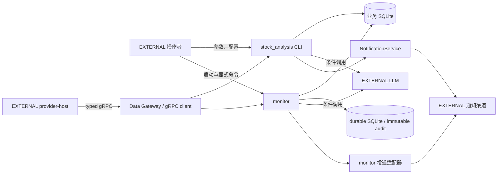
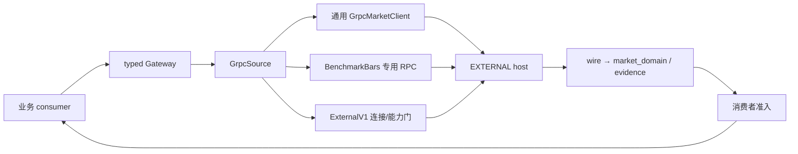
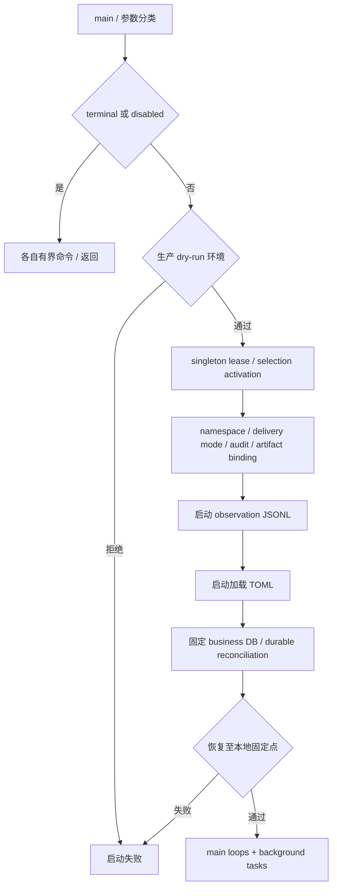
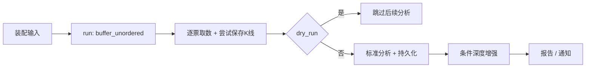
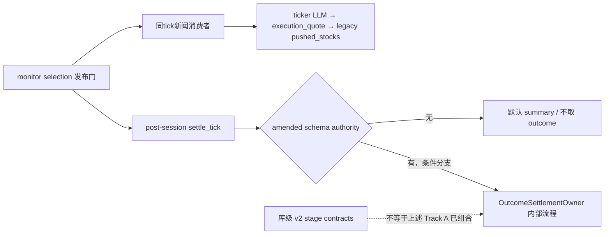
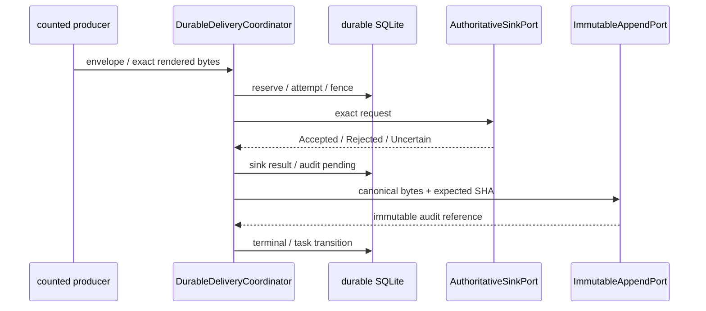

# Stock Analysis 当前项目架构蓝图

```architecture-source-v1
{
  "schema_version": 1,
  "status": "PROVISIONAL",
  "role": "current-source-audit",
  "baseline_commit": "aef7972965f610ed418049593dfff1d55341772e",
  "catalog": {
    "path": "docs/push-system/push-current-capability-catalog.v1.json",
    "sha256": "b3c04218e3548f80c026db905e3d0ac2eed59d7ce24efeefa8e69a20b417de93"
  },
  "manifest": {
    "path": "docs/push-system/push-current-evidence-manifest.v1.json",
    "sha256": "309319f13b599d400f72f9b17ac607e5f6aaa9f8e9ee9c24511f02629d34f13c"
  }
}
```

## 1. 阅读规则、身份与核对范围

本文审计日期为 2026-09-09，编写于 2026-09-09 至 09-10，状态为 PROVISIONAL。它描述源码结构、默认入口和条件分支，不认证生产进程、数据库内容、真实来源、接收回执或迁移完成。Rust/Cargo 事实固定在上方 aef7972 源码 pin；本次文档实施基线为 ee0db4a0a927ee1372bfe354a5e185013cddc3c4。当前机器材料最终修复提交为 047b4ab0ac1133a828efe2052eb60a541611e335，身份与原字节摘要见[当前审计实施记录](../../push-system/implementation-current-source-audit-2026-09-09.md#L17)。

历史规范仍绑定历史 Rust pin 07781bf386aafdf202851ae928efee8920387058；[历史 catalog](../../push-system/push-capability-catalog.v1.json)、[历史 manifest](../../push-system/push-evidence-manifest.v1.json)、[旧蓝图](../../Project_Architecture_Blueprint.md)、[实施 RFC](../../push-system/push-system-implementation-rfc.md)均保留原角色。本页的 current-source-audit 不是新的 runtime catalog；[MachineCatalog 合同](../../../src/monitor/push_job/catalog.rs#L1)仍消费冻结历史身份。规范权威、当前事实、生产验收三者不互相替代。

除特别说明外，源码链接均指向上述 Rust/Cargo pin。README、config、tests、build.rs、schema TSV fixture、bench 和 CI 不在 548 项 push manifest 范围内：本页以 ee0db4a 的相应 Git 文件及[全架构核查记录](../../push-system/current-blueprint-inventory-2026-09-09.md#L1)作为独立证据；CI 新文档门禁是此前文档工具提交引入，不能称由 Rust pin 覆盖。历史 v18/v19 文档按第 15 节单独标版本，文中陈旧注释或“已实施”标签不改变本页状态判定。

| 标签/口径 | 本页含义 | 证据使用方式 |
| --- | --- | --- |
| 源码默认路径 | 正常入口存在且按代码顺序调用，仍受运行前提限制 | 入口及实际分支，不据此推断当前已部署 |
| 条件路径 | 受配置、时间、发布材料或已有事实控制 | 同时定位 caller 与 gate |
| 库级能力 | 接口/实现存在，未证明 monitor 生产组合 | 声明与限定调用调查分别陈述 |
| 测试专用 | cfg(test) 或测试 fixture 提供的绑定 | 不计为生产接线 |
| INACTIVE / STARVED / OPT-IN / ACTIVE | 第 14 节固定机器目录的业务状态 | ACTIVE 仅为源码接线，不等于 Ready、已部署或已接收 |
| EXTERNAL / 推断 / 历史 / 规范目标 | 仓外系统、结构解释、历史快照、未来合同 | 明确其身份，不升级为当前事实 |

本页复用已验收审计和逐域核查，新增的限定源码核查集中在回测、设计吸收与来源存在性。未运行 Cargo metadata、编译、Rust 测试、bench、monitor、模型、provider、数据库、真实发送、浏览器或远端 CI。测试代码的存在和前置文档检查通过均不代表本轮运行时验收；前置验收版本与剩余发布阻断见[实施记录](../../push-system/implementation-current-source-audit-2026-09-09.md#L43)。

| 静态统计 | 数量 | 定义与证据 |
| --- | ---: | --- |
| 全仓 Git 跟踪 Rust 文件/物理行 | 594 / 445884 | src、tests、bench、build.rs 合计；[核查统计](../../push-system/current-blueprint-inventory-2026-09-09.md#L9) |
| src Rust 文件/物理行 | 546 / 432363 | 含内联及独立测试源码；[同一统计](../../push-system/current-blueprint-inventory-2026-09-09.md#L9) |
| tests Rust 文件/物理行 | 46 / 13251 | 41 个顶层候选与 5 个嵌套支持文件；[同一统计](../../push-system/current-blueprint-inventory-2026-09-09.md#L9) |
| bench / build.rs | 1 / 1 | 分别 121 / 149 行；[核查](../../push-system/current-blueprint-inventory-2026-09-09.md#L9) |
| package / library 顶层公开模块 | 1 / 62 | [Cargo package](../../../Cargo.toml#L1)、[lib 声明](../../../src/lib.rs#L10) |
| binary / integration-test 候选 | 28 / 41 | 静态自动发现加显式条目、去重；未取得本轮 metadata 解析结果；第 16 节列目录 |
| push manifest 文件/声明证据/架构组 | 548 / 250 / 9 | 546 个 src Rust + Cargo.toml + Cargo.lock；[当前 manifest](../../push-system/push-current-evidence-manifest.v1.json)、[实施记录](../../push-system/implementation-current-source-audit-2026-09-09.md#L30) |

规模热点是 src/bin 76769、database 74566、push_foundation 47285、data_gateway 30873、selection 25967、durable_delivery 23690、monitor 23600 物理行；这些数值只描述源码规模，不计算复杂度或业务迁移比例。[热点核查](../../push-system/current-blueprint-inventory-2026-09-09.md#L25)

## 2. 系统上下文与进程边界

这是 Rust 2021 单 package 的模块化单体，同时是外部市场数据服务的消费者。monitor 是常驻编排入口，默认 stock_analysis CLI 直接调用库内分析管道；CLI 并非 monitor 的远程控制客户端。provider-host 独立构建部署，本仓没有生产 provider server target 或本地 provider fallback。[Cargo](../../../Cargo.toml#L1)、[CLI main](../../../src/main.rs#L25)、[monitor main](../../../src/bin/monitor/main.rs#L4471)、[README 边界](../../../README.md#L28)



图中市场数据边由[bridge_for](../../../src/data_gateway/grpc_source.rs#L1063)和[CLI 取数](../../../src/pipeline/data.rs#L30)支撑；业务 DB 边由[CLI 初始化](../../../src/main.rs#L63)和[monitor 绑定](../../../src/bin/monitor/main.rs#L4940)支撑；投递边分别见[NotificationService::send](../../../src/notification/service.rs#L124)与[durable runtime](../../../src/bin/monitor/durable_delivery_runtime.rs#L1)。模型边按第 9 节各实际入口解释。该图只列消费者侧关系，不核实外部 host 的内部采集、部署或实际可用性。

| 运行单元 | 职责与隔离 | 定位 |
| --- | --- | --- |
| stock_analysis | 参数装配、分析/复盘/产业链/调度；直接复用 app 与 pipeline | [main](../../../src/main.rs#L76)、[app](../../../src/app/mod.rs#L1) |
| monitor | 启动 lease、审计、durable 恢复与受监督任务；正常服务和 terminal 命令分流 | [main](../../../src/bin/monitor/main.rs#L4471)、[process bootstrap](../../../src/selection/process_bootstrap.rs#L275) |
| probes | 检查已经运行的外部 endpoint；不启动 host，monitor 不调用独立 probe main | [grpc_bundle_probe::main](../../../src/bin/grpc_bundle_probe.rs#L107)、[README](../../../README.md#L97) |
| import/backfill/research 工具 | 独立进程，有各自数据库/取数/报告副作用；名称不代表只读 | [binary 目录](../../../src/bin)、[候选清单](#16-模块-target-协议和-schema-目录) |
| test fixture | integration-test crate 中的本地 tonic 服务，不是生产容器 | [tests/support](../../../tests/support/mod.rs#L1)、[build.rs](../../../build.rs#L24) |

仓库跟踪文件中未发现 Dockerfile、Compose、systemd、Kubernetes 或 Helm 部署单元；这不证明仓库外没有部署。README 的 host → probe → monitor 是建议的运维顺序，不能画为 monitor 内部强制调用顺序。[部署核查](../../push-system/current-blueprint-inventory-2026-09-09.md#L81)、[README](../../../README.md#L97)

## 3. Data Gateway 与 gRPC 数据平面

业务层通过 typed Gateway 消费 provider-neutral 记录与来源证据；data_provider 是委托 Gateway 的 facade/cache，不是采集 SDK。桥在首次构造时捕获地址和 bundle，缓存 Arc；通用 query 从锁内 clone client 后在锁外 await。缓存与网络请求并发是不同边界，不能据 process-wide 名称承诺严格一次构造或每轮配置重载。[Gateway 声明](../../../src/data_gateway/mod.rs#L1)、[facade](../../../src/data_provider/service.rs#L1)、[bridge_for](../../../src/data_gateway/grpc_source.rs#L1063)、[query_op](../../../src/data_gateway/grpc_source.rs#L2405)



图中三类 RPC 边分别见[query_op](../../../src/data_gateway/grpc_source.rs#L2405)、[BenchmarkBars 专用入口](../../../src/data_gateway/grpc_source.rs#L2427)、[ExternalV1](../../../src/data_gateway/grpc_source.rs#L2489)。不是所有 operation 都走同一 JSON dispatcher。审计 helper [audit_gateway_result_with_receipt_state_in](../../../src/data_gateway/review.rs#L1242)先核 provider，再取得 acquisition receipt 后返回 batch；审计失败拒绝该路径，但 helper 存在不证明所有 Gateway 调用均已接线。

| 能力族 | 当前模块入口 | 消费/数据语义 |
| --- | --- | --- |
| 行情、日线、指数、基准、T0 | [market_data](../../../src/data_gateway/market_data.rs#L1)、[historical_bars](../../../src/data_gateway/historical_bars.rs#L1)、[benchmark](../../../src/data_gateway/benchmark.rs#L1)、[t0_evidence](../../../src/data_gateway/t0_evidence.rs#L1) | 分析/监控/回测使用各自 typed 准入；指数身份不能伪装成股票 |
| 板块、排名、资金 | [board](../../../src/data_gateway/board.rs#L1)、[board_ranking](../../../src/data_gateway/board_ranking.rs#L1)、[capital](../../../src/data_gateway/capital.rs#L1) | 批次、榜单范围、证券与计量单位保真 |
| 新闻、公告、事件日历 | [global_news](../../../src/data_gateway/global_news.rs#L1)、[event_calendar](../../../src/data_gateway/event_calendar.rs#L1)、[futures_delivery](../../../src/data_gateway/futures_delivery.rs#L1) | 事件输入与来源时间，不由名称推断 host 已提供能力 |
| 财务、研报、搜索 | [company](../../../src/data_gateway/company.rs#L1)、[research](../../../src/data_gateway/research.rs#L1)、[general_web_research](../../../src/data_gateway/general_web_research.rs#L1) | 研究/AI 输入；缺失字段、无报告与合同错误分开 |
| 身份、生命周期、交易日历 | [instrument_identity](../../../src/data_gateway/instrument_identity.rs#L1)、[security_lifecycle](../../../src/data_gateway/security_lifecycle.rs#L1)、[exchange_calendar_authority](../../../src/data_gateway/exchange_calendar_authority.rs#L1) | 证券与日期准入，文件存在不等于来源完整认证 |
| 产业链、持仓、复盘、outcome | [chain_intelligence](../../../src/data_gateway/chain_intelligence.rs#L1)、[position_chain](../../../src/data_gateway/position_chain.rs#L1)、[review](../../../src/data_gateway/review.rs#L1)、[outcome_daily_bars](../../../src/data_gateway/outcome_daily_bars.rs#L1) | 各 owner 独立读取和提交，不能从一个 batch 推导全部业务已完成 |

GatewayBatch 的 Available 与 VerifiedEmpty 分开，Available 类型本身允许空 Vec；具体业务可以另要求完整且非空，例如选票退市过滤核对每票身份。不能把任何空向量当来源确认空，也不能把“有 evidence”当任意业务准入已经通过。[GatewayBatch](../../../src/data_gateway/review.rs#L110)、[选票过滤](../../../src/app/bootstrap.rs#L191)

build.rs 读取 client-bundle/market.proto 并合并 compatibility extensions，生成 client 和测试 fixture 所需 server trait；生成 trait 不意味着本仓部署生产服务。源码映射有 62 个业务名称和 Unspecified，静态测试预期生成 enum 为 0..=62；implemented_operations 静态声明 40 项，另 22 项不在该消费者声明集。host capabilities、真实可达性及 resolved generated targets 本轮未验证。[build.rs](../../../build.rs#L18)、[ops::method_name](../../../src/grpc_contract/ops.rs#L7)、[implemented_operations](../../../src/grpc_contract/ops.rs#L77)

通用 client 保留 request_id、operation、provider、reason_code 与 retryable。默认 RetryPolicy 最多 4 次总尝试、退避基数 1000ms、上限 60000ms；query 循环复用 request/request_id，不逐次查询 health。retryable=false 拒绝重试；true 仍排除 InvalidArgument、Unauthenticated、PermissionDenied、Unimplemented，但 FailedPrecondition 可进入 RetryBackoff，无 metadata 时它才默认 NoRetry。backoff 实现未消费 jitter_ms，不能把注释中的 jitter 当已实现行为；这些规则也不能自动套到专用 BenchmarkBars RPC。[errors](../../../src/grpc_client/errors.rs#L1)、[query](../../../src/grpc_client/client.rs#L202)、[retry_decision/RetryPolicy/backoff](../../../src/grpc_client/retry.rs#L13)

## 4. monitor 控制面与实际启动顺序

无显式参数时，MONITOR_ENABLED 转小写后与 true 比较、不 trim；未启用则进入 Disabled 并返回。显式 terminal 命令有自己的分类，不能把服务开关扩大为所有命令都禁用。Operational 分支才计算 selection 发布能力。[service_enabled_from_environment](../../../src/selection/process_bootstrap.rs#L268)、[分类](../../../src/selection/process_bootstrap.rs#L275)、[main 早退](../../../src/bin/monitor/main.rs#L4545)



图中门与顺序见[main 启动前置](../../../src/bin/monitor/main.rs#L4564)、[审计与产物](../../../src/bin/monitor/main.rs#L4655)、[JSONL/配置](../../../src/bin/monitor/main.rs#L4750)、[DB/恢复](../../../src/bin/monitor/main.rs#L4940)。生产 V10_DRY_RUN_PUSH 拒绝不能与 CLI 分析 dry-run 或测试专用路径混为一谈。opening readiness 在后续作为后台任务启动，不是 monitor 调用独立 probe，也不是所有网络调用之前的统一前置门。[后台任务](../../../src/bin/monitor/main.rs#L5527)

常驻生命周期由 supervise_long_running_lifecycle 观察 main loops、8 个具名后台 JoinHandle、信号和 JSONL writer 健康。main loops 为 P-01 scheduler、monitor_loop、news_monitor_loop、data_mode_monitor_loop；monitor_loop 内并发 intraday_loop 与 market_loop。后台包含 dryrun reporter、MonitorEvent consumer、post-close news、post-session review、startup review backfill、position-chain refresh、opening static/live readiness；review backfill 等待 durable producer-ready。[supervisor](../../../src/bin/monitor/main.rs#L4218)、[任务装配](../../../src/bin/monitor/main.rs#L5479)、[review backfill gate](../../../src/bin/monitor/main.rs#L5498)

可复用监控规则位于 src/monitor，进程绑定位于 src/bin/monitor。后者包含 notify/transport/presentation、P01、review、durable runtime、news AI/aggregator、行情同步桥及诊断。不能仅凭目录内有文件就认定 main 已注册该模块；metrics 是明确反例。[library 声明](../../../src/monitor/mod.rs#L15)、[binary 声明](../../../src/bin/monitor/main.rs#L1)、[metrics 原型](../../../src/bin/monitor/metrics.rs#L1)

## 5. CLI 分析、持久化与结果语义

CLI 先执行可选 operator auth、配置验证和 best-effort business DB 初始化，再先分流 schedule/chain，随后装配股票列表，最后选择 LHB/review/普通分析。不能画成所有模式均在选票之前互斥分流；LHB/review 也可能先触发股票池阶段的数据依赖。[main](../../../src/main.rs#L27)、[dispatch](../../../src/main.rs#L76)、[bootstrap](../../../src/app/bootstrap.rs#L64)

股票池可来自参数/环境、宏观 AI、龙虎榜、涨停池和持仓，再经过生命周期过滤。deep-analysis 关闭宏观/LHB/涨停扩展，但持仓追加独立；run_analysis 有非空显式 stocks 时重新使用原参数，否则使用装配列表。因此“deep 只分析过滤后的输入列表”不成立。[bootstrap](../../../src/app/bootstrap.rs#L89)、[run_analysis](../../../src/app/modes.rs#L20)



图为处理阶段关系；逐票失败可返回 None，run 过滤失败票，单票超时 120 秒。dry_run 判断发生在 fetch_and_save_data 之后，仍可能网络取数及写 K 线，因此不应作为安全只读验收命令。K 线保存失败只 warn，模拟持仓或分析结果保存失败则该票返回 None；各步骤不是统一原子事务。[run](../../../src/pipeline/mod.rs#L539)、[process_stock](../../../src/pipeline/analyze.rs#L1097)、[dry_run 顺序](../../../src/pipeline/analyze.rs#L1137)、[数据保存](../../../src/pipeline/data.rs#L30)、[结果保存](../../../src/pipeline/analyze.rs#L1199)

逐票发送失败只记录后仍可返回 Some；汇总要求结果非空、允许通知、非 dry-run 且非 single_notify，发送错误日志后仍可 Ok。NotificationService 顺序尝试渠道，任一成功为 Ok(true)，无渠道/全失败为 Ok(false)；旧调用把 Ok(_) 记录为成功。报告保存失败传播，图表失败继续，均不能与通知接收合并。[逐票发送](../../../src/pipeline/analyze.rs#L1252)、[汇总门](../../../src/pipeline/mod.rs#L635)、[汇总发送](../../../src/pipeline/summary_notify.rs#L107)、[NotificationService](../../../src/notification/service.rs#L124)

## 6. 业务能力、selection 与研究边界

| 能力 | 当前架构责任 | 源码入口与限制 |
| --- | --- | --- |
| 分析 | 技术指标、趋势、财务/新闻、score/veto 与宽 AnalysisResult | [pipeline](../../../src/pipeline/mod.rs#L61)、[analyzer](../../../src/analyzer/mod.rs#L1)、[indicators](../../../src/indicators/mod.rs#L1)；结果不是投资批准 |
| 机会/决策 | 候选、产业链、分层、排除、资金/持仓/T0 决策支持 | [opportunity](../../../src/opportunity/mod.rs#L1)、[decision](../../../src/decision/mod.rs#L1)；候选状态与投递状态分属 owner |
| 风险/组合 | 账户与行动 gate、现金/限额/止损、持仓与估值 | [risk](../../../src/risk/mod.rs#L1)、[portfolio](../../../src/portfolio/mod.rs#L1)、[risk_adapter](../../../src/trading/risk_adapter.rs#L1) |
| 模拟交易 | paper trade/sell、订单审计、FIFO lot | [paper_trade](../../../src/trading/paper_trade.rs#L1)、[paper_sell](../../../src/trading/paper_sell.rs#L1)、[paper_lot_ledger](../../../src/trading/paper_lot_ledger.rs#L1)；不证明券商写入 |
| 复盘/归因 | 日周报告、watchlist、prediction、epoch/replay、因子归因 | [review](../../../src/review/mod.rs#L1)、[performance](../../../src/performance/mod.rs#L1)、[attribution](../../../src/performance/attribution.rs#L542) |
| 策略/回测 | 多因子、Boll/MACD、RSI、回测报告和 walk-forward | [strategy](../../../src/strategy/mod.rs#L1)、[backtest_runner](../../../src/pipeline/backtest_runner.rs#L1)；成本与时点证据见下文 |

模拟交易调用可消费 execution_quote 后 simulate，monitor 的 paper sell 为独立业务成交路径；PAPER_SELL_DISABLED 是暂停开关。legacy paper_engine::run_once 自身返回 disabled，不能因文件保留而画进生产循环。confirmed account snapshot 是展示/风控事实；真实 broker trade-sync watermark 未接通的边界仍保留，消息送达不表示成交。[intraday_monitor](../../../src/decision/intraday_monitor.rs#L175)、[paper_engine](../../../src/trading/paper_engine.rs#L409)、[monitor 账户边界](../../../src/bin/monitor/main.rs#L1800)、[PaperSell 当前目录](../../push-system/push-current-capability-catalog.md#producer-与完成边界)

### 6.1 selection：入口门、库级 owner、实际消费者

selection 发布 gate 根据时间、checked-in activation/prepare evidence 与日历路径决定能力；calendar_authority_complete 的三路径 exists 只证明存在，不是内容认证。该 gate 不负责放行数据库 schema。默认 DatabaseManager::init 结束时 selection_schema_authority=None；缺 amended authority 时 outcome settle_tick 返回默认 summary、只告警，不进入 provider。[activation gate](../../../src/selection/activation_gate.rs#L16)、[calendar 检查](../../../src/selection/activation_gate.rs#L128)、[DB 默认 init](../../../src/database/mod.rs#L2654)、[settle_tick](../../../src/selection/outcome_v2.rs#L1083)



图中真实新闻链见[main 初始化/同 tick](../../../src/bin/monitor/main.rs#L4719)、[同 tick](../../../src/bin/monitor/main.rs#L7821)、[候选入池](../../../src/bin/monitor/news_aggregator_init.rs#L1169)；outcome scheduler 见[post_session_review_scheduler](../../../src/bin/monitor/main.rs#L6252)。selection disabled 日志中的 providers/DB/sinks/schedulers=0 只限定该能力，不表示整个 monitor 没有副作用。

库内阶段接口包括 acquisition/admission、relation/features、sample/rejection、commit audit/receipt/read-back 和 recovery envelope。SelectionV2PersistenceOwner 的 commit_production 自行取得 DB/connection/audit writer；限定非测试搜索未发现 commit_config_activation、commit_generation、commit_source_ingress 的业务组合调用，不能把完整阶段图标成当前默认链。[persistence owner](../../../src/selection/persistence_v2.rs#L67)、[commit_production](../../../src/selection/persistence_v2.rs#L153)、[阶段目录](../../../src/selection/mod.rs#L1)、[核查](../../push-system/current-blueprint-inventory-2026-09-09.md#L184)

OutcomeSettlementOwner 内部顺序是恢复、fresh due revalidation、claim、provider、outcome receipt；descriptor-relative/no-follow 文件锁约束同一 logical subject 的竞争。顺序是条件分支内部实现，仍须先通过上述生产 authority gate。[owner](../../../src/selection/outcome_v2.rs#L260)、[claim 锁](../../../src/selection/outcome_v2.rs#L348)、[settlement](../../../src/selection/outcome_v2.rs#L854)

### 6.2 回测：实际逐日评分与尚未证明的历史基本面

默认多因子报告调用 run_multi_factor_resolved → run_multi_factor_on_history；后者每个 today 选 k.date<=today 的最新 K 线字段并重算分数。顶部“切片末日一次评分”注释与当前循环不符。独立 snapshot 版本 run_multi_factor_with_snapshots 受 cfg(test) 限制；FactorSnapshotDao::get_as_of 确有 snapshot_date<=as_of 查询，但不能据 DAO 或测试 helper 宣称默认报告已使用完整 point-in-time 基本面。[默认 caller](../../../src/pipeline/backtest_runner.rs#L637)、[逐日实现](../../../src/pipeline/backtest_runner.rs#L228)、[测试限定](../../../src/pipeline/backtest_runner.rs#L128)、[DAO](../../../src/database/factor_snapshot.rs#L91)

BacktestEngine 的 buy/sell 确有佣金和滑点处理，不能沿用 v18.1/v18.2 的“完全没有成本模型”。compute_dynamic_slippage 无论开关分支均返回配置固定滑点，尚未接入波动率/ADV；walk-forward 的存在也不证明样本外结果、历史字段来源、容量和真实成本已经验收。此处税率只是代码参数，不作当前交易规则或税法指导。[buy](../../../src/strategy/core.rs#L513)、[sell](../../../src/strategy/core.rs#L713)、[固定滑点](../../../src/strategy/core.rs#L495)、[walk_forward](../../../src/pipeline/backtest_runner.rs#L484)

## 7. 投递 authority、事件与恢复

当前并存 NotificationService、push L1/L2/L4/L5/L6/L7、monitor notify + durable runtime。顶层库尚无 push_l3，真实模板渲染在 monitor push_templates；新增 Foundation 库合同也不意味着全部 producer 已迁入新 runtime。[lib 声明](../../../src/lib.rs#L56)、[模板](../../../src/bin/monitor/push_templates.rs#L1)、[当前架构组](../../push-system/push-current-capability-catalog.md#非迁移架构证据)



图中端口与身份来自[AuthoritativeSinkPort](../../../src/durable_delivery/model.rs#L1589)、[coordinator](../../../src/durable_delivery/coordinator.rs#L1)、[immutable append](../../../src/event/durable_delivery_append.rs#L1)。authority 只属于相应 counted 路径，不能覆盖旧 bool/BestEffort 通知。bus/JSONL 明确为 observation，不能 acknowledge delivery。[monitor 声明](../../../src/bin/monitor/main.rs#L4744)、[JSONL writer](../../../src/event/jsonl_writer.rs#L1)

当前 DecisionState 有 14 个变体，合法 transition 为显式白名单。Reserved→AttemptInFlight 后按 Accepted/Rejected/Uncertain 分到 audit pending，再经可选 task-transition pending 到各终态；UncertainManualReview 可经人工结果走接受或手工拒绝审计。RejectedDurable→Reserved 是显式 retry 边，但需授权、重新 lease/fence/reservation；不得将“非终态”理解为可任意重发。[DecisionState](../../../src/durable_delivery/model.rs#L1022)、[legal_transition](../../../src/durable_delivery/coordinator.rs#L8553)、[runtime](../../../src/bin/monitor/durable_delivery_runtime.rs#L1)

普通启动恢复扫描 all-date 既存 immutable envelope，不受新 producer 的业务时窗或最近五日 review backfill 限制，也不重新取当前 source。INACTIVE kind 仍可能有历史 decision 可恢复，这不为它创建活动 producer/Unit；foreign lease 与 Uncertain 不盲发。Foundation 单 decision scope、旧全局 scope、summary/hydration 必须保持一致，不能把一个成功摘要外推为所有历史状态已结清。[当前 kind/producer 恢复说明](../../push-system/push-current-capability-catalog.md#producer-与完成边界)、[scope 架构证据](../../push-system/push-current-capability-catalog.md#authority-transport)

| 事件/通知机制 | 完成语义与失败边界 | 证据 |
| --- | --- | --- |
| event::EventBus | EventEnvelope、publish outcome/counter/shutdown；广播观察，不是 durable queue | [bus](../../../src/event/bus.rs#L46) |
| monitor::EventBus | MonitorEvent 的 Tokio broadcast；lag 记录丢失后继续 | [bus](../../../src/monitor/event_bus.rs#L74) |
| event audit / durable immutable audit | 各自 descriptor、hash-chain 与落盘权威；不能接受任意 caller path 自动成为生产 authority | [dispatcher](../../../src/event/dispatcher.rs#L20)、[append](../../../src/event/durable_delivery_append.rs#L1) |
| L4/L5/L7 | compatibility 去重、治理、统计；无法替代 durable decision/receipt | [L4](../../../src/push_l4/dispatcher.rs#L1)、[L5](../../../src/push_l5/governance.rs#L1)、[L7](../../../src/push_l7/mod.rs#L1) |
| replay | 通用 replay 和 monitor force 历史文本重发需区分；force 是新本地 replay identity，不继承原业务 claim/receipt | [event replay](../../../src/event/replay.rs#L108)、[cli-replay-force](../../push-system/push-current-capability-catalog.md#cli-replay-force) |
| ReviewTask | 13 项注册不等于全部启用；Delivered/NoData/Disabled/永久 Failed 可终结任务，retryable Failed 有 1/5/15 分钟退避 | [ReviewTask](../../../src/bin/monitor/review_batch.rs#L418)、[当前 review producers](../../push-system/push-current-capability-catalog.md#review-r04-auto) |

## 8. 数据架构、schema 与 Foundation 库能力

业务库使用 Diesel/r2d2，durable 库使用 rusqlite；两库没有共同原子事务。DatabaseManager 为进程 singleton，持有连接池、可选归因池、descriptor 及 selection authority；字段释放顺序、连接 PRAGMA、main/WAL/SHM 身份、query-only/read-back 和 namespace-swap 检查是具体 owner 的实现。global schema catalog 只提供目录证据，不拥有 maintenance lease/migration/startup 权限。[DatabaseManager](../../../src/database/mod.rs#L419)、[连接配置](../../../src/database/mod.rs#L1893)、[authoritative reads](../../../src/database/mod.rs#L2706)、[global catalog](../../../src/database/global_schema_catalog_v1.rs#L1)

| 存储域 | 当前声明形状 | 运行与迁移边界 |
| --- | --- | --- |
| legacy generation-1 | 53 表、44 显式索引、63 trigger | [冻结 TSV](../../../src/database/fixtures/global_schema_legacy_catalog_v1.tsv#L1)，是声明集合，不是生产库实测 |
| selection-v2 | 12 表、5 索引、53 trigger，单一 mode/phase 共 70 对象 | [DDL plan](../../../src/database/selection_v2.rs#L4169)；17 static +9 stage +24 append-only +3 mode-specific，不能叠加互斥模式 |
| durable v9 | canonical bootstrap DDL 18 表 | [schema version](../../../src/durable_delivery/schema.rs#L9)、[DDL](../../../src/durable_delivery/schema.rs#L145)；不累计迁移中间表 |
| Foundation 基础合同 | 6 表、1 索引、18 trigger，共 25 managed persistent objects | [固定 SQL registry](../../push-system/push-system-foundation.v1.sql#L15)；规范仍是 PROPOSED，不是 25 张表 |
| readiness 独立库 schema v1 | 4 表、9 trigger、0 显式索引 | [schema](../../../src/push_foundation/readiness_store_schema.rs#L24)；不与基础 25 对象放进同一 main schema |
| readiness payload | snapshot/material v2/v3 | [domain](../../../src/push_foundation/readiness_snapshot.rs#L21)、[canonical domain](../../../src/push_foundation/readiness_snapshot.rs#L558)；载荷 v3 不表示 DB schema v3 |

默认 DatabaseManager::init 仍走 legacy 初始化/迁移并保留 selection_schema_authority=None；verified-owner 构造器是另一库级入口，未发现当前业务 caller，production selection apply 仍拒绝。冻结 catalog 与增量 owner 可重叠，例如 closing_valuation_run/item 已在 53 表中，同时由其模块 migration 建表；不能称所有增量表都在冻结集合之外。[init](../../../src/database/mod.rs#L2442)、[默认 authority](../../../src/database/mod.rs#L2654)、[verified-owner](../../../src/database/mod.rs#L2679)、[production apply](../../../src/database/global_schema_v1.rs#L392)、[run_migrations](../../../src/database/mod.rs#L2995)

FoundationSchemaMigration::apply_to 接受调用者路径、运行固定 DDL 并 attest，是已存在的库级迁移能力；push_foundation 模块明确不选择或迁移生产 DB。readiness initializer 另先构造内存镜像，再 create_new 认领文件；validate_schema 比较完整非 sqlite_* 对象与 header/FK，因此不兼容额外塞入基础 25 对象。ReadinessRecordStore 构造不 I/O，read 为只读事务，append/head CAS 为写事务；本轮未创建或打开这些库。[migration](../../../src/push_foundation/migration.rs#L101)、[模块边界](../../../src/push_foundation/mod.rs#L1)、[initializer](../../../src/push_foundation/readiness_store_schema.rs#L147)、[schema 比较](../../../src/push_foundation/readiness_store_schema.rs#L625)、[store](../../../src/push_foundation/readiness_store.rs#L114)

activation reader 接受 caller DB，经 rollback-only 连接和基础 schema attestation 读取 manifests/journal；存在 deployment-set 内部调用，不能写“全仓无 caller”。activation writer 接收 caller 已打开的可写连接，不认证连接/命令或授予 production owner；生产组合仍未证明。[inspect_raw_activation_facts](../../../src/push_foundation/activation_store.rs#L45)、[内部调用](../../../src/push_foundation/activation_readiness.rs#L349)、[apply_activation_candidate](../../../src/push_foundation/activation_transaction.rs#L108)

| 架构组 | 当前边界（正式目录原文） | 声明证据 |
| --- | --- | --- |
| contracts | 目录、身份、上下文纯库合同；MachineCatalog仍固定历史catalog身份。未据此证明monitor采用新调度链。 | [architecture-contracts-1](../../../src/monitor/push_job/catalog.rs#L236)、[architecture-contracts-2](../../../src/monitor/push_job/identity.rs#L418)、[architecture-contracts-3](../../../src/monitor/push_job/context.rs#L319) |
| projection-shadow | 捕获、投影、策略、结果分类和shadow库级合同；不证明各Unit真实业务adapter、生产shadow或切换。 | [architecture-projection-shadow-4](../../../src/monitor/push_job/facts.rs#L633)、[architecture-projection-shadow-5](../../../src/monitor/push_job/projection.rs#L275)、[architecture-projection-shadow-6](../../../src/monitor/push_job/policy.rs#L829)、[architecture-projection-shadow-7](../../../src/monitor/push_job/shadow.rs#L279)、[architecture-projection-shadow-8](../../../src/monitor/push_job/delivery.rs#L593) |
| foundation-store | 库级存储和迁移入口存在；push_foundation/mod.rs明确未选择或迁移生产DB。schema v4→v5保留rowid及predecessor自外键。 | [architecture-foundation-store-9](../../../src/push_foundation/intent_store.rs#L1280)、[architecture-foundation-store-10](../../../src/push_foundation/migration.rs#L101)、[architecture-foundation-store-11](../../../src/push_foundation/activation_store.rs#L45)、[durable-v4-v5-audit-migration](../../../src/durable_delivery/schema.rs#L942) |
| activation-candidate | 库级activation候选、部署集合及owner准入；calendar authority hash被消费，不表示生产批准、owner切换或受保护根已成立。 | [architecture-activation-candidate-12](../../../src/push_foundation/activation_transaction.rs#L108)、[architecture-activation-candidate-13](../../../src/push_foundation/activation_readiness.rs#L373)、[architecture-activation-candidate-14](../../../src/push_foundation/activation_owner.rs#L77)、[calendar-authority](../../../src/calendar.rs#L439) |
| effect-fence | EffectBroker::production固定返回ProductionRefused。generic/business effect的bind_fixture均受cfg(test)限制；文件和声明不证明生产授权。 | [architecture-effect-fence-15](../../../src/push_foundation/activation_fence.rs#L636)、[architecture-effect-fence-16](../../../src/push_foundation/activation_fence_ipc.rs#L95)、[generic-effect-test-binding](../../../src/push_foundation/activation_generic_effect.rs#L395)、[business-effect-test-binding](../../../src/push_foundation/activation_business_effect.rs#L449) |
| readiness-scheduler | readiness评估、phase调度、快照与存储库级合同；不能推导生产查询、真实来源、所有Unit消费者已经接线。 | [architecture-readiness-scheduler-17](../../../src/push_foundation/operational_readiness.rs#L335)、[architecture-readiness-scheduler-18](../../../src/push_foundation/phase_scheduler.rs#L479)、[architecture-readiness-scheduler-19](../../../src/push_foundation/readiness_snapshot.rs#L205)、[architecture-readiness-scheduler-20](../../../src/push_foundation/readiness_store.rs#L172)、[architecture-readiness-scheduler-21](../../../src/push_foundation/readiness_store_schema.rs#L147) |
| authority-transport | Foundation adapter消费旧runtime类型；counted envelope的legacy空绑定/省略序列化与Foundation decision绑定分属身份域。N02 dedicated adapter调用精确业务日窗口terminal reader及existing-only年度权威链，但不代表N02 producer迁移。 | [architecture-authority-transport-22](../../../src/push_foundation/terminal_authority.rs#L176)、[architecture-authority-transport-23](../../../src/push_foundation/generic_transport.rs#L237)、[architecture-authority-transport-24](../../../src/push_foundation/dedicated_transport.rs#L154)、[architecture-authority-transport-25](../../../src/push_foundation/dedicated_transport.rs#L203)、[flash-year-authority-read](../../../src/event/dispatcher.rs#L790)、[flash-window-terminal-read](../../../src/event/mod.rs#L975)、[foundation-reconcile-decision](../../../src/durable_delivery/coordinator.rs#L4001)、[counted-envelope](../../../src/durable_delivery/model.rs#L802)、[startup-pending-shared](../../../src/durable_delivery/coordinator.rs#L4035)、[startup-expired-attempt](../../../src/durable_delivery/coordinator.rs#L5537)、[startup-list-deliverable](../../../src/durable_delivery/coordinator.rs#L6183)、[foundation-envelope-build](../../../src/push_foundation/generic_transport.rs#L365)、[foundation-dispatch-impl](../../../src/push_foundation/generic_transport.rs#L274)、[n02-inspect](../../../src/push_foundation/dedicated_transport.rs#L218)、[n02-audit-dispatcher-source](../../../src/push_foundation/dedicated_transport.rs#L141) |
| finalization-observability | finalizer/recovery/metrics/SLA库级接口。reconcile_startup仅cfg(test)，reconcile_current经测试effect绑定；metrics/SLA未找到生产caller，不证明生产闭环。 | [architecture-finalization-observability-26](../../../src/push_foundation/business_finalizer.rs#L814)、[architecture-finalization-observability-27](../../../src/push_foundation/reconciler.rs#L337)、[architecture-finalization-observability-28](../../../src/push_foundation/finalization_metrics.rs#L393)、[architecture-finalization-observability-29](../../../src/push_foundation/finalization_sla.rs#L271)、[startup-test-only](../../../src/push_foundation/reconciler.rs#L277) |
| acquisition-readers | read_verified_acquisition_audit与read_acquisition_in_transaction只找到测试调用，未找到生产caller；不能当作auction-source生产输入边。 | [acquisition-verified-read](../../../src/database/data_acquisition_audit.rs#L99)、[acquisition-transaction-read](../../../src/database/data_acquisition_audit.rs#L120) |

| 运行产物 | 代码选择的生产路径 | 权威/限制 |
| --- | --- | --- |
| business DB | data/stock_analysis.db | [monitor mode-owned 绑定](../../../src/bin/monitor/main.rs#L3650)覆盖进程 DATABASE_PATH；CLI 单独接受该变量 |
| durable DB | data/durable_delivery.sqlite3 | [固定身份](../../../src/durable_delivery/model.rs#L75)，投递 owner |
| event audit | data/event_audit | [dispatcher](../../../src/event/dispatcher.rs#L286)，投递审计 |
| durable audit | data/durable_delivery_audit | [append](../../../src/event/durable_delivery_append.rs#L214)，exact-byte authority |
| event JSONL | data/event_bus | [main](../../../src/bin/monitor/main.rs#L3464)，观察/重放 |
| monitor lease | data/locks/production/monitor-delivery.lock | [main](../../../src/bin/monitor/main.rs#L3518)，单 owner 文件锁 |
| push log | data/push_log | [save_push_log](../../../src/bin/monitor/notify.rs#L1598)，发送前副本；不是 typed receipt |

reports 由具体命令/通知按需生成，不是 monitor 必然产物；上表不证明实际目录存在、权限或内容已验收。[产物核查](../../push-system/current-blueprint-inventory-2026-09-09.md#L81)

## 9. AI、LLM 与 Agent 的三套调用栈

| 调用栈 | 实际入口 | 失败/配置边界 |
| --- | --- | --- |
| LlmRegistry + LlmProvider | [registry::select](../../../src/llm/registry.rs#L86)、NewsAI/ticker 按 role 选择 | fallback 在已加载 provider 的选择阶段，不是请求失败后自动跨 provider 重试 |
| GeminiAnalyzer / multi-agent | [GeminiConfig](../../../src/analyzer/mod.rs#L306)、[6-agent 文本流水线](../../../src/agent/multi_agent/mod.rs#L36) | 独立配置与 client；不全部经过 LlmRegistry |
| AgentRunner ReAct | [run_react_analysis](../../../src/deep_analyzer.rs#L349)、[loop_runner](../../../src/agent/loop_runner.rs#L86) | 备用入口，不是 standard/deep/review 的统一中心；耗尽时有草稿可返回带未通过警告的 Ok |

LlmProvider::chat_json_with_receipt 默认返回 ReceiptUnavailable，NewsAI adapter 强制上游 receipt、45 秒期限且请求失败不换 provider；ticker extractor 用普通 chat_json，空输入/解析无 hits 可为空，API error 向上传播。实际候选入池 caller 对无模型/错误 warn 并返回 (0,0)，没有头注释所称 chain-mapper 关键词 fallback。[receipt 默认](../../../src/llm/mod.rs#L198)、[NewsAI adapter](../../../src/monitor/news_ai.rs#L1695)、[期限](../../../src/monitor/news_ai.rs#L34)、[ticker](../../../src/llm/ticker_extractor.rs#L53)、[入池 caller](../../../src/bin/monitor/news_aggregator_init.rs#L1169)

NewsAiProducer 在 test process 不装 analyzer；candidate_execution 分开新 assessment 与已有审计恢复：无模型可能仍可恢复投递已有结果，有模型但 delivery gate 关闭可只分析。NewsAI v2 的产业链进入 prompt/evidence hash，证券名称仅 display-only，不进入 identity/prompt/hash/DB；不能因无模型或缺显示名称就推断整个恢复链停止。[构造与候选分支](../../../src/bin/monitor/news_ai_shadow.rs#L145)、[链上下文](../../../src/bin/monitor/news_ai_shadow.rs#L399)、[display-only](../../../src/monitor/news_ai.rs#L282)

非 deep-analysis 的 MACRO_AI_ENABLED 默认开启，宏观 MACRO_AGENT_PIPELINE 也默认开启，四专家后融合失败回单 prompt。标准 pipeline 仅非空 GEMINI_API_KEY 构造 ai_analyzer，非 dry-run 且有 analyzer 才进入重点股增强，默认最多 15 只、每票 300 秒、股票级并发默认 3；失败保留标准分析。不能写“默认分析没有多 agent”，也不能把三股票并发当所有 LLM 请求的总限流。[宏观入口](../../../src/app/bootstrap.rs#L88)、[宏观分支](../../../src/analyzer/macro_rec.rs#L73)、[pipeline 构造](../../../src/pipeline/mod.rs#L350)、[重点股](../../../src/pipeline/mod.rs#L405)、[并发](../../../src/pipeline/mod.rs#L485)、[gate](../../../src/pipeline/mod.rs#L561)

AI_AGENT_PIPELINE 默认 true，但限定源码调查未见它约束 run_text_pipeline；不能依赖这个配置名证明多 agent 已停用。ReAct 默认 validators 仅 GrossMargin 与 ConsensusDeviation，同工具+canonical args 第三次重复才阻断，迭代耗尽草稿可以是未通过警告的 Ok 报告；这些保护不证明任意模型输出可信。[配置](../../../src/analyzer/mod.rs#L349)、[validators](../../../src/agent/validation.rs#L73)、[重复保护](../../../src/agent/loop_runner.rs#L167)、[耗尽结果](../../../src/agent/loop_runner.rs#L416)

## 10. 认证、配置、错误与可观测性

| 横切边界 | 当前实现 | 不能推导的结论 |
| --- | --- | --- |
| operator auth | [CLI main](../../../src/main.rs#L27)、[winrate main](../../../src/bin/winrate_simulator.rs#L101)调用 PAM；[required 默认 false](../../../src/auth/operator.rs#L52) | opt-in CLI 认证，monitor daemon 未见该调用；函数名称/注释不是默认强制认证 |
| LocalBridge auth | [auth](../../../src/grpc_client/auth.rs#L12)读取 GRPC_MARKET_TOKEN | “只有 addr/bundle 两项环境输入”不完整 |
| external bundle | [bundle](../../../src/grpc_client/bundle.rs#L10)、[路径读取保护](../../../src/grpc_client/bundle.rs#L145)与[client](../../../src/grpc_client/client.rs#L69)支持秘密零化、替换保护及安全连接 | 未发现 0700/0600 权限校验；不能声称文件权限已验证 |
| TOML | [load_all](../../../src/config.rs#L646)加载 strategy/chain，保留旧快照/默认值或 unavailable 分支 | monitor 只在启动加载；并非所有配置统一热重载 |
| schedule .env | [每轮覆盖读取](../../../src/app/schedule.rs#L174) | 仅该 CLI 调度行为，不外推 TOML 或 daemon |
| 治理配置 | [design_contracts.toml](../../../config/design_contracts.toml#L1) | 覆盖率/工具合同，不是 Rust runtime TOML |
| 日志 | [CLI](../../../src/main.rs#L42)本地毫秒+level+target；[monitor](../../../src/bin/monitor/main.rs#L4476)本地秒+level | 不是全系统统一格式 |
| 指标 | [event bus counters](../../../src/event/bus.rs#L46)、[MonitorMetrics](../../../src/bin/monitor/metrics.rs#L1)可构 registry/text | metrics 原型未见 main 注册/实例或 9090 listener；不证明生产 exporter |
| lifecycle 错误 | [supervisor](../../../src/bin/monitor/main.rs#L4218)、[exit 2](../../../src/bin/monitor/main.rs#L5548) | 长任务 fatal/JSONL writer 失败可终止；普通业务失败仍按各 producer 策略 |

异常使用 anyhow、thiserror 与 typed domain errors，Gateway 对来源与 retryability 有具体保真路径；单票 None、bool、Ok(false)、Rejected/Uncertain 和任务 Terminal 语义不同，不能以统一“成功/失败”覆盖所有层。[依赖](../../../Cargo.toml#L28)、[Gateway 错误](../../../src/data_gateway/review.rs#L1)、[投递模型](../../../src/durable_delivery/model.rs#L1022)、[第 14 节 current producer 目录](../../push-system/push-current-capability-catalog.md#producer-与完成边界)

## 11. 依赖方向与 Rust 实现模式

入口通常依赖 app/pipeline/monitor 编排，再调用业务规则和 Gateway/存储端口；这是结构上的推断，不是严格 Clean/Hexagonal Architecture 或正式 ADR。Gateway readiness audit 非测试依赖 DatabaseManager，database 非测试代码构造 selection schema 类型，pipeline position tracker 同时依赖 DB/Gateway/monitor::risk/risk；另有 database 测试调用 Gateway helper。测试边与生产边必须分开，本轮未计算全仓强连通分量。[gateway audit](../../../src/data_gateway/grpc_source.rs#L1427)、[DB 转换](../../../src/database/mod.rs#L704)、[position tracker](../../../src/pipeline/position_tracker.rs#L22)、[测试反向边](../../../src/database/mod.rs#L5472)

| 模式 | 实现证据 | 使用边界 |
| --- | --- | --- |
| trait port + Arc | [AuthoritativeSinkPort](../../../src/durable_delivery/model.rs#L1589) | Send+Sync 的投递边界，可用 test double；trait 存在不证明生产 sink 绑定 |
| 默认 fail-closed capability | [LlmProvider receipt](../../../src/llm/mod.rs#L198) | 默认拒绝高保证 receipt，具体实现显式提供能力 |
| opaque owner / receipt | [SelectionV2PersistenceOwner](../../../src/selection/persistence_v2.rs#L67) | 构造和提交责任集中，调用方不自行拼造 receipt |
| process singleton / snapshots | [DB_INSTANCE](../../../src/database/mod.rs#L419)、[config](../../../src/config.rs#L646) | 进程内共享不等于跨进程权威或热重载 |
| 显式状态白名单 | [legal_transition](../../../src/durable_delivery/coordinator.rs#L8553) | enum、序列化、schema、恢复必须共同考虑 |
| 同步桥 | [block_on_async](../../../src/lib.rs#L121)、[with_timeout](../../../src/lib.rs#L177) | multi-thread 内 block_in_place；已有其它 runtime flavor 会 panic；无 runtime 则新建 current_thread；普通入口没有默认超时 |
| 测试隔离 | [Foundation test 绑定](../../../src/push_foundation/mod.rs#L53)、[grpc fixture](../../../tests/support/mod.rs#L1) | cfg(test)/namespace/local instance 不升级为生产 authority |

以下是源码接口的说明性片段，不执行，也不声称所有调用均使用此端口。[AuthoritativeSinkPort](../../../src/durable_delivery/model.rs#L1589)

```rust
pub trait AuthoritativeSinkPort: Send + Sync {
    fn sink_identity(&self) -> &str;
    fn deliver(&self, request: &AuthoritativeDeliveryRequest) -> AuthoritativeSinkResult;
}
```

## 12. 测试、CI、构建与运行说明

| 测试层 | 当前静态入口 | 证明边界 |
| --- | --- | --- |
| module tests | [retry tests](../../../src/grpc_client/retry.rs#L1)、[durable](../../../src/durable_delivery/coordinator.rs#L1)、[Foundation tests](../../../src/push_foundation/tests.rs#L1) | 源码中有测试，不表示本轮执行 |
| integration / fixture | [grpc_bridge_e2e](../../../tests/grpc_bridge_e2e.rs#L1)、[durable cutover](../../../tests/durable_delivery_counted_cutover.rs#L1) | 41 个静态候选，第 16 节完整列名 |
| source contract | [unified_data_architecture](../../../tests/unified_data_architecture.rs#L101)、[design contradiction](../../../tests/test_design_contradiction.rs#L26) | 前者有路径白名单和首个 cfg(test) 截断；后者检查阈值/脚本，不是通用 Rust 调用图/依赖环证明 |
| process isolation | [monitor_help_isolation](../../../tests/monitor_help_isolation.rs#L1)、[tool isolation](../../../tests/tool_binary_process_isolation.rs#L1) | 子进程/目录/状态隔离的具体断言，不外推全部资源已隔离 |
| schema / attestation | [global catalog tests](../../../src/database/global_schema_catalog_v1.rs#L794) | 模式/phase/descriptor/trigger 边界，不是生产 schema scan |
| benchmark | [intraday_tick](../../../benches/intraday_tick.rs#L9) | 使用 criterion，但决策函数是 bench 内 mock；不是生产 tick 或 DB 吞吐实测 |

CI 声明固定取 ee0db4a 文件：Rust CI 先运行 strict 文档门禁，再安装 Rust、fmt、all-targets/all-features clippy/test；coverage 使用 Rust 1.95.0、cargo-llvm-cov 0.8.7 与 Gate C；compliance 仍引用当前不存在的 tests/e2e.rs target。no-Magic 静态脚本未接入这些 workflows。新文档不修复遗留 CI，也不把 workflow 声明或 README 的 flake 说明当本轮通过结果。[Rust CI](../../../.github/workflows/ci.yml#L17)、[coverage](../../../.github/workflows/coverage.yml#L17)、[compliance](../../../.github/workflows/compliance.yml#L34)、[PR 模板 lint](../../../.github/workflows/pr-template-lint.yml#L8)、[静态 gate](../../../scripts/check-no-magic-dependencies.sh#L1)

构建需求为 Rust、SQLite、C/C++ 工具链、Protobuf 编译环境；PAM 相关功能在 Unix 编译。本页记录的构建入口为 stock_analysis、monitor、grpc_bundle_probe/grpc_local_readiness_probe 与 attribution_backfill，都是消费者/工具，不生成 provider-host。[README 环境/构建](../../../README.md#L46)、[Cargo](../../../Cargo.toml#L11)、[build.rs](../../../build.rs#L18)

以下仅是构建命令说明，本 Task 未执行。生产启动还需要外部 endpoint、真实凭据、固定 namespace、审计可写及 durable 恢复；README 中 DATABASE_PATH 示例不覆盖 monitor 的固定绑定规则，不能作为绕过身份的方法。[README](../../../README.md#L76)、[固定 DB 绑定](../../../src/bin/monitor/main.rs#L3650)

```bash
cargo build --release --bin stock_analysis --bin monitor
cargo build --release --bin grpc_bundle_probe --bin grpc_local_readiness_probe
cargo build --release --bin attribution_backfill
```

## 13. 扩展约束、结构推断与维护

以下扩展建议由当前接缝与[规范 RFC](../../push-system/push-system-implementation-rfc.md)推导，不创建新 ADR、业务阈值或生产权限。

| 改动类型 | 应同时审视的实现边界 | 证据入口 |
| --- | --- | --- |
| Gateway / operation | typed 输入、空/错/新鲜度、wire/evidence、consumer 调用、host capability 和 fixture | [Gateway](../../../src/data_gateway/mod.rs#L1)、[ops](../../../src/grpc_contract/ops.rs#L77)、[build.rs](../../../build.rs#L18) |
| monitor 任务 | startup gate、具名 lifecycle、返回/重试语义、phase 交集、当前 owner | [supervisor](../../../src/bin/monitor/main.rs#L4218)、[任务装配](../../../src/bin/monitor/main.rs#L5479) |
| selection stage | opaque 输入、canonical 版本、DDL、receipt/read-back、恢复与 activation | [persistence](../../../src/selection/persistence_v2.rs#L67)、[schema](../../../src/database/selection_v2.rs#L4102) |
| counted kind / sink | policy、occurrence、exact bytes、typed receipt、fence、audit、terminal/hydration | [model](../../../src/durable_delivery/model.rs#L1)、[current producers](../../push-system/push-current-capability-catalog.md#producer-与完成边界) |
| 业务表 / migration | owner、模式、descriptor、增量兼容、两库恢复，不能假称跨库原子提交 | [DB init](../../../src/database/mod.rs#L2442)、[Foundation migration](../../../src/push_foundation/migration.rs#L101) |
| AI / research | 实际调用栈、receipt 要求、prompt/model/data 版本、时间窗口与样本证据 | [registry](../../../src/llm/registry.rs#L28)、[回测](../../../src/pipeline/backtest_runner.rs#L228)、[NewsAI](../../../src/monitor/news_ai.rs#L1695) |

结构上可推断：仓外 host 降低 provider linkage 耦合，同时增加合同发布协调；独立 durable DB 允许精细 authority/恢复，但保留跨库完成问题；权威审计先于 observation，故 audit filesystem 是硬依赖；activation/opaque owner 支持渐进释放，但存在库能力与生产接线差距。上述是从第 3、6、7、8 节证据解释的工程取舍，不声称已记录或批准正式 ADR。

推送的目标接口、应用结果、DDL、状态协议、readiness、activation、shadow、operator、安全留存及排期继续引用[规范 RFC](../../push-system/push-system-implementation-rfc.md)与[WBS 材料](../../push-system/implementation-batch-3-rfc-wbs-2026-09-06.md)，不把旧 §24 的暂定 35 Unit、旧工期或旧 proposed 文件位置平移为当前合同。当前 52 Unit 是目录身份，不表示 52 项已迁移；W01–W21 与真实观察/回滚/清理仍须各自证据。[current 实施边界](../../push-system/implementation-current-source-audit-2026-09-09.md#L75)

模块/target、RPC、owner、schema、状态机、配置 gate、任务树、来源版本或 CI 改变时，应更新对应事实及身份，并让 current 机器材料与源码重新闭合；文档变更不刷新源 pin 来掩盖源码变化。只读门禁不修复输入，派生文档通过显式固定输出生成。第二 HTML 与双目标 checker 属后续 Task，本 Markdown 不宣称其已实现。[当前审计工具行为](../../push-system/implementation-current-source-audit-2026-09-09.md#L9)

## 14. 四时段业务目录与完成 owner

本节是固定 current catalog 的阅读投影，不建立另一份手工运行时清单。65 kinds 按 primary_phase 归属为盘前 10、集合竞价 6、盘中 21、盘后 28；状态为 ACTIVE 36、INACTIVE 22、STARVED 5、OPT-IN 2。102 producers 包含同 kind 多入口和恢复入口，52 Units 按 occurrence/completion owner 分组；不能由 kind 名称或共用函数合并 owner。[机器目录](../../push-system/push-current-capability-catalog.v1.json)、[正式生成目录](../../push-system/push-current-capability-catalog.md#L1)

MarketSession 的盘前 Closed(<09:15)、Auction([09:15,09:25))、09:25–09:30 间隙、Morning([09:30,11:30))、午休、Afternoon([13:00,15:00))、AfterHours(>=15:00)只描述时钟分类。具体交易日、时间 gate 与失败后 timer 是否推进由各 producer 决定；主归属不是运行次数或跨时段次数。[calendar](../../../src/calendar.rs#L508)

以下 kind 行直接链接到机器记录，保留 phase/status/producer 关联；下一表对全部 52 Units 和 102 producers 提供逐入口证据索引。每个 producer 链接的固定生成节含触发、输入、完成权威、policy、known_gaps 及实际源码 symbol；因此有相同 kind 的自动、manual、backfill、startup-resume 也不会漏掉失败与完成差异。无 producer 的 kind 不虚构 Unit。

### 盘前

| kind | status | producer 入口 | 当前记录说明 |
| --- | --- | --- | --- |
| [DailyReport](../../push-system/push-current-capability-catalog.v1.json#L46) | INACTIVE | 无新 producer | 新claim/新producer审计：预期盘前/盘后；两处daily report counted binding缺失，legacy告警/summary拒绝，无发送caller。 |
| [Announcement](../../push-system/push-current-capability-catalog.v1.json#L83) | ACTIVE | [news-announcement](../../push-system/push-current-capability-catalog.md#news-announcement) | 新闻轮询可跨盘前/盘中/盘后；annroute claim/source-fact L4两层分离，公告失败不走legacy补发。 |
| [AccountMode](../../push-system/push-current-capability-catalog.v1.json#L492) | ACTIVE | [account-mode-main](../../push-system/push-current-capability-catalog.md#account-mode-main) | 服务启动/周期及盘前reset可跨盘中/盘后；主log_id.pushed只确认主消息，不证明Frozen副推。 |
| [DataMode](../../push-system/push-current-capability-catalog.v1.json#L530) | ACTIVE | [data-mode](../../push-system/push-current-capability-catalog.md#data-mode) | 跨盘前/盘中/盘后health hook；EstablishedSilently也推进LATEST，Delivery失败清pending，状态确认不是receipt。 |
| [CandidateTriggered](../../push-system/push-current-capability-catalog.v1.json#L646) | INACTIVE | 无新 producer | 新claim/新producer审计：真实caller存在但三层受阻：market active后要求Closed/盘前；下游promotion参数None；即使通过也缺counted binding。preopen_aux_pushed是未完成外门，不造活动producer。 |
| [SnapshotStale](../../push-system/push-current-capability-catalog.v1.json#L790) | ACTIVE | [snapshot-stale-startup](../../push-system/push-current-capability-catalog.md#snapshot-stale-startup)、[snapshot-stale-timer](../../push-system/push-current-capability-catalog.md#snapshot-stale-timer) | 无时段限制启动入口跨四Epic，15:10–15:13定时；同static LAST日期gate，至少五工作日summary过期。 |
| [PreopenNewsHot](../../push-system/push-current-capability-catalog.v1.json#L1324) | ACTIVE | [p01-scheduled](../../push-system/push-current-capability-catalog.md#p01-scheduled)、[p01-compensation](../../push-system/push-current-capability-catalog.md#p01-compensation)、[startup-resume-preopen-news-hot](../../push-system/push-current-capability-catalog.md#startup-resume-preopen-news-hot) | P01自动09:00–09:15与当日09:15后显式compensation共同claim；补偿不能恢复Scheduled Reserved信封。 另有普通启动all-date既存immutable envelope恢复producer，归原durable owner/Unit；不受正常loader/业务时窗/backfill最近5日限制，不生成新claim。 Scheduled Reserved的晚恢复禁令只属显式compensation，普通启动不检查该mode时窗。 |
| [PolicyHit](../../push-system/push-current-capability-catalog.v1.json#L1878) | INACTIVE | 无新 producer | 预期盘前/盘中/盘后；classify_policy仅定义/tests，normalized adapter/metadata/注释均非生产源caller，无producer/Unit。 |
| [MarketActionAlert](../../push-system/push-current-capability-catalog.v1.json#L1951) | ACTIVE | [account-frozen-side](../../push-system/push-current-capability-catalog.md#account-frozen-side)、[order-update-alert](../../push-system/push-current-capability-catalog.md#order-update-alert) | 跨盘前/盘中/盘后；OrderUpdate seen tuple与新Frozen副推拥有不同状态/code域，不借AccountMode主pushed。 |
| [NewsFlashCritical](../../push-system/push-current-capability-catalog.v1.json#L1976) | INACTIVE | 无新 producer | 预期盘前/盘中/盘后；共用gate/dispatcher但no_authoritative_strength_provider，reserve仅构造Aggregated。N01 accepted-event/critical quota与N02 window域分开；QN05保留在同gate活动N02的known_gaps，不造Critical producer/Unit。 |

### 集合竞价

| kind | status | producer 入口 | 当前记录说明 |
| --- | --- | --- | --- |
| [AuctionVolume](../../push-system/push-current-capability-catalog.v1.json#L106) | ACTIVE | [auction-volume](../../push-system/push-current-capability-catalog.md#auction-volume) | 当前P-02一次采集，并从同一snapshot准备消息、逐票records和notified_codes；sink成功且全部记录成功后才推进通知集合。逐票写入仍非原子，部分记录失败不回滚已写记录；bool不是typed终态或TransportAccepted证明。来源观察与生产认证分开，不据此晋级Unit。 |
| [VirtualWatch](../../push-system/push-current-capability-catalog.v1.json#L139) | STARVED | [virtual-watch-pilot](../../push-system/push-current-capability-catalog.md#virtual-watch-pilot)、[virtual-watch-confirm](../../push-system/push-current-capability-catalog.md#virtual-watch-confirm) | pilot空post_close导致vector无输入；confirm依赖同vector非空全零价，补价先改变资格；快照不是通知完成。 |
| [AuctionRepush](../../push-system/push-current-capability-catalog.v1.json#L262) | ACTIVE | [auction-repush](../../push-system/push-current-capability-catalog.md#auction-repush) | 与CandidateBoard同tick双true封session外门；两种通知自身冷却独立。 |
| [CandidateBoard](../../push-system/push-current-capability-catalog.v1.json#L444) | ACTIVE | [candidate-board](../../push-system/push-current-capability-catalog.md#candidate-board) | 与AuctionRepush共双bool外门；先失效子推并推进日期快照，再发主卡，空批不做空集失效。 |
| [PaperTrade](../../push-system/push-current-capability-catalog.v1.json#L708) | ACTIVE | [paper-trade-terminal](../../push-system/push-current-capability-catalog.md#paper-trade-terminal)、[startup-resume-paper-trade](../../push-system/push-current-capability-catalog.md#startup-resume-paper-trade) | 消费真实当日严格交易完成态，按terminal transition counted；业务成交与通知decision分开。 另有普通启动all-date既存immutable envelope恢复producer，归原durable owner/Unit；不受正常loader/业务时窗/backfill最近5日限制，不生成新claim。 |
| [CandidateInvalidated](../../push-system/push-current-capability-catalog.v1.json#L1811) | ACTIVE | [candidate-invalidated](../../push-system/push-current-capability-catalog.md#candidate-invalidated) | CandidateBoard差分子推bool被丢弃，随后快照推进可丢失败差分；空候选不做失效。 |

### 盘中

| kind | status | producer 入口 | 当前记录说明 |
| --- | --- | --- | --- |
| [HoldingEvent](../../push-system/push-current-capability-catalog.v1.json#L9) | INACTIVE | 无新 producer | 新claim/新producer审计：无生产发送caller；legacy summary停在counted binding不可用，reject_unbound_alert_delivery明确sink_calls=0；renderer/registry/fixture不构成producer。 |
| [LimitBoards](../../push-system/push-current-capability-catalog.v1.json#L172) | ACTIVE | [limit-boards-first](../../push-system/push-current-capability-catalog.md#limit-boards-first)、[limit-boards-second](../../push-system/push-current-capability-catalog.md#limit-boards-second)、[limit-boards-third-plus](../../push-system/push-current-capability-catalog.md#limit-boards-third-plus) | 首板/二板/三板+三producer共享预写code set和空code冷却，失败不回滚set。 |
| [SectorTop](../../push-system/push-current-capability-catalog.v1.json#L206) | ACTIVE | [sector-top](../../push-system/push-current-capability-catalog.md#sector-top)、[startup-resume-sector-top](../../push-system/push-current-capability-catalog.md#startup-resume-sector-top) | 独立BusinessDateOnce claim与一小时timer；false也推进timer。 另有普通启动all-date既存immutable envelope恢复producer，归原durable owner/Unit；不受正常loader/业务时窗/backfill最近5日限制，不生成新claim。 |
| [FundInflow](../../push-system/push-current-capability-catalog.v1.json#L250) | INACTIVE | 无新 producer | 全src负向caller审计仅enum/label/cooldown/adapter/BR196 fixture；无业务dispatch，不造活动producer。 |
| [TurnoverTop](../../push-system/push-current-capability-catalog.v1.json#L433) | INACTIVE | 无新 producer | 全src只有render_turnover_top/load_turnover_top_real定义、preview/tests与metadata，未形成生产dispatch。 |
| [NewsRanked](../../push-system/push-current-capability-catalog.v1.json#L481) | INACTIVE | 无新 producer | dispatch_table_init_audit明确disabled=no_producer；shadow/metadata/fixture不是生产入口。 |
| [HoldingPlan](../../push-system/push-current-capability-catalog.v1.json#L554) | ACTIVE | [holding-plan-periodic](../../push-system/push-current-capability-catalog.md#holding-plan-periodic)、[holding-plan-manual](../../push-system/push-current-capability-catalog.md#holding-plan-manual)、[startup-resume-holding-plan](../../push-system/push-current-capability-catalog.md#startup-resume-holding-plan) | 定时counted有holding_plan_daily副表；manual同family但新CLI受banner阻断，无日表；canonical时间可改变decision。 另有普通启动all-date既存immutable envelope恢复producer，归原durable owner/Unit；不受正常loader/业务时窗/backfill最近5日限制，不生成新claim。 |
| [T0Advice](../../push-system/push-current-capability-catalog.v1.json#L602) | ACTIVE | [t0-advice](../../push-system/push-current-capability-catalog.md#t0-advice)、[startup-resume-t0-advice](../../push-system/push-current-capability-catalog.md#startup-resume-t0-advice) | 独立T0 decision hash与30s timer，非HoldingPlan owner；Forbidden/Rejected不产生消息。 另有普通启动all-date既存immutable envelope恢复producer，归原durable owner/Unit；不受正常loader/业务时窗/backfill最近5日限制，不生成新claim。 |
| [ForbiddenOps](../../push-system/push-current-capability-catalog.v1.json#L684) | INACTIVE | 无新 producer | 新claim/新producer审计：全src仅renderer/preview/tests、registry/durable映射，无生产caller。 |
| [PaperSell](../../push-system/push-current-capability-catalog.v1.json#L753) | ACTIVE | [paper-sell-intraday](../../push-system/push-current-capability-catalog.md#paper-sell-intraday)、[paper-sell-post-close](../../push-system/push-current-capability-catalog.md#paper-sell-post-close) | 盘中与15:30盘后共享code/day/Filled防重；先成交后通知，失败仅warn，不恢复卖出事实。 |
| [CloseCall](../../push-system/push-current-capability-catalog.v1.json#L884) | ACTIVE | [close-call](../../push-system/push-current-capability-catalog.md#close-call)、[startup-resume-close-call](../../push-system/push-current-capability-catalog.md#startup-resume-close-call) | t≥14:55 counted per ticket，只有下界；零条也封close_call_pushed，失败保留。 另有普通启动all-date既存immutable envelope恢复producer，归原durable owner/Unit；不受正常loader/业务时窗/backfill最近5日限制，不生成新claim。 |
| [IntradayMarket](../../push-system/push-current-capability-catalog.v1.json#L1360) | ACTIVE | [market-view-periodic](../../push-system/push-current-capability-catalog.md#market-view-periodic)、[market-snapshot-warning](../../push-system/push-current-capability-catalog.md#market-snapshot-warning)、[market-preopen-probe](../../push-system/push-current-capability-catalog.md#market-preopen-probe)、[market-manual-i01](../../push-system/push-current-capability-catalog.md#market-manual-i01) | 定时flow view、15:05快照警告、受阻盘前probe、受banner阻断manual共空code冷却，各自外门独立。 |
| [NewsCatalyst](../../push-system/push-current-capability-catalog.v1.json#L1399) | ACTIVE | [catalyst-announcement](../../push-system/push-current-capability-catalog.md#catalyst-announcement)、[catalyst-manual](../../push-system/push-current-capability-catalog.md#catalyst-manual) | 公告触发重新读快照，无独立durable occurrence；manual已接线但新CLI被banner拒绝。 |
| [SectorAnomaly](../../push-system/push-current-capability-catalog.v1.json#L1426) | ACTIVE | [sector-anomaly](../../push-system/push-current-capability-catalog.md#sector-anomaly)、[startup-resume-sector-anomaly](../../push-system/push-current-capability-catalog.md#startup-resume-sector-anomaly) | 独立于SectorTop的BusinessDateOnce claim/timer；false延后一小时，新闻归因canonical缺口保留。 另有普通启动all-date既存immutable envelope恢复producer，归原durable owner/Unit；不受正常loader/业务时窗/backfill最近5日限制，不生成新claim。 |
| [NewsToIdea](../../push-system/push-current-capability-catalog.v1.json#L1470) | ACTIVE | [d01-announcement](../../push-system/push-current-capability-catalog.md#d01-announcement)、[d01-manual](../../push-system/push-current-capability-catalog.md#d01-manual)、[news-ai-same-tick](../../push-system/push-current-capability-catalog.md#news-ai-same-tick) | 普通D01公告/manual memo与集合竞价/盘中NewsAI assessment链分属不同Unit；manual新CLI受banner阻断。 |
| [IndustryChainIntraday](../../push-system/push-current-capability-catalog.v1.json#L1556) | ACTIVE | [industry-chain-periodic](../../push-system/push-current-capability-catalog.md#industry-chain-periodic)、[industry-chain-manual](../../push-system/push-current-capability-catalog.md#industry-chain-manual) | I03定时与manual共空code冷却，wrapper对Empty/Deduped语义不同；新CLI先banner Err。 |
| [PostFixedPriceOrder](../../push-system/push-current-capability-catalog.v1.json#L1596) | STARVED | [post-fixed-order](../../push-system/push-current-capability-catalog.md#post-fixed-order) | 盘中/盘后Epic的T14源OnceLock未注册，register_trade_event_source仅定义；900s独立timer保持due。 |
| [PostFixedPriceFill](../../push-system/push-current-capability-catalog.v1.json#L1632) | STARVED | [post-fixed-fill](../../push-system/push-current-capability-catalog.md#post-fixed-fill) | 同未注册源但独立T15事件校验与300s timer，无消费ack/cursor。 |
| [StPriceLimitChanged](../../push-system/push-current-capability-catalog.v1.json#L1668) | ACTIVE | [st-price-limit-batch](../../push-system/push-current-capability-catalog.md#st-price-limit-batch) | 真实ST持仓整批prepare后逐票发；一票失败保留外门，Ok含零条封st_price_pushed；5%→10%是实参而非动态规则authority。 |
| [EtfClosingCallAuction](../../push-system/push-current-capability-catalog.v1.json#L1703) | INACTIVE | 无新 producer | dispatcher仅定义无生产caller；monitor中的注释/未使用etf_closing_pushed不构成owner或活动producer。 |
| [NewsFlashAggregated](../../push-system/push-current-capability-catalog.v1.json#L1989) | ACTIVE | [news-flash-aggregate](../../push-system/push-current-capability-catalog.md#news-flash-aggregate) | 盘中/盘后四窗口accepted-window独立settlement；fresh authority+exact receipt，N01缺强度authority不被本入口补足。 |

### 盘后

| kind | status | producer 入口 | 当前记录说明 |
| --- | --- | --- | --- |
| [FactorIC](../../push-system/push-current-capability-catalog.v1.json#L297) | INACTIVE | 无新 producer | 新claim/新producer审计：只有DailyReportSubKind/dispatch metadata、计算报告和durable适配，无此kind发送caller。 |
| [SectorTier](../../push-system/push-current-capability-catalog.v1.json#L322) | INACTIVE | 无新 producer | 新claim/新producer审计：metadata/适配/领域同名enum不是PushKind producer；全src无发送caller。 |
| [CapitalVerify](../../push-system/push-current-capability-catalog.v1.json#L347) | INACTIVE | 无新 producer | 新claim/新producer审计：metadata/子类映射/计算结果不构成发送入口，全src无生产caller。 |
| [WeeklySOP](../../push-system/push-current-capability-catalog.v1.json#L372) | INACTIVE | 无新 producer | enum/label/adapter及fixture命中，无业务dispatch。 |
| [StockPick](../../push-system/push-current-capability-catalog.v1.json#L383) | INACTIVE | 无新 producer | 候选台CandidateSource::StockPick是上游候选输入，不是独立StockPick发送caller。 |
| [IndustryChain](../../push-system/push-current-capability-catalog.v1.json#L395) | STARVED | [review-r03-auto](../../push-system/push-current-capability-catalog.md#review-r03-auto)、[review-r03-manual](../../push-system/push-current-capability-catalog.md#review-r03-manual)、[startup-resume-industry-chain](../../push-system/push-current-capability-catalog.md#startup-resume-industry-chain) | R03新claim仍由LegacyAccountGate typed AccountMetricsIncomplete阻断provider/renderer/sink；auto/manual任务状态独立。普通启动可恢复既存IndustryChain counted claim，单独producer/Unit拥有该immutable decision；经核验hydration关联auto/manual，不激活新claim。 |
| [AttributionDaily](../../push-system/push-current-capability-catalog.v1.json#L826) | ACTIVE | [attribution-daily](../../push-system/push-current-capability-catalog.md#attribution-daily) | 仅ATTRIBUTION_LAST_RUN日期门；cooldown=None，L4无冷却owner；分析/存储成功后任何发送outcome均封日。 |
| [G5bAttribution](../../push-system/push-current-capability-catalog.v1.json#L855) | ACTIVE | [g5b-attribution](../../push-system/push-current-capability-catalog.md#g5b-attribution) | 仅G5B_LAST_RUN独立日期门；cooldown=None，L4无冷却owner；整批尝试后封日不等于接收。 |
| [ReviewMarket](../../push-system/push-current-capability-catalog.v1.json#L927) | INACTIVE | 无新 producer | 新claim/新producer审计：R02缺完整review-date市场batch，preflight/dispatcher Disabled；独立auto/manual任务审计不生成通知producer，backfill排除。 |
| [ReviewLhb](../../push-system/push-current-capability-catalog.v1.json#L952) | ACTIVE | [review-r04-auto](../../push-system/push-current-capability-catalog.md#review-r04-auto)、[review-r04-manual](../../push-system/push-current-capability-catalog.md#review-r04-manual)、[review-r04-backfill](../../push-system/push-current-capability-catalog.md#review-r04-backfill)、[startup-resume-review-lhb](../../push-system/push-current-capability-catalog.md#startup-resume-review-lhb) | R04三入口共原日BusinessDateOnce；auto实际at_manual提前绕21:00，来源校验不豁免。 另有普通启动all-date既存immutable envelope恢复producer，归原durable owner/Unit；不受正常loader/业务时窗/backfill最近5日限制，不生成新claim。 |
| [ReviewSignal](../../push-system/push-current-capability-catalog.v1.json#L1001) | INACTIVE | 无新 producer | 新claim/新producer审计：R05缺append-only signal→delivery→execution→settlement outcome，明确Disabled；不把订单表当生产源，backfill排除。 |
| [ReviewFailure](../../push-system/push-current-capability-catalog.v1.json#L1026) | INACTIVE | 无新 producer | 新claim/新producer审计：R06缺evidence-bound classified failure outcome，明确Disabled；无活动发送owner，backfill排除。 |
| [TomorrowWatch](../../push-system/push-current-capability-catalog.v1.json#L1050) | ACTIVE | [review-r07-auto](../../push-system/push-current-capability-catalog.md#review-r07-auto)、[review-r07-manual](../../push-system/push-current-capability-catalog.md#review-r07-manual)、[review-r07-backfill](../../push-system/push-current-capability-catalog.md#review-r07-backfill)、[startup-resume-tomorrow-watch](../../push-system/push-current-capability-catalog.md#startup-resume-tomorrow-watch) | R07三入口共原日claim；当日manual也等21:00，四源与LHB counted lineage缺口保留。 另有普通启动all-date既存immutable envelope恢复producer，归原durable owner/Unit；不受正常loader/业务时窗/backfill最近5日限制，不生成新claim。 |
| [EventCalendar](../../push-system/push-current-capability-catalog.v1.json#L1099) | ACTIVE | [review-r08-auto](../../push-system/push-current-capability-catalog.md#review-r08-auto)、[review-r08-manual](../../push-system/push-current-capability-catalog.md#review-r08-manual)、[review-r08-backfill](../../push-system/push-current-capability-catalog.md#review-r08-backfill)、[startup-resume-event-calendar](../../push-system/push-current-capability-catalog.md#startup-resume-event-calendar) | R08 Rolling review occurrence；必需CFFEX错误保留typed retryability，其余三组件可degraded；首批源错无持久任务终态。 另有普通启动all-date既存immutable envelope恢复producer，归原durable owner/Unit；不受正常loader/业务时窗/backfill最近5日限制，不生成新claim。 |
| [ReviewProviderTopN](../../push-system/push-current-capability-catalog.v1.json#L1149) | ACTIVE | [review-r09-auto](../../push-system/push-current-capability-catalog.md#review-r09-auto)、[review-r09-manual](../../push-system/push-current-capability-catalog.md#review-r09-manual)、[review-r09-backfill](../../push-system/push-current-capability-catalog.md#review-r09-backfill)、[startup-resume-review-provider-top-n](../../push-system/push-current-capability-catalog.md#startup-resume-review-provider-top-n) | R09两份Eastmoney来源限定榜单，同日15:35门；三入口共享原日immutable decision。 另有普通启动all-date既存immutable envelope恢复producer，归原durable owner/Unit；不受正常loader/业务时窗/backfill最近5日限制，不生成新claim。 |
| [PositionReview](../../push-system/push-current-capability-catalog.v1.json#L1198) | ACTIVE | [review-r11-auto](../../push-system/push-current-capability-catalog.md#review-r11-auto)、[review-r11-manual](../../push-system/push-current-capability-catalog.md#review-r11-manual)、[review-r11-backfill](../../push-system/push-current-capability-catalog.md#review-r11-backfill)、[startup-resume-position-review](../../push-system/push-current-capability-catalog.md#startup-resume-position-review) | R11精确d估值与latest summary/行业/AI正文的authority分开；三入口共享原日claim。 另有普通启动all-date既存immutable envelope恢复producer，归原durable owner/Unit；不受正常loader/业务时窗/backfill最近5日限制，不生成新claim。 |
| [ReviewBacktest](../../push-system/push-current-capability-catalog.v1.json#L1247) | INACTIVE | 无新 producer | 新claim/新producer审计：R12_TECHNICAL_BARS_PUBLISHED=false，新producer在loader/provider前Disabled，校正Task3初判；8-task backfill仍可恢复既存immutable decision，此为恢复路径说明，不冒充活动producer/Unit；无claim仍Disabled。 |
| [WatchlistTracking](../../push-system/push-current-capability-catalog.v1.json#L1273) | ACTIVE | [review-r13-auto](../../push-system/push-current-capability-catalog.md#review-r13-auto)、[review-r13-manual](../../push-system/push-current-capability-catalog.md#review-r13-manual)、[review-r13-backfill](../../push-system/push-current-capability-catalog.md#review-r13-backfill)、[startup-resume-watchlist-tracking](../../push-system/push-current-capability-catalog.md#startup-resume-watchlist-tracking) | R13三入口共原日claim；历史数据受latest两根K限制，Delivered后save_outcomes失败仅warn，重入不补保存。 另有普通启动all-date既存immutable envelope恢复producer，归原durable owner/Unit；不受正常loader/业务时窗/backfill最近5日限制，不生成新claim。 |
| [CatalystReview](../../push-system/push-current-capability-catalog.v1.json#L1504) | ACTIVE | [review-a10-auto](../../push-system/push-current-capability-catalog.md#review-a10-auto)、[review-a10-manual](../../push-system/push-current-capability-catalog.md#review-a10-manual)、[review-a10-backfill](../../push-system/push-current-capability-catalog.md#review-a10-backfill)、[review-a10-push](../../push-system/push-current-capability-catalog.md#review-a10-push)、[startup-resume-catalyst-review](../../push-system/push-current-capability-catalog.md#startup-resume-catalyst-review) | A10 auto/manual/backfill及--push同业务日共claim；后置名单保存不原子，real历史loader不等于stored replay。 另有普通启动all-date既存immutable envelope恢复producer，归原durable owner/Unit；不受正常loader/业务时窗/backfill最近5日限制，不生成新claim。 |
| [BlockTradeIntradayConfirm](../../push-system/push-current-capability-catalog.v1.json#L1727) | ACTIVE | [block-confirm-side-route](../../push-system/push-current-capability-catalog.md#block-confirm-side-route) | 名称含Intraday，实际盘后review side route；逐票两层300s冷却，无交易记录durable occurrence。 |
| [BlockTradePriceRange](../../push-system/push-current-capability-catalog.v1.json#L1751) | INACTIVE | 无新 producer | 唯一生产caller固定传None block_price_range，guard恒拒绝，校正Task3初判；review.price作平均价也不解除区间要求，无活动owner/Unit。 |
| [PaperReview](../../push-system/push-current-capability-catalog.v1.json#L1762) | STARVED | [paper-review-noon](../../push-system/push-current-capability-catalog.md#paper-review-noon)、[paper-review-daily-auto](../../push-system/push-current-capability-catalog.md#paper-review-daily-auto)、[paper-review-daily-manual](../../push-system/push-current-capability-catalog.md#paper-review-daily-manual)、[paper-review-daily-push](../../push-system/push-current-capability-catalog.md#paper-review-daily-push) | A01自产观察链缺输入；daily/manual/--push可消费合法exact已完成T+1历史记录，自动历史backfill排除；noon today结构受阻且bool仍封日，code/noon-code均保留。 |
| [IpoListingApproval](../../push-system/push-current-capability-catalog.v1.json#L1834) | INACTIVE | 无新 producer | run_review_only明确disabled=no_producer；IPO催化side route不发送此kind。 |
| [IpoProspectus](../../push-system/push-current-capability-catalog.v1.json#L1845) | INACTIVE | 无新 producer | run_review_only明确disabled=no_producer；不将IpoCatalyst另一路当本kind。 |
| [IpoCatalyst](../../push-system/push-current-capability-catalog.v1.json#L1856) | ACTIVE | [ipo-catalyst-side-route](../../push-system/push-current-capability-catalog.md#ipo-catalyst-side-route) | review side route，R08同日缓存仅输入复用；空code默认1800s双层冷却，无每日一次owner。 |
| [EarningsBeat](../../push-system/push-current-capability-catalog.v1.json#L1890) | OPT-IN | [earnings-beat](../../push-system/push-current-capability-catalog.md#earnings-beat) | EARNINGS_BEAT_ENABLED=1才分类，gate在provider I/O后；与Miss轮询共享但L4 kind完成键不同。 |
| [EarningsMiss](../../push-system/push-current-capability-catalog.v1.json#L1911) | OPT-IN | [earnings-miss](../../push-system/push-current-capability-catalog.md#earnings-miss) | 同opt-in来源扫描的负向分类；不得把Beat发送成功当Miss完成，保持独立Unit。 |
| [AnalystUpgrade](../../push-system/push-current-capability-catalog.v1.json#L1932) | ACTIVE | [analyst-upgrade](../../push-system/push-current-capability-catalog.md#analyst-upgrade) | observe先推进评级map，独立analyst poll timer在send前推进；失败后同report可能Duplicate。 |

### 14.1 全部 Unit 与 producer 完成边界索引

下表 owner 字段逐字来自当前 JSON；“触发/输入/权威/策略/问题”链接到每个 producer 的完整小节，机器 Unit 链接保留 occurrence_families 与 phase_epics。表格不以共同 timer、DB 或 kind 自动证明原子完成，也不重复 source-only 架构组作为业务迁移证书。

| Unit / occurrence 记录 | phase_epics | completion_owner（原文） | 全部 producer：触发/输入/权威/策略/问题 |
| --- | --- | --- | --- |
| [MU-announcement](../../push-system/push-current-capability-catalog.v1.json#L10438) | 盘前、盘中、盘后 | news_dedup.key=annroute:{observed_date}:{source}:{external_id}；独立 L4(announcement,source_fact_event_id,空 sub_kind) | [news-announcement](../../push-system/push-current-capability-catalog.md#news-announcement) |
| [MU-p01](../../push-system/push-current-capability-catalog.v1.json#L10454) | 盘前 | business_date_once_claims(business_date,PreopenNewsHot,None,GLOBAL) → immutable decision / occurrence=p01:{business_date} | [p01-scheduled](../../push-system/push-current-capability-catalog.md#p01-scheduled)、[p01-compensation](../../push-system/push-current-capability-catalog.md#p01-compensation)、[startup-resume-preopen-news-hot](../../push-system/push-current-capability-catalog.md#startup-resume-preopen-news-hot) |
| [MU-d01](../../push-system/push-current-capability-catalog.v1.json#L10470) | 盘中 | D01_LAST_PUSH[code:name]；COOLDOWN_TABLE(NewsToIdea,空 code)；L4 无冷却（PerTicket 缺 code） | [d01-announcement](../../push-system/push-current-capability-catalog.md#d01-announcement)、[d01-manual](../../push-system/push-current-capability-catalog.md#d01-manual) |
| [MU-news-catalyst](../../push-system/push-current-capability-catalog.v1.json#L10485) | 盘中 | L4(news_catalyst,空 code,空 sub_kind)；模板 COOLDOWN_TABLE(NewsCatalyst,空 code) | [catalyst-announcement](../../push-system/push-current-capability-catalog.md#catalyst-announcement)、[catalyst-manual](../../push-system/push-current-capability-catalog.md#catalyst-manual) |
| [MU-news-ai](../../push-system/push-current-capability-catalog.v1.json#L10500) | 集合竞价、盘中 | news_ai_delivery_event(delivery_identity_sha256=assessment_id,reservation,state)；assessment=provider+batch_id+item_id+target_code+analysis_version hash | [news-ai-same-tick](../../push-system/push-current-capability-catalog.md#news-ai-same-tick) |
| [MU-news-flash-aggregate](../../push-system/push-current-capability-catalog.v1.json#L10515) | 盘中、盘后 | NewsFlash authority accepted-window(business_date,window) / window_state[index]；reservation_identity_sha256+attempt_ordinal | [news-flash-aggregate](../../push-system/push-current-capability-catalog.md#news-flash-aggregate) |
| [MU-earnings-beat](../../push-system/push-current-capability-catalog.v1.json#L10530) | 盘后 | L4(earnings_beat,source_fact_event_id(earnings:{code}:{report_date}),空 sub_kind) | [earnings-beat](../../push-system/push-current-capability-catalog.md#earnings-beat) |
| [MU-earnings-miss](../../push-system/push-current-capability-catalog.v1.json#L10544) | 盘后 | L4(earnings_miss,source_fact_event_id(earnings:{code}:{report_date}),空 sub_kind) | [earnings-miss](../../push-system/push-current-capability-catalog.md#earnings-miss) |
| [MU-analyst](../../push-system/push-current-capability-catalog.v1.json#L10558) | 盘后 | L4(analyst_upgrade,source_fact_event_id(analyst:{code}:{broker}:{report_id}),空 sub_kind) | [analyst-upgrade](../../push-system/push-current-capability-catalog.md#analyst-upgrade) |
| [MU-auction-volume](../../push-system/push-current-capability-catalog.v1.json#L10572) | 集合竞价 | monitor_loop.auction_vol_notified[session,code]；独立 L4(auction_volume,空 code,空 sub_kind) | [auction-volume](../../push-system/push-current-capability-catalog.md#auction-volume) |
| [MU-auction-candidates](../../push-system/push-current-capability-catalog.v1.json#L10586) | 集合竞价 | monitor_loop.post_close_candidates_notified[session]；candidate_board_snapshot[{date}].jsonl 最末 code 集（双层非原子推进链） | [auction-repush](../../push-system/push-current-capability-catalog.md#auction-repush)、[candidate-board](../../push-system/push-current-capability-catalog.md#candidate-board)、[candidate-invalidated](../../push-system/push-current-capability-catalog.md#candidate-invalidated) |
| [MU-virtual-watch](../../push-system/push-current-capability-catalog.v1.json#L10604) | 集合竞价、盘中 | L4(virtual_watch,空 code,空 sub_kind)；共享 monitor_loop.virtual_observation vector / virtual_snapshot_persisted[session] | [virtual-watch-pilot](../../push-system/push-current-capability-catalog.md#virtual-watch-pilot)、[virtual-watch-confirm](../../push-system/push-current-capability-catalog.md#virtual-watch-confirm) |
| [MU-paper-trade](../../push-system/push-current-capability-catalog.v1.json#L10621) | 集合竞价 | counted decision(PaperTrade,Ticket,terminal_transition_id,source fingerprint,subject,policy,rendered hash) | [paper-trade-terminal](../../push-system/push-current-capability-catalog.md#paper-trade-terminal)、[startup-resume-paper-trade](../../push-system/push-current-capability-catalog.md#startup-resume-paper-trade) |
| [MU-limit-boards](../../push-system/push-current-capability-catalog.v1.json#L10636) | 盘中 | monitor_loop.board_notified[session,code]；L4(limit_boards,空 code,空 sub_kind) | [limit-boards-first](../../push-system/push-current-capability-catalog.md#limit-boards-first)、[limit-boards-second](../../push-system/push-current-capability-catalog.md#limit-boards-second)、[limit-boards-third-plus](../../push-system/push-current-capability-catalog.md#limit-boards-third-plus) |
| [MU-holding-plan](../../push-system/push-current-capability-catalog.v1.json#L10654) | 盘中 | counted decision(HoldingPlan,Ticket,holding-plan:{date}:{code},source fingerprint,subject,policy,rendered hash) | [holding-plan-periodic](../../push-system/push-current-capability-catalog.md#holding-plan-periodic)、[holding-plan-manual](../../push-system/push-current-capability-catalog.md#holding-plan-manual)、[startup-resume-holding-plan](../../push-system/push-current-capability-catalog.md#startup-resume-holding-plan) |
| [MU-t0](../../push-system/push-current-capability-catalog.v1.json#L10670) | 盘中 | counted decision(T0Advice,Ticket,T0PlanDecisionBindingV1.decision_id(),source fingerprint,subject,policy,rendered hash) | [t0-advice](../../push-system/push-current-capability-catalog.md#t0-advice)、[startup-resume-t0-advice](../../push-system/push-current-capability-catalog.md#startup-resume-t0-advice) |
| [MU-close-call](../../push-system/push-current-capability-catalog.v1.json#L10685) | 盘中 | counted decision(CloseCall,Ticket,close-call:{date}:{code},source fingerprint,subject,policy,rendered hash) | [close-call](../../push-system/push-current-capability-catalog.md#close-call)、[startup-resume-close-call](../../push-system/push-current-capability-catalog.md#startup-resume-close-call) |
| [MU-industry-intraday](../../push-system/push-current-capability-catalog.v1.json#L10700) | 盘中 | L4(industry_chain_intraday,空 code,空 sub_kind)；COOLDOWN_TABLE(IndustryChainIntraday,空 code) | [industry-chain-periodic](../../push-system/push-current-capability-catalog.md#industry-chain-periodic)、[industry-chain-manual](../../push-system/push-current-capability-catalog.md#industry-chain-manual) |
| [MU-intraday-market](../../push-system/push-current-capability-catalog.v1.json#L10715) | 盘前、盘中、盘后 | L4(intraday_market,空 code,空 sub_kind) | [market-view-periodic](../../push-system/push-current-capability-catalog.md#market-view-periodic)、[market-snapshot-warning](../../push-system/push-current-capability-catalog.md#market-snapshot-warning)、[market-preopen-probe](../../push-system/push-current-capability-catalog.md#market-preopen-probe)、[market-manual-i01](../../push-system/push-current-capability-catalog.md#market-manual-i01) |
| [MU-sector-top](../../push-system/push-current-capability-catalog.v1.json#L10737) | 盘中 | business_date_once_claims(business_date,SectorTop,None,GLOBAL) → immutable decision / occurrence=sector-top:{date} | [sector-top](../../push-system/push-current-capability-catalog.md#sector-top)、[startup-resume-sector-top](../../push-system/push-current-capability-catalog.md#startup-resume-sector-top) |
| [MU-sector-anomaly](../../push-system/push-current-capability-catalog.v1.json#L10752) | 盘中 | business_date_once_claims(business_date,SectorAnomaly,None,GLOBAL) → immutable decision / occurrence=sector-anomaly:{date} | [sector-anomaly](../../push-system/push-current-capability-catalog.md#sector-anomaly)、[startup-resume-sector-anomaly](../../push-system/push-current-capability-catalog.md#startup-resume-sector-anomaly) |
| [MU-data-mode](../../push-system/push-current-capability-catalog.v1.json#L10767) | 盘前、盘中、盘后 | LATEST_DATA_MODE；DATA_MODE_PENDING_STABLE(mode,since)；DATA_MODE_UNSAFE_REMINDER(fingerprint,external_confirmed_at,heartbeat_at) | [data-mode](../../push-system/push-current-capability-catalog.md#data-mode) |
| [MU-account-mode](../../push-system/push-current-capability-catalog.v1.json#L10783) | 盘前、盘中、盘后 | account_mode_log[log_id].pushed（同模式未确认复用 log_id） | [account-mode-main](../../push-system/push-current-capability-catalog.md#account-mode-main) |
| [MU-frozen-side](../../push-system/push-current-capability-catalog.v1.json#L10799) | 盘前、盘中、盘后 | L4(market_action_alert,FROZEN,空 sub_kind)；触发资格来自 account_mode_log 新建事实，无副推持久确认列 | [account-frozen-side](../../push-system/push-current-capability-catalog.md#account-frozen-side) |
| [MU-order-alert](../../push-system/push-current-capability-catalog.v1.json#L10815) | 盘前、盘中、盘后 | MarketActionState.seen[code]=(action,shares)；L4(market_action_alert,code,空 sub_kind) | [order-update-alert](../../push-system/push-current-capability-catalog.md#order-update-alert) |
| [MU-paper-sell](../../push-system/push-current-capability-catalog.v1.json#L10831) | 盘中、盘后 | paper_trades(code,direction=sell,status=Filled,date(ts))；L4(paper_sell,code,空 sub_kind) | [paper-sell-intraday](../../push-system/push-current-capability-catalog.md#paper-sell-intraday)、[paper-sell-post-close](../../push-system/push-current-capability-catalog.md#paper-sell-post-close) |
| [MU-snapshot-stale](../../push-system/push-current-capability-catalog.v1.json#L10847) | 盘前、集合竞价、盘中、盘后 | check_snapshot_staleness_and_notify::LAST:SnapshotReminderGate(today,last_confirmed,in_flight) | [snapshot-stale-startup](../../push-system/push-current-capability-catalog.md#snapshot-stale-startup)、[snapshot-stale-timer](../../push-system/push-current-capability-catalog.md#snapshot-stale-timer) |
| [MU-attribution-daily](../../push-system/push-current-capability-catalog.v1.json#L10865) | 盘后 | monitor_loop::ATTRIBUTION_LAST_RUN[calendar_date] | [attribution-daily](../../push-system/push-current-capability-catalog.md#attribution-daily) |
| [MU-g5b-attribution](../../push-system/push-current-capability-catalog.v1.json#L10879) | 盘后 | monitor_loop::G5B_LAST_RUN[calendar_date] | [g5b-attribution](../../push-system/push-current-capability-catalog.md#g5b-attribution) |
| [MU-fixed-order](../../push-system/push-current-capability-catalog.v1.json#L10893) | 盘中、盘后 | monitor_loop.last_post_fixed_order[session]；L4(post_fixed_price_order,code,空 sub_kind) | [post-fixed-order](../../push-system/push-current-capability-catalog.md#post-fixed-order) |
| [MU-fixed-fill](../../push-system/push-current-capability-catalog.v1.json#L10908) | 盘中、盘后 | monitor_loop.last_post_fixed_fill[session]；L4(post_fixed_price_fill,code,空 sub_kind) | [post-fixed-fill](../../push-system/push-current-capability-catalog.md#post-fixed-fill) |
| [MU-st-price](../../push-system/push-current-capability-catalog.v1.json#L10923) | 盘中 | monitor_loop.st_price_pushed[session]；L4(st_price_limit_changed,code,空 sub_kind) | [st-price-limit-batch](../../push-system/push-current-capability-catalog.md#st-price-limit-batch) |
| [MU-paper-review-noon](../../push-system/push-current-capability-catalog.v1.json#L10937) | 盘中 | monitor_loop::NOON_SNAP_LAST[calendar_date]；潜在模板/L4(PaperReview,noon-code,空 sub_kind) | [paper-review-noon](../../push-system/push-current-capability-catalog.md#paper-review-noon) |
| [MU-review-r04](../../push-system/push-current-capability-catalog.v1.json#L10951) | 盘后 | business_date_once_claims(business_date,ReviewLhb,None,GLOBAL) → immutable decision / occurrence=review_task_identity(date,R04) | [review-r04-auto](../../push-system/push-current-capability-catalog.md#review-r04-auto)、[review-r04-manual](../../push-system/push-current-capability-catalog.md#review-r04-manual)、[review-r04-backfill](../../push-system/push-current-capability-catalog.md#review-r04-backfill)、[startup-resume-review-lhb](../../push-system/push-current-capability-catalog.md#startup-resume-review-lhb) |
| [MU-review-r07](../../push-system/push-current-capability-catalog.v1.json#L10968) | 盘后 | business_date_once_claims(business_date,TomorrowWatch,None,GLOBAL) → immutable decision / occurrence=review_task_identity(date,R07) | [review-r07-auto](../../push-system/push-current-capability-catalog.md#review-r07-auto)、[review-r07-manual](../../push-system/push-current-capability-catalog.md#review-r07-manual)、[review-r07-backfill](../../push-system/push-current-capability-catalog.md#review-r07-backfill)、[startup-resume-tomorrow-watch](../../push-system/push-current-capability-catalog.md#startup-resume-tomorrow-watch) |
| [MU-review-r08](../../push-system/push-current-capability-catalog.v1.json#L10985) | 盘后 | durable review occurrence(business_date,EventCalendar,None,GLOBAL,review_task_identity(date,R08)) → Rolling immutable decision | [review-r08-auto](../../push-system/push-current-capability-catalog.md#review-r08-auto)、[review-r08-manual](../../push-system/push-current-capability-catalog.md#review-r08-manual)、[review-r08-backfill](../../push-system/push-current-capability-catalog.md#review-r08-backfill)、[startup-resume-event-calendar](../../push-system/push-current-capability-catalog.md#startup-resume-event-calendar) |
| [MU-review-r09](../../push-system/push-current-capability-catalog.v1.json#L11002) | 盘后 | business_date_once_claims(business_date,ReviewProviderTopN,None,GLOBAL) → immutable decision / occurrence=review_task_identity(date,R09) | [review-r09-auto](../../push-system/push-current-capability-catalog.md#review-r09-auto)、[review-r09-manual](../../push-system/push-current-capability-catalog.md#review-r09-manual)、[review-r09-backfill](../../push-system/push-current-capability-catalog.md#review-r09-backfill)、[startup-resume-review-provider-top-n](../../push-system/push-current-capability-catalog.md#startup-resume-review-provider-top-n) |
| [MU-review-r11](../../push-system/push-current-capability-catalog.v1.json#L11019) | 盘后 | business_date_once_claims(business_date,PositionReview,None,GLOBAL) → immutable decision / occurrence=review_task_identity(date,R11) | [review-r11-auto](../../push-system/push-current-capability-catalog.md#review-r11-auto)、[review-r11-manual](../../push-system/push-current-capability-catalog.md#review-r11-manual)、[review-r11-backfill](../../push-system/push-current-capability-catalog.md#review-r11-backfill)、[startup-resume-position-review](../../push-system/push-current-capability-catalog.md#startup-resume-position-review) |
| [MU-review-r13](../../push-system/push-current-capability-catalog.v1.json#L11036) | 盘后 | business_date_once_claims(business_date,WatchlistTracking,None,GLOBAL) → immutable decision / occurrence=review_task_identity(date,R13) | [review-r13-auto](../../push-system/push-current-capability-catalog.md#review-r13-auto)、[review-r13-manual](../../push-system/push-current-capability-catalog.md#review-r13-manual)、[review-r13-backfill](../../push-system/push-current-capability-catalog.md#review-r13-backfill)、[startup-resume-watchlist-tracking](../../push-system/push-current-capability-catalog.md#startup-resume-watchlist-tracking) |
| [MU-review-a10](../../push-system/push-current-capability-catalog.v1.json#L11053) | 盘后 | business_date_once_claims(business_date,CatalystReview,None,GLOBAL) → immutable decision / occurrence=review_task_identity(date,A10) | [review-a10-auto](../../push-system/push-current-capability-catalog.md#review-a10-auto)、[review-a10-manual](../../push-system/push-current-capability-catalog.md#review-a10-manual)、[review-a10-backfill](../../push-system/push-current-capability-catalog.md#review-a10-backfill)、[review-a10-push](../../push-system/push-current-capability-catalog.md#review-a10-push)、[startup-resume-catalyst-review](../../push-system/push-current-capability-catalog.md#startup-resume-catalyst-review) |
| [MU-review-r03-auto](../../push-system/push-current-capability-catalog.v1.json#L11071) | 盘后 | post_session_review_scheduler::ReviewScheduleState(date).tasks[R03] | [review-r03-auto](../../push-system/push-current-capability-catalog.md#review-r03-auto) |
| [MU-review-r03-manual](../../push-system/push-current-capability-catalog.v1.json#L11085) | 盘后 | run_review_only::temporary audit_state(invocation,date).tasks[R03] | [review-r03-manual](../../push-system/push-current-capability-catalog.md#review-r03-manual) |
| [MU-paper-review-daily](../../push-system/push-current-capability-catalog.v1.json#L11099) | 盘后 | COOLDOWN_TABLE(PaperReview,code)；L4(paper_review,code,空 sub_kind) | [paper-review-daily-auto](../../push-system/push-current-capability-catalog.md#paper-review-daily-auto)、[paper-review-daily-manual](../../push-system/push-current-capability-catalog.md#paper-review-daily-manual)、[paper-review-daily-push](../../push-system/push-current-capability-catalog.md#paper-review-daily-push) |
| [MU-block-confirm](../../push-system/push-current-capability-catalog.v1.json#L11115) | 盘后 | COOLDOWN_TABLE(BlockTradeIntradayConfirm,code)；L4(block_trade_intraday_confirm,code,空 sub_kind) | [block-confirm-side-route](../../push-system/push-current-capability-catalog.md#block-confirm-side-route) |
| [MU-ipo-catalyst](../../push-system/push-current-capability-catalog.v1.json#L11129) | 盘后 | COOLDOWN_TABLE(IpoCatalyst,空 code)；L4(ipo_catalyst,空 code,空 sub_kind) | [ipo-catalyst-side-route](../../push-system/push-current-capability-catalog.md#ipo-catalyst-side-route) |
| [MU-cli-replay-force](../../push-system/push-current-capability-catalog.v1.json#L11143) | 盘前、集合竞价、盘中、盘后 | MonitorReplayPublisher replay envelope.id → replay_audit/YYYY.jsonl attempt/result hash chain；ReplayRunner invocation summary | [cli-replay-force](../../push-system/push-current-capability-catalog.md#cli-replay-force) |
| [MU-cli-single](../../push-system/push-current-capability-catalog.v1.json#L11160) | 盘前、集合竞价、盘中、盘后 | AnalysisPipeline::process_stock_inner(invocation,code) 的 Option<AnalysisResult>；无持久通知 completion cursor | [cli-single-default](../../push-system/push-current-capability-catalog.md#cli-single-default)、[cli-single-schedule](../../push-system/push-current-capability-catalog.md#cli-single-schedule)、[cli-single-lhb](../../push-system/push-current-capability-catalog.md#cli-single-lhb) |
| [MU-cli-summary](../../push-system/push-current-capability-catalog.v1.json#L11179) | 盘前、集合竞价、盘中、盘后 | AnalysisPipeline::run(invocation) 的 results / send_summary_notification_to 返回值；无持久通知 completion cursor | [cli-summary-default](../../push-system/push-current-capability-catalog.md#cli-summary-default)、[cli-summary-schedule](../../push-system/push-current-capability-catalog.md#cli-summary-schedule)、[cli-summary-lhb](../../push-system/push-current-capability-catalog.md#cli-summary-lhb) |
| [MU-cli-chain](../../push-system/push-current-capability-catalog.v1.json#L11198) | 盘前、集合竞价、盘中、盘后 | run_chain_analysis_mode(invocation) 的 Result<()>；无独立持久通知 cursor | [cli-chain](../../push-system/push-current-capability-catalog.md#cli-chain) |
| [MU-chain-preopen](../../push-system/push-current-capability-catalog.v1.json#L11215) | 盘前 | monitor_loop::CHAIN_PREOPEN_LAST[calendar_date] | [chain-preopen-timer](../../push-system/push-current-capability-catalog.md#chain-preopen-timer) |
| [MU-chain-post-close](../../push-system/push-current-capability-catalog.v1.json#L11229) | 盘后 | monitor_loop::CHAIN_POST_LAST[calendar_date] | [chain-post-close-timer](../../push-system/push-current-capability-catalog.md#chain-post-close-timer) |
| [MU-review-r03-stored-recovery](../../push-system/push-current-capability-catalog.v1.json#L11243) | 盘后 | business_date_once_claims(business_date,IndustryChain,None,GLOBAL) → existing immutable decision / occurrence=review_task_identity(date,R03) | [startup-resume-industry-chain](../../push-system/push-current-capability-catalog.md#startup-resume-industry-chain) |

### 14.2 enum 外路径与共性问题

enum 外有 10 个正式 producer：两个产业链 timer、CLI chain、force replay、单股 default/LHB/schedule、汇总 default/LHB/schedule；其 Unit/owner 已全部在上表。AlertManager 是无当前 caller 的 helper，不能当第 11 个活动 producer；PaperBuy/Watchdog 仍是排除项。[enum 外正式目录](../../push-system/push-current-capability-catalog.md#enum-外生产路径)、[AlertManager](../../../src/monitor/alert.rs#L93)、[排除项](../../push-system/push-current-capability-catalog.md#原工作树未移入项)

两条 chain timer 缺交易日 guard，按 calendar date 外门封口，run_chain_analysis_mode 报告成功后即使通知 false/error 也可 Ok；CLI 单股/汇总无 authoritative notification cursor；force replay 在普通 startup barrier 前独立执行，不借既存 counted decision owner。它们必须保留独立 trigger/业务日期/完成语义。[chain-preopen](../../push-system/push-current-capability-catalog.md#chain-preopen-timer)、[chain-post-close](../../push-system/push-current-capability-catalog.md#chain-post-close-timer)、[cli-chain](../../push-system/push-current-capability-catalog.md#cli-chain)、[force replay](../../push-system/push-current-capability-catalog.md#cli-replay-force)

| 现存问题族 | 当前代表与影响 | 正式 producer 证据 |
| --- | --- | --- |
| 通知前推进业务状态 | CandidateBoard/Invalidated 快照、LimitBoards code set；失败可丢重试/差分 | [candidate-board](../../push-system/push-current-capability-catalog.md#candidate-board)、[limit-boards-first](../../push-system/push-current-capability-catalog.md#limit-boards-first) |
| 非接收结果封日/延后 | Attribution/G5b 日期门、SectorTop/Anomaly timer，业务完成不等于外部接收 | [attribution](../../push-system/push-current-capability-catalog.md#attribution-daily)、[g5b](../../push-system/push-current-capability-catalog.md#g5b-attribution)、[sector-top](../../push-system/push-current-capability-catalog.md#sector-top) |
| 一次采集仍非原子 | AuctionVolume 同 snapshot 准备消息/records/notified_codes，sink 与全部 records 成功才推进集合；部分 records 失败不回滚 | [auction-volume](../../push-system/push-current-capability-catalog.md#auction-volume) |
| 有路径但无新输入 | VirtualWatch/PaperReview、R03 新 claim、未注册 T14/T15；保持 STARVED，不因文档修合同激活 | [virtual-watch](../../push-system/push-current-capability-catalog.md#virtual-watch-confirm)、[R03](../../push-system/push-current-capability-catalog.md#review-r03-auto)、[T14](../../push-system/push-current-capability-catalog.md#post-fixed-order) |
| gate 位于 I/O 之后 | Earnings opt-in gate 不保证关闭时零 provider 请求 | [earnings-beat](../../push-system/push-current-capability-catalog.md#earnings-beat)、[earnings-miss](../../push-system/push-current-capability-catalog.md#earnings-miss) |
| 当前时间与历史恢复不同 | R04 auto 实际 at_manual 可绕 21:00，R07 当日 manual 仍等 21:00；普通 startup all-date 与任务 backfill 分开 | [R04](../../push-system/push-current-capability-catalog.md#review-r04-auto)、[R07](../../push-system/push-current-capability-catalog.md#review-r07-manual)、[startup](../../push-system/push-current-capability-catalog.md#startup-resume-review-lhb) |
| 投递后业务写入失败 | R13 outcomes/A10 watchlist 不反转已投递状态，也不证明重入自动补写 | [R13](../../push-system/push-current-capability-catalog.md#review-r13-auto)、[A10](../../push-system/push-current-capability-catalog.md#review-a10-auto) |

## 15. v18/v19 来源覆盖与实际吸收

### 15.1 九份冻结纳管来源

[根 source catalog](../../../design-source-catalog.v1.json)固定九份；本次已读取九份原文，不扩张其身份或改写冲突/替代关系。下表自声明版本与状态逐字取该 catalog，SHA 是原文件字节而非 JSON 重排摘要；这些设计输入不覆盖 current-source-audit 的事实权威。

| 纳管来源 / 原字节 SHA-256 | self_version / self_status | 实际吸收与裁决 |
| --- | --- | --- |
| [v18.1-strategic-gap-analysis](../../../docs/v18.x/v18.1-strategic-gap-analysis.md#L1)<br>`7f74b5abe4c20d6be099239878f27483a52d44cfa6ac126e1c750e916567c3f2` | v18.1 / Strategic Research | 战略研究中的机构就绪度、盈利诊断及券商建议不是当前测量或实盘授权。已有回测、风险和归因模块；没有据此获得 broker 运行证据。[业务入口](../../../src/pipeline/mod.rs#L1)、[回测引擎](../../../src/strategy/core.rs#L476) |
| [v18.2-backtest-direction](../../../docs/v18.x/v18.2-backtest-direction.md#L1)<br>`946770a2bb66f1e9eeb90e87d4cd4f7b13434e1f377409ef891be84c5a5178f2` | v20.x / Strategic Planning | 事件驱动回测是设计方向；当前报告仍走 pipeline → strategy::core。默认逐日使用截至 today 的 Kline 字段重新评分；snapshot helper 是 cfg(test)，不能宣称默认已消费 point-in-time 因子表。[默认路径](../../../src/pipeline/backtest_runner.rs#L637)、[逐日评分](../../../src/pipeline/backtest_runner.rs#L260)、[测试 helper](../../../src/pipeline/backtest_runner.rs#L128) |
| [v18.3-backtest-implementation](../../../docs/v18.x/v18.3-backtest-implementation.md#L1)<br>`b63393561c17252524cbafabf322a5e4624b9e31b60a668af5b1334bc11283c2` | v20.x / Implementation Design | 源内 Rust 是未执行的设计示例，不是新增 backtest 模块证据。当前 buy/sell 已有成本项，动态滑点开关两分支均返回固定 slippage_rate；“无成本”诊断已过时，“动态冲击已落地”也不成立。[实际成本](../../../src/strategy/core.rs#L495) |
| [v18.4-factor-zoo-design](../../../docs/v18.x/v18.4-factor-zoo-design.md#L1)<br>`7cf4040e11698c4f67aef54d2471d855d00cd9f31d178b7dfc1676c762977ce7` | v20.x / Implementation Design | Polars 已列依赖，但不足以证明原文 55 因子、五模式、DSL、性能倍数或生产化完成。保留研究意图；历史基本面时点完整性未验证。[依赖](../../../Cargo.toml#L54)、[当前多因子实现](../../../src/pipeline/backtest_runner.rs#L228)、[as-of DAO](../../../src/database/factor_snapshot.rs#L91) |
| [v18.5-production-readiness-design](../../../docs/v18.x/v18.5-production-readiness-design.md#L1)<br>`7265e80311074f774ba2194c3728622bbf3e6b4f5f26499bdca8d76b7fff067f` | v20.0 / Draft | Draft 的 Redis/PostgreSQL、REST/WebSocket、JWT 与多副本部署不是当前拓扑。实际为消费者与 SQLite owner；metrics 仍是未找到生产入口的原型。[DB owner](../../../src/database/mod.rs#L419)、[metrics](../../../src/bin/monitor/metrics.rs#L1)、[部署调查](../../push-system/current-blueprint-inventory-2026-09-09.md#L81) |
| [push-template-catalog-97f28b9](../../../docs/v19.x/push-template-catalog.md#L1)<br>`c6e0fc8bce6d4fe668222837052425a07a6db6918c68b5fc8121efe1beced4d2` | null / 历史代码索引 + 生产接线审计；当前事实已由蓝图 §24 上位替代 | 仅为 master@97f28b9 的 57-kind 历史索引；冻结 catalog 的 superseded_by 仍指旧蓝图，本文不改该记录。当前业务事实改读 65-kind/102-producer/52-Unit 审计，不把历史接线状态沿用。[当前目录](../../push-system/push-current-capability-catalog.md#L1) |
| [v19.0-operational-clarity-design](../../../docs/v19.x/v19.0-operational-clarity-design.md#L1)<br>`da8f141e2c5aee942ea29539e80ff267dac339ca678c4fe7b764df133dc69284` | v19.0 / 评审中 | 11 PR 是设计拆分，实际吸收逐项见下表；原文退役规则指针不作为本次规则。supervisor、typed gRPC 错误、测试隔离分别是窄能力，不能合称全套 Operational Clarity 已完成。[supervisor](../../../src/bin/monitor/main.rs#L4218)、[错误](../../../src/grpc_client/errors.rs#L1) |
| [v19.1-review-enhancement](../../../docs/v19.x/v19.1-review-enhancement.md#L1)<br>`26ca82982ebdc8c6cab9251dc00f250b57a33e5e90821db25705c87be23ad2ef` | v19.1 / Design | SQLite prediction 路径部分吸收追踪意图；未见原设计 SignalTracker 类型或 R10 ReviewTask。Strong 候选在持久快照/推送之前采样，目标是 today+5 自然日；回填按自然日循环并把 pred_date+1 交给 verify_one，与“五交易日完整验证闭环”不等价。[采样](../../../src/bin/monitor/push_templates.rs#L8060)、[回填](../../../src/bin/monitor/push_templates.rs#L9431)、[ReviewTask](../../../src/bin/monitor/review_batch.rs#L418) |
| [v19.2-ai-analysis-improvement](../../../docs/v19.x/v19.2-ai-analysis-improvement.md#L1)<br>`ac7b2430ee5cf043314bd37aea622fbc16e42c27e4cea6bb9e50ef787b3b99ea` | v19.2 / Design | LlmRegistry 已存在，但旧 Gemini、多 agent、NewsAI 三条实际栈仍需分别审计，不能按历史建议宣布 dead code 清除或统一完成。原文 IC 数值不是本轮测量。[registry](../../../src/llm/registry.rs#L20)、[pipeline](../../../src/pipeline/mod.rs#L561)、[NewsAI](../../../src/bin/monitor/news_ai_shadow.rs#L145) |

### 15.2 额外七份已跟踪来源（不加入固定 catalog）

这七份由 Git 跟踪且本次已读完，共 1349 行；原字节已与准备基线 b531b51 和实施基线 ee0db4a 核对。此前“文件不存在”的调查前提撤回：忽略规则下的 rg 默认发现结果不能代替 git ls-files。这里记录实际文件证据与阅读覆盖，不将七份升级为新增批准来源。

| 额外来源 / Git 原字节 SHA-256 | 实际吸收与边界 |
| --- | --- |
| [README.md](../../../docs/v18.x/README.md#L1)<br>`1b724ac78f6ba8cb02cf882fc0fed9d0049d6b57be547a0974752bea3c18d750` | 设计已进入规划、尚未开始实现是 README 自述；Gate L 前研究/模拟边界保留为来源约束，不据此认证任何生产 Gate 已通过。[当前模拟边界](../../../src/bin/monitor/main.rs#L4471) |
| [v18.0-2026-07-16-brainstorming-quant-platform-closure-design-active.md](../../../docs/v18.x/v18.0-2026-07-16-brainstorming-quant-platform-closure-design-active.md#L1)<br>`0b065ebbd8fb35c9614c68c190d5382857fada00293b770b48898dfa8138602c` | 四核心闭环及 Gate P/L 是目标；当前 Gateway、selection、durable 各有更窄的 evidence/owner，不构成四模块全局闭环。[Gateway](../../../src/data_gateway/review.rs#L110)、[selection owner](../../../src/selection/persistence_v2.rs#L67) |
| [v18.0-2026-07-16-codebase-design-four-core-modules.md](../../../docs/v18.x/v18.0-2026-07-16-codebase-design-four-core-modules.md#L1)<br>`2957130797624195a53f6577b4bdd479269dc7b00a38790cd8d0f55f0ee18c21` | DataEnvelope、投资 DecisionRecord、PaperExecution/PaperLedger、AuditJournal 仍是设计接口；现有 paper/FIFO、order audit、attribution 不等于统一事件账本或远端 WORM ≥5 年证明。[订单审计入口](../../../src/database/mod.rs#L1)、[durable outbox](../../../src/durable_delivery/model.rs#L1) |
| [v18.0-2026-07-16-review-quant-platform-assessment.md](../../../docs/v18.x/v18.0-2026-07-16-review-quant-platform-assessment.md#L1)<br>`454d6fcd529df40c2653baaed4d342ae0d75cf04cd4848ecb2bd4c3c0d199c96` | 评估中的测试数、成熟度与缺陷是该历史时点的观察，不能与本轮未执行的 41 个 integration 候选混为通过率。[当前测试口径](../../push-system/current-blueprint-inventory-2026-09-09.md#L9) |
| [v18.0-2026-07-16-writing-plans-implementation-roadmap.md](../../../docs/v18.x/v18.0-2026-07-16-writing-plans-implementation-roadmap.md#L1)<br>`45bb0747715e71c97d98aaa35cdd05d8d67a40364c9d540d7782d8804fb8a7df` | 工作流顺序和合并 gate 仍为待逐工作流批准的路线来源；不把六工作流、工时、日历承诺并入本轮推送交付。[既有 RFC](../../push-system/push-system-implementation-rfc.md) |
| [README.md](../../../docs/v19.x/README.md#L1)<br>`8e22b601567bcc72e2a4d81ff9b3f2bb306067afa27d216a1e50d461e8f936d3` | 总状态仍写设计阶段/待评审，而清单给 v19.3 历史“已实施”标签；分别保留其语境，不由 README 的旧统计证明当前 banner、health 或运行稳定性。[当前控制面](../../../src/bin/monitor/main.rs#L4218) |
| [v19.3-push-workflow.md](../../../docs/v19.x/v19.3-push-workflow.md#L1)<br>`0dc787e2040c642f9adf99855cf8117a95fa4a14968b0582b082ffb6a2c5e297` | BR-223/704de84 的 57→59-kind 接线是历史变化，不是 current 状态。BlockTradePriceRange 当前 INACTIVE；IpoCatalyst 无每日完成 owner 的缺口、provider 外部边界等按正式 producer 记录，不因“五时段已完成”标签消失。[当前 kind 目录](../../push-system/push-current-capability-catalog.v1.json)、[IPO](../../push-system/push-current-capability-catalog.md#ipo-catalyst-side-route) |

### 15.3 四核心合同与安全边界

| 设计合同 | 当前窄能力 | 未能证明的目标 |
| --- | --- | --- |
| 数据治理 | [GatewayBatch/evidence](../../../src/data_gateway/review.rs#L110)、[readiness audit](../../../src/data_gateway/grpc_source.rs#L1427) | 全业务统一 DataEnvelope/DataHealth authority；不是任何 nonempty data 都可行动 |
| 投资决策 | [selection opaque owner](../../../src/selection/persistence_v2.rs#L67)、[策略引擎](../../../src/strategy/core.rs#L476) | 全候选/风控/模型版本共享的投资 DecisionRecord |
| 模拟执行 | [BacktestEngine](../../../src/strategy/core.rs#L476)、[paper 业务存储](../../../src/database/mod.rs#L1) | PaperExecution/PaperLedger 订单、fill、event、reconcile 的统一不可变 owner；券商真实成交 |
| 归因与审计 | [归因模块](../../../src/performance/attribution.rs#L542)、[durable audit](../../../src/durable_delivery/model.rs#L1) | 四模块共享 AuditJournal、ModelChangeProposal 审批链、远端 WORM/Object-Lock 和留存恢复 Gate P |

对 src 的限定声明检索未发现字面类型 DataEnvelope、AuditJournal、DecisionRecord、PaperExecution、PaperLedger、ModelChangeProposal、BannerSnapshot、ErrorCode、SignalTracker、RunMode、CircuitBreaker。该负证据只覆盖这些精确声明名，不表示没有近义功能；上表用具体窄能力避免这种误推。[模块声明全集](../../../src/lib.rs#L10)、[已完成边界调查](../../push-system/current-blueprint-inventory-2026-09-09.md#L197)

durable DecisionId 是投递身份，不是 v18 投资 DecisionRecord；通知接收、人工确认、持仓修改及 paper fill 均不能证明券商订单成交。未来关联宜用明确类型/业务引用，不能复用字段推导完成；这是代码与设计边界的推断，不是本轮新增 ADR。Gate P/L、审批与回滚要求仍留在[四核心设计](../../v18.x/v18.0-2026-07-16-codebase-design-four-core-modules.md#L1)和[整合设计](../../v18.x/v18.0-2026-07-16-brainstorming-quant-platform-closure-design-active.md#L1)，本文不授予 Gate 或实盘权限。

### 15.4 v19.0 十一个 PR 的当前对应

| 设计 PR | 当前对应 / 边界 | 证据 |
| --- | --- | --- |
| PR-1 Quiet/Halted | phase、shutdown、supervisor 部分覆盖；未发现设计 RunMode 类型，不是统一 Quiet 门 | [bootstrap](../../../src/selection/process_bootstrap.rs#L275)、[supervisor](../../../src/bin/monitor/main.rs#L4218) |
| PR-2 BannerSnapshot | 旧 banner 适配仍存在；未发现该设计类型，不能声明统一快照完成 | [v14_adapter](../../../src/bin/monitor/v14_adapter.rs#L1) |
| PR-3 ErrorCode | typed gRPC errors/retryability 已有；不是设计的全平台 ErrorCode enum | [errors](../../../src/grpc_client/errors.rs#L1)、[retry](../../../src/grpc_client/retry.rs#L13) |
| PR-4 日志轮转 | 实际 env_logger 初始化不同；设计的 tracing/按日/大小/保留策略未验证落地 | [CLI](../../../src/main.rs#L42)、[daemon](../../../src/bin/monitor/main.rs#L4476) |
| PR-5 health CLI | 独立 readiness probe 不等于设计 monitor --health 快照界面 | [probe](../../../src/bin/grpc_local_readiness_probe.rs#L1)、[命令分类](../../../src/selection/process_bootstrap.rs#L275) |
| PR-6 25+ metrics | MonitorMetrics 原型与 bus counters 存在；未找到生产 exporter 接线 | [metrics](../../../src/bin/monitor/metrics.rs#L1)、[bus](../../../src/event/bus.rs#L46) |
| PR-7 全 source breaker | retry/局部 backoff 不能代表全 source 统一 breaker；设计自身 5/10 阈值语境不在本页重定 | [retry](../../../src/grpc_client/retry.rs#L13)、[设计](../../v19.x/v19.0-operational-clarity-design.md#L116) |
| PR-8 banner recovery map | 未证明所有数据源成功时间集中到 BannerSnapshot；局部状态不替代它 | [banner adapter](../../../src/bin/monitor/v14_adapter.rs#L1)、[设计](../../v19.x/v19.0-operational-clarity-design.md#L117) |
| PR-9 三层 health 通知 | 当前生命周期与通知各自有错误路径；本地 heartbeat/HTTP/webhook 三层设计不可一概认定完成 | [supervisor](../../../src/bin/monitor/main.rs#L4218)、[NotificationService](../../../src/notification/service.rs#L124) |
| PR-10 test isolation | 本地 profile、namespace 和进程隔离有具体测试；生产 dry-run 拒绝，不以旧 --test 假定直接发送 | [process isolation](../../../tests/monitor_help_isolation.rs#L1)、[production bootstrap](../../../src/bin/monitor/main.rs#L4545) |
| PR-11 failure matrix | 多域已有负向测试；未执行本轮 suite，也没有设计统一 ErrorCode 的全覆盖证明 | [retry tests](../../../src/grpc_client/retry.rs#L1)、[durable tests](../../../tests/durable_delivery_counted_cutover.rs#L1) |

v19 通用运维、v18 研究到模拟闭环与 v20 回测/因子/扩容不能自动并入推送专项；共享 typed reason、receipt、隔离等接缝也不共享完成证书。未来 DDL、状态协议、排期与人力仍查[规范 RFC](../../push-system/push-system-implementation-rfc.md)和[WBS 说明](../../push-system/implementation-batch-3-rfc-wbs-2026-09-06.md)，不承诺旧文的周数、性能倍数或 GA 日期。


## 16. 模块、target、协议和 schema 目录

### 16.1 顶层 62 个公开模块与主要子模块

以下声明清单来自 src/lib.rs 及各模块入口；re-export 不重复计入公开模块。子模块列保留 pub/pub(crate)/pub(super)/private 声明文字，包含 cfg/test 条件下的声明，具体属性以行链接为准；这是词法目录，不是可达性或生产构建证书。相对旧目录新增的 push_foundation 和 monitor::push_job 分别仍按第 8 节的库级边界解读。

| 顶层模块（lib 声明） | 模块文件 / 顶层子模块声明（含条件与测试） |
| --- | --- |
| [analyzer](../../../src/lib.rs#L10) | [入口](../../../src/analyzer/mod.rs#L1)；[private analyze](../../../src/analyzer/mod.rs#L16)、[private client](../../../src/analyzer/mod.rs#L17)、[private macro_rec](../../../src/analyzer/mod.rs#L18)、[private prompts](../../../src/analyzer/mod.rs#L23)、[pub(crate) types](../../../src/analyzer/mod.rs#L24) |
| [announcement](../../../src/lib.rs#L11) | [入口](../../../src/announcement.rs#L1)；无顶层 mod 声明 |
| [app](../../../src/lib.rs#L12) | [入口](../../../src/app/mod.rs#L1)；[pub bootstrap](../../../src/app/mod.rs#L8)、[pub modes](../../../src/app/mod.rs#L9)、[pub schedule](../../../src/app/mod.rs#L10) |
| [auth](../../../src/lib.rs#L13) | [入口](../../../src/auth/mod.rs#L1)；[pub operator](../../../src/auth/mod.rs#L6) |
| [breakout](../../../src/lib.rs#L14) | [入口](../../../src/breakout/mod.rs#L1)；[pub engine](../../../src/breakout/mod.rs#L7)、[pub position](../../../src/breakout/mod.rs#L8)、[pub signal](../../../src/breakout/mod.rs#L9) |
| [broker](../../../src/lib.rs#L15) | [入口](../../../src/broker.rs#L1)；无顶层 mod 声明 |
| [bus](../../../src/lib.rs#L17) | [入口](../../../src/bus/mod.rs#L1)；无顶层 mod 声明 |
| [calendar](../../../src/lib.rs#L18) | [入口](../../../src/calendar.rs#L1)；无顶层 mod 声明 |
| [capital_flow](../../../src/lib.rs#L19) | [入口](../../../src/capital_flow.rs#L1)；无顶层 mod 声明 |
| [chart_generator](../../../src/lib.rs#L20) | [入口](../../../src/chart_generator.rs#L1)；无顶层 mod 声明 |
| [cli](../../../src/lib.rs#L22) | [入口](../../../src/cli.rs#L1)；无顶层 mod 声明 |
| [company_financials](../../../src/lib.rs#L23) | [入口](../../../src/company_financials.rs#L1)；无顶层 mod 声明 |
| [company_metrics](../../../src/lib.rs#L24) | [入口](../../../src/company_metrics.rs#L1)；无顶层 mod 声明 |
| [config](../../../src/lib.rs#L25) | [入口](../../../src/config.rs#L1)；无顶层 mod 声明 |
| [data_gateway](../../../src/lib.rs#L26) | [入口](../../../src/data_gateway/mod.rs#L1)；[private benchmark](../../../src/data_gateway/mod.rs#L3)、[pub block_trade](../../../src/data_gateway/mod.rs#L4)、[pub board](../../../src/data_gateway/mod.rs#L5)、[pub board_ranking](../../../src/data_gateway/mod.rs#L6)、[private board_runtime](../../../src/data_gateway/mod.rs#L7)、[pub capital](../../../src/data_gateway/mod.rs#L8)、[pub chain_intelligence](../../../src/data_gateway/mod.rs#L9)、[pub company](../../../src/data_gateway/mod.rs#L10)、[pub consensus](../../../src/data_gateway/mod.rs#L11)、[pub dragon_tiger](../../../src/data_gateway/mod.rs#L12)、[pub economic_calendar](../../../src/data_gateway/mod.rs#L13)、[pub event_calendar](../../../src/data_gateway/mod.rs#L14)、[pub evidence_time](../../../src/data_gateway/mod.rs#L15)、[pub exchange_calendar_authority](../../../src/data_gateway/mod.rs#L16)、[pub futures_delivery](../../../src/data_gateway/mod.rs#L17)、[pub general_web_research](../../../src/data_gateway/mod.rs#L18)、[pub global_market](../../../src/data_gateway/mod.rs#L19)、[pub global_news](../../../src/data_gateway/mod.rs#L20)、[pub grpc_source](../../../src/data_gateway/mod.rs#L21)、[pub historical_bars](../../../src/data_gateway/mod.rs#L22)、[pub index](../../../src/data_gateway/mod.rs#L23)、[pub instrument_identity](../../../src/data_gateway/mod.rs#L24)、[pub intraday_shape](../../../src/data_gateway/mod.rs#L25)、[pub market_capabilities](../../../src/data_gateway/mod.rs#L26)、[pub market_data](../../../src/data_gateway/mod.rs#L27)、[pub outcome_daily_bars](../../../src/data_gateway/mod.rs#L28)、[pub position_chain](../../../src/data_gateway/mod.rs#L29)、[pub research](../../../src/data_gateway/mod.rs#L30)、[pub review](../../../src/data_gateway/mod.rs#L31)、[pub security_lifecycle](../../../src/data_gateway/mod.rs#L32)、[pub sina_instrument_news](../../../src/data_gateway/mod.rs#L33)、[pub t0_evidence](../../../src/data_gateway/mod.rs#L34) |
| [data_provider](../../../src/lib.rs#L27) | [入口](../../../src/data_provider/mod.rs#L1)；[pub chip_distribution](../../../src/data_provider/mod.rs#L6)、[pub consensus](../../../src/data_provider/mod.rs#L7)、[pub halt_status](../../../src/data_provider/mod.rs#L8)、[pub limit_status](../../../src/data_provider/mod.rs#L9)、[pub service](../../../src/data_provider/mod.rs#L10)、[pub news_item](../../../src/data_provider/mod.rs#L12) |
| [database](../../../src/lib.rs#L28) | [入口](../../../src/database/mod.rs#L1)；[pub factor_snapshot](../../../src/database/mod.rs#L2379)、[pub repository](../../../src/database/mod.rs#L2380)、[pub(crate) agent_logs](../../../src/database/mod.rs#L2382)、[pub attribution_epochs](../../../src/database/mod.rs#L2383)、[pub attribution_reports](../../../src/database/mod.rs#L2384)、[pub benchmark_segments](../../../src/database/mod.rs#L2385)、[pub chain_intelligence](../../../src/database/mod.rs#L2386)、[pub concepts](../../../src/database/mod.rs#L2387)、[pub daily_change_confirmation](../../../src/database/mod.rs#L2388)、[pub data_acquisition_audit](../../../src/database/mod.rs#L2389)、[pub execution_tracking](../../../src/database/mod.rs#L2390)、[pub(crate) global_schema_catalog_v1](../../../src/database/mod.rs#L2391)、[pub(crate) global_schema_v1](../../../src/database/mod.rs#L2392)、[private kline](../../../src/database/mod.rs#L2393)、[private lhb](../../../src/database/mod.rs#L2394)、[pub news_ai](../../../src/database/mod.rs#L2395)、[pub order_audit](../../../src/database/mod.rs#L2396)、[pub(crate) paper_inventory_failure_audit](../../../src/database/mod.rs#L2397)、[pub position_chain](../../../src/database/mod.rs#L2398)、[private positions](../../../src/database/mod.rs#L2399)、[private sqlite_descriptor_attestation](../../../src/database/mod.rs#L2402)、[pub account_mode_log](../../../src/database/mod.rs#L2404)、[pub account_snapshot](../../../src/database/mod.rs#L2406)、[pub catalyst_watchlist](../../../src/database/mod.rs#L2408)、[pub closing_valuation](../../../src/database/mod.rs#L2409)、[pub position_shares](../../../src/database/mod.rs#L2410)、[pub selection](../../../src/database/mod.rs#L2411)、[pub selection_v2](../../../src/database/mod.rs#L2412)、[pub(crate) selection_v2_generation_journal](../../../src/database/mod.rs#L2413)、[pub selection_v2_read_model](../../../src/database/mod.rs#L2414)、[pub selection_v2_repository](../../../src/database/mod.rs#L2415)、[pub user_account_summary](../../../src/database/mod.rs#L2416)、[pub user_position_snapshot](../../../src/database/mod.rs#L2417) |
| [decision](../../../src/lib.rs#L29) | [入口](../../../src/decision/mod.rs#L1)；[pub capital_verify](../../../src/decision/mod.rs#L5)、[pub decision_decide](../../../src/decision/mod.rs#L6)、[pub decision_panel](../../../src/decision/mod.rs#L7)、[pub decision_render](../../../src/decision/mod.rs#L8)、[pub exclusion](../../../src/decision/mod.rs#L9)、[pub holding_plan](../../../src/decision/mod.rs#L10)、[pub intraday_monitor](../../../src/decision/mod.rs#L11)、[pub layers](../../../src/decision/mod.rs#L13)、[pub leader](../../../src/decision/mod.rs#L14)、[pub live_plan](../../../src/decision/mod.rs#L15)、[pub pre_trade_filter](../../../src/decision/mod.rs#L16)、[pub rotation](../../../src/decision/mod.rs#L17)、[pub sector_score](../../../src/decision/mod.rs#L18)、[pub t0_advisor](../../../src/decision/mod.rs#L19) |
| [durable_delivery](../../../src/lib.rs#L30) | [入口](../../../src/durable_delivery/mod.rs#L1)；[private coordinator](../../../src/durable_delivery/mod.rs#L8)、[private model](../../../src/durable_delivery/mod.rs#L9)、[private schema](../../../src/durable_delivery/mod.rs#L10)、[private tests](../../../src/durable_delivery/mod.rs#L33) |
| [enums](../../../src/lib.rs#L31) | [入口](../../../src/enums.rs#L1)；无顶层 mod 声明 |
| [errors](../../../src/lib.rs#L32) | [入口](../../../src/errors.rs#L1)；无顶层 mod 声明 |
| [indicators](../../../src/lib.rs#L33) | [入口](../../../src/indicators/mod.rs#L1)；[private cross](../../../src/indicators/mod.rs#L31)、[private divergence](../../../src/indicators/mod.rs#L32)、[private kdj](../../../src/indicators/mod.rs#L33)、[private macd](../../../src/indicators/mod.rs#L34)、[pub multi_period](../../../src/indicators/mod.rs#L35)、[private rsi](../../../src/indicators/mod.rs#L36)、[private skdj](../../../src/indicators/mod.rs#L37) |
| [lhb_analyzer](../../../src/lib.rs#L34) | [入口](../../../src/lhb_analyzer.rs#L1)；无顶层 mod 声明 |
| [llm](../../../src/lib.rs#L35) | [入口](../../../src/llm/mod.rs#L1)；[pub providers](../../../src/llm/mod.rs#L18)、[pub registry](../../../src/llm/mod.rs#L19)、[pub ticker_extractor](../../../src/llm/mod.rs#L20) |
| [market_analyzer](../../../src/lib.rs#L36) | [入口](../../../src/market_analyzer/mod.rs#L1)；[pub async_overview](../../../src/market_analyzer/mod.rs#L30)、[private indices](../../../src/market_analyzer/mod.rs#L31)、[pub limit_chain_review](../../../src/market_analyzer/mod.rs#L32)、[private limit_up](../../../src/market_analyzer/mod.rs#L33)、[pub market_stage_confidence](../../../src/market_analyzer/mod.rs#L34)、[pub performance_feedback](../../../src/market_analyzer/mod.rs#L35)、[pub post_close_review](../../../src/market_analyzer/mod.rs#L36)、[pub review](../../../src/market_analyzer/mod.rs#L37)、[pub sector_monitor](../../../src/market_analyzer/mod.rs#L38)、[private statistics](../../../src/market_analyzer/mod.rs#L39) |
| [market_data](../../../src/lib.rs#L37) | [入口](../../../src/market_data.rs#L1)；无顶层 mod 声明 |
| [models](../../../src/lib.rs#L38) | [入口](../../../src/models.rs#L1)；无顶层 mod 声明 |
| [monitor](../../../src/lib.rs#L39) | [入口](../../../src/monitor/mod.rs#L1)；[pub adaptive](../../../src/monitor/mod.rs#L16)、[pub alert](../../../src/monitor/mod.rs#L17)、[pub alert_log](../../../src/monitor/mod.rs#L18)、[pub attribution](../../../src/monitor/mod.rs#L19)、[pub attribution_deep](../../../src/monitor/mod.rs#L20)、[pub auction](../../../src/monitor/mod.rs#L21)、[pub checklist](../../../src/monitor/mod.rs#L22)、[pub data_mode](../../../src/monitor/mod.rs#L23)、[pub data_quality](../../../src/monitor/mod.rs#L24)、[pub detector](../../../src/monitor/mod.rs#L25)、[pub entity_linker](../../../src/monitor/mod.rs#L26)、[pub event_bus](../../../src/monitor/mod.rs#L27)、[private integration](../../../src/monitor/mod.rs#L28)、[pub news_ai](../../../src/monitor/mod.rs#L29)、[pub news_monitor](../../../src/monitor/mod.rs#L30)、[pub prediction](../../../src/monitor/mod.rs#L31)、[pub push_job](../../../src/monitor/mod.rs#L32)、[pub rate_budget](../../../src/monitor/mod.rs#L33)、[pub risk](../../../src/monitor/mod.rs#L34)、[pub scanner](../../../src/monitor/mod.rs#L35)、[pub signal_fusion](../../../src/monitor/mod.rs#L36)、[pub signal_state](../../../src/monitor/mod.rs#L37) |
| [news](../../../src/lib.rs#L40) | [入口](../../../src/news/mod.rs#L1)；[pub aggregator](../../../src/news/mod.rs#L13)、[pub dispatcher](../../../src/news/mod.rs#L14)、[pub impact](../../../src/news/mod.rs#L15)、[pub ipo](../../../src/news/mod.rs#L16)、[pub sink](../../../src/news/mod.rs#L17)、[pub stock_mapper](../../../src/news/mod.rs#L18) |
| [notification](../../../src/lib.rs#L41) | [入口](../../../src/notification/mod.rs#L1)；[pub config](../../../src/notification/mod.rs#L20)、[pub email](../../../src/notification/mod.rs#L21)、[pub feishu](../../../src/notification/mod.rs#L22)、[pub report](../../../src/notification/mod.rs#L23)、[pub service](../../../src/notification/mod.rs#L24)、[pub wechat](../../../src/notification/mod.rs#L25) |
| [opportunity](../../../src/lib.rs#L42) | [入口](../../../src/opportunity/mod.rs#L1)；[pub auction_agent](../../../src/opportunity/mod.rs#L7)、[pub bom_kb](../../../src/opportunity/mod.rs#L8)、[pub candidate_panel](../../../src/opportunity/mod.rs#L9)、[pub candidate_state](../../../src/opportunity/mod.rs#L10)、[pub chain_mapper](../../../src/opportunity/mod.rs#L11)、[pub discover](../../../src/opportunity/mod.rs#L12)、[pub event_extractor](../../../src/opportunity/mod.rs#L13)、[pub hit_case](../../../src/opportunity/mod.rs#L14)、[pub impact](../../../src/opportunity/mod.rs#L15)、[pub launch_gate](../../../src/opportunity/mod.rs#L16)、[pub real_alpha](../../../src/opportunity/mod.rs#L17)、[pub scheduler](../../../src/opportunity/mod.rs#L18)、[pub score](../../../src/opportunity/mod.rs#L19)、[pub virtual_reason](../../../src/opportunity/mod.rs#L20)、[pub winrate](../../../src/opportunity/mod.rs#L21) |
| [performance](../../../src/lib.rs#L43) | [入口](../../../src/performance/mod.rs#L1)；[pub attribution](../../../src/performance/mod.rs#L3)、[pub attribution_epoch](../../../src/performance/mod.rs#L4)、[pub attribution_replay](../../../src/performance/mod.rs#L5)、[pub economic_position](../../../src/performance/mod.rs#L6)、[pub report](../../../src/performance/mod.rs#L7)、[pub snapshot](../../../src/performance/mod.rs#L8) |
| [pipeline](../../../src/lib.rs#L44) | [入口](../../../src/pipeline/mod.rs#L1)；[private backtest_runner](../../../src/pipeline/mod.rs#L8)、[pub chain_analysis](../../../src/pipeline/mod.rs#L9)、[pub(super) extra_context](../../../src/pipeline/mod.rs#L10)、[private macro_news](../../../src/pipeline/mod.rs#L11)、[private market_regime](../../../src/pipeline/mod.rs#L12)、[pub(super) multi_timeframe](../../../src/pipeline/mod.rs#L13)、[pub(super) position_tracker](../../../src/pipeline/mod.rs#L14)、[pub(super) price_stats](../../../src/pipeline/mod.rs#L15)、[private reporting](../../../src/pipeline/mod.rs#L16)、[pub result_types](../../../src/pipeline/mod.rs#L17)、[pub score_breakdown](../../../src/pipeline/mod.rs#L18)、[pub section_utils](../../../src/pipeline/mod.rs#L19)、[private summary_notify](../../../src/pipeline/mod.rs#L20)、[pub(super) technical_report](../../../src/pipeline/mod.rs#L21)、[private trade_type](../../../src/pipeline/mod.rs#L22)、[pub veto_rules](../../../src/pipeline/mod.rs#L23)、[private data](../../../src/pipeline/mod.rs#L1025)、[private analyze](../../../src/pipeline/mod.rs#L1030) |
| [portfolio](../../../src/lib.rs#L45) | [入口](../../../src/portfolio/mod.rs#L1)；[pub closing_valuation](../../../src/portfolio/mod.rs#L6)、[private store](../../../src/portfolio/mod.rs#L7)、[pub user_position_snapshot](../../../src/portfolio/mod.rs#L8) |
| [review](../../../src/lib.rs#L46) | [入口](../../../src/review/mod.rs#L1)；[pub equity](../../../src/review/mod.rs#L10)、[pub factor_ic](../../../src/review/mod.rs#L11)、[pub factor_report](../../../src/review/mod.rs#L12)、[pub journal](../../../src/review/mod.rs#L13)、[pub report](../../../src/review/mod.rs#L14)、[pub sop](../../../src/review/mod.rs#L15)、[pub backtest](../../../src/review/mod.rs#L17)、[pub watchlist_tracking](../../../src/review/mod.rs#L19)、[pub catalyst_review](../../../src/review/mod.rs#L21)、[pub failure_attribution](../../../src/review/mod.rs#L23)、[pub lhb_review](../../../src/review/mod.rs#L24)、[pub limit_chain_review](../../../src/review/mod.rs#L25)、[pub market_stage](../../../src/review/mod.rs#L26)、[pub performance_feedback](../../../src/review/mod.rs#L27)、[pub signal_review](../../../src/review/mod.rs#L28)、[pub tomorrow_watchlist](../../../src/review/mod.rs#L29) |
| [registry](../../../src/lib.rs#L48) | [入口](../../../src/registry/mod.rs#L1)；无顶层 mod 声明 |
| [risk](../../../src/lib.rs#L49) | [入口](../../../src/risk/mod.rs#L1)；[pub cash_guard](../../../src/risk/mod.rs#L16)、[pub env_guard](../../../src/risk/mod.rs#L17)、[pub limits](../../../src/risk/mod.rs#L18)、[pub sector_exit](../../../src/risk/mod.rs#L19)、[pub stop_loss](../../../src/risk/mod.rs#L20)、[pub veto_chain](../../../src/risk/mod.rs#L21)、[pub veto_rules_live](../../../src/risk/mod.rs#L22)、[pub account_mode](../../../src/risk/mod.rs#L24)、[pub action_gate](../../../src/risk/mod.rs#L25) |
| [schema](../../../src/lib.rs#L50) | [入口](../../../src/schema.rs#L1)；无顶层 mod 声明 |
| [search_service](../../../src/lib.rs#L51) | [入口](../../../src/search_service/mod.rs#L1)；[pub(crate) macro_news](../../../src/search_service/mod.rs#L20)、[pub providers](../../../src/search_service/mod.rs#L21)、[pub service](../../../src/search_service/mod.rs#L22)、[pub types](../../../src/search_service/mod.rs#L23) |
| [selection](../../../src/lib.rs#L52) | [入口](../../../src/selection/mod.rs#L1)；[pub acquisition_v2](../../../src/selection/mod.rs#L3)、[pub activation_gate](../../../src/selection/mod.rs#L4)、[pub activation_runtime](../../../src/selection/mod.rs#L5)、[pub admission](../../../src/selection/mod.rs#L6)、[pub audit](../../../src/selection/mod.rs#L7)、[pub config_activation_v2](../../../src/selection/mod.rs#L8)、[pub features](../../../src/selection/mod.rs#L9)、[pub ingress_v2](../../../src/selection/mod.rs#L10)、[pub model](../../../src/selection/mod.rs#L11)、[pub(crate) outcome_session_gate](../../../src/selection/mod.rs#L12)、[pub outcome_v2](../../../src/selection/mod.rs#L13)、[pub persistence_v2](../../../src/selection/mod.rs#L14)、[private process_bootstrap](../../../src/selection/mod.rs#L15)、[pub quality](../../../src/selection/mod.rs#L16)、[pub relation](../../../src/selection/mod.rs#L17)、[pub schema_v2](../../../src/selection/mod.rs#L18)、[pub trading_calendar_v2](../../../src/selection/mod.rs#L19) |
| [sharpe_calculator](../../../src/lib.rs#L53) | [入口](../../../src/sharpe_calculator.rs#L1)；无顶层 mod 声明 |
| [signal](../../../src/lib.rs#L54) | [入口](../../../src/signal/mod.rs#L1)；[pub market_event](../../../src/signal/mod.rs#L12)、[pub push_recorder](../../../src/signal/mod.rs#L13) |
| [event](../../../src/lib.rs#L57) | [入口](../../../src/event/mod.rs#L1)；[pub bus](../../../src/event/mod.rs#L8)、[pub cli](../../../src/event/mod.rs#L9)、[pub delivery_settlement](../../../src/event/mod.rs#L10)、[pub dispatcher](../../../src/event/mod.rs#L11)、[pub durable_delivery_append](../../../src/event/mod.rs#L12)、[pub envelope](../../../src/event/mod.rs#L13)、[pub history](../../../src/event/mod.rs#L14)、[pub jsonl_writer](../../../src/event/mod.rs#L15)、[pub push_record](../../../src/event/mod.rs#L16)、[pub replay](../../../src/event/mod.rs#L17) |
| [push_foundation](../../../src/lib.rs#L58) | [入口](../../../src/push_foundation/mod.rs#L1)；[private activation](../../../src/push_foundation/mod.rs#L3)、[private activation_authorization](../../../src/push_foundation/mod.rs#L4)、[private activation_business_effect](../../../src/push_foundation/mod.rs#L6)、[private activation_codec](../../../src/push_foundation/mod.rs#L7)、[private activation_deployment](../../../src/push_foundation/mod.rs#L8)、[private activation_facts](../../../src/push_foundation/mod.rs#L9)、[private activation_fence](../../../src/push_foundation/mod.rs#L11)、[private activation_fence_ipc](../../../src/push_foundation/mod.rs#L13)、[private activation_fence_store](../../../src/push_foundation/mod.rs#L15)、[private activation_generic_effect](../../../src/push_foundation/mod.rs#L17)、[private activation_owner](../../../src/push_foundation/mod.rs#L18)、[private activation_readiness](../../../src/push_foundation/mod.rs#L19)、[private activation_store](../../../src/push_foundation/mod.rs#L20)、[private activation_transaction](../../../src/push_foundation/mod.rs#L21)、[private business_finalizer](../../../src/push_foundation/mod.rs#L22)、[private dedicated_transport](../../../src/push_foundation/mod.rs#L23)、[pub(crate) finalization_metrics](../../../src/push_foundation/mod.rs#L24)、[pub(crate) finalization_sla](../../../src/push_foundation/mod.rs#L25)、[private generic_transport](../../../src/push_foundation/mod.rs#L26)、[private intent_store](../../../src/push_foundation/mod.rs#L27)、[private migration](../../../src/push_foundation/mod.rs#L28)、[private operational_readiness](../../../src/push_foundation/mod.rs#L29)、[private phase_scheduler](../../../src/push_foundation/mod.rs#L30)、[private readiness_probe](../../../src/push_foundation/mod.rs#L31)、[private readiness_recovery](../../../src/push_foundation/mod.rs#L32)、[private readiness_recovery_codec](../../../src/push_foundation/mod.rs#L33)、[private readiness_snapshot](../../../src/push_foundation/mod.rs#L34)、[private readiness_snapshot_codec](../../../src/push_foundation/mod.rs#L35)、[private readiness_sqlite_io](../../../src/push_foundation/mod.rs#L36)、[private readiness_store](../../../src/push_foundation/mod.rs#L37)、[private readiness_store_schema](../../../src/push_foundation/mod.rs#L38)、[private reconciler](../../../src/push_foundation/mod.rs#L39)、[private terminal_authority](../../../src/push_foundation/mod.rs#L40)、[private activation_authorization_tests](../../../src/push_foundation/mod.rs#L58)、[private activation_business_process_tests](../../../src/push_foundation/mod.rs#L60)、[private activation_deployment_tests](../../../src/push_foundation/mod.rs#L62)、[private activation_facts_tests](../../../src/push_foundation/mod.rs#L64)、[private activation_fence_process_tests](../../../src/push_foundation/mod.rs#L66)、[private activation_fence_tests](../../../src/push_foundation/mod.rs#L68)、[private activation_generic_effect_tests](../../../src/push_foundation/mod.rs#L70)、[private activation_generic_process_tests](../../../src/push_foundation/mod.rs#L72)、[private activation_owner_tests](../../../src/push_foundation/mod.rs#L74)、[private activation_readiness_tests](../../../src/push_foundation/mod.rs#L76)、[private activation_transaction_tests](../../../src/push_foundation/mod.rs#L78)、[private business_finalizer_tests](../../../src/push_foundation/mod.rs#L80)、[private dedicated_transport_tests](../../../src/push_foundation/mod.rs#L82)、[private finalization_metrics_tests](../../../src/push_foundation/mod.rs#L84)、[private finalization_sla_tests](../../../src/push_foundation/mod.rs#L86)、[private generic_transport_tests](../../../src/push_foundation/mod.rs#L88)、[private operational_readiness_tests](../../../src/push_foundation/mod.rs#L90)、[private phase_scheduler_tests](../../../src/push_foundation/mod.rs#L92)、[private readiness_deployment_set_tests](../../../src/push_foundation/mod.rs#L94)、[private readiness_probe_tests](../../../src/push_foundation/mod.rs#L96)、[private readiness_recovery_codec_tests](../../../src/push_foundation/mod.rs#L98)、[private readiness_recovery_tests](../../../src/push_foundation/mod.rs#L100)、[private readiness_snapshot_codec_tests](../../../src/push_foundation/mod.rs#L102)、[private readiness_snapshot_tests](../../../src/push_foundation/mod.rs#L104)、[private readiness_store_schema_tests](../../../src/push_foundation/mod.rs#L106)、[private readiness_store_tests](../../../src/push_foundation/mod.rs#L108)、[private reconciler_tests](../../../src/push_foundation/mod.rs#L110)、[private terminal_authority_tests](../../../src/push_foundation/mod.rs#L112)、[private tests](../../../src/push_foundation/mod.rs#L114) |
| [push_l1](../../../src/lib.rs#L59) | [入口](../../../src/push_l1/mod.rs#L1)；[pub event](../../../src/push_l1/mod.rs#L7) |
| [push_l2](../../../src/lib.rs#L60) | [入口](../../../src/push_l2/mod.rs#L1)；[pub template](../../../src/push_l2/mod.rs#L7) |
| [push_l4](../../../src/lib.rs#L61) | [入口](../../../src/push_l4/mod.rs#L1)；[pub dispatcher](../../../src/push_l4/mod.rs#L8) |
| [push_l5](../../../src/lib.rs#L62) | [入口](../../../src/push_l5/mod.rs#L1)；[pub governance](../../../src/push_l5/mod.rs#L8) |
| [push_l6](../../../src/lib.rs#L63) | [入口](../../../src/push_l6/mod.rs#L1)；[pub external_sinks](../../../src/push_l6/mod.rs#L9)、[pub sink](../../../src/push_l6/mod.rs#L10) |
| [push_l7](../../../src/lib.rs#L64) | [入口](../../../src/push_l7/mod.rs#L1)；[pub analytics](../../../src/push_l7/mod.rs#L8)、[pub sqlite_store](../../../src/push_l7/mod.rs#L9) |
| [strategy](../../../src/lib.rs#L65) | [入口](../../../src/strategy/mod.rs#L1)；[pub boll_macd](../../../src/strategy/mod.rs#L26)、[pub bollinger_zscore](../../../src/strategy/mod.rs#L27)、[pub contrarian](../../../src/strategy/mod.rs#L28)、[pub core](../../../src/strategy/mod.rs#L29)、[pub lot](../../../src/strategy/mod.rs#L30)、[pub multi_factor](../../../src/strategy/mod.rs#L31)、[pub multi_timeframe](../../../src/strategy/mod.rs#L32)、[pub rsi](../../../src/strategy/mod.rs#L33)、[pub v16_4](../../../src/strategy/mod.rs#L35) |
| [traits](../../../src/lib.rs#L66) | [入口](../../../src/traits.rs#L1)；无顶层 mod 声明 |
| [trend_analyzer](../../../src/lib.rs#L67) | [入口](../../../src/trend_analyzer.rs#L1)；无顶层 mod 声明 |
| [types](../../../src/lib.rs#L68) | [入口](../../../src/types.rs#L1)；无顶层 mod 声明 |
| [util](../../../src/lib.rs#L69) | [入口](../../../src/util.rs#L1)；无顶层 mod 声明 |
| [agent](../../../src/lib.rs#L95) | [入口](../../../src/agent/mod.rs#L1)；[pub context](../../../src/agent/mod.rs#L1)、[pub loop_runner](../../../src/agent/mod.rs#L2)、[pub multi_agent](../../../src/agent/mod.rs#L3)、[pub state](../../../src/agent/mod.rs#L4)、[pub tool](../../../src/agent/mod.rs#L5)、[pub toolbelt](../../../src/agent/mod.rs#L6)、[pub tools](../../../src/agent/mod.rs#L7)、[pub tools_chip](../../../src/agent/mod.rs#L8)、[pub tools_money_flow](../../../src/agent/mod.rs#L9)、[pub tools_news](../../../src/agent/mod.rs#L10)、[pub tools_research](../../../src/agent/mod.rs#L11)、[pub tools_sector](../../../src/agent/mod.rs#L12)、[pub validation](../../../src/agent/mod.rs#L13)、[pub auction_agent](../../../src/agent/mod.rs#L15) |
| [deep_analyzer](../../../src/lib.rs#L96) | [入口](../../../src/deep_analyzer.rs#L1)；无顶层 mod 声明 |
| [trading](../../../src/lib.rs#L97) | [入口](../../../src/trading/mod.rs#L1)；[pub order_safety](../../../src/trading/mod.rs#L8)、[pub paper_engine](../../../src/trading/mod.rs#L9)、[pub(crate) paper_lot_ledger](../../../src/trading/mod.rs#L10)、[pub paper_sell](../../../src/trading/mod.rs#L11)、[pub paper_trade](../../../src/trading/mod.rs#L12)、[pub risk_adapter](../../../src/trading/mod.rs#L13) |
| [http_client](../../../src/lib.rs#L224) | [入口](../../../src/http_client.rs#L1)；无顶层 mod 声明 |
| [grpc_client](../../../src/lib.rs#L229) | [入口](../../../src/grpc_client/mod.rs#L1)；[pub auth](../../../src/grpc_client/mod.rs#L2)、[pub bundle](../../../src/grpc_client/mod.rs#L3)、[pub client](../../../src/grpc_client/mod.rs#L4)、[pub envelope](../../../src/grpc_client/mod.rs#L5)、[pub errors](../../../src/grpc_client/mod.rs#L6)、[pub external_v1](../../../src/grpc_client/mod.rs#L7)、[pub pb](../../../src/grpc_client/mod.rs#L8)、[pub retry](../../../src/grpc_client/mod.rs#L9) |
| [grpc_contract](../../../src/lib.rs#L230) | [入口](../../../src/grpc_contract/mod.rs#L1)；[pub ops](../../../src/grpc_contract/mod.rs#L2)、[pub params](../../../src/grpc_contract/mod.rs#L3)、[pub schema](../../../src/grpc_contract/mod.rs#L4)、[pub validate](../../../src/grpc_contract/mod.rs#L5) |
| [market_domain](../../../src/lib.rs#L233) | [入口](../../../src/market_domain/mod.rs#L1)；[pub bars](../../../src/market_domain/mod.rs#L1)、[pub evidence](../../../src/market_domain/mod.rs#L2)、[pub instrument](../../../src/market_domain/mod.rs#L3)、[pub lifecycle](../../../src/market_domain/mod.rs#L4)、[pub market](../../../src/market_domain/mod.rs#L5)、[pub provider_id](../../../src/market_domain/mod.rs#L6)、[pub ranking](../../../src/market_domain/mod.rs#L7)、[pub record](../../../src/market_domain/mod.rs#L8)、[pub tdx](../../../src/market_domain/mod.rs#L9)、[pub value](../../../src/market_domain/mod.rs#L10) |

### 16.2 binary 与 integration-test 静态候选

下列 28 binary 和 41 integration-test 由 Git 文件与 Cargo 显式条目去重整理，含目录式 monitor 与 src/main.rs；未运行 metadata，不能称解析后的 target 集。文件名不保证工具只读或当前适合执行。[显式 bin 条目](../../../Cargo.toml#L11)

| binary 候选 | 源码入口 |
| --- | --- |
| stock_analysis | [src/main.rs](../../../src/main.rs#L1) |
| agent_test | [src/bin/agent_test.rs](../../../src/bin/agent_test.rs#L1) |
| announcement_probe | [src/bin/announcement_probe.rs](../../../src/bin/announcement_probe.rs#L1) |
| attribution_backfill | [src/bin/attribution_backfill.rs](../../../src/bin/attribution_backfill.rs#L1) |
| backfill_catalyst_watchlist | [src/bin/backfill_catalyst_watchlist.rs](../../../src/bin/backfill_catalyst_watchlist.rs#L1) |
| backfill_daily | [src/bin/backfill_daily.rs](../../../src/bin/backfill_daily.rs#L1) |
| backfill_predictions | [src/bin/backfill_predictions.rs](../../../src/bin/backfill_predictions.rs#L1) |
| board_directory_probe | [src/bin/board_directory_probe.rs](../../../src/bin/board_directory_probe.rs#L1) |
| boll_macd_backtest | [src/bin/boll_macd_backtest.rs](../../../src/bin/boll_macd_backtest.rs#L1) |
| confirm_daily_change | [src/bin/confirm_daily_change.rs](../../../src/bin/confirm_daily_change.rs#L1) |
| deep_analyze | [src/bin/deep_analyze.rs](../../../src/bin/deep_analyze.rs#L1) |
| economic_position_probe | [src/bin/economic_position_probe.rs](../../../src/bin/economic_position_probe.rs#L1) |
| gateway_quote_probe | [src/bin/gateway_quote_probe.rs](../../../src/bin/gateway_quote_probe.rs#L1) |
| grpc_bundle_probe | [src/bin/grpc_bundle_probe.rs](../../../src/bin/grpc_bundle_probe.rs#L1) |
| grpc_local_readiness_probe | [src/bin/grpc_local_readiness_probe.rs](../../../src/bin/grpc_local_readiness_probe.rs#L1) |
| import_real_account_snapshot | [src/bin/import_real_account_snapshot.rs](../../../src/bin/import_real_account_snapshot.rs#L1) |
| import_user_account_summary | [src/bin/import_user_account_summary.rs](../../../src/bin/import_user_account_summary.rs#L1) |
| import_user_position_snapshot | [src/bin/import_user_position_snapshot.rs](../../../src/bin/import_user_position_snapshot.rs#L1) |
| lhb_query | [src/bin/lhb_query.rs](../../../src/bin/lhb_query.rs#L1) |
| migrate_selection_v2 | [src/bin/migrate_selection_v2.rs](../../../src/bin/migrate_selection_v2.rs#L1) |
| monitor | [src/bin/monitor/main.rs](../../../src/bin/monitor/main.rs#L1) |
| produce_winrate_samples | [src/bin/produce_winrate_samples.rs](../../../src/bin/produce_winrate_samples.rs#L1) |
| rsi_optimize | [src/bin/rsi_optimize.rs](../../../src/bin/rsi_optimize.rs#L1) |
| run_closing_valuation | [src/bin/run_closing_valuation.rs](../../../src/bin/run_closing_valuation.rs#L1) |
| selection_activation_prepare | [src/bin/selection_activation_prepare.rs](../../../src/bin/selection_activation_prepare.rs#L1) |
| strategy_attribution | [src/bin/strategy_attribution.rs](../../../src/bin/strategy_attribution.rs#L1) |
| v14_e2e | [src/bin/v14_e2e.rs](../../../src/bin/v14_e2e.rs#L1) |
| winrate_simulator | [src/bin/winrate_simulator.rs](../../../src/bin/winrate_simulator.rs#L1) |

| integration-test 候选 | 静态文件 |
| --- | --- |
| attribution_epoch_integration | [tests/attribution_epoch_integration.rs](../../../tests/attribution_epoch_integration.rs#L1) |
| board_gateway_consumer_cutover | [tests/board_gateway_consumer_cutover.rs](../../../tests/board_gateway_consumer_cutover.rs#L1) |
| bom_kb_tests | [tests/bom_kb_tests.rs](../../../tests/bom_kb_tests.rs#L1) |
| br192_candidate_counted_binding | [tests/br192_candidate_counted_binding.rs](../../../tests/br192_candidate_counted_binding.rs#L1) |
| br192_main_fail_closed_counted_producers | [tests/br192_main_fail_closed_counted_producers.rs](../../../tests/br192_main_fail_closed_counted_producers.rs#L1) |
| br192_monitor_test_counted_cleanup | [tests/br192_monitor_test_counted_cleanup.rs](../../../tests/br192_monitor_test_counted_cleanup.rs#L1) |
| br192_paper_trade_counted_binding | [tests/br192_paper_trade_counted_binding.rs](../../../tests/br192_paper_trade_counted_binding.rs#L1) |
| br192_paper_trade_quote_freshness | [tests/br192_paper_trade_quote_freshness.rs](../../../tests/br192_paper_trade_quote_freshness.rs#L1) |
| br193_selection_activation | [tests/br193_selection_activation.rs](../../../tests/br193_selection_activation.rs#L1) |
| br193_selection_scheduler | [tests/br193_selection_scheduler.rs](../../../tests/br193_selection_scheduler.rs#L1) |
| chain_exclusive | [tests/chain_exclusive.rs](../../../tests/chain_exclusive.rs#L1) |
| durable_delivery_counted_cutover | [tests/durable_delivery_counted_cutover.rs](../../../tests/durable_delivery_counted_cutover.rs#L1) |
| e2e_dedup | [tests/e2e_dedup.rs](../../../tests/e2e_dedup.rs#L1) |
| e2e_prediction_verify | [tests/e2e_prediction_verify.rs](../../../tests/e2e_prediction_verify.rs#L1) |
| event_extractor_tests | [tests/event_extractor_tests.rs](../../../tests/event_extractor_tests.rs#L1) |
| flash_filter | [tests/flash_filter.rs](../../../tests/flash_filter.rs#L1) |
| grpc_bridge_e2e | [tests/grpc_bridge_e2e.rs](../../../tests/grpc_bridge_e2e.rs#L1) |
| grpc_channel_e2e | [tests/grpc_channel_e2e.rs](../../../tests/grpc_channel_e2e.rs#L1) |
| holding_summary_tests | [tests/holding_summary_tests.rs](../../../tests/holding_summary_tests.rs#L1) |
| launch_gate_tests | [tests/launch_gate_tests.rs](../../../tests/launch_gate_tests.rs#L1) |
| market_event_tests | [tests/market_event_tests.rs](../../../tests/market_event_tests.rs#L1) |
| monitor_help_isolation | [tests/monitor_help_isolation.rs](../../../tests/monitor_help_isolation.rs#L1) |
| news_item_test | [tests/news_item_test.rs](../../../tests/news_item_test.rs#L1) |
| north_flow_option_tests | [tests/north_flow_option_tests.rs](../../../tests/north_flow_option_tests.rs#L1) |
| notification_channels_tests | [tests/notification_channels_tests.rs](../../../tests/notification_channels_tests.rs#L1) |
| opportunity_e2e_tests | [tests/opportunity_e2e_tests.rs](../../../tests/opportunity_e2e_tests.rs#L1) |
| position_tracker_tests | [tests/position_tracker_tests.rs](../../../tests/position_tracker_tests.rs#L1) |
| ranking | [tests/ranking.rs](../../../tests/ranking.rs#L1) |
| review_timeout_tests | [tests/review_timeout_tests.rs](../../../tests/review_timeout_tests.rs#L1) |
| rule_filter_benchmark | [tests/rule_filter_benchmark.rs](../../../tests/rule_filter_benchmark.rs#L1) |
| score_tests | [tests/score_tests.rs](../../../tests/score_tests.rs#L1) |
| selection_process_bootstrap_isolation | [tests/selection_process_bootstrap_isolation.rs](../../../tests/selection_process_bootstrap_isolation.rs#L1) |
| test_coverage_thresholds | [tests/test_coverage_thresholds.rs](../../../tests/test_coverage_thresholds.rs#L1) |
| test_data_freshness_check | [tests/test_data_freshness_check.rs](../../../tests/test_data_freshness_check.rs#L1) |
| test_design_contradiction | [tests/test_design_contradiction.rs](../../../tests/test_design_contradiction.rs#L1) |
| test_fake_impl_check | [tests/test_fake_impl_check.rs](../../../tests/test_fake_impl_check.rs#L1) |
| tool_binary_process_isolation | [tests/tool_binary_process_isolation.rs](../../../tests/tool_binary_process_isolation.rs#L1) |
| unified_data_architecture | [tests/unified_data_architecture.rs](../../../tests/unified_data_architecture.rs#L1) |
| v11_three_sources | [tests/v11_three_sources.rs](../../../tests/v11_three_sources.rs#L1) |
| v12_p0_3_halt | [tests/v12_p0_3_halt.rs](../../../tests/v12_p0_3_halt.rs#L1) |
| winrate_tests | [tests/winrate_tests.rs](../../../tests/winrate_tests.rs#L1) |

### 16.3 全部 Operation 与消费者声明集

下表完整覆盖源码 method_name 的 62 个业务 operation 名称；序号仅为阅读目录序号，不是 wire ID。Unspecified 单独映射到 OPERATION_UNSPECIFIED；静态测试要求生成 enum 覆盖 0..=62，但本轮未编译或运行该测试。“列入”只表示 implemented_operations 的 40 项静态声明，其余 22 项仍有映射，不推导 host 支持或生产运行。[映射/声明/测试](../../../src/grpc_contract/ops.rs#L7)

build.rs:18 读取用户维护的 client-bundle/market.proto，并按兼容规则补充 56–62 等声明；该本地 proto 实际存在，但被忽略且不在 Git 或 push manifest 内，不能归入 ee0db4a。NEEDS_CONTEXT：外部 bundle 的发布身份、上游版本与部署一致性未验证；本文不复制该原件、不提供依赖未纳管文件的公开链接，也不把本地 proto 的数值映射认证为仓库固定合同。[构建读取边界](../../../build.rs#L18)、[扩展常量](../../../build.rs#L39)

| 目录序号（非 wire ID） | Operation / 映射行 | implemented_operations |
| ---: | --- | --- |
| 1 | [HistoricalBars](../../../src/grpc_contract/ops.rs#L10) | 列入 |
| 2 | [MinuteData](../../../src/grpc_contract/ops.rs#L11) | 列入 |
| 3 | [RealtimeQuotes](../../../src/grpc_contract/ops.rs#L12) | 列入 |
| 4 | [MoneyFlows](../../../src/grpc_contract/ops.rs#L13) | 列入 |
| 5 | [OrderBooks](../../../src/grpc_contract/ops.rs#L14) | 列入 |
| 6 | [Auctions](../../../src/grpc_contract/ops.rs#L15) | 未列入 |
| 7 | [Trades](../../../src/grpc_contract/ops.rs#L16) | 未列入 |
| 8 | [SecurityMetadata](../../../src/grpc_contract/ops.rs#L17) | 列入 |
| 9 | [GlobalIndices](../../../src/grpc_contract/ops.rs#L18) | 列入 |
| 10 | [ForeignExchange](../../../src/grpc_contract/ops.rs#L19) | 列入 |
| 11 | [EconomicCalendar](../../../src/grpc_contract/ops.rs#L20) | 列入 |
| 12 | [FuturesDelivery](../../../src/grpc_contract/ops.rs#L21) | 列入 |
| 13 | [ReferenceRates](../../../src/grpc_contract/ops.rs#L22) | 未列入 |
| 14 | [OfficialFxFixings](../../../src/grpc_contract/ops.rs#L23) | 未列入 |
| 15 | [EconomicSeries](../../../src/grpc_contract/ops.rs#L24) | 未列入 |
| 16 | [CompanyFilings](../../../src/grpc_contract/ops.rs#L25) | 未列入 |
| 17 | [GlobalNews](../../../src/grpc_contract/ops.rs#L26) | 列入 |
| 18 | [Announcements](../../../src/grpc_contract/ops.rs#L27) | 列入 |
| 19 | [MarketAnnouncements](../../../src/grpc_contract/ops.rs#L28) | 未列入 |
| 20 | [InvestorQuestions](../../../src/grpc_contract/ops.rs#L29) | 未列入 |
| 21 | [PolicyDocuments](../../../src/grpc_contract/ops.rs#L30) | 未列入 |
| 22 | [SecurityProfiles](../../../src/grpc_contract/ops.rs#L31) | 未列入 |
| 23 | [FinancialStatements](../../../src/grpc_contract/ops.rs#L32) | 列入 |
| 24 | [MarketStatistics](../../../src/grpc_contract/ops.rs#L33) | 列入 |
| 25 | [TechnicalBars](../../../src/grpc_contract/ops.rs#L34) | 列入 |
| 26 | [CorporateActions](../../../src/grpc_contract/ops.rs#L35) | 列入 |
| 27 | [BoardDirectory](../../../src/grpc_contract/ops.rs#L36) | 列入 |
| 28 | [BoardConstituents](../../../src/grpc_contract/ops.rs#L37) | 列入 |
| 29 | [BoardMemberships](../../../src/grpc_contract/ops.rs#L38) | 未列入 |
| 30 | [ResearchReports](../../../src/grpc_contract/ops.rs#L39) | 列入 |
| 31 | [ResearchDocuments](../../../src/grpc_contract/ops.rs#L40) | 未列入 |
| 32 | [Consensus](../../../src/grpc_contract/ops.rs#L41) | 列入 |
| 33 | [TargetPrices](../../../src/grpc_contract/ops.rs#L42) | 未列入 |
| 34 | [SemanticSearch](../../../src/grpc_contract/ops.rs#L43) | 列入 |
| 35 | [FundFlowSeries](../../../src/grpc_contract/ops.rs#L44) | 列入 |
| 36 | [BoardFlows](../../../src/grpc_contract/ops.rs#L45) | 列入 |
| 37 | [MarginData](../../../src/grpc_contract/ops.rs#L46) | 未列入 |
| 38 | [BlockTrades](../../../src/grpc_contract/ops.rs#L47) | 列入 |
| 39 | [HolderCounts](../../../src/grpc_contract/ops.rs#L48) | 未列入 |
| 40 | [LockupEvents](../../../src/grpc_contract/ops.rs#L49) | 未列入 |
| 41 | [DividendPlans](../../../src/grpc_contract/ops.rs#L50) | 未列入 |
| 42 | [PostCloseFlows](../../../src/grpc_contract/ops.rs#L51) | 未列入 |
| 43 | [NorthboundDaily](../../../src/grpc_contract/ops.rs#L52) | 列入 |
| 44 | [LimitPools](../../../src/grpc_contract/ops.rs#L53) | 列入 |
| 45 | [StrongStockReasons](../../../src/grpc_contract/ops.rs#L54) | 列入 |
| 46 | [DragonTiger](../../../src/grpc_contract/ops.rs#L55) | 列入 |
| 47 | [MarketDragonTiger](../../../src/grpc_contract/ops.rs#L56) | 列入 |
| 48 | [DragonTigerDiscovery](../../../src/grpc_contract/ops.rs#L57) | 未列入 |
| 49 | [MarketRankings](../../../src/grpc_contract/ops.rs#L58) | 列入 |
| 50 | [MarketBreadth](../../../src/grpc_contract/ops.rs#L59) | 未列入 |
| 51 | [Popularity](../../../src/grpc_contract/ops.rs#L60) | 未列入 |
| 52 | [ConceptHits](../../../src/grpc_contract/ops.rs#L61) | 列入 |
| 53 | [OptionData](../../../src/grpc_contract/ops.rs#L62) | 未列入 |
| 54 | [ProviderTopNRankings](../../../src/grpc_contract/ops.rs#L63) | 列入 |
| 55 | [InstrumentNews](../../../src/grpc_contract/ops.rs#L65) | 列入 |
| 56 | [IndexQuotes](../../../src/grpc_contract/ops.rs#L64) | 列入 |
| 57 | [IntradayShape](../../../src/grpc_contract/ops.rs#L66) | 列入 |
| 58 | [T0Evidence](../../../src/grpc_contract/ops.rs#L67) | 列入 |
| 59 | [OutcomeDailyBars](../../../src/grpc_contract/ops.rs#L68) | 列入 |
| 60 | [UpperLimitPoolReview](../../../src/grpc_contract/ops.rs#L69) | 列入 |
| 61 | [ChainBatch](../../../src/grpc_contract/ops.rs#L70) | 列入 |
| 62 | [BenchmarkBars](../../../src/grpc_contract/ops.rs#L71) | 列入 |

### 16.4 schema 与状态完整目录

legacy generation-1 是 53 tables/44 explicit indexes/63 triggers 的冻结形状，不是当前运行 DB 的总表数；表名逐项如下。[fixture 口径](../../../src/database/fixtures/global_schema_legacy_catalog_v1.tsv#L1)

| 冻结业务表 | fixture 证据 |
| --- | --- |
| account_mode_log | [legacy-v1.table.account_mode_log](../../../src/database/fixtures/global_schema_legacy_catalog_v1.tsv#L5) |
| agent_scratchpad | [legacy-v1.table.agent_scratchpad](../../../src/database/fixtures/global_schema_legacy_catalog_v1.tsv#L6) |
| analysis_result | [legacy-v1.table.analysis_result](../../../src/database/fixtures/global_schema_legacy_catalog_v1.tsv#L7) |
| board_rotation_daily | [legacy-v1.table.board_rotation_daily](../../../src/database/fixtures/global_schema_legacy_catalog_v1.tsv#L8) |
| chain_daily | [legacy-v1.table.chain_daily](../../../src/database/fixtures/global_schema_legacy_catalog_v1.tsv#L9) |
| chain_intelligence_batches | [legacy-v1.table.chain_intelligence_batches](../../../src/database/fixtures/global_schema_legacy_catalog_v1.tsv#L10) |
| chain_intelligence_chains | [legacy-v1.table.chain_intelligence_chains](../../../src/database/fixtures/global_schema_legacy_catalog_v1.tsv#L11) |
| chain_intelligence_input_evidence | [legacy-v1.table.chain_intelligence_input_evidence](../../../src/database/fixtures/global_schema_legacy_catalog_v1.tsv#L12) |
| chain_intelligence_members | [legacy-v1.table.chain_intelligence_members](../../../src/database/fixtures/global_schema_legacy_catalog_v1.tsv#L13) |
| chain_intelligence_rejections | [legacy-v1.table.chain_intelligence_rejections](../../../src/database/fixtures/global_schema_legacy_catalog_v1.tsv#L14) |
| chain_intelligence_visibility_receipts | [legacy-v1.table.chain_intelligence_visibility_receipts](../../../src/database/fixtures/global_schema_legacy_catalog_v1.tsv#L15) |
| closing_valuation_item | [legacy-v1.table.closing_valuation_item](../../../src/database/fixtures/global_schema_legacy_catalog_v1.tsv#L16) |
| closing_valuation_run | [legacy-v1.table.closing_valuation_run](../../../src/database/fixtures/global_schema_legacy_catalog_v1.tsv#L17) |
| concept_cooccurrence | [legacy-v1.table.concept_cooccurrence](../../../src/database/fixtures/global_schema_legacy_catalog_v1.tsv#L18) |
| daily_change_confirmation | [legacy-v1.table.daily_change_confirmation](../../../src/database/fixtures/global_schema_legacy_catalog_v1.tsv#L19) |
| daily_change_confirmation_chain | [legacy-v1.table.daily_change_confirmation_chain](../../../src/database/fixtures/global_schema_legacy_catalog_v1.tsv#L20) |
| data_acquisition_audit | [legacy-v1.table.data_acquisition_audit](../../../src/database/fixtures/global_schema_legacy_catalog_v1.tsv#L21) |
| data_acquisition_audit_chain | [legacy-v1.table.data_acquisition_audit_chain](../../../src/database/fixtures/global_schema_legacy_catalog_v1.tsv#L22) |
| event_seen_simhash | [legacy-v1.table.event_seen_simhash](../../../src/database/fixtures/global_schema_legacy_catalog_v1.tsv#L23) |
| execution_tracking | [legacy-v1.table.execution_tracking](../../../src/database/fixtures/global_schema_legacy_catalog_v1.tsv#L24) |
| factor_snapshot | [legacy-v1.table.factor_snapshot](../../../src/database/fixtures/global_schema_legacy_catalog_v1.tsv#L25) |
| ledger | [legacy-v1.table.ledger](../../../src/database/fixtures/global_schema_legacy_catalog_v1.tsv#L26) |
| lhb_daily | [legacy-v1.table.lhb_daily](../../../src/database/fixtures/global_schema_legacy_catalog_v1.tsv#L27) |
| news_ai_assessment | [legacy-v1.table.news_ai_assessment](../../../src/database/fixtures/global_schema_legacy_catalog_v1.tsv#L28) |
| news_ai_assessment_chain | [legacy-v1.table.news_ai_assessment_chain](../../../src/database/fixtures/global_schema_legacy_catalog_v1.tsv#L29) |
| news_dedup | [legacy-v1.table.news_dedup](../../../src/database/fixtures/global_schema_legacy_catalog_v1.tsv#L30) |
| news_items | [legacy-v1.table.news_items](../../../src/database/fixtures/global_schema_legacy_catalog_v1.tsv#L31) |
| order_audit | [legacy-v1.table.order_audit](../../../src/database/fixtures/global_schema_legacy_catalog_v1.tsv#L32) |
| order_audit_chain | [legacy-v1.table.order_audit_chain](../../../src/database/fixtures/global_schema_legacy_catalog_v1.tsv#L33) |
| order_idempotency | [legacy-v1.table.order_idempotency](../../../src/database/fixtures/global_schema_legacy_catalog_v1.tsv#L34) |
| paper_performance_snapshot | [legacy-v1.table.paper_performance_snapshot](../../../src/database/fixtures/global_schema_legacy_catalog_v1.tsv#L35) |
| paper_trades | [legacy-v1.table.paper_trades](../../../src/database/fixtures/global_schema_legacy_catalog_v1.tsv#L36) |
| position_adjustments | [legacy-v1.table.position_adjustments](../../../src/database/fixtures/global_schema_legacy_catalog_v1.tsv#L37) |
| position_chain_assignment | [legacy-v1.table.position_chain_assignment](../../../src/database/fixtures/global_schema_legacy_catalog_v1.tsv#L38) |
| prediction_tracker | [legacy-v1.table.prediction_tracker](../../../src/database/fixtures/global_schema_legacy_catalog_v1.tsv#L39) |
| pushed_stocks | [legacy-v1.table.pushed_stocks](../../../src/database/fixtures/global_schema_legacy_catalog_v1.tsv#L40) |
| real_account_snapshot | [legacy-v1.table.real_account_snapshot](../../../src/database/fixtures/global_schema_legacy_catalog_v1.tsv#L41) |
| selection_candidates | [legacy-v1.table.selection_candidates](../../../src/database/fixtures/global_schema_legacy_catalog_v1.tsv#L42) |
| selection_event_completions | [legacy-v1.table.selection_event_completions](../../../src/database/fixtures/global_schema_legacy_catalog_v1.tsv#L43) |
| selection_event_inbox | [legacy-v1.table.selection_event_inbox](../../../src/database/fixtures/global_schema_legacy_catalog_v1.tsv#L44) |
| selection_feature_snapshots | [legacy-v1.table.selection_feature_snapshots](../../../src/database/fixtures/global_schema_legacy_catalog_v1.tsv#L45) |
| selection_outcomes | [legacy-v1.table.selection_outcomes](../../../src/database/fixtures/global_schema_legacy_catalog_v1.tsv#L46) |
| selection_runs | [legacy-v1.table.selection_runs](../../../src/database/fixtures/global_schema_legacy_catalog_v1.tsv#L47) |
| selection_visibility_receipts | [legacy-v1.table.selection_visibility_receipts](../../../src/database/fixtures/global_schema_legacy_catalog_v1.tsv#L48) |
| signal_state | [legacy-v1.table.signal_state](../../../src/database/fixtures/global_schema_legacy_catalog_v1.tsv#L49) |
| stock_concepts | [legacy-v1.table.stock_concepts](../../../src/database/fixtures/global_schema_legacy_catalog_v1.tsv#L50) |
| stock_daily | [legacy-v1.table.stock_daily](../../../src/database/fixtures/global_schema_legacy_catalog_v1.tsv#L51) |
| stock_position | [legacy-v1.table.stock_position](../../../src/database/fixtures/global_schema_legacy_catalog_v1.tsv#L52) |
| topic_novelty_history | [legacy-v1.table.topic_novelty_history](../../../src/database/fixtures/global_schema_legacy_catalog_v1.tsv#L53) |
| trades | [legacy-v1.table.trades](../../../src/database/fixtures/global_schema_legacy_catalog_v1.tsv#L54) |
| user_account_summary | [legacy-v1.table.user_account_summary](../../../src/database/fixtures/global_schema_legacy_catalog_v1.tsv#L55) |
| user_position_snapshot | [legacy-v1.table.user_position_snapshot](../../../src/database/fixtures/global_schema_legacy_catalog_v1.tsv#L56) |
| user_position_snapshot_item | [legacy-v1.table.user_position_snapshot_item](../../../src/database/fixtures/global_schema_legacy_catalog_v1.tsv#L57) |

selection-v2 final 是 12 tables/5 indexes/17 static triggers；除静态 final catalog 外，journal、阶段约束与 DB mode 仍有各自职责，不能只比数量。[V2_TABLES](../../../src/database/selection_v2.rs#L18)、[final schema](../../../src/database/selection_v2.rs#L4102)

| selection-v2 final tables（12） | 定位 |
| --- | --- |
| selection_source_batch_attempts | [V2_TABLES](../../../src/database/selection_v2.rs#L18) |
| selection_source_facts_v2 | [V2_TABLES](../../../src/database/selection_v2.rs#L18) |
| selection_source_fact_attempts | [V2_TABLES](../../../src/database/selection_v2.rs#L18) |
| selection_relation_attempts | [V2_TABLES](../../../src/database/selection_v2.rs#L18) |
| selection_evaluation_attempts | [V2_TABLES](../../../src/database/selection_v2.rs#L18) |
| selection_samples | [V2_TABLES](../../../src/database/selection_v2.rs#L18) |
| selection_rejections | [V2_TABLES](../../../src/database/selection_v2.rs#L18) |
| selection_sample_outcomes | [V2_TABLES](../../../src/database/selection_v2.rs#L18) |
| selection_outcome_attempts | [V2_TABLES](../../../src/database/selection_v2.rs#L18) |
| selection_v2_recovery_envelopes | [V2_TABLES](../../../src/database/selection_v2.rs#L18) |
| selection_v2_run_stages | [V2_TABLES](../../../src/database/selection_v2.rs#L18) |
| selection_v2_commit_receipts | [V2_TABLES](../../../src/database/selection_v2.rs#L18) |

durable delivery 的 18 个当前建表项如下；迁移临时表不重复计入。[schema version 9](../../../src/durable_delivery/schema.rs#L9)

| durable table | 当前 DDL |
| --- | --- |
| delivery_decisions | [CREATE TABLE](../../../src/durable_delivery/schema.rs#L155) |
| delivery_policy_catalog | [CREATE TABLE](../../../src/durable_delivery/schema.rs#L194) |
| immutable_audit_outbox | [CREATE TABLE](../../../src/durable_delivery/schema.rs#L208) |
| cooldown_reservations | [CREATE TABLE](../../../src/durable_delivery/schema.rs#L227) |
| cooldown_heads | [CREATE TABLE](../../../src/durable_delivery/schema.rs#L250) |
| business_date_once_claims | [CREATE TABLE](../../../src/durable_delivery/schema.rs#L264) |
| daily_budget_reservations | [CREATE TABLE](../../../src/durable_delivery/schema.rs#L276) |
| delivery_attempts | [CREATE TABLE](../../../src/durable_delivery/schema.rs#L291) |
| sink_results | [CREATE TABLE](../../../src/durable_delivery/schema.rs#L307) |
| review_terminal_replay_attempts | [CREATE TABLE](../../../src/durable_delivery/schema.rs#L337) |
| review_terminal_replay_completions | [CREATE TABLE](../../../src/durable_delivery/schema.rs#L360) |
| manual_resolutions | [CREATE TABLE](../../../src/durable_delivery/schema.rs#L390) |
| delivery_disposition_payloads | [CREATE TABLE](../../../src/durable_delivery/schema.rs#L434) |
| task_transition_payloads | [CREATE TABLE](../../../src/durable_delivery/schema.rs#L450) |
| delivery_state_events | [CREATE TABLE](../../../src/durable_delivery/schema.rs#L467) |
| delivery_attempt_events | [CREATE TABLE](../../../src/durable_delivery/schema.rs#L480) |
| cooldown_reservation_events | [CREATE TABLE](../../../src/durable_delivery/schema.rs#L493) |
| daily_budget_reservation_events | [CREATE TABLE](../../../src/durable_delivery/schema.rs#L505) |

14 个 DecisionState：Reserved、AttemptInFlight、AcceptedAuditPending、AcceptedTaskTransitionPending、Delivered、RejectedAuditPending、RejectedTaskTransitionPending、RejectedDurable、UncertainAuditPending、UncertainTaskTransitionPending、UncertainManualReview、ManualRejectedAuditPending、ManualRejectedTaskTransitionPending、ManualResolvedRejected。枚举目录不是任意两状态均可转移的许可；白名单与 pending恢复见第 7 节。[enum/as_str/parse](../../../src/durable_delivery/model.rs#L1022)、[legal_transition](../../../src/durable_delivery/coordinator.rs#L8553)

| 增量 owner / schema 族（非穷尽运行表总数） | 当前入口 |
| --- | --- |
| attribution epochs/reports、benchmark segments | [epochs](../../../src/database/attribution_epochs.rs#L1)、[reports](../../../src/database/attribution_reports.rs#L1)、[benchmark](../../../src/database/benchmark_segments.rs#L1) |
| news AI、catalyst watchlist | [news_ai](../../../src/database/news_ai.rs#L1)、[watchlist](../../../src/database/catalyst_watchlist.rs#L1) |
| account / position snapshot、closing valuation | [account](../../../src/database/account_snapshot.rs#L1)、[position](../../../src/database/user_position_snapshot.rs#L1)、[valuation](../../../src/database/closing_valuation.rs#L1) |
| selection schema/generation/read model | [selection](../../../src/database/selection_v2.rs#L1)、[journal](../../../src/database/selection_v2_generation_journal.rs#L1)、[read model](../../../src/database/selection_v2_read_model.rs#L1) |
| Foundation additive persistence、readiness store | [migration](../../../src/push_foundation/migration.rs#L101)、[readiness schema](../../../src/push_foundation/readiness_store_schema.rs#L1)；第 8 节分开说明数量和生产绑定 |

各事实的关键证据已分布在第 2–12 节的组件表、实际调用边及本节完整目录，不再把旧附录 H 的少量代表行当全仓证明。宏观数据质量、取数 receipt、业务 authority、外部接收与模型质量是不同证明域。[Gateway receipt](../../../src/data_gateway/review.rs#L1242)、[业务 owner](../../../src/selection/persistence_v2.rs#L67)、[投递状态](../../../src/durable_delivery/model.rs#L1022)


## 17. 冻结旧蓝图逐章节覆盖裁决

下表记录全部旧一级编号章、附录，以及推送/设计专项和目录的细项。章节合并不代表架构面删除；旧文始终保持原件，未来合同转向既有 RFC/WBS，当前事实按本文各节证据重新落位。

| 冻结旧位置 | 当前落位 | 覆盖裁决 |
| --- | --- | --- |
| [1. 阅读约定与证据规则](../../Project_Architecture_Blueprint.md#L10) | §1 | 重写：固定双身份、范围和未验证边界 |
| [2. 架构检测结论](../../Project_Architecture_Blueprint.md#L32) | §1–2、16.1 | 重写：594/445884、62模块，候选而非metadata |
| [3. C4 Level 1：系统上下文](../../Project_Architecture_Blueprint.md#L72) | §2 | 保留并重画当前消费者上下文 |
| [4. C4 Level 2：运行容器与进程拓扑](../../Project_Architecture_Blueprint.md#L99) | §2、4–5 | 重写：进程与 CLI/daemon 区分 |
| [5. C4 Level 2：生产部署拓扑](../../Project_Architecture_Blueprint.md#L156) | §2、12 | 历史化部署图，明确仓外host及无仓内部署单元证据 |
| [6. C4 Level 3：统一数据平面](../../Project_Architecture_Blueprint.md#L190) | §3 | 按当前typed Gateway能力/数据质量重写 |
| [7. C4 Level 3：gRPC 合同与调用链](../../Project_Architecture_Blueprint.md#L231) | §3、16.3 | 重写三类RPC、retry和40/22目录 |
| [8. C4 Level 3：monitor 控制面](../../Project_Architecture_Blueprint.md#L262) | §4 | 重写启动/配置/恢复顺序与任务树 |
| [9. C4 Level 3：默认 CLI 分析管道](../../Project_Architecture_Blueprint.md#L326) | §5 | 重写选票、dry-run、失败和持久化实际语义 |
| [10. 业务能力地图](../../Project_Architecture_Blueprint.md#L368) | §6 | 保留能力面，收窄paper/broker边界 |
| [11. selection-v2 阶段架构](../../Project_Architecture_Blueprint.md#L417) | §6.1、8、16.4 | 重写默认/条件/库级/测试/拒绝与schema目录 |
| [12. 持久化投递与权威审计](../../Project_Architecture_Blueprint.md#L473) | §7、16.4 | 重写authority、恢复及14状态白名单 |
| [13. 事件、推送与通知架构](../../Project_Architecture_Blueprint.md#L542) | §7、14 | 保留多通知抽象、两bus及enum外路径 |
| [14. 数据架构](../../Project_Architecture_Blueprint.md#L578) | §8、16.4 | 重写两库owner、schema口径、质量与运行产物 |
| [15. AI、LLM 与 Agent 子系统](../../Project_Architecture_Blueprint.md#L653) | §9、15 | 重写三条AI栈、gate及实际吸收 |
| [16. 依赖方向与已知环](../../Project_Architecture_Blueprint.md#L683) | §11 | 收窄为有证据的依赖边；不假称全仓SCC已算 |
| [17. 横切关注点](../../Project_Architecture_Blueprint.md#L708) | §3、10 | 重写auth/config/retry/log/metrics实际边界 |
| [18. Rust 实现模式](../../Project_Architecture_Blueprint.md#L750) | §11、16.1 | 保留Rust模式，区分接口存在与生产绑定 |
| [19. 测试架构与质量门禁](../../Project_Architecture_Blueprint.md#L846) | §12、16.2 | 重写静态测试层与CI声明；不冒称运行通过 |
| [20. 构建、部署与运行手册](../../Project_Architecture_Blueprint.md#L893) | §2、4、8、12、16.2 | 保留构建说明/产物，分开建议与实际顺序 |
| [21. 扩展蓝图](../../Project_Architecture_Blueprint.md#L945) | §13 | 按现有接缝给扩展约束，不新增依赖 |
| [22. 架构决策记录（由代码推导）](../../Project_Architecture_Blueprint.md#L1002) | §13、15.3 | 降为明确代码推断，不冒称正式ADR |
| [23. 新开发治理模板](../../Project_Architecture_Blueprint.md#L1062) | §13 | 合并维护/约束；未来合同转规范RFC |
| [24. 推送系统专项架构与演进路线](../../Project_Architecture_Blueprint.md#L1091) | §7–8、13–14 | 全部重写当前65/102/52；未来目标不冒称现状 |
| [24.1 审计口径、状态与时段边界](../../Project_Architecture_Blueprint.md#L1099) | §1、14 | 更新审计口径、四时段10/6/21/28 |
| [24.2 所有 monitor PushKind 共用的逐层逻辑](../../Project_Architecture_Blueprint.md#L1116) | §7、14.1 | 区分公共层与逐producer owner/policy |
| [24.3 盘前推送（5 个 PushKind）](../../Project_Architecture_Blueprint.md#L1129) | §14 盘前 | 旧5-kind分组改为当前10 |
| [24.4 集合竞价推送（7 个 PushKind）](../../Project_Architecture_Blueprint.md#L1141) | §14 集合竞价 | 旧7-kind分组改为当前6；AuctionVolume一次采集 |
| [24.5 盘中推送（22 个 PushKind，含尾盘集合竞价与事件驱动）](../../Project_Architecture_Blueprint.md#L1153) | §14 盘中 | 旧22-kind分组改为当前21 |
| [24.6 盘后推送（31 个 PushKind）](../../Project_Architecture_Blueprint.md#L1180) | §14 盘后 | 旧31-kind分组改为当前28 |
| [24.7 不经过 PushKind 的通知路径与 helper](../../Project_Architecture_Blueprint.md#L1218) | §14.2 | 10条enum外producer与无caller helper分开 |
| [24.8 全量对账结论](../../Project_Architecture_Blueprint.md#L1230) | §14 | 重写为65kind/102producer/52Unit对账 |
| [24.9 当前事实与问题基线](../../Project_Architecture_Blueprint.md#L1242) | §14.1–14.2 | 逐owner链接全部触发/输入/权威/策略/问题 |
| [24.10 目标架构约束](../../Project_Architecture_Blueprint.md#L1267) | §13、规范RFC | 目标约束转正式规范，不重立运行合同 |
| [24.11 目标运行链](../../Project_Architecture_Blueprint.md#L1279) | §8、规范RFC | 当前库证据与未来目标运行链分开 |
| [24.12 模块落位与依赖方向](../../Project_Architecture_Blueprint.md#L1311) | §8、11、16.1 | 保留真实模块/依赖落位，拒绝默认已接线推论 |
| [24.13 统一的应用层结果合同](../../Project_Architecture_Blueprint.md#L1335) | §7–8、规范RFC | 实际接口说明保留；未来应用结果合同转规范 |
| [24.14 跨业务 DB 与 durable DB 的完成协议](../../Project_Architecture_Blueprint.md#L1373) | §7–8、规范RFC | 两库非原子当前边界保留；协议转规范 |
| [24.15 PhaseScheduler 与启动 readiness](../../Project_Architecture_Blueprint.md#L1398) | §4、8、规范RFC | 默认启动与库级scheduler/readiness分开 |
| [24.16 三套通知抽象的兼容迁移](../../Project_Architecture_Blueprint.md#L1453) | §7、13 | 兼容抽象并存；迁移计划链接RFC/WBS |
| [24.17 推送体验与语义去重](../../Project_Architecture_Blueprint.md#L1468) | §14.1–14.2、规范RFC | 现有去重失败语义保留；目标体验不自定阈值 |
| [24.18 增量实施顺序与验收](../../Project_Architecture_Blueprint.md#L1478) | §13、18、WBS | 旧工时/35Unit历史化，不承诺观察/切换已完成 |
| [24.19 专项禁止项](../../Project_Architecture_Blueprint.md#L1625) | §13、18 | 保留authority、安全、scope禁止项 |
| [25. v18.x / v19.x 设计覆盖审计与落位](../../Project_Architecture_Blueprint.md#L1645) | §15 | 九份固定catalog与额外七份实际阅读分开 |
| [25.1 状态词与裁决优先级](../../Project_Architecture_Blueprint.md#L1649) | §1、15.1 | 冻结来源优先级与当前事实区分 |
| [25.2 v18.x 全文档覆盖矩阵](../../Project_Architecture_Blueprint.md#L1663) | §15.1–15.2 | 九份纳管中v18五份及额外五份逐项覆盖 |
| [25.3 v18 四核心模块：目标与当前吸收程度](../../Project_Architecture_Blueprint.md#L1680) | §15.3 | 四核心目标与当前窄能力逐项裁决 |
| [25.4 v18 安全边界与实施顺序](../../Project_Architecture_Blueprint.md#L1704) | §6、15.3 | Gate P/L与安全留在来源，不新授权/新排期 |
| [25.5 v18.2--v18.5 实际是 v20 提案](../../Project_Architecture_Blueprint.md#L1726) | §6.2、15.1 | 自版本v20标签、实际回测与扩容目标分开 |
| [25.6 v19.x 全文档覆盖矩阵](../../Project_Architecture_Blueprint.md#L1737) | §15.1–15.2 | v19六份逐份阅读/历史状态分开 |
| [25.7 v19.0 11 个 PR 的当前代码对账](../../Project_Architecture_Blueprint.md#L1748) | §15.4 | 11PR逐项静态对账，不把近义功能当完成 |
| [25.8 v19.1/v19.2/v19.3 的具体裁决](../../Project_Architecture_Blueprint.md#L1766) | §9、14、15.1–15.2 | v19.1自然日差异/v19.2实际AI/v19.3旧接线纠正 |
| [25.9 与推送专项的合并边界、计划和周期](../../Project_Architecture_Blueprint.md#L1779) | §13、15末 | 共享接缝不共享完成证书；排期转RFC/WBS |
| [26. 蓝图维护触发器](../../Project_Architecture_Blueprint.md#L1794) | §13、18 | 重写维护触发与后续HTML边界 |
| [附录 A：完整代码模块与 binary inventory](../../Project_Architecture_Blueprint.md#L1831) | §16.1–16.2 | 62公开模块、完整声明入口与28静态候选 |
| [A.1 61 个 `src/lib.rs` 顶层模块](../../Project_Architecture_Blueprint.md#L1833) | §16.1 | 旧61更新62 |
| [A.2 主要模块的完整子模块声明](../../Project_Architecture_Blueprint.md#L1861) | §16.1 | 从当前源码列376个顶层子声明，含cfg/test，不推断调用 |
| [A.3 28 个 binary targets](../../Project_Architecture_Blueprint.md#L1895) | §16.2 | 28名称保留；撤回未获本轮metadata的target认证 |
| [附录 B：41 个 integration-test targets](../../Project_Architecture_Blueprint.md#L1906) | §16.2 | 41integration候选逐文件列出 |
| [附录 C：gRPC Operation 完整目录](../../Project_Architecture_Blueprint.md#L1934) | §16.3 | 62业务operation完整映射 |
| [C.1 40 个 production-used consumer operations](../../Project_Architecture_Blueprint.md#L1936) | §16.3 | 40项声明消费者集，非host实时能力 |
| [C.2 冻结但未加入 consumer-used 集的 22 个 operations](../../Project_Architecture_Blueprint.md#L1955) | §16.3 | 22项未列入声明集 |
| [附录 D：legacy generation-1 冻结业务表（53）](../../Project_Architecture_Blueprint.md#L1961) | §8、16.4 | 53冻结表逐项列名，非运行库总数 |
| [附录 E：selection-v2 final tables（12）](../../Project_Architecture_Blueprint.md#L1977) | §8、16.4 | 12final表逐项列名；17静态与53总trigger区分 |
| [附录 F：durable delivery tables（18）](../../Project_Architecture_Blueprint.md#L2000) | §8、16.4 | 18当前DDL逐项列名，不累计中间表 |
| [附录 G：DecisionState 完整目录（14）](../../Project_Architecture_Blueprint.md#L2013) | §7、16.4 | 14状态逐名保留及实际白名单 |
| [附录 H：关键证据矩阵](../../Project_Architecture_Blueprint.md#L2032) | §2–12、16 | 证据分散到每段/图/行，不以代表矩阵当全仓证明 |
| [附录 I：架构非目标与已知债务](../../Project_Architecture_Blueprint.md#L2050) | §10、13、15、18 | 已知债务/非目标保留并收窄可验证性 |

## 18. 未验证边界与后续交付

本页静态核对完整架构面，但没有证明外部 host/证书/文件权限、生产 schema/owner、真实渠道接受、完整 selection stage 发布、Foundation production effect 绑定、全 Unit shadow/promotion/观察/回滚/清理或当前 CI 通过。Foundation 的 production 固定拒绝、测试专用绑定、metrics/SLA 未找到生产 caller 都是当前边界，不能用新增蓝图替代修复。[current 架构证据](../../push-system/push-current-capability-catalog.md#非迁移架构证据)、[实施剩余项](../../push-system/implementation-current-source-audit-2026-09-09.md#L75)

本页已更正旧蓝图的统计、认证、配置、默认 DB、gRPC retry、selection 接线、AI 调用栈、回测时点与 schema 计数；旧 Markdown/HTML 保持历史原件。第 17 节给出公开完整覆盖裁决。后续生成本目录 HTML 和双目标门禁时必须绑定本页原字节及首部固定来源身份，继续保持 PROVISIONAL；本 Task 未执行浏览器或 Rust/生产验收。
