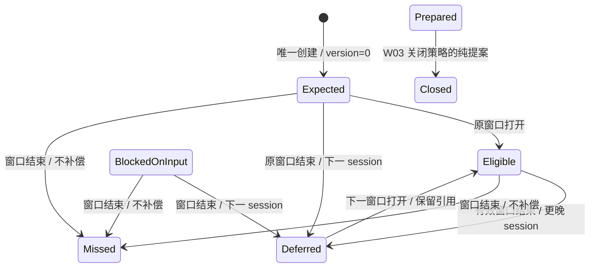

# 推送 Foundation W14 实现与验证结果

**状态：** W14 调度状态机、评审修复和本阶段验收已完成。最终 W14 18/18、Foundation 103/103、push_job 52/52、rustdoc 与普通编译/Clippy 通过；strict Clippy 和 catalog 的既有基线问题单列于 §7。生产接线与完整迁移尚未完成。

**验证日期：** 2026-09-07（Asia/Shanghai）

**分支/worktree：** `codex/push-reliability-20260905` / `.worktrees/push-reliability-20260905`

**实现提交：** `ff5f1d3`；最终仅访问器命名修订为 `b2e92ca`。初版实现为 `b7f5cfb`，非交易日修复为 `5f5bca6`，后续评审反例提交为 `4fc3571`。

## 1. 交付范围与权威依据

WBS W14 的验收句是“窗口半开区间和原业务日 catch-up 可回放；closed occurrence 不可重开”。实现为 `src/push_foundation/phase_scheduler.rs` 的 crate-private 确定性状态机，组合 W01 身份、W03 完成策略、W06 catalog 和 W11 恢复报告。正常 tick 与 startup catch-up 使用同一判定入口；输出创建事实、转换提案或只读结果。

依据：`docs/push-system/push-system-wbs.v1.json` W14；`docs/push-system/push-system-implementation-rfc.md:868` 的 ScheduleOccurrence/版本/生命周期/恢复合同；`docs/Project_Architecture_Blueprint.md:1398` 的 PhaseScheduler 与启动顺序；[W14 设计](../superpowers/specs/2026-09-07-push-foundation-w14-phase-scheduler-design.md)及[实施计划](../superpowers/plans/2026-09-07-push-foundation-w14-phase-scheduler.md)。

本模块没有生产 timer、provider、LLM、sink、数据库写入或订单调用。W07 冻结 SQL 不含 occurrence registry，W14 没有另造中央数据库；真正的同库 CAS、转换证据和 fence 仍由 W16 及逐 Unit 适配器实现。

## 2. 验收映射

| 要求 | 实现证据 | 行为证据 |
| --- | --- | --- |
| 起点含、终点不含；非法窗口拒绝 | `phase_scheduler.rs:46`、`:61` | `phase_scheduler_tests.rs:121`、`:453`，精确 start/end/end-1 |
| producer/Unit/owner/family/phase 绑定 W06 | `phase_scheduler.rs:124` | `phase_scheduler_tests.rs:146`，合法绑定及逐字段漂移 |
| 非交易日不造新任务，不给已有未准备任务授予资格 | `phase_scheduler.rs:525`、`:575` | `phase_scheduler_tests.rs:235`、`:252`，tick/catch-up 都保留原状态与版本 |
| RecoverPersistedOnly 禁止新建及已有未准备任务升级 | `phase_scheduler.rs:525`、`:578` | `phase_scheduler_tests.rs:281`、`:299`，Expected/Eligible/Blocked 和窗口内外 |
| 新 occurrence 先 Expected/version=0，再 Eligible/version=1 | `phase_scheduler.rs:226`、`:525`、`:607` | `phase_scheduler_tests.rs:337` |
| normal/catch-up 同输入精确相等，身份保留原业务日 | `phase_scheduler.rs:480`、`:488`、`:525`；`reconciler.rs:150` | `phase_scheduler_tests.rs:380`、`:411`，后续日期与错误业务日反例 |
| 延期恢复后仍使用下一窗口；再次延期保留同一身份 | `phase_scheduler.rs:314`、`:376`、`:583`、`:642` | `phase_scheduler_tests.rs:489`、`:602`，应用提案后的连续 tick/catch-up、第三窗口、拒绝重复/重叠引用 |
| Blocked 不因 tick 假装来源恢复；Prepared 不因过期丢失 | `phase_scheduler.rs:559`、`:605` | `phase_scheduler_tests.rs:817` |
| W03 关闭提案只从 Prepared 产生；Closed/Missed 无出边 | `phase_scheduler.rs:499`、`:559` | `phase_scheduler_tests.rs:686`、`:871`，重复关闭、回拨、catch-up、未准备关闭拒绝 |
| 快照与提案精确绑定，拒绝时序和版本错误 | `phase_scheduler.rs:94`、`:239`、`:297`、`:320`、`:365` | `phase_scheduler_tests.rs:735`、`:803`、`:919`，同 ID 不同窗口、陈旧提案、时间回退、版本溢出 |

上述相对源码路径均位于 `src/push_foundation/`。W01 身份新增的只读 getter 位于 `src/monitor/push_job/identity.rs:242`，身份哈希算法和 golden 身份未修改。

## 3. 生命周期与边界

`Eligible→Prepared` 需要 physical owner 的持久准备事实；`Expected|Eligible→BlockedOnInput`、`BlockedOnInput→Eligible` 需要 W15 来源/恢复证据。本切片不凭时间 tick 生成这些证据。

延迟任务保留原业务日与 occurrence ID。例如 9 月 7 日任务延期到 9 月 8 日，下一窗口恢复为 Eligible 后仍保存 9 月 8 日 session 引用；再次延期到 9 月 9 日只增加版本并替换 session 引用，不改业务日和身份。Closed/Missed 永无出边；错误 schedule/date 输入失败关闭。

## 4. Spec 评审

固定审查范围为 `4f209d7...b7f5cfb`，由独立只读评审执行；主线负责修复及运行测试。

- **P1，已修复：** Deferred→Eligible 原先清空下一窗口引用，后续 tick 错按原窗口过期；测试曾真实报 `NextEligibleSessionRequired`。现保留引用，并以有效窗口判断连续运行和恢复。
- **P2，已修复：** RecoverPersistedOnly 只挡住无快照分支，已有 Expected 仍能升级。现对所有未准备非终态返回 RecoveryOnly，Prepared 和终态保留既有事实。
- **能力边界已澄清：** W03 `CompletionDirective` 没有目标 occurrence 身份。W14 completion 只生成纯提案，不能证明该完成结果属于此任务。真正的 BoundScheduleCloseProposal 必须由业务适配器重验目标、完成证据、policy 和 fence；本轮没有声称该生产授权已实现。
- **恢复边界已澄清：** W11 marker 只能由成功返回的报告生成，证明对应恢复遍历已完成；它没有业务库/Unit/进程绑定，不能证明全局生产启动顺序。

修复复查未发现新的确定性实现错误；评审要求补连续第三窗口、重复和重叠引用的验证，已加入对应测试。

## 5. Standards 评审与主线补查

独立 Standards 评审发现 **1 项 P2 绑定问题**：窗口不进入 occurrence ID，旧实现仅比 ID，允许将较早 schedule 的 next-session ref 移植到结束更晚的 schedule。现由统一 `validate_for` 重验接收方的 ID、策略、业务日和窗口；hydrate、提案、apply 复用检查。apply 还匹配完整输入 schedule、原 session、status 和 version。原重复分派已集中；只读复查确认该缺口已关闭。

主线另发现并修复：

- 非交易日只保护无 occurrence 分支；真实 RED 为 Expected→Eligible，修复后保留原事实。
- 提案允许 observed_at 早于当前 updated_at，应用时才失败；现在生成提案前拒绝时间倒退。

接口仍为 crate-private；错误只携带固定类型/字段名。模块不持有 prepared/source/receipt 正文，没有新增生产 `unwrap/expect/panic/unreachable`，production wiring diff 为零。

工具检查另发现一个新增命名告警：`from_status(&self)` 触发 Clippy wrong_self_convention。`b2e92ca` 将这个 crate-private getter 改为 `expected_status`，同步三处测试调用；RFC 的 from_status 字段和调度行为不变。最终普通 Clippy 回到 163 项既有告警，W14 文件零新增。

## 6. TDD 证据

| 提交/检查 | 结果 |
| --- | --- |
| `d879ff3` | 冻结初始设计与实施计划 |
| `b0b770f` → `4f16fce` | catalog/window 接口 RED/GREEN |
| `eb01a25` → `ab27962` | deterministic catch-up 与 W11 marker RED/GREEN |
| `00d825b` → `b7f5cfb` | 生命周期封口 RED/GREEN，初版 W14 12/12 |
| `5f5bca6` | 非交易日回归先 0/1 失败，再 1/1 通过 |
| `4fc3571` | 评审回归 RED：W14 12 passed / 4 failed；分别为丢窗口、引用移植、恢复模式绕过、时间回退 |
| 评审修复工作树 | W14 16 passed / 0 failed；43 个既有 warning，未新增 |
| `ff5f1d3` | 评审修复与第三窗口/Missed 补测；W14 18/18、Foundation 103/103 通过 |
| `b2e92ca` | getter 命名修订；Clippy 新增告警清零，受影响 Foundation 测试重新验证 |

## 7. 验证记录

| 检查 | 结果 |
| --- | --- |
| `cargo test --lib w14_ -- --test-threads=1` | PASS：18 passed / 0 failed |
| `cargo test --lib push_foundation:: -- --test-threads=1` | PASS：103 passed / 0 failed |
| `cargo test --lib monitor::push_job::tests:: -- --test-threads=1` | PASS：52 passed / 0 failed |
| `cargo test --doc` | PASS：16 passed / 0 failed / 4 ignored |
| `cargo check --lib` | PASS：84 项既有 warning；W14 目标文件无告警 |
| `cargo clippy --lib` | PASS，exit 0：163 项既有 warning；W14 目标文件无告警 |
| `cargo clippy --lib -- -D warnings` | 既有基线阻断，exit 101：163 errors；首错 `src/data_gateway/futures_delivery.rs:15`，W14 目标文件无命中 |
| architecture docs 五组测试 | PASS：418 runs / 5023 assertions / 0 failures / 0 errors / 0 skips |
| RFC inputs / sources / RFC draft / WBS render check | PASS：rfc_inputs_valid / source_catalog_valid / rfc_spec_valid / wbs_current |
| catalog check / render check | NOT CURRENT，exit 1：既有 file_set、源码 SHA、symbol line 漂移 |
| production-wiring diff | PASS：相对 `4f209d7`，monitor/notification/config/Cargo/migrations 零变更 |
| 生产 panic 扫描 / git diff --check | PASS |

文档五组精确计数依次为 rfc_inputs 12/238、source_catalog 12/110、catalog 33/393、rfc_spec 295/3873、wbs 66/409。本轮没有修改这些结构化输入和验证器。catalog 的旧冻结清单需要后续独立 re-freeze；本轮没有只改 SHA 消除报错。

证据范围：最终命名修订只影响 crate-private getter 和三处测试引用，Clippy 与 Foundation 在该修订后重验；W01--W06 public API、rustdoc、结构化文档输入及数据库行为未再修改，相应通过证据继续有效。strict Clippy/catalog 的失败单列，不声称全仓全门禁通过。

## 8. 当前提升与剩余工作

W14 为后续迁移提供可重放的统一调度决定：精确时窗、原业务日身份、延期资格连续性、终态封口、保留持久任务和拒绝陈旧提案都有可执行验证。现有生产推送尚未接入该模块，因此不能据此宣称线上漏推或重推已改善。

仍需完成 W15 运行就绪快照与恢复事件、W16 activation/CAS/fence、W17 shadow、W18 operator 控制面、W19 观测与审计、W20 故障矩阵、W21 发布门禁，以及 52 个 Unit 的实际接线、业务库 occurrence CAS、shadow、逐 Unit 晋级和交易日观察。生产监控观察保持停止；本轮没有启动、停止、查看或替换生产 monitor。

## 9. 周期估算更正

此前对话中的“并行开发 5--7 个工作日、全部上线约 4--6 周”不能作为完整目标的完成承诺，后一个数字与已批准 WBS 的硬约束不符。

`push-system-wbs.v1.json.trading_totals` 明确为 42 个 physical-owner Unit、42 次晋级、76 个观察 session，完全串行发布模型为 118 个 session；仅“一交易日最多晋级一个 Unit”就有至少 42 个交易日的下限。观察可否重叠、节假日、人工批准、样本、STARVED/OPT-IN 和未排序 Unit 都影响实际日历。这个下限也不是全部完成的交付日期。

并行评审已经帮助提前发现并关闭 W14 缺陷；后续独立工程可以并行，但不能压缩上述晋级规则或把剩余 Foundation 的工程估算套到 52 Unit 全迁移。后续周期报告应分别给出代码、逐 Unit 接线、晋级与观察的证据和假设，不再沿用未经 WBS 校验的总工期。
