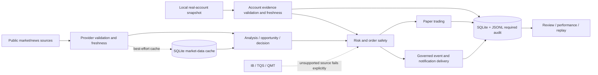

# README Architecture and Deterministic History Test Implementation Plan

> **For agentic workers:** REQUIRED SUB-SKILL: Use superpowers:subagent-driven-development (recommended) or superpowers:executing-plans to implement this plan task-by-task. Steps use checkbox (`- [ ]`) syntax for tracking.

**Goal:** Remove the midnight-dependent history-test failure and replace the stale root README with an accurate explanation of the project's purpose, architecture, safety boundaries, and verified operating commands.

**Architecture:** Keep production history filtering unchanged and isolate calendar-date query fixtures from rolling-window rate fixtures. Rewrite the README around the current executable data flow rather than historical version claims, using one Mermaid diagram and stable responsibility tables.

**Tech Stack:** Rust 2021, Tokio, Chrono, SQLite, Diesel/rusqlite, cargo-next tooling, Markdown/Mermaid, GitHub Actions.

---

## File structure

- Create `docs/superpowers/specs/2026-07-20-readme-architecture-design.md`: approved information architecture, truth sources, failure modes and rollback.
- Create `docs/superpowers/plans/2026-07-20-readme-architecture-and-history-test.md`: executable TDD/documentation plan.
- Modify `src/event/history.rs`: make only the existing filter-matrix test independent of local midnight.
- Replace `README.md`: current project purpose, layered architecture, data flows, entry points, safety contract, setup, gates and documentation links.

### Task 1: Make the history filter matrix deterministic

**Files:**
- Modify: `src/event/history.rs:901-979`
- Test: `src/event/history.rs::tests::query_and_rate_filters_reject_each_nonmatching_complete_record`

- [x] **Step 1: Preserve the reproduced RED evidence**

Run:

```bash
cargo test --lib event::history::tests::query_and_rate_filters_reject_each_nonmatching_complete_record -- --exact --nocapture --test-threads=1
```

Expected before the fix: FAIL near local midnight with `left: 2`, `right: 3` because `Local::now() - 2h` crosses the calendar-date filter.

- [x] **Step 2: Separate fixed-date query data from rolling-window rate data**

Replace the shared fixture with two temporary directories. Use local noon for date filtering:

```rust
let query_now = today()
    .and_hms_opt(12, 0, 0)
    .expect("valid local noon")
    .and_local_timezone(Local)
    .single()
    .expect("unambiguous local noon");
```

Write `wrong-kind`, `wrong-date`, `wanted`, and `wrong-sink` to the query directory and assert the two same-date `WantedKind` rows remain. For rate filtering, take a fresh `rate_now = Local::now()`, write `wrong-kind`, `wanted`, `wrong-sink`, and `outside-window`; derive each JSONL partition from `row.ts.format("%Y-%m-%d")`, then assert only `wanted` contributes to the one-hour/wanted-sink result.

- [x] **Step 3: Verify the focused regression repeatedly**

Run:

```bash
cargo test --lib event::history::tests::query_and_rate_filters_reject_each_nonmatching_complete_record -- --exact --test-threads=1
```

Expected: PASS, independent of whether `rate_now - 2h` is the previous date.

### Task 2: Rewrite the root README around the current architecture

**Files:**
- Modify: `README.md`
- Reference: `Cargo.toml`, `src/lib.rs`, `src/bin/monitor/main.rs`, `AGENTS.md`, `docs/business_rules.md`, `docs/v16.x/README.md`

- [x] **Step 1: Replace stale version/count claims with a stable project contract**

The opening must state all of the following:

```text
stock_analysis is a Rust A-share research, monitoring, paper-trading and review system.
It consumes real public market/news data and optional local real-account snapshots.
It does not claim an active IB/TQS/QMT broker connection and does not automatically place live orders.
Missing or stale evidence fails closed instead of becoming mock/zero/cost-price data.
```

Remove the old v9 “latest progress”, source-line/module counts, fixed test counts, fixed push counts, and “production/live trading complete” wording.

- [x] **Step 2: Add the end-to-end architecture diagram and layer table**

Use this Mermaid flow, keeping the broker branch explicitly unavailable until a real adapter exists:



Follow it with six layers: application entry points; data sources; persistence/audit; research/decision; risk/paper execution; event/delivery/review. Each layer names only modules exported by the current crate or current binary tree.

- [x] **Step 3: Document truthful entry points and safe setup**

Include these verified targets and purposes:

```bash
cargo run --bin monitor -- --review
cargo run --bin monitor
cargo run --bin monitor -- --history --date=YYYY-MM-DD
cargo run --bin rsi_optimize -- compare
cargo run --bin import_real_account_snapshot -- \
  --database data/stock_analysis.db \
  --evidence <ignored-local-manifest.json>
STOCK_DB=data/stock_analysis.db STOCK_LIST=000001 bash tools/one_shot/backfill_daily.sh
```

Explain that `--test --e2e` requires an isolated test database and `TEST_CODE` identities, while replay force and production notification modes are operational actions rather than quick-start examples.

- [x] **Step 4: Document safety contracts and release evidence**

Describe redlines 2.1–2.10 in compact groups: no mock/fill; freshness/quality; test/live isolation; order limits; immutable audit; business-rule/config consistency. State the current Gate D thresholds and reproducible commands without promising that a previously generated report remains fresh forever.

- [x] **Step 5: Add current limitations and authoritative documentation links**

Link `AGENTS.md`, `docs/business_rules.md`, `docs/README.md`, `docs/v16.x/README.md`, the v16.x audit, the Gate D design and coverage plan. Explicitly say historical version documents describe evolution and do not override current executable contracts.

### Task 3: Run complete gates and publish through PR

**Files:**
- Validate all modified files
- Do not stage: `.planning/2026-07-18-v18-ws0-test-inventory/`

- [x] **Step 1: Run formatting, lint, tests and compliance**

```bash
cargo fmt --all -- --check
cargo clippy --workspace --all-targets --all-features -- -D warnings
cargo test --workspace --all-targets --all-features -- --test-threads=1
bash tools/compliance/check.sh
cargo build --release --workspace --all-features
```

Expected: every command exits 0. Freshness must report the latest completed trading day; Saturday/Sunday are excluded by the trading calendar.

- [x] **Step 2: Regenerate and enforce coverage**

```bash
cargo llvm-cov --workspace --all-features --json --output-path target/coverage/coverage.json -- --test-threads=1
python3 tools/coverage/check_thresholds.py target/coverage/coverage.json
```

Expected: global line coverage at least 80% and registered core line coverage at least 95%.

- [ ] **Step 3: Validate privacy and fixed-SHA review evidence**

Verify only boolean/count contracts for the ignored local account database, confirm no screenshot/database/account manifest is tracked, and run Standards/Spec review against the branch merge-base. No private account value or security identity may enter output or Git.

- [ ] **Step 4: Commit, push and merge through GitHub**

Stage only the four scoped files, create a reviewed commit, push the branch, create a PR with all mandatory evidence fields, wait for configured checks, merge through GitHub, fetch `master`, and prove the branch commit is an ancestor of remote `master`.
